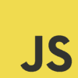
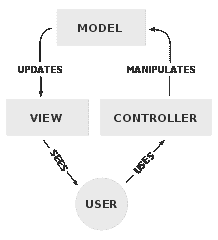
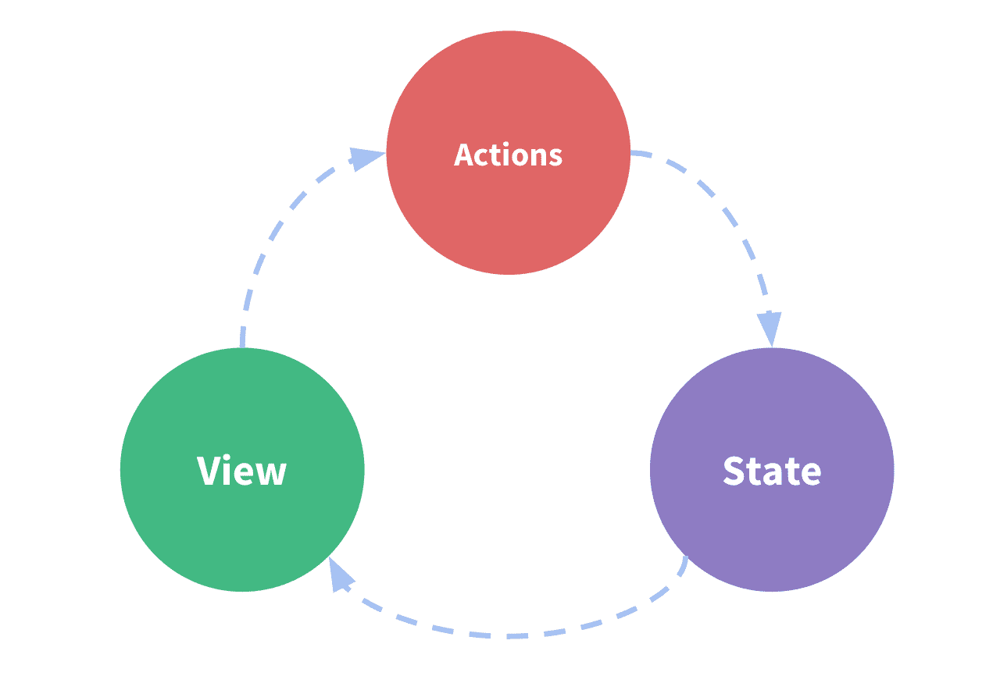
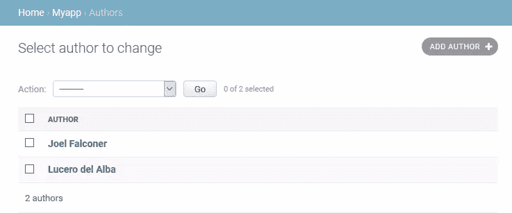
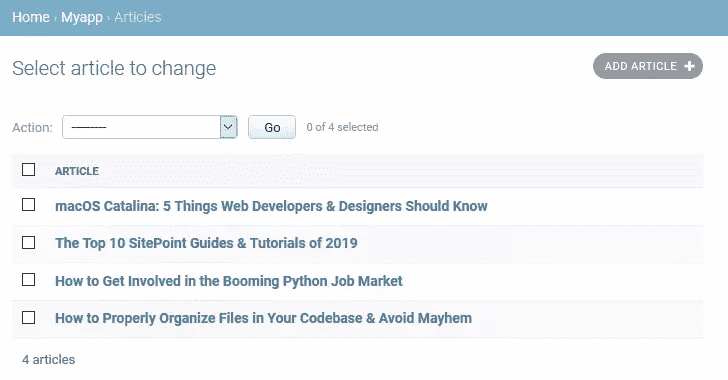

# 如何用 Django 和 Vue.js 构建 Web 应用原型

> 原文：<https://www.sitepoint.com/web-app-prototype-django-vue/>

如果你能设计出一个定制的 web 应用原型，它是[响应型](https://www.sitepoint.com/build-responsive-bootstrap-website/)(移动就绪)、[反应型](https://www.sitepoint.com/reactive-web-apps/)(光速快)，并带有一个全功能的[管理界面](https://docs.djangoproject.com/en/dev/ref/contrib/admin/)来管理内容，这不是很酷吗？其实用 Django 和 Vue.js 就可以！😁

## 0.简介:全栈开发 101

我将介绍如何构建一个定制 web 应用程序的原型，并且尽可能保持简洁明了，这里的上下文信息将会非常简短。然而，我会提供——希望——足够的资源，这样你就知道如果你需要更多的信息可以去哪里。

为此，我将完全混合 Django 和 Vue.js 之间的数据管理、表示和路由——所以准备好吧！

### 关于姜戈

[](https://www.djangoproject.com/)

你可能知道 [Django](https://www.djangoproject.com/) ，这是一个基于 Python 的*网络框架，面向有最后期限的完美主义者*，它的**速度惊人，安全可靠，可伸缩性极强**。但是如果你不太了解，这篇文章将作为一个非常快速的动手介绍。

### 关于 Vue.js

[](https://vuejs.org/)

同样的还有 [Vue.js](https://vuejs.org/) 、*渐进式的 JavaScript 框架*也就是*平易近人、多才多艺、高性能*。如果你不熟悉它，在这里你会得到一个快速和肮脏的介绍。

我还将介绍两个官方的 Vue.js 库:

*   **[Vue 路由器](https://router.vuejs.org/)** 用于路由/视图映射
*   **Vuex**为状态管理

### Python + JavaScript = WIN！

[](https://www.python.org/)

对于本文，我们将设置一个发布项目，它具有一个基本的[数据库模式](https://en.wikipedia.org/wiki/Database_schema)来保存`authors`和`articles`，以及一个最小的[用户界面](https://en.wikipedia.org/wiki/User_interface) (UI)来与它们进行交互。

[](https://www.sitepoint.com/javascript/)

希望这将作为一个玩具程序来理解*如何在后端使用 Python 代码集成 Django，在前端使用 JavaScript 框架*，你可以在以后适应自己的需求。

## 1.建立 Django 项目

很快，我们将从零开始建立一个项目。如果你已经知道如何处理 Django 项目，你可以跳过这一节。我们假设您已经安装了和 [Python。](https://realpython.com/installing-python/)

要获得更深入的指导，请参见 Django 文档网站上的[如何安装 Django](https://docs.djangoproject.com/en/dev/topics/install/) 。

### Python 虚拟环境

让我们打开一个控制台并创建一个虚拟环境(更多信息请参见[Python 中的虚拟环境简化版](https://www.sitepoint.com/virtual-environments-python-made-easy/)):

```
$ virtualenv myenvironment 
```

```
Using base prefix 'c:\\users\\luzdealba\\appdata\\local\\programs\\python\\python37'
New python executable in C:\Users\luzdealba\Development\myenvironment\Scripts\python.exe
Installing setuptools, pip, wheel …
done 
```

不要在意路径，因为它们会随着系统的不同而变化。

让我们进入并激活虚拟环境。

在 Windows 上:

```
$ cd myenvironment
$ Scripts\activate 
```

在 macOS 和 Linux 上:

```
$ cd myenvironment
$ source bin/activate 
```

### Django 包

让我们安装 Django:

```
(myenvironment) $ pip install django 
```

```
Collecting django
  Downloading Django-3.0.3-py3-none-any.whl (7.5 MB)
Collecting sqlparse>=0.2.2
  Downloading sqlparse-0.3.1-py2.py3-none-any.whl (40 kB)
Collecting pytz
  Using cached pytz-2019.3-py2.py3-none-any.whl (509 kB)
Collecting asgiref~=3.2
  Downloading asgiref-3.2.3-py2.py3-none-any.whl (18 kB)
Installing collected packages: sqlparse, pytz, asgiref, django
Successfully installed asgiref-3.2.3 django-3.0.3 pytz-2019.3 sqlparse-0.3.1 
```

再说一次，不要在意程序版本和文件大小，因为它们会有所不同。

### 该项目

让我们开始一个名为`myproject`的项目:

```
(myenvironment) $ django-admin startproject myproject 
```

让我们进入项目:

```
(myenvironment) $ cd myproject 
```

### 该应用程序

启动一个名为`myapp`的 app:

```
(myenvironment) $ django-admin startapp myapp 
```

并将`myapp.apps.MyappConfig`添加到`myproject/settings.py`中的`INSTALLED_APPS`常量列表中，以启用该应用。

## 2.用 Django 建立数据库

这里我们将使用 Django 定义后端数据库，稍后我们将使用 Vuex 将其与前端存储集成。

### Django 模型

[模型](https://docs.djangoproject.com/en/dev/topics/db/models/)是 Django 实现一个[对象关系数据库管理系统](https://en.wikipedia.org/wiki/Object-relational_database) (ORDBMS)的方法。换句话说，就是纯文本文件，您可以在其中定义数据库表和字段，并从这里将它们传播到应用程序层和 DB 引擎。

让我们在`myapp/models.py`中为我们的应用程序编写以下模型:

```
from django.db import models

class Article(models.Model):
    """Table schema to store articles."""
    name = models.CharField(max_length=64)
    author = models.ForeignKey('myapp.Author', on_delete=models.CASCADE)
    content = models.TextField()
    slug = models.CharField(default='', max_length=64)

    def __str__(self):
        return '%s' % self.name

class Author(models.Model):
    """Table schema to store auhtors."""
    name = models.CharField(max_length=64)
    slug = models.CharField(default='', max_length=64)

    def __str__(self):
        return '%s' % self.name 
```

注意，我们为文章和作者实现了一个 [URL slug](https://en.wikipedia.org/wiki/Clean_URL#Slug) 。

更多信息，请参见 Django 文档网站上的[模型 API 参考](https://docs.djangoproject.com/en/dev/ref/models/)。

### Django 管理

在我们可以通过管理站点管理这些模型之前，我们首先需要 [`register`](https://docs.djangoproject.com/en/dev/ref/contrib/admin/#django.contrib.admin.AdminSite.register) 它们，以便 Django 可以使用它们。

让我们简单地编辑`myapp/admin.py`,使它看起来像这样:

```
from django.contrib import admin

from .models import Article
from .models import Author

# register models to use in admin site
admin.site.register(Article)
admin.site.register(Author) 
```

在 Django 文档网站上阅读关于 Django 管理网站的更多信息。

### django 移民

来自 Django 的[迁移文档](https://docs.djangoproject.com/en/dev/topics/migrations/):

> 迁移是 Django 传播您对模型所做的更改(添加字段、删除模型等)的方式。)到您的数据库模式中。

简而言之:迁移做*一切*；不需要 SQL 命令。

首先，让我们创建迁移文件:

```
(myenvironment) $ python manage.py makemigrations 
```

```
Migrations for 'myapp':
  myapp\migrations\0001_initial.py
    - Create model Author
    - Create model Article 
```

现在让我们使用这些信息来更新数据库:

```
(myenvironment) $ python manage.py migrate 
```

```
Operations to perform:
  Apply all migrations: admin, auth, contenttypes, myapp, sessions
Running migrations:
  Applying contenttypes.0001_initial... OK
  Applying auth.0001_initial... OK
  Applying admin.0001_initial... OK
  Applying admin.0002_logentry_remove_auto_add... OK
  Applying admin.0003_logentry_add_action_flag_choices... OK
  Applying contenttypes.0002_remove_content_type_name... OK
  Applying auth.0002_alter_permission_name_max_length... OK
  Applying auth.0003_alter_user_email_max_length... OK
  Applying auth.0004_alter_user_username_opts... OK
  Applying auth.0005_alter_user_last_login_null... OK
  Applying auth.0006_require_contenttypes_0002... OK
  Applying auth.0007_alter_validators_add_error_messages... OK
  Applying auth.0008_alter_user_username_max_length... OK
  Applying auth.0009_alter_user_last_name_max_length... OK
  Applying auth.0010_alter_group_name_max_length... OK
  Applying auth.0011_update_proxy_permissions... OK
  Applying myapp.0001_initial... OK
  Applying sessions.0001_initial... OK 
```

不要介意长长的名单。这是因为这是我们的第一次迁移，所以不仅创建了我们的`Author`和`Article`表，还创建了 Django 的所有默认模式。

有关更多信息，请参见 Django 文档站点中的[迁移操作](https://docs.djangoproject.com/en/dev/ref/migration-operations/)。

## 3.Django 模板中 Vue 组件的基本接口

这是 mashup 最有趣的部分之一，因为我们将混合来自不同技术的密切相关的工具。

### 姜戈观点

[](https://en.wikipedia.org/wiki/Model%E2%80%93view%E2%80%93controller)

Django 遵循[模型-视图-控制器](https://en.wikipedia.org/wiki/Model%E2%80%93view%E2%80%93controller) (MVC)软件设计模式，将相关的程序逻辑分成三个相互关联的元素。

我们将在`myapp/views.py`中编写以下视图:

```
from django.shortcuts import render

from .models import Article
from .models import Author

def frontend(request):
    """Vue.js will take care of everything else."""
    articles = Article.objects.all()
    authors = Author.objects.all()

    data = {
        'articles': articles,
        'authors': authors,
    }

    return render(request, 'myapp/template.html', data) 
```

注意，我们查询了数据库中的所有文章和作者。那以后会派上用场的。

在 Django 文档站点中可以看到更多关于[编写视图](https://docs.djangoproject.com/en/dev/topics/http/views/)和[基于类的视图](https://docs.djangoproject.com/en/dev/topics/class-based-views/) ( [API](https://docs.djangoproject.com/en/dev/ref/class-based-views/) )。

### Django 模板

Django 有丰富的[模板语言](https://docs.djangoproject.com/en/dev/ref/templates/language/)和[内置的模板标签和过滤器](https://docs.djangoproject.com/en/dev/ref/templates/builtins/)，还有[一个面向 Python 程序员的 API](https://docs.djangoproject.com/en/dev/ref/templates/api/)；但是，是的，你猜对了——我们在这里不会涉及太多。😅

然而，我们要做的是使用 [Bootstrap 的启动模板](https://getbootstrap.com/docs/4.4/getting-started/introduction/#starter-template)为应用程序设置一个*非常*的基本导航布局:

*   浅灰色背景
*   白色前景
*   居中内容

所以我们将在`myapp/templates/myapp/template.html`中编写以下模板(您需要在`myapp/`中创建子目录`templates/myapp/`):

```
<!doctype html>
<html lang="en">
  <head>
    <!-- Required meta tags -->
    <meta charset="utf-8">
    <meta name="viewport" content="width=device-width, initial-scale=1, shrink-to-fit=no">

    <!-- Bootstrap CSS -->
    <link rel="stylesheet" href="https://stackpath.bootstrapcdn.com/bootstrap/4.4.1/css/bootstrap.min.css" integrity="sha384-Vkoo8x4CGsO3+Hhxv8T/Q5PaXtkKtu6ug5TOeNV6gBiFeWPGFN9MuhOf23Q9Ifjh" crossorigin="anonymous">

    <title>Django and Vue.js</title>
  </head>
  <body class="bg-light">
    <div class="bg-white container">
      <h1>Prototyping a Web App with Django and Vue.js</h1>

      <!-- Content -->
    </div>

    <!-- Vue.js -->
    <script src="https://unpkg.com/vue"></script>
    <script src="https://unpkg.com/vue-router"></script>

    <!-- jQuery first, then Popper.js, then Bootstrap JS -->
    <script src="https://code.jquery.com/jquery-3.4.1.slim.min.js" integrity="sha384-J6qa4849blE2+poT4WnyKhv5vZF5SrPo0iEjwBvKU7imGFAV0wwj1yYfoRSJoZ+n" crossorigin="anonymous"></script>
    <script src="https://cdn.jsdelivr.net/npm/popper.js@1.16.0/dist/umd/popper.min.js" integrity="sha384-Q6E9RHvbIyZFJoft+2mJbHaEWldlvI9IOYy5n3zV9zzTtmI3UksdQRVvoxMfooAo" crossorigin="anonymous"></script>
    <script src="https://stackpath.bootstrapcdn.com/bootstrap/4.4.1/js/bootstrap.min.js" integrity="sha384-wfSDF2E50Y2D1uUdj0O3uMBJnjuUD4Ih7YwaYd1iqfktj0Uod8GCExl3Og8ifwB6" crossorigin="anonymous"></script>
  </body>
</html> 
```

阅读更多关于 Django 模板的信息。

### view . js Templates-检视. js templates

Vue.js *也*有一个[模板语法](https://vuejs.org/v2/guide/syntax.html)可用，它还允许我们创建自己的 HTML 标签。

我们将创建四个模板:`article-list`、`author-list`、`article-item`和`author-item`:

```
<template id="article-list-template">
  <div class="article-list">
    <h2>Articles</h2>
    <article-item
      v-for="article in articles"
      v-bind:key="article.slug"
      v-bind:name="article.name"
      v-bind:slug="article.slug"
      v-bind:content="article.content"
    ></article-item>
  </div>
</template>

<template id="author-list-template">
  <div class="author-list">
    <h2>Authors</h2>
    <author-item
      v-for="author in authors"
      v-bind:key="author.slug"
      v-bind:name="author.name"
      v-bind:slug="author.slug"
    ></author-item>
  </div>
</template>

<template id="article-item-template">
  <div class="article-item">
    <span v-if="$route.params.slug">
      <h3>
        <router-link
          v-bind:to="'/article/' + $route.params.slug + '/'"
          v-html="$store.getters.getArticleBySlug($route.params.slug)['name']"
        ></router-link>
      </h3>
      <div v-html="$store.getters.getArticleBySlug($route.params.slug)['content']"></div>
    </span>
    <span v-else>
      <h3>
        <router-link
          v-bind:to="'/article/' + slug + '/'"
          v-html="name"
       ></router-link>
     </h3>
      <div v-html="content"></div>
      <hr />
    </span>
  </div>
</template>

<template id="author-item-template">
  <div class="author-item">
    <span v-if="$route.params.slug">
      <b>
        <router-link v-bind:to="'/author/' + $route.params.slug + '/'">
          [[ $store.getters.getAuthorBySlug($route.params.slug)['name'] ]]
        </router-link>
      </b>
      ([[ $route.params.slug ]])
    </span>
    <span v-else>
      <b>
        <router-link v-bind:to="'/author/' + slug + '/'">
          [[ name ]]
        </router-link>
      </b> ([[ slug ]])
    </span>
  </div>
</template> 
```

#### 故障

简而言之，我们在这里所做的:

1.  列表渲染用 [`v-for`](https://vuejs.org/v2/guide/list.html#Mapping-an-Array-to-Elements-with-v-for) 。
2.  HTML 中的数据绑定属性有 [`v-bind`](https://vuejs.org/v2/guide/syntax.html#Attributes) 。
3.  有条件渲染用 [`v-if`](https://vuejs.org/v2/guide/conditional.html#v-if) 和 [`v-else`](https://vuejs.org/v2/guide/conditional.html#v-else) 。
4.  带 [`v-html`](https://vuejs.org/v2/guide/syntax.html#Raw-HTML) 的 Raw HTML 渲染。

当我们介绍存储和路由时，`$store`和`$route`会更有意义。

#### Django 和 Vue.js 模板之间的文本插值

就像 Django 一样，Vue.js 中的[文本插值](https://en.wikipedia.org/wiki/String_interpolation)的最基本形式是使用“Mustache”语法(双花括号)。

像这样:

```
<span>Message: {{ msg }}</span> 
```

为了避免两者之间的冲突，在实例化 Vue.js 时，我们将它设置为使用双方括号:

```
delimiters: ['[[', ']]'] 
```

#### view . js themes 检视. js themes-主题

你知道你可以“主题化”Vue.js 吗？

*   Vue.js 的嵌入式主题
*   [Vuetify.js](https://vuetifyjs.com/) ，[材料设计](https://material.io/)构件框架
*   [BootstrapVue](https://bootstrap-vue.js.org/) ，Vue.js 的 Bootstrap 组件和网格系统
*   [Buefy](https://buefy.org/) ，基于[布尔玛](https://bulma.io/)的 Vue.js 轻量级 UI 组件
*   [Element UI](https://madewithvuejs.com/element-ui) ，面向开发者、设计师、产品经理的组件库
*   [Vue 材料](https://vuematerial.io/)，材料设计和 Vue.js
*   [Quasar 框架](https://quasar.dev/)，高性能 Vue.js UI

### Vue.js 组件

[组件](https://vuejs.org/v2/guide/components.html)是可重用的 Vue 实例。这意味着我们可以定义一个组件，为它编写一个 HTML 模板，然后用 Vue.js 为我们处理 [DOM](https://en.wikipedia.org/wiki/Document_Object_Model) 来多次使用它。

我们将在最后展示完整的[单页应用程序](https://en.wikipedia.org/wiki/Single-page_application) (SPA)代码。现在，让我们介绍几个片段。

与模板一样，我们将定义四个组件— `ArticleList`、`AuthorList,`、`ArticleItem`和`AuthorItem`:

```
ArticleList = Vue.component('article-list', {
  data: function () { return { articles: store.state.articles } },
  template: '#article-list-template',
});      

AuthorList = Vue.component('author-list', {
  data: function () { return { authors: store.state.authors } },
  template: '#author-list-template',
});

ArticleItem = Vue.component('article-item', {
  delimiters: ['[[', ']]'],
  props: ['name', 'slug', 'content'],
  template: '#article-item-template',
});

AuthorItem = Vue.component('author-item', {
  delimiters: ['[[', ']]'],
  props: ['name', 'slug'],
  template: '#author-item-template',
}); 
```

#### 故障

1.  当在一个组件中时， [`data`必须是一个函数](https://vuejs.org/v2/guide/components.html#data-Must-Be-a-Function) ( `$store`一会解释)。
2.  我们使用先前定义的[模板](https://vuejs.org/v2/guide/components.html#DOM-Template-Parsing-Caveats)。
3.  要消除文本插值的歧义，请确保您设置的 [`delimiters`](https://vuejs.org/v2/api/#delimiters) 不同于 Django 的(`{{` / `}}`)。
4.  我们使用列为数组的 [`props`](https://vuejs.org/v2/guide/components-props.html) 将数据传递给我们的组件。

## 4.使用 Vuex 连接 Vue.js 商店以收集 Django 的数据库

[](https://vuex.vuejs.org/)

一个丰富的前端可能有许多松散耦合的组件，每个组件都有自己的一组参数，这使得共享数据或管理变量的状态变得复杂。

这就是 Vuex 派上用场的地方:

> 它充当应用程序中所有组件的集中存储，规则确保状态只能以可预测的方式变化。

### 创建 Vuex 商店

让我们在 Django 模板中创建和定义一个商店，并使用 Django 视图中共享的数据:

```
const store = new Vuex.Store({
  state: {
      authors: [
      
          {
            name: '{{ author.name }}',
            slug: '{{ author.slug }}',
          },
      
      ],
      articles: [
      
          {
            content: '{{ article.content | linebreaksbr }}',
            name: '{{ article.name }}',
            slug: '{{ article.slug }}',
          },
      
      ],
  },
  getters: {
    getArticleBySlug: (state) => (slug) => {
      return state.articles.find(articles => articles.slug === slug)
    },
    getAuthorBySlug: (state) => (slug) => {
      return state.authors.find(authors => authors.slug === slug)
    },
  }
}) 
```

#### 故障

让我们回顾一下刚刚发生的事情:

1.  我们使用 [`Vuex.Store()`](https://vuex.vuejs.org/guide/) 创建了一个商店。
2.  我们定义了一个 [Vuex 状态](https://vuex.vuejs.org/guide/state.html)，其中所有的`articles`和`authors`都被收集。
3.  我们使用 Django 模板中内置的 [`for`循环](https://docs.djangoproject.com/en/dev/ref/templates/builtins/#for)来迭代所有的`articles`和`authors`。
4.  我们已经创建了两个[Vuex getter](https://vuex.vuejs.org/guide/getters.html)来通过它们的 slug 获取一篇文章或一个作者，分别是`getArticleBySlug`和`getAuthorBySlug`。

Vuex 还有很多，所以请务必查看[入门指南](https://vuex.vuejs.org/guide/)和 [API 参考](https://vuex.vuejs.org/api/)。

## 5.Django 和 Vue 路由器之间的路由 URL

Django 有一个强大的 [URL 分配器](https://docs.djangoproject.com/en/dev/topics/http/urls/)，我们将结合 [Vue.js 路由](https://vuejs.org/v2/guide/routing.html)使用它。

我们将创建一个应用程序:

1.  使用[动态路由匹配](https://router.vuejs.org/guide/essentials/dynamic-matching.html)在页面间无缝切换，无需刷新(参见[示例](http://vue-2-simple-routing-example.surge.sh/about))
2.  与[嵌套路线](https://router.vuejs.org/guide/essentials/nested-routes.html)一起工作(参见[示例](https://vue-router-course.netlify.com/))

### 和姜戈一起

[反应式](https://en.wikipedia.org/wiki/Reactive_programming)URL 通常需要在服务器上进行[特殊配置才能正常工作，但是 Django 允许我们按照自己的意愿设计 URL，所以不需要为 Apache 或 NGINX 设置重写规则。](https://router.vuejs.org/guide/essentials/history-mode.html#example-server-configurations)

我们将编辑`myproject/urls.py`,以便它使用基目录`/`作为我们的应用程序的路径:

```
from django.contrib import admin
from django.urls import path

# don't forget to import the app's view!
from myapp import views as myapp_views

urlpatterns = [
    path('admin/', admin.site.urls),

    # paths for our app
    path('', myapp_views.frontend),
    path('article/<slug:slug>/', myapp_views.frontend),
    path('author/<slug:slug>/', myapp_views.frontend),
] 
```

### 使用 Vue 路由器

默认情况下，Vue Router 使用“哈希模式”(即:http://site/#/path)作为 JavaScript 技巧，使用[锚](https://en.wikipedia.org/wiki/Anchor_text)加载页面的部分内容。然而，我们将利用 Vue Router 的 [HTML5 历史模式](https://router.vuejs.org/guide/essentials/history-mode.html)，这意味着我们所有的 URL 将无缝更改，无需重新加载页面*和*，无需使用哈希。

我们将设置路由器，使每条路径与之前定义的相应组件相匹配:

```
const routes = [
  { component: ArticleList, path: '/article/', },
  { component: AuthorList,  path: '/author/',  },
  { component: ArticleItem, path: '/article/:slug/', },
  { component: AuthorItem,  path: '/author/:slug/',  },
]

const router = new VueRouter({
  mode: 'history',
  routes: routes,
}) 
```

正如我们所见，定义路径的语法与 Django 的略有不同，但本质上是一样的。

阅读更多关于 [Vue 路由器](https://router.vuejs.org/)的信息。

## 6.测试一切

现在我们已经把所有的部分都准备好了，是时候做一些[灰盒测试](https://en.wikipedia.org/wiki/Gray_box_testing)了，看看事情是如何运作的！

### 创建 Django 超级用户

在我们登录管理员之前，我们需要创建一个超级用户。

让我们创建一个管理员:

```
(myenvironment) $ python manage.py createsuperuser 
```

接下来，您将输入用户名、电子邮件地址和密码(两次)。

### 运行本地服务器

我们将使用 [`runserver`](https://docs.djangoproject.com/en/dev/ref/django-admin/#runserver) 运行 Django 的内置服务器，在我们的本地系统上启动网站。

在控制台上:

```
(myenvironment) $ python manage.py runserver 
```

```
Watching for file changes with StatReloader
Performing system checks...

System check identified no issues (0 silenced).
March 09, 2020 - 19:41:22
Django version 3.0.3, using settings 'myproject.settings'
Starting development server at http://127.0.0.1:8000/
Quit the server with CTRL-BREAK. 
```

### 创建数据库条目

我们现在将填充数据库，以便我们可以在前端浏览一些东西。

让我们转到 http://127.0.0.1:8000/admin/

1.  在 MYAPP 面板上，在 Authors 旁边，点击 [Add](http://127.0.0.1:8000/admin/myapp/author/add/) 链接，创建至少两个作者。
2.  在 MYAPP 窗格的文章旁边，点击[添加](http://127.0.0.1:8000/admin/myapp/article/add/)链接，为每个作者创建至少两篇不同的文章。

请注意，您必须在创建了几个作者之后添加文章*，以便您可以链接它们。*

### 浏览网站！

现在是时候看看这一切是如何一起发挥作用了！

[https://www.youtube.com/embed/qGJNV7QPpnE?rel=0](https://www.youtube.com/embed/qGJNV7QPpnE?rel=0)

<br>

## 完整的 SPA 代码

您可以在我的 GitHub 存储库中导航所有项目代码， [luzdealba / djangovuejs](https://github.com/luzdealba/djangovuejs) 。

无论如何，这可能是你最感兴趣的:

```
<!doctype html>
<html lang="en">
  <head>
    <!-- Required meta tags -->
    <meta charset="utf-8">
    <meta name="viewport" content="width=device-width, initial-scale=1, shrink-to-fit=no">

    <!-- Bootstrap CSS -->
    <link rel="stylesheet" href="https://stackpath.bootstrapcdn.com/bootstrap/4.4.1/css/bootstrap.min.css" integrity="sha384-Vkoo8x4CGsO3+Hhxv8T/Q5PaXtkKtu6ug5TOeNV6gBiFeWPGFN9MuhOf23Q9Ifjh" crossorigin="anonymous">

    <title>Django and Vue.js</title>
    <style> .router-link-active {
        color: black;
        text-decoration: none;
      } </style>
  </head>
  <body class="bg-light">
    <div class="bg-white container">

      <div class="jumbotron">
        <h1 class="display-4">Django and Vue.js</h1>
        <p class="lead">
          Wouldn’t it be cool if you could prototype a custom web application that’s responsive (mobile ready), reactive (light-speed fast), with a full–featured back office site to manage the content; all of that in no time? Actually, with a mashup between Django’s and Vue.js, you can! 😁
        </p>
      </div>

      <!-- Content -->
      <div id="myapp">
        <nav class="navbar navbar-expand-lg navbar-light bg-light">
          <ul class="navbar-nav mr-auto">
            <li class="nav-item">
              <router-link
                class="nav-link text-primary"
                to="/author/"
              >
                Go to Authors
              </router-link>
            </li>
            <li class="nav-item">
              <router-link
                class="nav-link text-primary"
                to="/article/"
              >
                Go to Articles
              </router-link>
            </li>
          </ul>
        </nav>
        <br />
        <router-view></router-view>
      </div>
    </div>

    <!-- Vue.js -->
    <script src="https://unpkg.com/vue"></script>
    <script src="https://unpkg.com/vue-router"></script>
    <script src="https://unpkg.com/vuex"></script>

    <!-- Vue templates -->
    <template id="article-list-template">
      <div class="article-list">
        <h2>Articles</h2>
        <article-item
          v-for="article in articles"
          v-bind:key="article.slug"
          v-bind:name="article.name"
          v-bind:slug="article.slug"
          v-bind:content="article.content"
        ></article-item>
      </div>
    </template>

    <template id="author-list-template">
      <div class="author-list">
        <h2>Authors</h2>
        <author-item
          v-for="author in authors"
          v-bind:key="author.slug"
          v-bind:name="author.name"
          v-bind:slug="author.slug"
        ></author-item>
      </div>
    </template>

    <template id="article-item-template">
      <div class="article-item">
        <span v-if="$route.params.slug">
          <h3>
            <router-link
              v-bind:to="'/article/' + $route.params.slug + '/'"
              v-html="$store.getters.getArticleBySlug($route.params.slug)['name']"
            ></router-link>
          </h3>
          <div v-html="$store.getters.getArticleBySlug($route.params.slug)['content']"></div>
        </span>
        <span v-else>
          <h3>
            <router-link
              v-bind:to="'/article/' + slug + '/'"
              v-html="name"
           ></router-link>
         </h3>
          <div v-html="content"></div>
          <hr />
        </span>
      </div>
    </template>

    <template id="author-item-template">
      <div class="author-item">
        <span v-if="$route.params.slug">
          <b>
            <router-link v-bind:to="'/author/' + $route.params.slug + '/'">
              [[ $store.getters.getAuthorBySlug($route.params.slug)['name'] ]]
            </router-link>
          </b>
          ([[ $route.params.slug ]])
        </span>
        <span v-else>
          <b>
            <router-link v-bind:to="'/author/' + slug + '/'">
              [[ name ]]
            </router-link>
          </b> ([[ slug ]])
        </span>
      </div>
    </template>

    <!-- Vue app -->
    <script> // store
      const store = new Vuex.Store({
        state: {
            authors: [
            
                {
                  name: '{{ author.name }}',
                  slug: '{{ author.slug }}',
                },
            
            ],
            articles: [
            
                {
                  content: '{{ article.content | linebreaksbr }}',
                  name: '{{ article.name }}',
                  slug: '{{ article.slug }}',
                },
            
            ],
        },
        getters: {
          getArticleBySlug: (state) => (slug) => {
            return state.articles.find(articles => articles.slug === slug)
          },
          getAuthorBySlug: (state) => (slug) => {
            return state.authors.find(authors => authors.slug === slug)
          },
        }
      })

      // components
      ArticleList = Vue.component('article-list', {
        data: function () { return { articles: store.state.articles } },
        template: '#article-list-template',
      });      

      AuthorList = Vue.component('author-list', {
        data: function () { return { authors: store.state.authors } },
        template: '#author-list-template',
      });

      ArticleItem = Vue.component('article-item', {
        delimiters: ['[[', ']]'],
        props: ['name', 'slug', 'content'],
        template: '#article-item-template',
      });

      AuthorItem = Vue.component('author-item', {
        delimiters: ['[[', ']]'],
        props: ['name', 'slug'],
        template: '#author-item-template',
      });

      // router
      const routes = [
        { component: ArticleList, path: '/article/', },
        { component: AuthorList,  path: '/author/',  },
        { component: ArticleItem, path: '/article/:slug/', },
        { component: AuthorItem,  path: '/author/:slug/',  },
      ]

      const router = new VueRouter({
        mode: 'history',
        routes: routes,
      })

      // app
      const myapp = new Vue({
          router,
          store,
      }).$mount('#myapp'); </script>

    <!-- jQuery first, then Popper.js, then Bootstrap JS -->
    <script src="https://code.jquery.com/jquery-3.4.1.slim.min.js" integrity="sha384-J6qa4849blE2+poT4WnyKhv5vZF5SrPo0iEjwBvKU7imGFAV0wwj1yYfoRSJoZ+n" crossorigin="anonymous"></script>
    <script src="https://cdn.jsdelivr.net/npm/popper.js@1.16.0/dist/umd/popper.min.js" integrity="sha384-Q6E9RHvbIyZFJoft+2mJbHaEWldlvI9IOYy5n3zV9zzTtmI3UksdQRVvoxMfooAo" crossorigin="anonymous"></script>
    <script src="https://stackpath.bootstrapcdn.com/bootstrap/4.4.1/js/bootstrap.min.js" integrity="sha384-wfSDF2E50Y2D1uUdj0O3uMBJnjuUD4Ih7YwaYd1iqfktj0Uod8GCExl3Og8ifwB6" crossorigin="anonymous"></script>
  </body>
</html> 
```

## 期待:微服务！

此时，你已经有了一个坚实的原型，可以作为概念的[证明](https://en.wikipedia.org/wiki/Proof_of_concept)向你的潜在客户或同事展示一个想法，或者作为你自己项目的基础。

虽然我们创建的界面可以呈现数据库注册表，但您不能通过前端以任何其他方式与它们进行交互，例如添加、编辑或删除这样的条目。为此，您将需要一个 API。

信不信由你，*用 Django* 通过 REST API 实现微服务相当简单。您所需要的就是 [Django REST 框架](https://www.django-rest-framework.org/)附加组件，它有很好的文档记录，并且和 Django 一样，强大、灵活、安全。

有了一个公开的 API，接下来你可以做的就是用 Vue.js 在你的前端管理数据。我不能在这里涵盖细节，但你可以查看 [Vue.js 指南](https://vuejs.org/v2/cookbook/)中的“[使用 Axios 消费 API](https://vuejs.org/v2/cookbook/using-axios-to-consume-apis.html)”文章。

## 包扎

这对于全栈开发的入门者来说怎么样？我们已经完成了一个项目的原型，它可以作为 web 应用程序的基础。

我什么都没掺水！事实上，因为我们从一开始就使用 Vuex 存储进行状态管理，使用 Vue 路由器进行动态路由匹配，所以随着应用的扩展，我们不需要做实质性的改变。因此，您可以在此基础上向任何需要的方向扩展——定制数据库、改进界面，甚至创建微服务！

如果您的 Python 或 JavaScript 知识有限，请不要害羞。我们都需要从某个地方开始。进一步阅读，进一步编码，保持好奇！

## 分享这篇文章