# 16 个精彩的网络浏览器选项

> 原文：<https://www.sitepoint.com/web-browser-options/>

有时候，人们很容易忘记有大量的网络浏览器，但是它们的数量实在太多了。如果你能想到你想让浏览器做的事情，有一个解决方案适合你。即使浏览器构建在相同的引擎上，比如 WebKit，也不总是意味着浏览器会以完全相同的方式显示网站，所以在某个引擎上构建多个浏览器也没什么坏处。

对于网页设计者来说，几乎要求你有一个以上的浏览器来测试你的设计。拥有全部 16 个可能会有些多余，但准备好 5 个或 6 个也不失为一个好主意。

## Mac 网络浏览器

**[卡米诺](http://caminobrowser.org/)**:“Mozilla Power，Mac Style”是这款流行的 Mac 专用网络浏览器的口号。基于 Gecko 引擎，Camino 是一个开源浏览器项目，试图将其功能与 Mac 体验相匹配。由于它的开源特性，它还支持许多扩展程序可用性的附加组件。

**[iCab](http://www.icab.de/)** : iCab 基于 WebKit，作为“nag ware”免费提供，会提醒你注册升级到 pro。专业版售价 20 美元/15 欧元。还有一个版本适用于 iPhone 和 iPod Touch。

[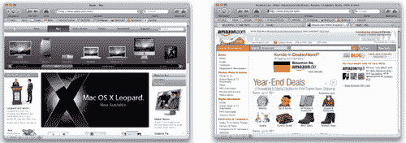](https://blogs.sitepointstatic.com.s3.amazonaws.cimg/lists/browsers/icab.png)

**[OmniWeb](http://www.omnigroup.com/applications/omniweb/)** :由著名的 Omni Group 开发，OmniWeb 使用 WebKit，包括一些不错的功能，如工作区、链接查看、广告拦截等等。OmniWeb 过去售价 14.95 美元，但从 2009 年 2 月开始免费提供。

[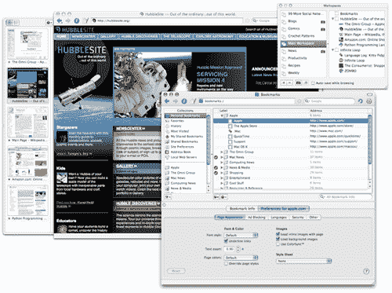](https://blogs.sitepointstatic.com.s3.amazonaws.cimg/lists/browsers/omniweb.png)

**[Shiira](http://shiira.jp/)** : Shiira 是一款基于 WebKit 的开源浏览器，旨在“创造一款比 Safari 更好、更有用的浏览器”在撰写本文时，自 2007 年以来还没有新的稳定版本发布，所以我们将由您来决定这个任务是否完成。

[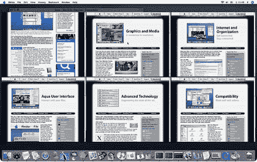](https://blogs.sitepointstatic.com.s3.amazonaws.cimg/lists/browsers/shiira.png)

## 多平台网络浏览器

火狐 : Mozilla Firefox 可能是最知名的第三方浏览器之一，到目前为止，几乎每个人都在自己的电脑上藏了一份。Firefox 是一个基于 Gecko 的浏览器，具有扩展、密码管理和更多功能。

[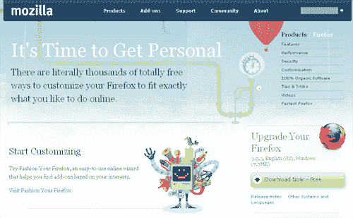](https://blogs.sitepointstatic.com.s3.amazonaws.cimg/lists/browsers/firefox.png)

**[Flock](http://flock.com/)** : Flock 被认为是 Firefox 的分支，构建于 Gecko 之上，将在 Windows、Mac OS X、Linux 和 BSD 上运行。Flock 的主要区别在于，它非常注重将社交网络体验融入浏览器环境。

[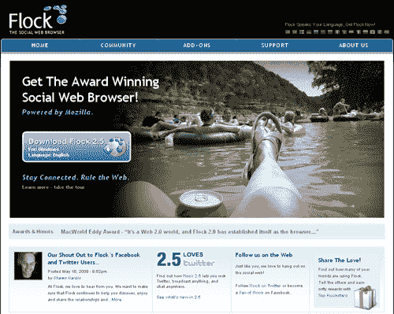](https://blogs.sitepointstatic.com.s3.amazonaws.cimg/lists/browsers/flock.png)

:基于 WebKit 的谷歌 Chrome 在推出后相对较短的时间内就拥有了相当忠实的追随者。虽然 Mac OS X 和 Linux 还没有正式发布，但这两个版本都应该会发布。这个特定应用程序的未来版本计划了很多东西，但目前它只是一个优秀的浏览器，没有很多花哨的功能。

[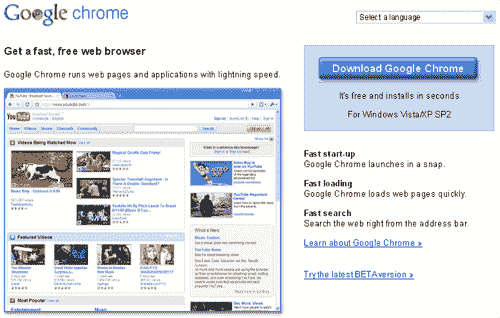](https://blogs.sitepointstatic.com.s3.amazonaws.cimg/lists/browsers/chrome.png)

Konqueror : Konqueror 是 K 桌面环境的一部分，但也可用于 Unix 系统、Mac OS X，最终将用于 Windows 系统。除了作为一个浏览器，它还可以用于文件管理。

[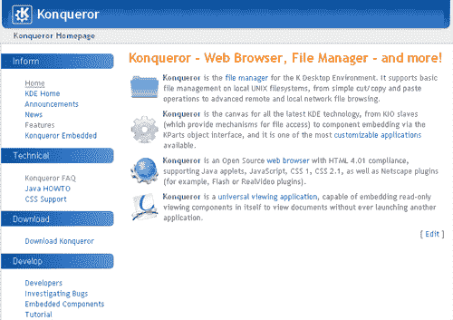](https://blogs.sitepointstatic.com.s3.amazonaws.cimg/lists/browsers/konqueror.png)

**[Opera](http://www.opera.com/browser/)** : Opera 使用 Presto 引擎，较小版本的浏览器用于 Wii 和任天堂 DS 等设备。它提供了数据同步、在线拼写检查、鼠标手势等功能。

[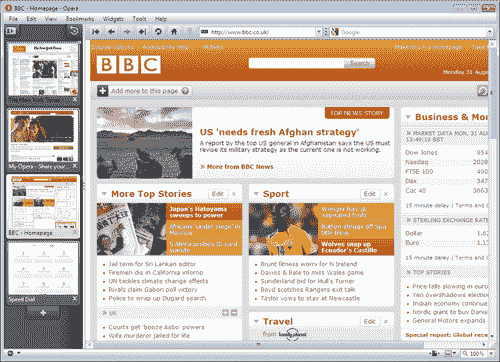](https://blogs.sitepointstatic.com.s3.amazonaws.cimg/lists/browsers/opera.png)

Safari:Safari 由苹果公司制造，安装在每台 Mac 电脑上，因此与 Mac 电脑紧密相关，但也有一个 Windows 版本受到了一定的欢迎。Safari 建立在 WebKit 的基础上，采用了简约的设计，强调你正在查看的页面，它还依靠大量的视觉技巧来使平凡的任务变得更加有趣，比如查看你的浏览历史。

[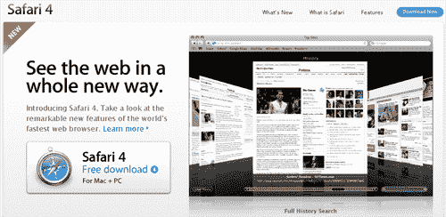](https://blogs.sitepointstatic.com.s3.amazonaws.cimg/lists/browsers/safari.png)

**[SeaMonkey](http://www.seamonkey-project.org/)**:SeaMonkey 是 Mozilla 家族中的另一款浏览器，但更多的是一个应用套件，具有浏览器、电子邮件和新闻阅读器的功能。

[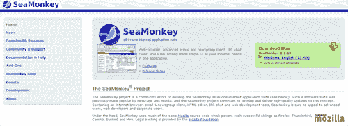](https://blogs.sitepointstatic.com.s3.amazonaws.cimg/lists/browsers/seamonkey.png)

## Windows Web 浏览器

**[Avant](http://www.avantbrowser.com/)** : Avant 号称最快的网络浏览器，有 41 种语言版本，下载量超过 2200 万次。它使用 Trident 布局引擎为自己供电，这使得它可以兼容 Internet Explorer 工具栏和插件。它还提供内置功能，如在线个人资料存储，允许您从任何地方登录到您的帐户，鼠标手势，自动填写表格等等。

[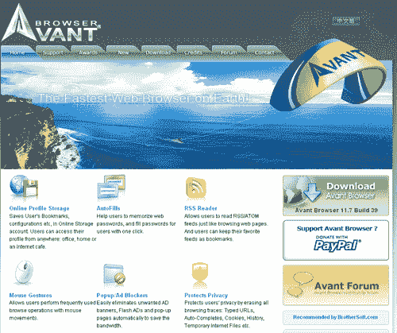](https://blogs.sitepointstatic.com.s3.amazonaws.cimg/lists/browsers/avant.png)

:尽管设计师们哀叹 Internet Explorer 6 一直困扰着他们的噩梦，但在这种特殊情况下，我们谈论的是 Internet Explorer 8。IE8 是最新的网络标准，处理 AJAX，是对这个浏览世界的中流砥柱的所有先前版本的巨大改进。

[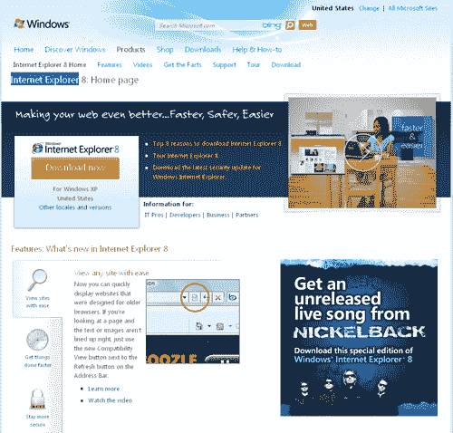](https://blogs.sitepointstatic.com.s3.amazonaws.cimg/lists/browsers/ie8.png)

K-Meleon :基于 Mozilla Gecko 引擎，K-Meleon 围绕轻量级的概念构建，并与 Windows 设置的视觉外观紧密集成。

[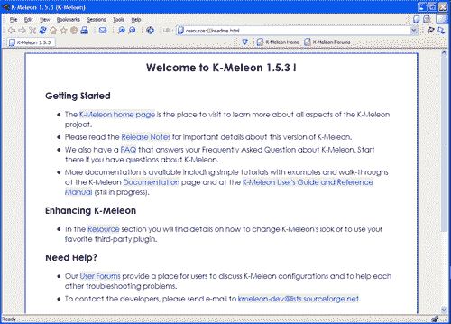](https://blogs.sitepointstatic.com.s3.amazonaws.cimg/lists/browsers/k-meleon.png)

傲游 :傲游是一款基于中国的浏览器，但在世界其他地方也有狂热的追随者。目前该浏览器运行在 Trident 引擎上，但目前正在测试的版本 3 将同时运行 Trident 和 WebKit。它包括诸如可皮肤化、关闭标签的撤销、许多扩展和许多其他功能。

[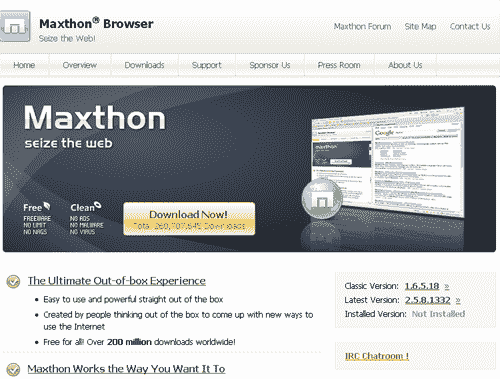](https://blogs.sitepointstatic.com.s3.amazonaws.cimg/lists/browsers/maxthon.png)

:斯雷普尼尔是一款在日本越来越受欢迎的浏览器，它非常注重定制，允许用户创建符合自己特定需求的浏览器。它基于 Trident 引擎，具有插件、标签、可定制的皮肤等等。

[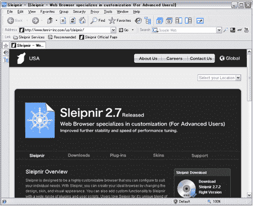](https://blogs.sitepointstatic.com.s3.amazonaws.cimg/lists/browsers/sleipnir.png)

## 分享这篇文章