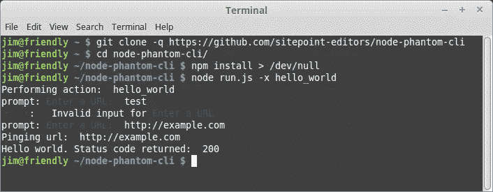

# 节点、幻影和骑士的网络爬行

> 原文：<https://www.sitepoint.com/web-crawling-node-phantomjs-horseman/>

*本文由 [Lukas White](https://www.sitepoint.com/author/lwhite) 进行同行评审。感谢 SitePoint 的所有同行评审员使 SitePoint 的内容尽可能做到最好！*

在项目过程中，发现自己需要编写自定义脚本来执行各种操作是很常见的。这种一次性脚本通常通过命令行( [CLI](https://en.wikipedia.org/wiki/Command-line_interface) )执行，可以用于几乎任何类型的任务。这些年来我写了很多这样的脚本，我已经开始欣赏提前花一点时间来建立一个定制的 CLI [微框架](https://en.wikipedia.org/wiki/Microframework)来促进这个过程的价值。幸运的是， [Node.js](https://nodejs.org/) 和它广泛的包生态系统 [npm](https://www.npmjs.com/) ，让这一切变得容易。无论是解析一个文本文件还是运行一个 [ETL](https://en.wikipedia.org/wiki/Extract,_transform,_load) ，有一个合适的约定使得以一种高效和结构化的方式添加新功能变得容易。

虽然不一定与命令行相关联，但 web 爬行经常用于某些问题领域，如自动化功能测试和外观检测。本教程演示了如何实现一个轻量级的 CLI 框架，其支持的行动围绕网页抓取。希望这能激发你的创造力，不管你是对爬行感兴趣还是对命令行感兴趣。涵盖的技术包括 Node.js、 [PhantomJS](http://phantomjs.org/) ，以及各种与爬行和 CLI 相关的 npm 包。

本教程的源代码可以在 [GitHub](https://github.com/sitepoint-editors/node-phantom-cli) 上找到。为了运行这些示例，您需要安装 Node.js 和 PhantomJS。下载安装说明可以在这里找到: [Node.js](https://nodejs.org/en/download/) ， [PhantomJS](http://phantomjs.org/download.html) 。

## 设置基本的命令行框架

任何 CLI 框架的核心都是将命令(通常包括一个或多个可选或必需的参数)转换为具体操作的概念。两个 npm 包在这方面很有帮助，分别是[指挥官](https://www.npmjs.com/package/commander)和[提示](https://www.npmjs.com/package/prompt)。

Commander 允许您定义支持哪些参数，而 prompt 允许您(适当地)在运行时提示用户输入。最终的结果是一个[语法上很棒的](https://en.wikipedia.org/wiki/Syntactic_sugar)界面，用于基于一些用户提供的数据执行各种带有动态行为的动作。

例如，我们希望我们的命令看起来像这样:

```
$ node run.js -x hello_world 
```

我们的入口点( [run.js](https://github.com/sitepoint-editors/node-phantom-cli/blob/master/run.js) )这样定义可能的参数:

```
program
  .version('1.0.0')
  .option('-x --action-to-perform [string]', 'The type of action to perform.')
  .option('-u --url [string]', 'Optional URL used by certain actions')
  .parse(process.argv); 
```

并定义了各种用户输入情况，如下所示:

```
var performAction = require('./actions/' + program.actionToPerform)

switch (program.actionToPerform) {
  case 'hello_world':
    prompt.get([{

      // What the property name should be in the result object
      name: 'url',

      // The prompt message shown to the user
      description: 'Enter a URL',

      // Whether or not the user is required to enter a value
      required: true,

      // Validates the user input
      conform: function (value) {

        // In this case, the user must enter a valid URL
        return validUrl.isWebUri(value);
      }
    }], function (err, result) {

      // Perform some action following successful input
      performAction(phantomInstance, result.url);
    });
    break;
} 
```

至此，我们已经定义了一个基本路径，通过它我们可以指定要执行的操作，并添加了一个接受 URL 的提示。我们只需要添加一个模块来处理特定于这个动作的逻辑。我们可以通过在[动作](https://github.com/sitepoint-editors/node-phantom-cli/tree/master/actions)目录中添加一个名为 [hello_world.js](https://github.com/sitepoint-editors/node-phantom-cli/blob/master/actions/hello_world.js) 的文件来实现:

```
'use strict';

/**
 * @param Horseman phantomInstance
 * @param string url
 */
module.exports = function (phantomInstance, url) {

  if (!url || typeof url !== 'string') {
    throw 'You must specify a url to ping';
  } else {
    console.log('Pinging url: ', url);
  }

  phantomInstance
    .open(url)
    .status()
    .then(function (statusCode) {
      if (Number(statusCode) >= 400) {
        throw 'Page failed with status: ' + statusCode;
      } else {
        console.log('Hello world. Status code returned: ', statusCode);
      }
    })
    .catch(function (err) {
      console.log('Error: ', err);
    })

    // Always close the Horseman instance
    // Otherwise you might end up with orphaned phantom processes
    .close();
}; 
```

如您所见，该模块期望被提供一个 PhantomJS 对象的实例(`phantomInstance`)和一个 URL ( `url`)。我们将很快进入定义 PhantomJS 实例的细节，但是现在足以看到我们已经为触发特定的动作打下了基础。既然我们已经建立了一个约定，我们可以很容易地以一种定义好的、合理的方式添加新的动作。

## 用骑士爬行着幻影

[骑士](https://github.com/johntitus/node-horseman)是一个 Node.js 包，它为创建 PhantomJS 流程并与之交互提供了一个强大的接口。对 Horseman 及其特性的全面解释需要单独撰写一篇文章，但可以说它允许您轻松地模拟人类用户可能在浏览器中表现出的任何行为。Horseman 提供了广泛的配置选项，包括自动注入 jQuery 和忽略 SSL 证书警告。它还提供了 cookie 处理和截图功能。

每当我们通过 CLI 框架触发一个动作时，我们的入口脚本(`run.js`)实例化一个骑士实例，并将其传递给指定的动作模块。在伪代码中，它看起来像这样:

```
var phantomInstance = new Horseman({
  phantomPath: '/usr/local/bin/phantomjs',
  loadImages: true,
  injectJquery: true,
  webSecurity: true,
  ignoreSSLErrors: true
});

performAction(phantomInstance, ...); 
```

现在，当我们运行命令时，骑士实例和输入 URL 被传递给 [hello_world](https://github.com/sitepoint-editors/node-phantom-cli/blob/master/actions/hello_world.js) 模块，导致 PhantomJS 请求 URL，捕获其状态代码，并将状态打印到控制台。我们刚刚用骑士进行了第一次真正的爬行。醒醒。



## 复杂交互的链式骑手方法

到目前为止，我们已经看到了一个非常简单的 Horseman 用法，但是当我们将它的方法链接在一起以在浏览器中执行一系列动作时，这个包可以做得更多。为了演示其中的一些特性，让我们定义一个动作，模拟用户通过 [GitHub](https://github.com/) 创建一个新的存储库。

**请注意:**这个例子纯粹是为了演示，不应该被认为是创建 Github 库的可行方法。这仅仅是一个如何使用 Horseman 与 web 应用程序交互的例子。如果你对以自动化的方式创建仓库感兴趣，你应该使用官方的 [Github API](https://developer.github.com/v3/repos/#create) 。

让我们假设新的爬行将像这样被触发:

```
$ node run.js -x create_repo 
```

遵循我们已经建立的 CLI 框架的约定，我们需要向 actions 目录添加一个名为 [create_repo.js](https://github.com/sitepoint-editors/node-phantom-cli/blob/master/actions/create_repo.js) 的新模块。与我们之前的“hello world”示例一样，`create_repo`模块导出了一个包含该动作所有逻辑的函数。

```
module.exports = function (phantomInstance, username, password, repository) {

  if (!username || !password || !repository) {
    throw 'You must specify login credentials and a repository name';
  }

  ...
} 
```

注意，通过这个操作，我们向导出的函数传递了比以前更多的参数。这些参数包括`username`、`password`和`repository`。一旦用户成功完成提示质询，我们将从`run.js`传递这些值。

在这一切发生之前，我们必须向`run.js`添加逻辑来触发提示并捕获数据。我们通过在主`switch`语句中添加一个案例来实现这一点:

```
switch (program.actionToPerform) {

  case 'create_repo':
    prompt.get([{
       name: 'repository',
       description: 'Enter repository name',
       required: true
    }, {
       name: 'username',
       description: 'Enter GitHub username',
       required: true
     }, {
       name: 'password',
       description: 'Enter GitHub password',
       hidden: true,
       required: true
    }], function (err, result) {
      performAction(
        phantomInstance,
        result.username,
        result.password,
        result.repository
      );
    });
    break;

    ... 
```

现在我们已经将这个钩子添加到了`run.js`中，当用户输入相关数据时，它将被传递给动作，从而允许我们继续抓取。

至于`create_repo`抓取逻辑本身，我们使用骑士的方法数组导航到 Github 登录页面，输入提供的`username`和`password`，并提交表单:

```
phantomInstance
  .open('https://github.com/login')
  .type('input[name="login"]', username)
  .type('input[name="password"]', password)
  .click('input[name="commit"]') 
```

我们继续等待表单提交页面的加载:

```
.waitForNextPage() 
```

之后，我们使用 jQuery 来确定登录是否成功:

```
.evaluate(function () {
  $ = window.$ || window.jQuery;
  var fullHtml = $('body').html();
  return !fullHtml.match(/Incorrect username or password/);
})
.then(function (isLoggedIn) {
  if (!isLoggedIn) {
    throw 'Login failed';
  }
}) 
```

如果登录失败，将引发错误。否则，我们继续链接方法以导航到我们的个人资料页面:

```
.click('a:contains("Your profile")')
.waitForNextPage() 
```

进入我们的个人资料页面后，我们将导航到我们的存储库选项卡:

```
.click('nav[role="navigation"] a:nth-child(2)')
.waitForSelector('a.new-repo') 
```

在我们的 repositories 选项卡上，我们检查指定名称的存储库是否已经存在。如果是，那么我们抛出一个错误。如果没有，那么我们继续我们的序列:

```
// Gather the names of the user's existing repositories
.evaluate(function () {
  $ = window.$ || window.jQuery;

  var possibleRepositories = [];
  $('.repo-list-item h3 a').each(function (i, el) {
    possibleRepositories.push($(el).text().replace(/^\s+/, ''));
  });

  return possibleRepositories;
})

// Determine if the specified repository already exists
.then(function (possibleRepositories) {
  if (possibleRepositories.indexOf(repository) > -1) {
    throw 'Repository already exists: ' + repository;
  }
}) 
```

假设没有抛出任何错误，我们通过以编程方式单击“new repository”按钮并等待下一页来继续:

```
.click('a:contains("New")')
.waitForNextPage() 
```

之后，我们输入提供的`repository`名称并提交表单:

```
.type('input#repository_name', repository)
.click('button:contains("Create repository")') 
```

当我们到达结果页面时，我们知道已经创建了存储库:

```
.waitForNextPage()
.then(function () {
  console.log('Success! You should now have a new repository at: ', 'https://github.com/' + username + '/' + repository);
}) 
```

与任何骑士爬行一样，我们在最后关闭骑士实例是至关重要的:

```
.close(); 
```

未能关闭骑士实例会导致孤立的 PhantomJS 进程在机器上持续。

## 爬行以收集数据

至此，我们已经组装了一个静态的动作序列，以编程方式在 GitHub 上创建一个新的存储库。为了完成这个，我们链接了一系列的骑士方法。

这种方法对于事先已知的特定结构和行为模式非常有用，但是，您可能会发现在某些时候需要实现更灵活的脚本。如果您的动作序列有可能根据上下文发生很大变化或产生多种不同的结果，就可能会出现这种情况。如果您需要从 DOM 中提取数据，情况也是如此。

在这种情况下，您可以使用 Horseman 的 [evaluate()](https://github.com/johntitus/node-horseman#evaluatefn-arg1-arg2) 方法，该方法允许您通过注入内联或外部链接的 JavaScript 在浏览器中执行自由形式的交互。

这一节展示了一个从页面中提取基本数据的例子(这里是锚链接)。一个可能需要这样做的场景是构建一个污损检测爬虫来访问域中的每个 URL。

与上一个示例一样，我们必须首先向 actions 目录添加一个新模块:

```
module.exports = function (phantomInstance, url) {

  if (!url || typeof url !== 'string') {
    throw 'You must specify a url to gather links';
  }

  phantomInstance
    .open(url)

    // Interact with the page. This code is run in the browser.
    .evaluate(function () {
      $ = window.$ || window.jQuery;

      // Return a single result object with properties for
      // whatever intelligence you want to derive from the page
      var result = {
        links: []
      };

      if ($) {
        $('a').each(function (i, el) {
          var href = $(el).attr('href');
          if (href) {
            if (!href.match(/^(#|javascript|mailto)/) && result.links.indexOf(href) === -1) {
              result.links.push(href);
            }
          }
        });
      }
      // jQuery should be present, but if it's not, then collect the links using pure javascript
      else {
        var links = document.getElementsByTagName('a');
        for (var i = 0; i < links.length; i++) {
          var href = links[i].href;
          if (href) {
            if (!href.match(/^(#|javascript|mailto)/) && result.links.indexOf(href) === -1) {
              result.links.push(href);
            }
          }
        }
      }

      return result;
    })
    .then(function (result) {
      console.log('Success! Here are the derived links: \n', result.links);
    })

    .catch(function (err) {
      console.log('Error getting links: ', err);
    })

    // Always close the Horseman instance
    // Otherwise you might end up with orphaned phantom processes
    .close(); 
```

然后在`run.js`中为新动作添加一个钩子:

```
switch (program.actionToPerform) {

  ...

  case 'get_links':
    prompt.get([{
        name: 'url',
        description: 'Enter URL to gather links from',
        required: true,
        conform: function (value) {
          return validUrl.isWebUri(value);
        }
    }], function (err, result) {
      performAction(phantomInstance, result.url);
    });
    break; 
```

现在代码已经准备好了，我们可以通过运行下面的命令从任何给定的页面中抓取链接:

```
$ node run.js -x get_links 
```

这个动作演示了从页面中提取数据，并且不使用任何由 Horseman 内置的浏览器动作。它直接执行您放在`evaluate()`方法中的任何 JavaScript，就像它在浏览器环境中运行一样。

在本节中应该注意的最后一件事，前面已经提到过:您不仅可以使用`evaluate()`方法在浏览器中执行定制的 JavaScript，还可以在运行评估逻辑之前将外部脚本注入到运行时环境中。可以这样做:

```
phantomInstance
  .open(url)
  .injectJs('scripts/CustomLogic.js')
  .evaluate(function() {
    var x = CustomLogic.getX(); // Assumes variable 'CustomLogic' was loaded by scripts/custom_logic.js
    console.log('Retrieved x using CustomLogic: ', x);
  }) 
```

通过扩展上述逻辑，您可以在任何网站上执行几乎任何操作。

## 使用骑士截图

我想演示的最后一个用例是如何使用 Horseman 截屏。我们可以用 Horseman 的 [screenshotBase64()](https://github.com/johntitus/node-horseman#screenshotbase64type) 方法来实现这一点，该方法返回一个代表屏幕截图的 Base64 编码的字符串。

与前面的例子一样，我们必须首先向 actions 目录添加一个新模块:

```
module.exports = function (phantomInstance, url) {

  if (!url || typeof url !== 'string') {
    throw 'You must specify a url to take a screenshot';
  }

  console.log('Taking screenshot of: ', url);

  phantomInstance
    .open(url)

    // Optionally, determine the status of the response
    .status()
    .then(function (statusCode) {
      console.log('HTTP status code: ', statusCode);
      if (Number(statusCode) >= 400) {
        throw 'Page failed with status: ' + statusCode;
      }
    })

    // Take the screenshot
    .screenshotBase64('PNG')

    // Save the screenshot to a file
    .then(function (screenshotBase64) {

      // Name the file based on a sha1 hash of the url
      var urlSha1 = crypto.createHash('sha1').update(url).digest('hex')
        , filePath = 'screenshots/' + urlSha1 + '.base64.png.txt';

      fs.writeFile(filePath, screenshotBase64, function (err) {
        if (err) {
          throw err;
        }
        console.log('Success! You should now have a new screenshot at: ', filePath);
      });
    })

    .catch(function (err) {
      console.log('Error taking screenshot: ', err);
    })

    // Always close the Horseman instance
    // Otherwise you might end up with orphaned phantom processes
    .close();
}; 
```

然后在`run.js`中为新动作添加一个钩子:

```
case 'take_screenshot':
  prompt.get([{
      name: 'url',
      description: 'Enter URL to take screenshot of',
      required: true,
      conform: function (value) {
        return validUrl.isWebUri(value);
      }
  }], function (err, result) {
    performAction(phantomInstance, result.url);
  });
  break; 
```

现在，您可以使用以下命令截图:

```
$ node run.js -x take_screenshot 
```

使用 base64 编码的字符串(而不是，例如，保存实际图像)的原因是，它们是表示原始图像数据的便捷方式。这个 [StackOverflow 答案](http://stackoverflow.com/a/201510/1136887)更详细。

如果您想保存实际的图像，您可以使用 [screenshot()](https://github.com/johntitus/node-horseman#screenshotpath) 方法。

## 结论

本教程试图演示一个定制的 CLI 微框架和一些在 Node.js 中爬行的基本逻辑，使用骑士包来利用 PhantomJS。虽然使用 CLI 框架可能会使许多项目受益，但爬行的使用通常仅限于非常具体的问题领域。一个常见的领域是质量保证(QA)，爬行可用于功能和用户界面测试。另一个领域是安全性，例如，您可能希望定期搜索您的网站，以检测它是否被篡改或受到其他危害。

无论你的项目是什么情况，一定要清楚地定义你的目标，尽可能不引人注目。在可能的情况下获得许可，尽最大可能保持礼貌，注意永远不要拒绝访问某个网站。如果你怀疑你正在产生大量的自动流量，那么你可能是，并且应该重新评估你的目标、实现或者许可级别。

## 分享这篇文章