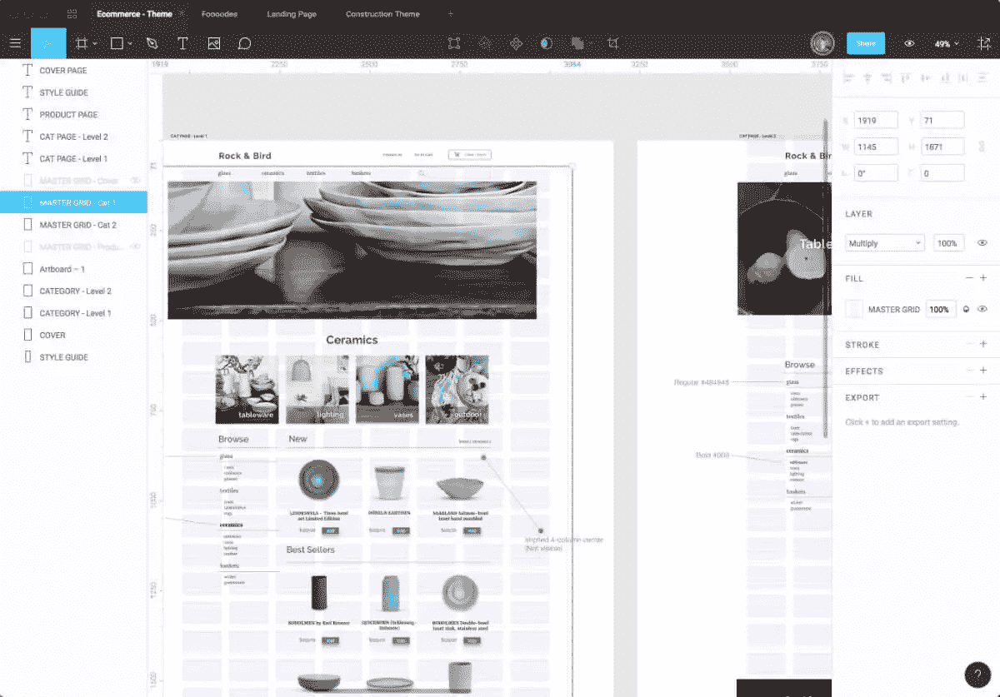
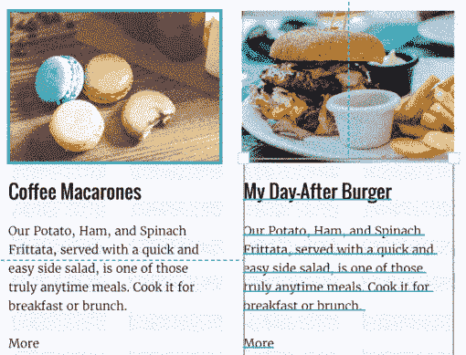
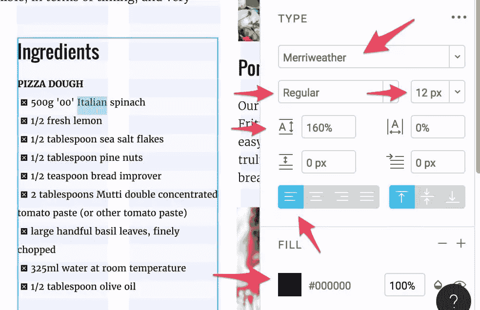
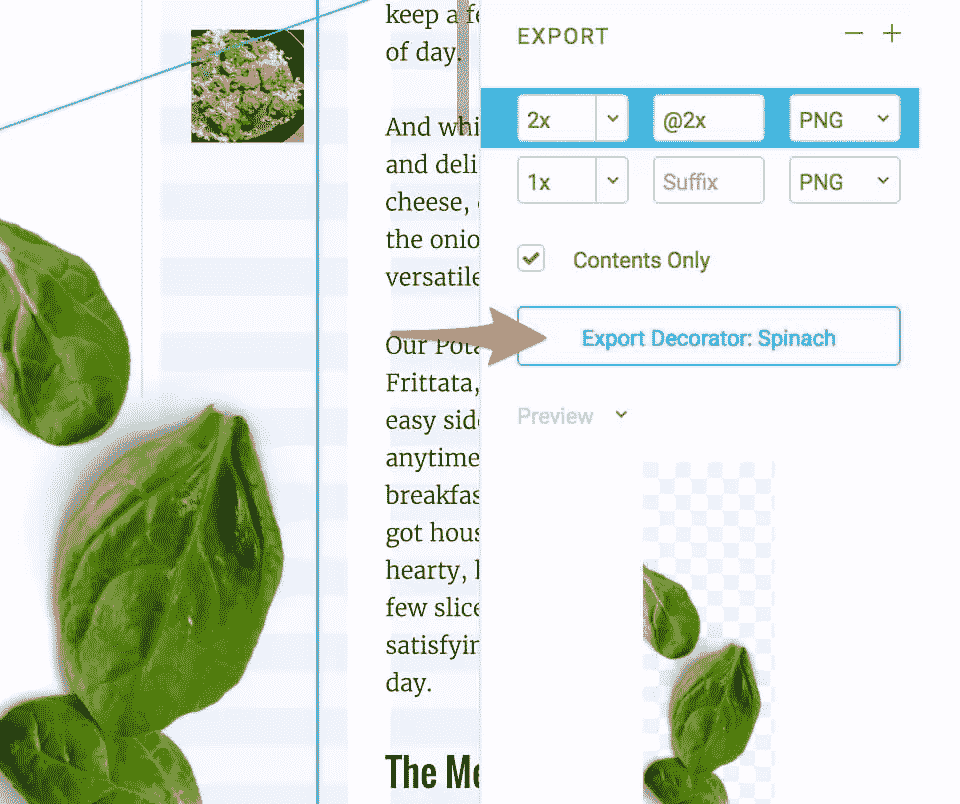

# 网页设计 2016:Chromes 的进攻！

> 原文：<https://www.sitepoint.com/web-design-2016-attack-chromes/>

我们刚刚结束了 2016 年，我认为回顾过去 12 个月你的工作流程可能会如何发展总是很有趣。在一年的时间里，你的工具和技术发生了如此多的变化，这常常令人惊讶。

对我来说，2016 年 UX 设计展的突出主题是 Chrome 应用作为成熟的网页设计选项的到来。事实上，我已经在 2016 年的时事通讯中写了其中的三篇。

BoxySVG 用户界面

早在四月份，我们就讨论过 Jarek Foksa 的[BoxySVG——一个优秀的小型 SVG 编辑器](https://www.sitepoint.com/boxy-svg-a-fast-simple-insanely-useful-svg-editor/)。虽然这款应用可以在 Chrome 浏览器中运行，但它最好是作为下载的 ChromeOS 应用运行。

9 月份，[我报道了 Pingendo，一个原型开发工具](https://www.sitepoint.com/the-great-prototyping-debate-software-vs-hand-coding/)，它提供了引导驱动的原型——以及另一个 Chrome 应用。从那时起，我已经用这个应用程序建立了两个原型。

### 输入 Figma

然而，可以说我自己的工作流程在 2016 年发生的最大变化发生在 11 月，当时我编辑了亚当·拉希德的《Figma 是素描设计师的一个重要选择吗？——又一款 ChromeOS 应用。

现在，亚当会告诉你，他是一个不折不扣的素描迷——我的意思是，*他教授素描课程*——然而他来找我，兴奋地写了一个基于网络的素描竞争对手。当时，我对 T2·菲格玛一无所知，但当我读到他的初稿时，我被吸引住了。

菲格玛

六个星期后，我现在每天都使用 Figma。我不是故意的——事情就这样发生了。我有 Sketch、Adobe XD、Photoshop 甚至 Fireworks，但我发现我花在(目前)免费网络应用上的时间更多。

### 那么，为什么是菲格玛？

**不是 UI** 。如果 Sketch 发明了现代 UI 设计工具应该是什么样子，Figma 并没有偏离太远。左边是层，右边是属性。如果你熟悉 Sketch，你就不会在 Figma(或者 XD)中迷失。

此外，草图文件通常很容易导入 Figma。

但显然，这些都不是*把*换成 Figma 的理由。

**是因为免费吗？**不，不要误会——我喜欢免费的，但我已经为其他应用付费了，所以我不使用它们在技术上是在赔钱。

不，还有一个更令人惊讶的原因(反正对我来说)。

## Figma 的多用户协作改变了游戏规则

多用户协作是 Figma 的“特色酱”——这是唯一一件与 Sketch、Photoshop 甚至 Adobe XD 相比使用起来有显著不同的东西。

Figma 的多用户界面

Figma 允许你通过 URL 或用户名直接从应用程序中分享设计。没有上传或同步到二级云服务。菲格玛在线设计了*——与谷歌文档没有什么不同。*

 *这意味着当两个或更多的用户在查看同一个 Figma 设计时，你可以看到另一个用户的光标——再次类似于 Google Docs。

我不得不说，当我第一次看到这个的时候，我觉得*‘嗯……那很……可爱’*。

但随着时间的推移，人们逐渐意识到这种实时分享功能是多么的有用。原因如下。

### 1) Figma Docs 是生活方式指南

当您与开发人员共享 Figma 文档时(仅查看访问权限)，他们就能够单击任何页面元素并在右侧面板中查看其属性。这包括:

*   字体系列、大小、粗细
*   宽度和高度
*   行高和边距
*   颜色；色彩；色调
*   阴影和效果

开发人员使用 Figma 查看房产

虽然这并不能取代对好的风格指南的需求，但它确实给了开发人员一个简单的方法来回答他们关于设计的几乎任何问题。

事实上，当我在 Skype 上向马尼拉的开发人员介绍我的 Figma 设计时，我已经能够看到他们点击了。Figma 还内置了一个不错的评论/注释系统。

### 2).开发人员不需要向你要求小的图形调整

通常需要对图标和图形进行微小的调整，这通常意味着返回到 UI 设计器。Figma 允许任何拥有授权和浏览器的人在任何需要的时候调整和重新导出图形。

开发人员可以在必要时调整和重新导出图形。

此外，完整的版本控制让您可以随时恢复到原始版本。

### 3).项目经理不需要持续的状态报告

作为设计师，我们经常需要花时间向利益相关者更新设计项目的进度。有了 Figma，他们可以准确地看到*你的设计处于*阶段，因此他们不再需要你不断更新。

当他们来找你时，你可以直接进入重要的问题，而不是解释你做了什么。

### 在上面系上丝带

最重要的是，Figma 的多用户功能让每个人都在同一个页面上(双关语)。项目经理、营销人员和开发人员很早就参与到设计过程中——实际上是看着你工作——所以他们似乎感觉到更多的所有权。这是一个很好的副作用。

所有应用程序都会从这种实时协作方式中受益吗？大概不会。我从未在谷歌文档中见过同样的事情。网页/应用程序设计似乎特别适合。

然而，看到 2016 年 Chrome 应用程序的强大和复杂，我很想知道 2017 年人们会用它做什么。

*原载于 [SitePoint 设计简讯](https://www.sitepoint.com/newsletter/)* 。* 

## *分享这篇文章*