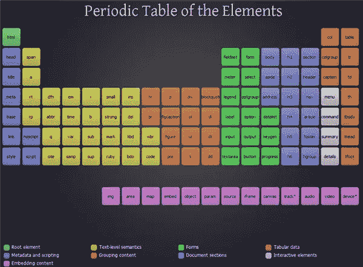
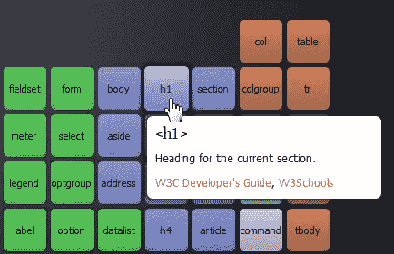
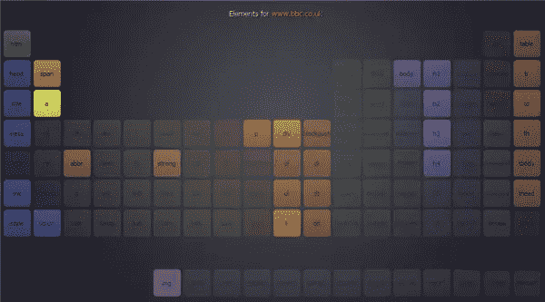

# 网页设计资源:( HTML 5)元素周期表

> 原文：<https://www.sitepoint.com/web-design-resource-the-periodic-table-of-the-html-5-elements/>

如果你对学习 HTML 感兴趣，或者已经知道 HTML，但想知道 HTML 5 中使用了哪些元素，那么你可能会发现 Josh Duck 的元素周期表是一个有用的资源。彩色表的布局风格类似于科学元素周期表。这个标签表包括 HTML5 工作草案中的 104 个元素和 2 个用星号突出显示的提议元素。

表格的每一部分都用颜色编码，将元素分成不同的组，如表格数据、交互元素、表单、元数据和脚本。

单击任何元素都会显示一个弹出标签，上面有每个标签的简短说明，以及 W3 Schools 和 W3C 开发人员指南的链接。

另一个方便的功能是“它们是如何被使用的”部分，它允许你输入一个网站的 URL，表格会改变以突出显示该网站上使用的标签。你可以在下面的例子中看到 BBC 网站上使用了哪些元素。

这里使用的周期表布局是一种清晰简洁的方式来查看所有的元素。这是一个简单但有用的学习工具，我会在我的网页设计课上推荐给学生。Josh Duck 是一名在澳大利亚布里斯班工作的灯开发人员。

如果你正在学习 HTML 或弄清楚 HTML 5，你还用过哪些资源(当然除了 SitePoint)？

## 分享这篇文章