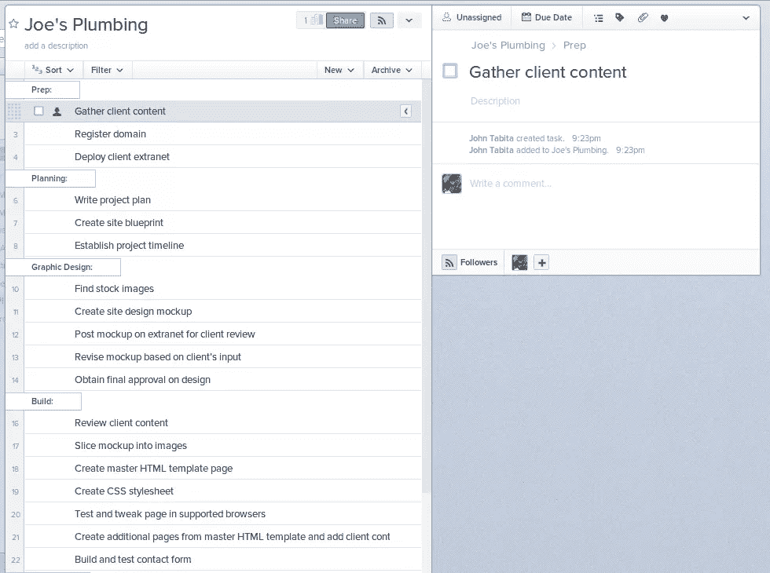
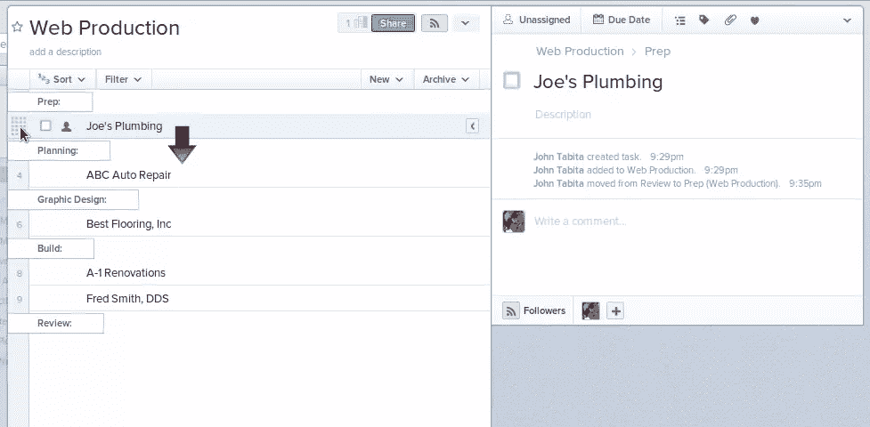

# 网页设计工作流程:基本工具

> 原文：<https://www.sitepoint.com/web-design-workflow-essential-tools/>

在我的上一篇文章中，我解释了[管理您的工作流](https://www.sitepoint.com/web-design-workflow-made-easy/ "Web Design Workflow Made Easy")的必要性。无论你是一次处理几个复杂的项目，还是大量的小项目，你都需要一个系统。

您的系统需要工具来运行。我用打印清单跟踪工作进度的日子已经一去不复返了。欢迎来到生产力应用的时代。这些年来，我已经用过很多次了。两个特别的例子是 Asana 和 Producteev。

多达 15 人的团队可以免费练习体式。 [Producteev](http://www.producteev.com/ "Producteev | Task Management for Teams") (截至 5 月)完全免费，无论团队规模大小。两者都有以下共同特征:

*   干净的用户界面
*   工作区、项目、任务和子任务
*   分配任务、添加截止日期、跟踪任务和跟踪进度
*   无限项目
*   电子邮件通知
*   将电子邮件变成任务
*   移动应用程序

虽然 Producteev 值得考虑，但在我看来，Asana 有几个特性让它略胜一筹。

首先，我可以将不同的电子邮件关联到每个工作区。这意味着我可以在公司和个人项目中使用它。我添加到公司工作区的同事看不到我的个人项目。

第二个是在项目、任务或子任务中创建部分标题的能力，这使我能够以多种不同的方式管理项目——每个客户一个项目，或者每个客户一个任务。让我们来看看每一个。

## 每个客户一个项目

使用这种方法，每个客户端都包含在自己的项目中，完成后可以归档。

正如我前面提到的，Asana 允许您在项目中创建节标题。你会注意到我为每个制作阶段(即准备、计划、平面设计等)都做了一个。)下面有相应的任务。任务完成后可以核对。

这种方法的缺点是，每次添加新的客户端时，您都必须创建一个新的项目。但是，创建一个每次都要复制的主项目模板可以简化这一过程。

## 每个客户端一个任务

每个客户端一个任务，每个客户端是单个项目下的一个单独的任务，例如“Web 生产”。

在这个场景中，您将看到我已经创建了与以前相同的部分标题，并将每个客户端任务放在适当的生产阶段下。随着特定客户端从一个阶段进入下一个阶段，您可以将客户端任务拖到下一个部分标题。只有当一个客户完成了整个工作流程，你才能把任务标记为完成。

如果您仍然希望跟踪每个生产步骤，您可以在每个客户端任务中创建子任务，并在子任务中添加节标题。

根据我的经验，方法 1 在管理更少、更复杂的项目时效果很好；然而，方法 2 快速、有效地跟踪大量较小的项目。像往常一样，你的里程数可能会有所不同，所以尝试每一种，以确定哪种最适合你。

有喜欢的项目管理 app 或工作流方法吗？请在下面的评论中发表你的观点。

## 分享这篇文章