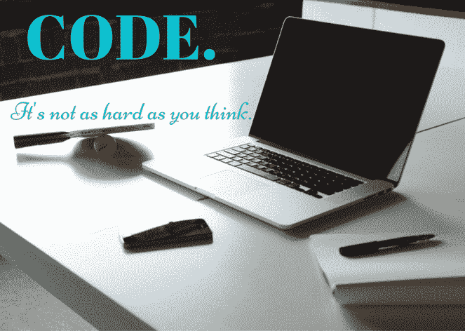
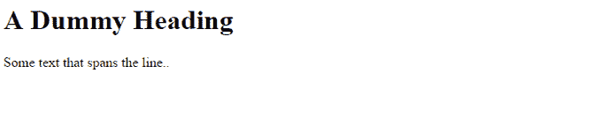
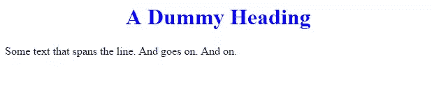
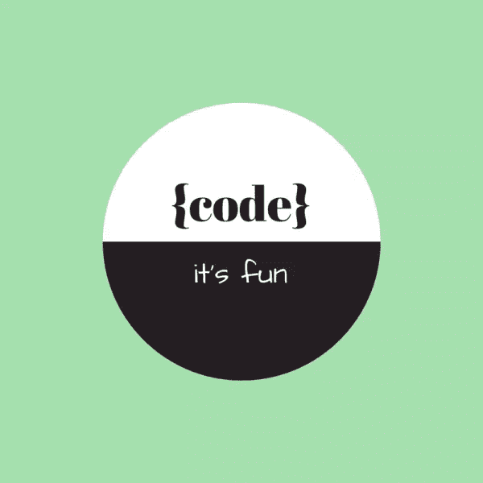

# 网页设计者编程指南

> 原文：<https://www.sitepoint.com/web-designers-guide-to-programming/>

[](https://www.flickr.com/photos/32268485@N07/9109957947)

图片来源:卡梅隆-尼克-艾康

网页设计师真的需要知道如何编码吗？我们真的需要[【独角兽】](http://webdesign.tutsplus.com/articles/my-thoughts-on-unicorns-in-the-mystical-world-of-ux--webdesign-17999)？

答案大概是**没有**。

今天的世界正走向超级专业化(例如几乎任何东西的移动应用程序)。大多数设计师更喜欢[专注于他们的强项](http://torquemag.io/designers-code/)——网站设计的创意方面。让开发人员想办法让它变得生动起来。或者更好的是，用[现代协同设计工具](https://boagworld.com/design/why-codesign-tools-are-the-future-of-web-design/)创建一个实时网站，在那里不需要召集开发者！

但事实是——作为一名创意人员，你希望完全掌控自己的作品。你想看到你的作品上线。你想突破界限。

正如梵高所写

> “我一直在做我还不会做的事情，以便学会去做。”— [文森特·梵高](http://vangoghletters.org/vg/letters/let528/letter.html)

要真正掌握你的手艺，你需要了解媒体。网络的媒介，是代码。

对于那些渴望掌握网页设计的人来说，问题并不是“网页设计师需要学习如何编码吗？”但更多的是“一个网页设计师需要学习多少代码？”。

设计师不需要成为 HTML 或 CSS 大师。或者是专业的程序员。**设计师需要对构成网络基础的代码有足够的了解，以便能够将这些点连接起来，做出合理的设计决策。**



对于以前从未做过任何编程的人来说，这可能有点让人不知所措。HTML，CSS，JavaScript，PHP，Ruby，SQL..web 开发实际上使用了许多不同的编程语言。如果你是一个渴望了解你的网站设计如何变得生动的设计师，这里有你需要知道的东西和开始的地方。

## 前端与后端 Web 开发

浏览者看到的网站部分称为前端。后端包括所有存储的数据、图像、服务器和其他组件。网页设计和开发有点像盖房子——建筑师设计房子很像网页设计师设计网站；施工人员搭建类似于后端开发的砖块、砂浆、管道等，油漆工、室内装饰工等处理类似于前端开发的房子的可见的最后润色。

前端开发是用 HTML，CSS 和 JavaScript 完成的，后端开发人员一般用 PHP，Ruby，Python，Java，SQL 或者。Net 进行编程。全栈开发人员，他们理解并能够编码全栈，即前端和后端。(关于前端 vs 后端开发的更多信息，你可以在这里阅读[，在这里](http://blog.bloc.io/frontend-vs-backend-web-development/)阅读[。](http://blog.udacity.com/2014/12/front-end-vs-back-end-vs-full-stack-web-developers.html)

设计师不需要学习所有这些编程语言。我们的目标不是成为一个全栈开发人员，或者任何类型的开发人员(除非你真的*想要*进行转换！).**目标是理解设计如何转化为代码**。对于设计师来说，专注于理解前端编程的基础是有意义的，因为它是创建布局和设计的视觉元素的部分。

## 超文本标记语言

从设计或模型到一个真实的网站涉及到许多编码阶段，正如你在上面看到的，许多语言。该过程的第一步通常是将网站的组件映射到 HTML 元素中，并写出基本的 HTML 代码。每个组件被称为一个元素，并使用标签来指定。文本、图像、动画都变成了 HTML 元素。每个元素都被构造成一个称为 DOM 树的层次结构，它决定了每个元素的加载和显示顺序。这里有一个简单的基本 HTML 的例子。

```
<!DOCTYPE html>
<html>
<body>
  <h1>A Dummy Heading</h1>
  <p>Some text that spans the line.. </p>
</body>
</html>
```

这是它看起来的样子:



挺平淡的！除了我们放入的基本文本之外，这里没有样式、布局或任何其他视觉元素。这是因为样式信息放在 CSS 中。但是在我们转向 CSS 之前，这里有一些很棒的在线培训可以帮助你熟悉 HTML

*   [HTML 简介](https://learnable.com/courses/introduction-to-html-2897)来自 Learnable
*   W3Schools 的 HTML 简介
*   KhanAcademy 的 HTML 简介

## CSS(级联样式表)

大多数样式信息作为 CSS 表与 HTML 分开存储。开发人员更喜欢将内容和风格分开，这样就可以很容易地改变一个或另一个，而不会弄乱一切，或者必须重做整个代码。这真的很有效，尤其是对于有多个页面的大型网站。每个页面不再需要有自己的布局编码或字体等定义。所有的页面都可以使用一组通用的 CSS 样式表来利用通用的布局、字体集等。

或者，如果客户在最后一刻决定对布局进行重大修改，您可以直接更改 CSS 样式，而不必编辑站点的每个页面。通常当开发人员开始编码时，在他们准备好最终版本之前，这是一个在 HTML 和 CSS 之间来回迭代的过程。

让我们先看第一个例子，并添加一些样式。下面几行使标题为蓝色并居中。

```
<!DOCTYPE html>
<html>
<body>
<style>
h1 {
    color: blue;
    text-align: center;
}
</style>

  <h1>A Dummy Heading</h1>
  <p>Some text that spans the line. And goes on. And on. </p>

</body>
</html>
```

现在看起来是这样的:



同样，这只是一个非常基本的例子。你可以从以下网上资源中学习一些实用的 CSS:

*   [实用 CSS](https://learnable.com/courses/practical-css-198) 来自可学
*   W3Schools 的 CSS 介绍
*   [Khan academy 的 CSS 简介](https://www.khanacademy.org/computing/computer-programming/html-css/intro-to-css/p/css-basics)

## Java Script 语言

JavaScript 让你在网页上拥有动态的、交互式的元素。大多数联系人表单、变化的图像传送带、自动建议/自动填充字段等都是基于 JavaScript 的。当然，添加某些动态元素还有其他方法，但 JavaScript 是目前最流行的。JavaScript 也用于改变 HTML 内容，或者加载不同的内容。W3School 有一些很好的[实例](http://www.w3schools.com/js/js_intro.asp)，你可以从中看到 JavaScript 是如何改变内容的。要了解更多关于 JavaScript 及其如何帮助设计师的信息，请查看以下资源:

*   Rachel Nabors 为设计师编写的 JavaScript 脚本(额外:【2013 混合会议在此讨论)
*   W3School 的 JavaScript 简介(带实例)

对于大多数网络任务，有一个丰富的 JavaScript 函数、API 和插件库。也就是说，您可以轻松地使用这些预构建的包，并且除了基本的 JavaScript 代码之外，很少需要自己编写代码。

## 把所有的放在一起



因此，我们已经向您介绍了前端 web 开发的基本语言——这些语言用于将您的设计翻译成实时网页。正如我们前面所说的，编码过程通常是迭代的，开发人员根据所需的功能在这些语言之间来回切换。但是这一切是如何结合在一起的呢？以下课程可以帮助您了解 HTML、CSS 和 JavaScript 如何结合在一起，让您的设计变得栩栩如生:

*   用来自 Learnable 的 HTML & CSS 建立你的第一个网站
*   来自 Udacity 的 HTML 和 CSS 简介
*   [30 天从 Tut+学会 HTML & CSS](http://webdesign.tutsplus.com/courses/30-days-to-learn-html-css)
*   用代码学院的 HTML+CSS 制作一个网站
*   [Udemy 上的 Web 开发简介](https://www.udemy.com/introduction-to-web-development/)

请注意，这些只是一些精选的入门课程，供您入门。那些有兴趣深入研究或扩展他们的技能以包括前端 web 开发的人可以在 [Learnable](http://learnable.com) 、 [CodeAcademy](http://www.codecademy.com/) 、 [Tut+](http://tutplus.com) 、 [Udemy](http://udemy.com) 或其他在线门户网站上查找更多资源。

## 包装它

虽然设计人员不需要知道如何编码，但花时间学习前端开发的基础知识肯定会有助于扩展他们的视野。它带来了

*   有助于创造新设计可能性的理解
*   实现或试验您自己的实时网站的能力
*   与开发人员互动的机会或者词汇

最重要的是，你从以上所有事情中获得的满足感和尊重。

很难吗？可能吧(但我列出的超级简单、全面的课程应该会让它变得轻而易举)。值得吗？绝对的。

如果你已经走过这条路，请与我们分享——作为一名设计师，它对你有什么帮助？你面临的最大障碍是什么？

## 分享这篇文章