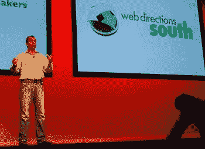

# 网络指南 2007 在悉尼开幕

> 原文：<https://www.sitepoint.com/web-directions-south-2007-opens-in-sydney/>

SitePoint 工作人员是今天在悉尼举行的 Web Directions South 2007 开幕式上的 600 多名观众之一。会议主持人约翰·奥尔索普上台宣布会议开始，并介绍了一些主要主题。

他的首要任务是移动网络已经到来。约翰提到苹果 iPhone、诺基亚的 WebKit 驱动的移动浏览器和任天堂 Wii 等设备正在改变人们使用网络的方式。为了反映这些进步，今年的会议特别关注移动网络技术。

来自 SlideShare 的主旨发言人 Rashmi Sinha 接着就 T2 流行的危险发表了演讲，重点是社交网络的当前趋势。辛哈展示了新一代社交网站是如何基于共享活动(如脸书)和对象(如 YouTube)的。

在演讲过程中，辛哈不时停下来询问听众对当前焦点的看法，她惊讶地发现，悉尼的听众似乎与她在硅谷演讲的听众有着不同的优先考虑。例如，只有少数 Web Directions South 的与会者表示他们目前正在开发脸书应用程序，而在美国，显然“都是关于脸书应用程序的”

辛哈概述了社交网络中的三种社交模式:

*   **盲目社交的 Google 模式**，不能浏览网络，只能搜索(如 Picasa Web，Google Calendar)。
*   鼓励暴民的 Digg 模式，在产生“流行”内容方面非常强大，但是存在问题，因为用户倾向于在暴民中工作，而不是独立工作。
*   利用观看、收藏和标记等社交姿态的 YouTube 模式。

Sinha 鼓励与会者考虑他们使用的社交模式，以及它将对用户突出显示的“流行”内容类型产生的影响。

Sinha 还从理论上推断出**谷歌正在积极地反对这些社交模型中的几个**，因为社交网络中封闭的对象共享圈不能很好地转化为像 Google Pagerank 这样的算法，后者只能通过衡量开放网络上的受欢迎程度来衡量内容的质量。

标签: [wds07](http://technorati.com/tag/wds07)

## 分享这篇文章