# 使用 Photoshop 控制网络

> 原文：<https://www.sitepoint.com/web-domination-photoshop/>

如果你熟悉 Photoshop，你可能会渴望尝试它的许多功能。在本文中，我们将介绍 Photoshop 用户应该掌握的一些基本任务，例如调整文档和图层的大小和旋转，使用蒙版，创建曲线和自定义形状，使用透明图像等等！

首先，我们将涵盖每个 Photoshop 用户需要知道的基础知识。然后我们将致力于学习所有关于[创造酷按钮效果](https://www.sitepoint.com/web-domination-photoshop/)的知识。我们将涵盖大量不同的效果，所以我希望你已经准备好一些严重的 Photoshop 动作！

这篇文章代表了我的新书《Photoshop 选集:101 个网页设计技巧，诀窍&技巧中的两个章节，这是一个 Photoshop 技巧的完整概要——它们都是全彩色的！你可以[下载这篇文章，加上这本书的介绍性章节，以 PDF 格式](https://www.sitepoint.com/show-modal-popup-after-time-delay/)离线阅读。但是现在，让我们在 Photoshop 中有一个坚实的基础。

##### 第二章。基本技能

这一章涵盖了我们将在本书其余部分用到的基本解决方案。作为额外的奖励，我将向您展示如何创建一个带虚线边框的礼券盒——毫无疑问，您一直想制作一个属于自己的礼券盒！

***在文件中放置图形***

通常，您会想要将现有的图形和插图导入到 Photoshop 文档中。Photoshop 的问题？一点也不——事实上，有几种方法可以做到这一点！

外部图形可以作为光栅图层或智能对象放入 Photoshop 中。首先，我将向您展示如何放置这些图形，然后我们将讨论栅格图层和智能对象之间的区别。

**解决方案**

*从网页上放置插图*

从网页中复制图稿，然后选择“编辑”>“粘贴”或按 Ctrl-V(在 Mac 上按 Command-V)将其粘贴到 Photoshop 文档中。Photoshop 将创建一个包含图稿的新图层，或者将其放入选定的空白图层中。艺术品将位于栅格图层上。

*从展平的图像文件中放置插图*

展平的图像文件(如 GIF、JPEG 或 PNG)在单个图层上包含图稿。在 Photoshop 中打开文件，并使用“选择”>“全部”或按 Ctrl-A (Command-A)来创建整个文档的选区。单击您的 Photoshop 文档，然后选择“编辑”>“粘贴”或按 Ctrl-V (Command-V)来粘贴它。Photoshop 会将文档粘贴到一个新的或选定的空图层中，就像从网页中粘贴图稿一样。艺术品将位于栅格图层上。

*放置不同 Photoshop 文档中的图层*

定位文档窗口，使两个窗口都可见。选择要从中导入的文档的窗口，以显示其图层面板。选择并拖动必要的层到新窗口，当你看到窗口周围有一个粗黑的轮廓时，松开鼠标按钮。这将复制层，如下一页顶部的例子所示。复制的层将保留其原始属性。

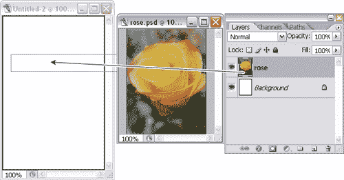
*将图层从一个 Photoshop 文档复制到另一个*

*放置来自 Illustrator 的作品*

打开 Illustrator 并选择要导出到 Photoshop 的图稿。使用 Ctrl-C(Mac 上的 Command-C)复制插图。在 Illustrator 仍然打开的情况下切换到 Photoshop，并使用 Ctrl-V (Command-V)粘贴复制的图稿。将出现一个对话框，询问您是否希望将图稿粘贴为智能对象、像素、路径或形状图层。

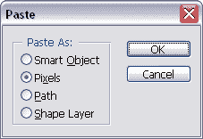
*粘贴对话框*

*将作品作为智能对象放置*

选择“文件”>“置入”,然后选择要导入的文件。单击“置入”将文件作为智能对象导入到 Photoshop 文档中。对于 PDF 和 Illustrator 文件，Photoshop 将显示一个对话框，要求您选择要放置的页面。选择您想要的页面，然后单击“确定”。

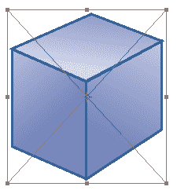
*粘贴为智能对象的图像的边框*

智能对象最初将被放置在一个包围它的边界框中，如下所示。您可以使用此边界框来移动、旋转、缩放或对对象进行其他变换。完成后，在边框内双击，将智能对象提交到其图层。

***讨论***

**智能物体**

智能对象是一种嵌入文件，出现在 Photoshop 中它自己的图层中。智能对象图层通过一个图标来区分，该图标覆盖在“图层”调板中显示的缩略图图像上，如下例所示。

智能对象不同于其他图层，因为它们链接到源文件(例如，Illustrator 文件、JPEG、GIF 或其他 Photoshop 文件)。如果您对源文件进行了更改，智能对象层也将随着这些更改而更新。

*栅格图层 vs 智能对象图层*

相比之下，栅格图层(或常规图层)是完全可编辑的，因此您可以在其上绘图、涂色、填充颜色或擦除像素。与保留图像质量的智能对象不同，如果缩小栅格图层的大小，将会丢失信息。

下一页的示例演示了这一点，该示例显示了缩小智能对象的大小，然后将其调整回原始尺寸的结果。将相同的步骤应用于栅格图层时，会产生模糊且质量较低的图像。

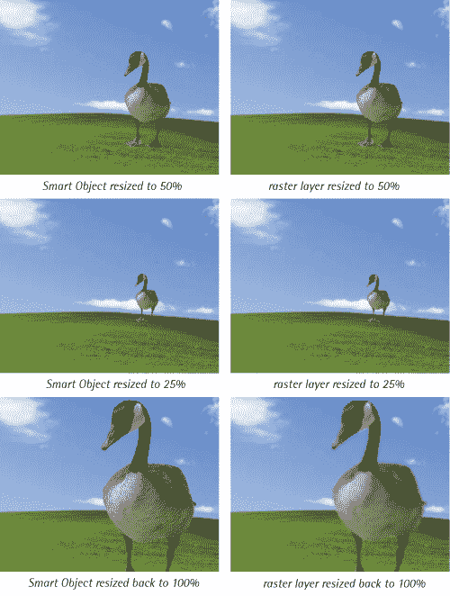
*与光栅图层相比，调整智能对象大小时图像质量的差异*

因为智能对象链接到外部文档，所以您可以在不丢失原始图像数据的情况下调整它们的大小。虽然您可以将图层效果和一些变换应用到智能对象图层，但您实际上不能操纵(绘画、绘制、擦除)它们的像素，因为它们不能从外部文档中编辑。双击智能对象图标，可以打开原始源文件进行编辑。

**光栅化**

您可以通过右键单击智能对象图层的名称并选择“栅格化图层”来栅格化智能对象。这将断开与原始源文件的链接，并将该图层视为普通栅格图层。

***调整文档大小***

**解决方案**

通过选择“图像”>“图像大小”或按 Ctrl-Alt-I(在 mac 上按 Command-Option-I)，调出“图像大小”对话框。您可以通过改变像素尺寸或文档大小来调整文档的大小。当调整将在屏幕上使用的图像(例如将在网页上使用的图像)的大小时使用前者，当调整将被打印的图像的大小时使用后者。

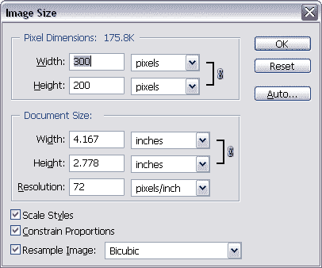
*图像尺寸对话框*

通过选中“约束比例”复选框，可以在调整图像大小时保持原始文档的比例。缩放图层样式(阴影、描边等)。)，选中“比例样式”复选框。

***调整图层大小或选择***

Photoshop 还允许您调整图层或文档特定部分的大小，而不会影响文档的整体大小。

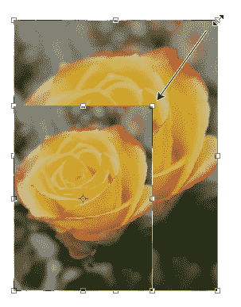
*使用角手柄调整元素大小*

**解决方案**

从图层面板中，选择包含要调整大小的元素的图层。如果图层包含您不希望调整大小的其他元素，请使用其中一个选择工具选择您的元素。

做出选择后，使用“编辑”>“自由变换”或按 Ctrl-T(在 Mac 上为 Command-T)。带有手柄的边界框将出现在您的选择周围。单击并拖动这些手柄来调整元素的大小，如下例所示。若要保持变换成比例，使图像看起来不会被挤压或拉伸，请按住 Shift 键，并使用角手柄调整其大小。

也可以使用选项栏将图元调整到特定的宽度或高度。在下面的例子中，我点击了“保持纵横比”按钮(用链接表示)，然后指定宽度——这自动改变了元素的高度。如果我没有保持长宽比，只有我的玫瑰的宽度会发生变化。

按 Enter 键或在边界框内双击以应用变换。

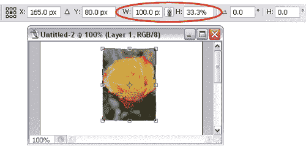
*使用自由变换选项*

**讨论**

调整不同图层类型的大小时，会得到不同的结果。矢量形状图层(如文本或形状图层)可以放大或缩小，而不会影响质量。

智能对象也可以放大或缩小，而不会影响质量，这取决于原始文件。如果原始文件是矢量图形，智能对象可以调整大小，而不会损失质量。如果原始文件是 GIF 或类似文件，智能对象的大小可以调整到图像尺寸的大小，超过这个尺寸，它将开始失去质量。

栅格图层或选择只能调整得更小。将它们调整得更大通常会导致质量下降。

***旋转一层或选择***

之前，您可能已经使用了自由变换命令来调整图层和选区的大小，并认为它非常棒。你当时可能没有意识到的是，同样的命令也可以用来旋转图层和选区！

**解决方案**

进行选择或选择要旋转的图层。选择“编辑”>“自由变换”或按 Ctrl-T (Command T ),并将光标移出边界框。

你会看到它变成一个弯曲的双箭头，如本例所示。您可以单击并拖动此光标来旋转边界框内的元素。

*旋转一个选区*

按住 Shift 键将角度移动限制为 15 度增量。也可以在选项栏的“角度”文本框中设置特定的旋转角度(在-180°和 180°之间)。

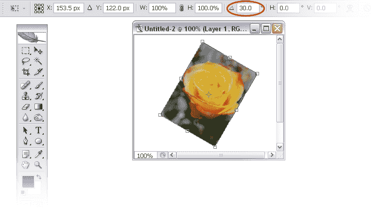
*在选项栏中设置旋转角度*

*旋转选项*
*对于 90 度或 180 度旋转，您可以选择编辑>变换，并从旋转 180°、顺时针旋转 90°或逆时针旋转 90°中进行选择。*

按 Enter 键或在边界框内双击以完成变换。

***使用绘图工具创建线条***

**解决方案**

*垂直线和水平线*

使用画笔或铅笔工具(B)，将光标移动到您希望线条在文档上开始的位置。单击并按住鼠标按钮。

按住 Shift 键将鼠标移动限制为直线，然后拖动光标来绘制直线。释放鼠标按钮以完成该行。

*对角线*

使用画笔或铅笔工具(B)，将光标定位在您希望线条开始的点上，并单击一次(这次释放鼠标按钮)。按住 Shift 键并单击您希望线条结束的位置。Photoshop 会用一条直线把点连接起来。

***完美的正方形和圆形***

**解决方案**

如果你有点冒险精神，尝试在 Photoshop 中画一些形状，你可能会发现很难“徒手”画出一个完美的正方形或圆形

解决方法很简单——如果在创建矩形或椭圆时按住 Shift 键，Photoshop 将确保形状是完美的正方形或圆形。这适用于选择和形状工具。

***拉直圆角矩形的边缘***

 *使用各自的形状工具创建矩形和圆角矩形非常简单。但是如果你想要一个只有一些角是圆角的矩形呢？

**解决方案**

**1。**使用本例中高亮显示的圆角矩形工具(U)创建一个圆角矩形。请确保使用选项栏中的“形状图层”选项，而不是“填充像素”选项。

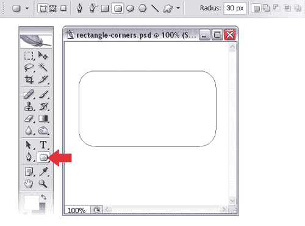
*创建圆角矩形*

**2。**选择转换点工具(P)，你会发现在钢笔工具弹出菜单。单击路径以显示矢量形状的锚点。这些用白色小方块表示。

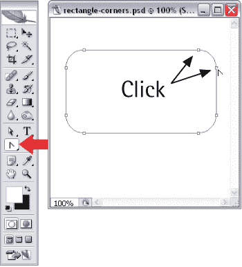
*用转换点工具点击锚点*

**3。**点击组成您想要“拉直”的圆角的每个锚点这将把曲线变成一个“切割”角，如下例所示。

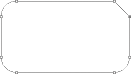
*使用转换点工具的结果*

**4。**选择直接选择工具(A)并点击顶角点(如有必要放大)。按住 Shift 键将移动限制在水平路径，横向拖动该点，直到它与底部点垂直对齐，如本例所示。如果您愿意，可以使用箭头键移动点以获得更高的精度。

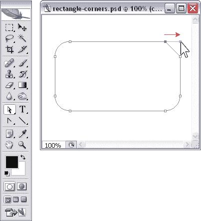
*移动拐角点*

**5。**要整理它，选择删除锚点工具(在钢笔工具弹出菜单中找到)，并点击底部的点删除它(如本例所示)，因为它现在变得多余。瞧啊。圆角矩形上有一条直边！

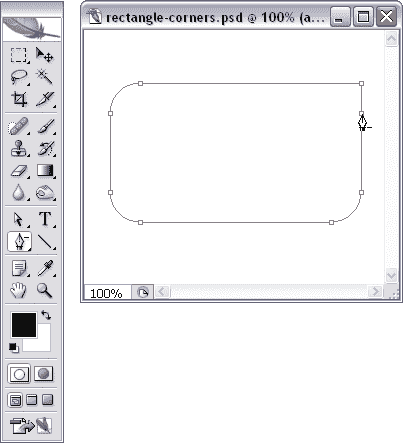
*删除锚点*

***创建弧形设计元素***

也许有一天，你会发现自己想要创造曲线设计元素，就像这里展示的那样。你可能已经注意到 Photoshop 没有“曲线”工具。曲线美从何而来？

*弧形设计元素*

**解决方案**

答案简单来说就是钢笔工具(P)。创建曲线包括学习如何绘制自己的矢量形状——这是令人兴奋的事情！如果你以前从未使用过矢量绘图工具，那你就有得玩了！

回想一下您使用铅笔和画笔绘图工具的经历，在那里您单击并拖动鼠标来创建一个形状。钢笔工具是明显不同的，因为你不是创建一个形状，而是点击和拖动来设置锚点和曲线方向。这需要一些练习，但掌握钢笔工具是你创造令人愉快的曲线的关键。

让我们从基础开始。在我解释如何制作曲线形状之前，我将快速浏览一下如何用钢笔工具绘制多边形形状；这很容易，为绘制更复杂的曲线打下了良好的基础。

让我们画一个三角形。每次使用钢笔工具单击都会创建一个角点。

单击一次创建第一个点，然后再次单击创建第二个点。线段会自动连接这些点，形成一条路径。再次单击以创建第三个点-一条线段将该点连接到第二个点，从而延伸路径。此后创建的任何后续点都将与线段相连，但因为我们正在创建一个三角形，所以我们只需要三个点。

要制作三角形，只需点击我们创建的第一个点来闭合路径。您会注意到，当您将光标移到原点上时，它会变成一个带小圆圈的钢笔。这意味着您可以通过单击该点来关闭路径。

或者，您可以简单地通过按 Enter 键来关闭路径。以下示例显示了创建三角形的四次单击操作。

*使用钢笔工具创建多边形*

让我们尝试创建一些曲线。

这一次，当您单击以放置一个点时，拖动鼠标。你会看到两条线从你画的点延伸出来。这些被称为贝塞尔控制手柄，或“手柄”这些把手的长度和方向将决定我们将要走的道路的曲率。松开鼠标按钮，将光标移动到另一个位置。

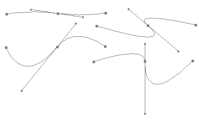
*弯曲的路径*

再次单击并按住鼠标按钮。您将看到在第一个点和第二个点之间创建了一条路径，并且您的一个把手消失了。如果拖动鼠标，新的把手将从第二个点延伸。

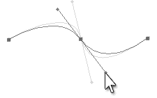
*用车把调整曲线*

选择直接选择工具(A)并通过拖动手柄的端点来调整曲线，如下例所示。让我们试着用这些技巧制作我在上一页展示的曲线形状。

**曲线形状 1**

按照下图进行操作。

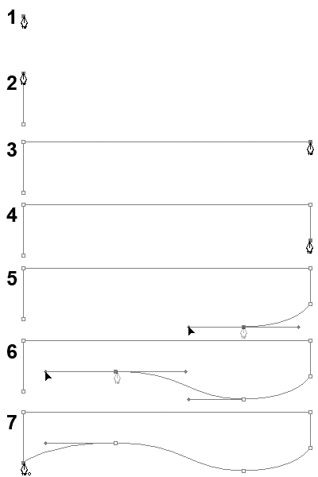
*一步步为曲形 1*

**1。**使用钢笔工具(P)，点击一次创建一个点。

**2。**按住 Shift 键并点击第一个点上方，创建一条垂直直线。

**3。**按住 Shift 键，点击顶点右侧，创建一条水平直线。

**4。**仍然按住 Shift 键，点击右侧点的下方，创建一个比我们创建的第一个线段稍短的垂直线段。

**5。**如图所示定位光标。按住 Shift 键，单击并拖动以创建一个带有水平手柄的点。

**6。**如图中步骤 6 所示定位光标。按住 Shift 键，单击并拖动以创建另一个带水平手柄的点。

**7。**在原始点上单击一次，关闭形状。

**弯曲形状 2**

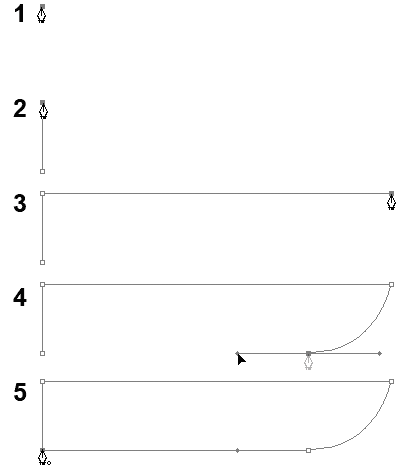
*创建弯曲形状 2*

**1。**使用钢笔工具(P)，点击一次创建一个点。

**2。**按住 Shift 键并在第一个点上方单击，创建一条垂直的+直线，如图所示。

**3。**按住 Shift 键，点击顶点右侧，创建一条水平直线。

**4。**如图所示定位光标。单击并拖动以创建带手柄的点，然后按住 Shift 并向左拖动以创建弯曲部分。

**5。**在原始点上单击一次，关闭形状。

**弯曲形状 3**

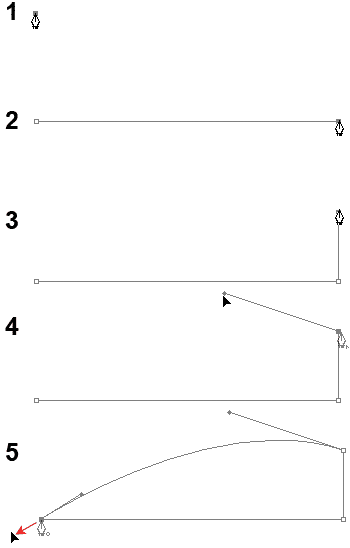
*创建弯曲形状 3*

**1。**使用钢笔工具(P)，点击一次创建一个点。

**2。**按住 Shift 键并单击第一个点的右侧，创建一条水平直线。

**3。**按住 Shift 键，在右侧的点上方单击，创建一条垂直的直线。

**4。**按住 Alt 键(Mac 上的选项)。单击您刚刚创建的点，然后向左上方拖动鼠标来创建车把。

**5。**点击原点完成造型，但不要放开鼠标键。向下向左拖动鼠标，如图中的步骤 5 所示，以创建车把。使用直接选择工具(A)来调整你的车把曲线。

***重用矢量形状***

随着您更多地使用形状，您可能会发现您经常会重新创建相同的矢量形状。如果它是一个简单的形状，即不涉及轮廓或层的形状，您可以将其存储为自定形状，并在以后使用自定形状工具(U)来访问它。

警告:保存你的形状！
*创建并添加自定义形状后，我建议您单击自定义形状弹出框中的小箭头并选择保存形状。这将把当前可见的所有自定义形状保存到. csh 文件中。这样，如果您需要重新安装 Photoshop 或重置首选项，您将能够重新加载您的形状。您会发现大多数可自定义的元素，如图层样式、图案和画笔，都提供了菜单选项，允许您保存为它们创建的自定义设置。*

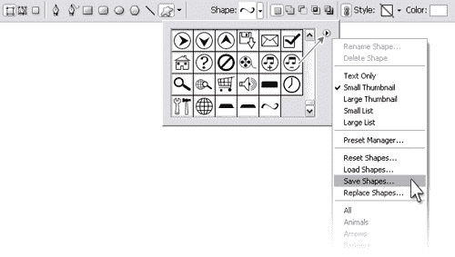
*保存自定义形状*

**解决方案**

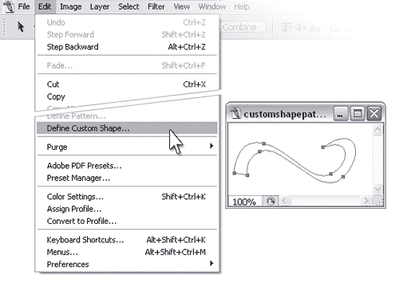
*定义自定义形状*

**1。**用路径选择工具点击选择你的矢量形状(黑色箭头)。

**2。**选择编辑>定义自定义形状…

**3。**在形状名称对话框中输入一个名称，然后点击确定。

**4。**要使用您的形状，选择自定义形状工具(U)并向下滚动可用形状列表，您会看到您的形状已被添加！

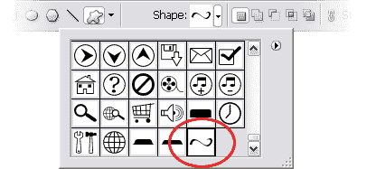
*新定制形状*

***从图像文件中采样颜色***

**解决方案**

在 Photoshop 中打开图像文件。如果您无法在 Photoshop 中打开它(例如，图像可能嵌入在文档中)，请在允许您在计算机上查看文件的适当程序中打开它(例如，web 浏览器，如果图像在 Word 文档中，则使用 Microsoft Word)。

如果图像在 Photoshop 中打开，选择吸管工具(I)并单击图像以抓取颜色。您的前景色将被设置为您选择的颜色。

如果您已经在另一个程序中打开了图像，请调整 Photoshop 窗口的大小并移动它，以便您可以同时看到 Photoshop 窗口和图像(此示例显示了 Photoshop 窗口旁边的 SitePoint 网站)。选择吸管工具(I)。在 Photoshop 窗口中的任意位置点按，然后将滴管拖到从中取样颜色的图像上。在这里显示的例子中，我从 SitePoint 徽标中提取了橙色。您可以看到该颜色在拾色器中被设置为前景色。

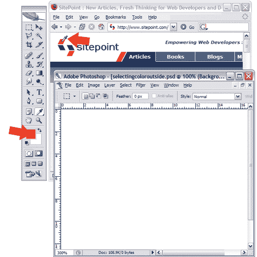
*从 Photoshop 界面外采样一种颜色*

***寻找一种颜色的十六进制码解***

当你在为一个网站设计 HTML 和 CSS 时，你将需要你使用的颜色的六位十六进制代码。Photoshop 通过两种方式向您提供这些内容。

*省时提示*
*信息调板中的一些图标旁边有一个小箭头图标。你可以通过点击这些图标来改变信息面板的显示选项。这样，你就不需要通过调色板选项对话框了，这样就省去了两次点击！*

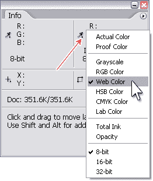
*选择颜色显示选项*

**使用信息调板**

当您在文档中移动光标时，信息调色板将显示光标所在位置的颜色值。默认情况下，调色板设置为显示颜色的 RGB 和 CMYK 值。您可以通过单击调色板右上角的小箭头并选择调色板选项来配置调色板中显示的信息。将出现一个对话框，显示您可以更改的选项。除此之外，您将看到两个下拉菜单来更改颜色读数——将其中一个更改为网页颜色。

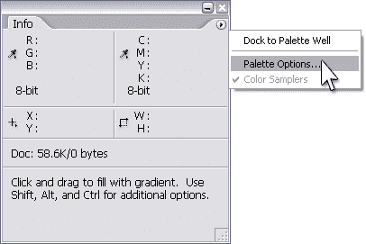
*选择调色板选项…用于信息调色板*

这将显示颜色的红色、绿色和蓝色值的十六进制代码。把这些串在一起就得到你的六位十六进制代码。在这个例子中，十六进制代码是`c9ad1c`。

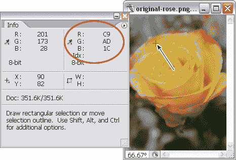
*信息面板显示十六进制颜色代码*

**使用拾色器**

颜色的十六进制代码也显示在颜色选择器对话框底部的文本字段中，如下所示。您可以突出显示颜色代码，使用 Ctrl-C(Mac 上的 Command-C)复制它，并将其粘贴到样式表或 HTML 文件中。注意，散列符号(#)没有被复制，所以在粘贴代码时不要忘记添加它！

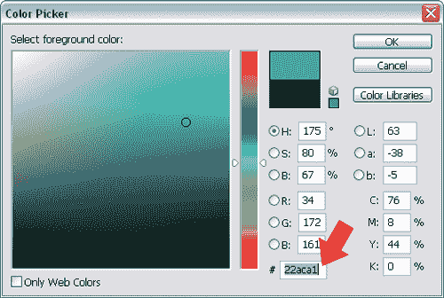
*十六进制颜色代码显示在拾色器中*

***调整图层透明度***

**解决方案**

我们在第一章的“图层快捷方式和任务”中简单地讨论了这个任务。若要调整层的透明度，请使用“层”调板中的“不透明度”栏来更改其不透明度。

如果您选择了“选择”、“移动”或“裁剪”工具，您只需键入一个数字就可以更改透明度——不透明度将神奇地改变以反映该百分比！

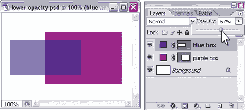
*改变图层的不透明度*

***将一幅图像淡入背景***

网页设计中常用的一种效果是将整个图像或图像的一部分(例如边缘)淡化到它所在的背景中。你可以在 Photoshop 中使用渐变和图层蒙版轻松制作出这种时髦的效果。

**解决方案**

**1。**排列您的 Photoshop 文档，使您希望淡化的图像在一个图层上，背景色在另一个图层上。

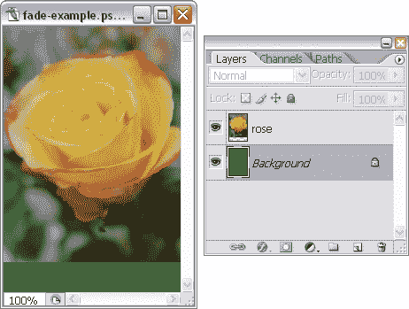
*初始文档*

**2。**选择图像图层，点击图层面板底部的添加图层蒙版图标(由暗灰色背景上的白色圆圈表示)，如下例所示。一个空白的矩形缩略图将出现在图层缩略图旁边，代表图层蒙版。确保选择了此缩略图。

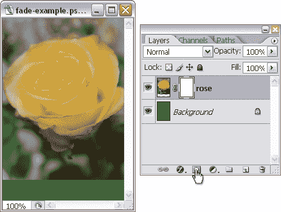
*创建图层蒙版*

**3。将你的前景色设置为黑色。选择渐变工具(G)并选择前景透明渐变。**

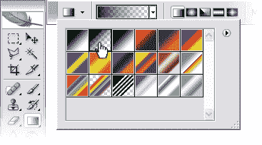
*选择前景为透明渐变*

**4。**通过点击图像的底部边缘并向上拖动鼠标来应用渐变。按住 Shift 键将渐变路径约束为直线。释放鼠标按钮，渐变将被应用。你的淡入淡出效果完成了！

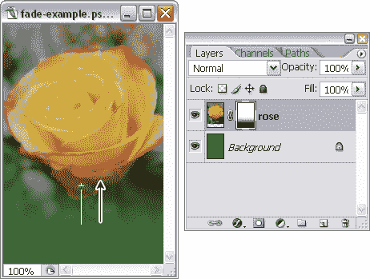
*添加渐变效果*

**讨论**

图层蒙版是灰度图像，显示或隐藏应用了蒙版的图层区域。蒙版上的灰色调反映了层上相应区域的透明度:黑色区域完全透明，因此不可见；白色区域完全不透明，所以它们完全可见；灰色的阴影具有不同程度的透明度，这取决于灰色有多暗(它越接近黑色，图像层上相应的部分就越透明)。

您可以使用任何绘图或绘画工具编辑图层蒙版，包括铅笔和画笔工具(B)、渐变工具(G)和油漆桶工具(G)。在遮罩上绘制只会影响遮罩，不会影响组成图像的像素。用黑色、白色或灰色在面具上画画。

在这个解决方案中，我使用了黑色到透明的渐变来创建图层蒙版上的渐变。这使得图像的上半部分仍然可见，但让下半部分逐渐消失，以便背景颜色可以显示出来。

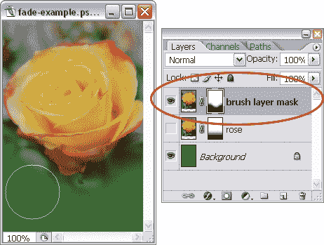
*使用笔刷工具创建图层蒙版*

我们也可以用笔刷工具(B)创建一个淡入淡出效果。在所示的例子中，我选择了一个边缘柔和的笔刷，设置我的前景色为黑色，在图层蒙版上沿着图像的底部涂去我想要淡化的区域。

你可能想知道为什么不在图片层的底部或者它自己的层上画一个绿色渐变来达到同样的效果。

为什么要用图层蒙版？图层蒙版的妙处在于它们是非破坏性的。它们实际上不会修改图像层本身的任何像素，这最终会为您带来更大的灵活性。如果您决定不要使用图层蒙版创建的效果，您可以去掉蒙版，原始图像将保持不变。或者，如果你决定不喜欢绿色，你可以改变背景颜色，褪色效果仍然有效。

***将两幅图像融合在一起***

**解决方案**

将两个图像混合在一起非常类似于将一个图像淡入背景:您将对至少一个图像应用图层蒙版。如果你以前没有创建过图层蒙版，请阅读第二章中题为“将图像淡入背景”的解决方案。

排列 Photoshop 文档，使其中一个图像与另一个图像重叠，如下例所示。我通常发现，如果图像背景有相似的颜色或纹理，效果会更好，尽管这并不是强制性的！

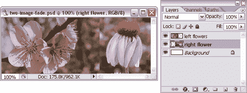
*带有两个图像层的初始文档*

为顶层创建一个图层蒙版，使用渐变工具(G)或笔刷工具(B)创建一个渐变效果，如我在“将图像渐变到背景中”中所述如果您用图层蒙版隐藏了太多的图层，您可以通过在图层蒙版上用白色涂回这些区域来使它们再次可见。

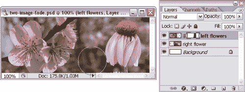
*创建图层蒙版*

就我个人而言，我对这个效果非常满意，所以我就把它留在这里。你可以在这里看到最终的结果。

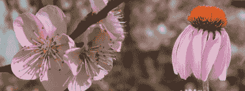
*美丽的花朵*

 ***解决方案**

**1。**选择圆角矩形工具(U)并选择路径选项，如下所示。

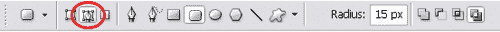
*选择路径选项*

**2。**用这个在图像上创建一个圆角矩形路径。您可以在路径面板中查看路径。

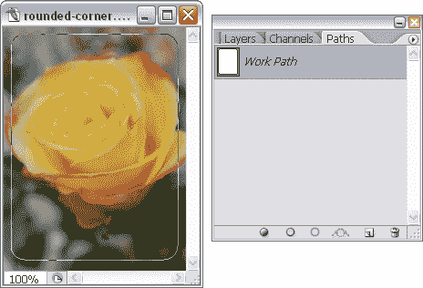
*创建圆角矩形*

**3。**选择图层>矢量蒙版>当前路径。Photoshop 将使用您刚刚创建的圆角矩形路径创建一个矢量蒙版。此处的示例显示了图层面板中的新矢量蒙版。您可以使用直接选择工具(A)来修改路径和改变其形状。

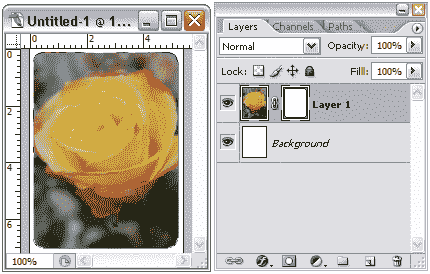
*创建矢量蒙版*

***用相同的形状遮罩多个图层***

比方说，你有多个层，你想用相同的形状掩盖它们。您可以创建一个图层蒙版，然后为每个图层复制蒙版，但如果您以后想要更改形状图层呢？如果你有足够的动力，你可以检查每一层并修改形状蒙版…但是当你可以很容易地使用剪贴蒙版将工作时间减半时，你为什么要烦恼呢？

**解决方案**

在这个解决方案中，我将从一个简单网站的界面设计开始。它有一个标题栏、一个菜单栏和一个内容区，如下例所示。

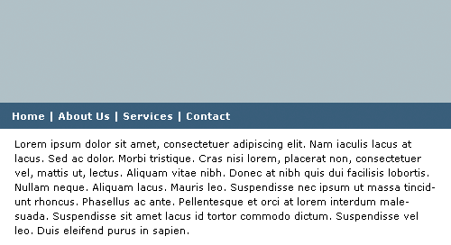
*网站设计*

我将粘贴我在本章前面混合在一起的花的图像。正如你在下面的例子中看到的，图像比标题区域大。我希望它们包含在标题区域中，但是我仍然希望能够移动它们。这个解决方案看起来很简单——在每一层上加一个图层蒙版就可以了。但是，如果我决定以后改变标题高度呢？那我就要修改所有的面具了。

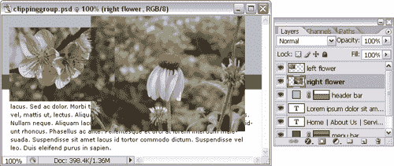
*图片为页眉区*

输入剪辑蒙版。首先，您的文档必须有一个包含“遮罩”区域形状的形状层。将需要蒙版的图层直接放在这个形状图层上面。

在“层”调板中，将光标移动到形状层和它上面的层之间的边界。按住 Alt 键(Mac 上的选项)。光标将变成两个重叠的圆圈，如下例所示。

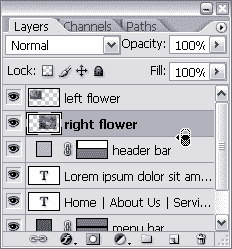
*按住 Alt (Option)键改变光标*

点击一次。顶层会被底层夹住。如果你检查图层面板，你会注意到顶层的缩略图旁边现在有一个黑色的箭头，我们的形状层的名称加了下划线。

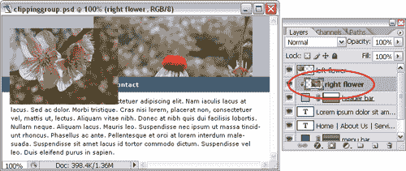
*用另一个图层裁剪其中一个图层*

现在让我们对第二张图片做同样的处理。将鼠标移动到图层面板中的下一个图层的边缘，按住 Alt 并单击。

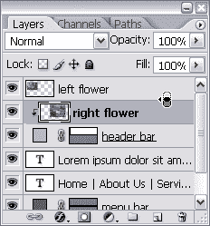
*裁剪另一层*

两个图层现在都已被基础图层裁剪，如下例所示。

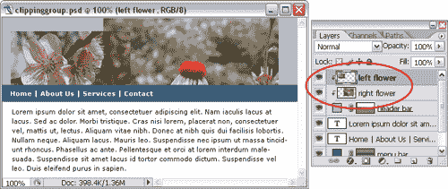
*为多个图层创建剪贴蒙版*

您可以四处移动各个层，它们将保持被基础层的形状剪裁。下图说明了这一点。

*用剪贴蒙版移动图层*

作为最后的点缀，我将使用“将图像淡入背景”的解决方案将第二朵花的右边缘淡入背景。我们的最终结果如下所示。

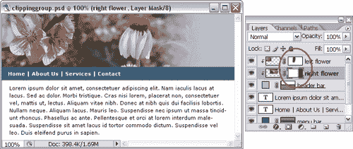
*添加图层蒙版*

**讨论**

剪辑蒙版允许您使用位于其自身图层上的单个可编辑蒙版来蒙版多个图层。这个遮罩将剪切位于它上面的所有层，这使您不必基于同一个形状创建多个层遮罩。

剪裁的图层会继承基础图层的属性。因此，例如，如果基础图层的不透明度为 50%，则剪切的图层也将具有 50%的不透明度。

要解开图层，请按住 Alt (Option)键并在要解开的图层下方单击。它上面的所有图层都将被取消裁剪。

***制作虚线优惠券框***

你可能以前见过点状礼券盒，通过使用它们节省了一两美元！这个解决方案向你展示了如何使用自定义的笔刷创建一个带虚线边框的 couponstyle
框。

*装载方形画笔*

**解决方案**

**1。选择笔刷工具(B)。**

**2。打开笔刷面板。点击右上角的小箭头，选择方形笔刷。将出现一个对话框，询问您是否要替换或添加到当前显示的画笔列表中。您可以通过选择
重置笔刷来恢复您的原始笔刷设置…(如果您想将默认笔刷添加到您的
当前列表中，请单击附加，否则请单击确定。)**

**3。**选择画笔笔尖形状，然后选择一个方形画笔，其直径与您想要的每个虚线笔画的长度相匹配。如果大小不太合适，您可以使用直径滑块进行调整，如右图所示。

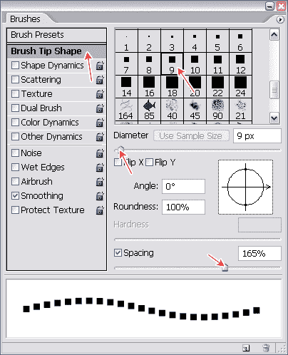
*修改画笔笔尖形状选项*

**4。**增加间距滑块，直到画笔描边之间的间距适合您。

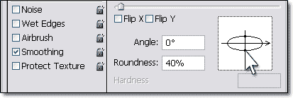
*改变笔画的高度*

**5。你可能想挤压你的画笔，使它更像一个矩形。在对话框中单击圆的顶点或底点，并将其向水平轴拖动，直到笔划看起来类似于左侧图像中的笔划。**

**6。**勾选散射复选框，将散射量更改为 0%。

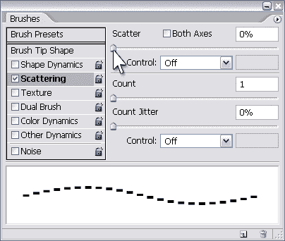
*改变散射量*

**7。**对。现在你可以开始画你的盒子了！为虚线选择一种前景色。创建一个新层，按住 Shift 键，并在文档中拖动以绘制一条水平线。

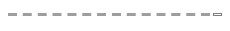
*画虚线*

**8。**接下来，返回笔刷面板，拖动水平轴箭头将笔刷旋转 90 度(或者在角度文本框中输入 90 度)。
这将允许你画竖线。

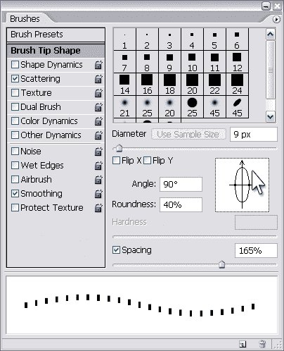
*旋转画笔*

**9。**按住 Shift 向下拖动鼠标画一条垂直线。

10。将画笔旋转回零，画出第二条水平线。

**11。**再次将画笔旋转 90 度，画出最后一条垂直线，完成你的盒子。

*完成了优惠券框*

***应用阴影***

**解决方案**

选择要应用投影的图层，选择图层>
图层样式>投影。在图层样式对话框中调整不透明度、角度、距离和其他设置，直到你对效果满意为止。

请注意,“角度”的值将影响文档中的所有投影，以便光源在整个图像中保持一致。

*拖动阴影*
*也可以直接在文档窗口中点击，拖动阴影四处移动，如下图所示。确保投影在图层样式对话框中高亮显示，否则不起作用！*

*移动阴影*

***背景透明的图像***

**解决方案**

打开包含透明区域的 Photoshop 文档。

你会看到 Photoshop 用灰色方格图案标记透明区域。

*关闭背景图层的文档*

选择“文件”>“存储为 Web 格式…”或按 Shift-Alt-Ctrl-S(在 Mac 上按 Shift-Option-Command-S)。在出现的对话框中，选择 GIF 并选中透明度选项，如右图所示。

虽然 gif 和 PNG 都支持透明，但有些浏览器(包括 Internet Explorer 6)不支持 PNG 透明。出于这个原因，我建议你使用 gif 来满足你的透明图像需求。单击保存并命名您的文件。

*另存为透明 GIF*

**讨论**

具有弯曲、平滑边缘的图像(如本例中的图像)会保持边缘清晰的假象，这是消除锯齿的结果，部分透明的像素会添加到图像的边缘以使其平滑，如下所示。

但是，当您将图像保存为 GIF 格式时，这些部分透明的像素会保存为不透明的像素，其中白色是默认的“背景”颜色。

*反锯齿形状的特写*

如果您没有将此图像放置在白色背景上，通过单击遮罩箭头来定义自定义遮罩颜色可能是明智的，如下所示。否则，图像周围会出现白色的“光晕”。

*选择替代的哑光颜色*

假设我们要将这个图形放在亮红色的背景下。单击无光箭头，选择其他…，然后选择一个亮红色。

*设置一个亮红色的哑光颜色*

现在，您将能够在图形周围看到一个红色光环。如果你放大，你会看到这些抗锯齿像素的行为就像他们坐在一个红色的背景。

*彩色光晕特写*

单击保存按钮保存您的图像。

*无哑光 vs 红色哑光*

***汇总***

在这一章中，我们看了 Photoshop 用户应该掌握的一些基本功能的解决方案。我们学习了如何将图形导入 Photoshop 文档，如何调整和旋转图像和选区，如何使用 Shift 键来限制移动，以及如何使用蒙版和基本图层样式来创建效果。我们还学习了创建矢量图形和保存透明 gif 的基础知识。这些技巧构成了使用 Photoshop 的重要基础，在接下来的章节中我们肯定会用到它们！

##### 第三章。创建按钮

现在，说点好的！

在这一章中，我们将制作导航按钮。我将描述的解决方案是为了创建按钮效果。先别着急在 Photoshop 里做一个完整的导航界面；我将在本书的后面帮助你设计布局构图。

您将在这里学到的技术可以应用于任何“类似按钮”的对象，包括图标、项目符号、标题和导航栏，以及其他页面元素。

***制作一个简单的平面按钮***

**解决方案**

*矩形扁平按钮*

我们将绘制一个基本的矩形按钮。将前景色设置为您选择的颜色，然后使用矩形工具(U)绘制一个矩形。

我告诉过你这是最基本的！我画了另一个浅色的矩形，让我的按钮在左边有一个粗边框，让我的按钮更有趣，如下所示。

*有粗边框的矩形按钮*

*圆形扁平按钮*

你也可以使用圆角矩形工具(U)创建圆角矩形按钮。如下所示，使用选项栏中的“半径”字段更改拐角的“圆度”。

*十像素半径的圆角矩形按钮*

Photoshop 不会取代 CSS
*在网页上，你可能会使用 CSS 而不是图像来实现这个矩形按钮的效果。然而，当在 Photoshop 中为网页构图绘制简单按钮时，这种技术很方便。*

*半径为 20 像素的圆角矩形按钮*

**给按钮添加轮廓**

在这个解决方案中，我们将为我们的基本按钮添加轮廓，使它们看起来像这里显示的那样。

*带轮廓的按钮*

*添加图层样式*
*在本章及以后的内容中，我们将大量使用图层样式，它们是通过启动图层样式窗口来应用的。有几种不同的方式来启动这个窗口，但我最常用的是点击图层面板底部的小 f 按钮，如下所示。单击此按钮将显示一个对话框，列出所有可用的不同图层样式。只需选择一个你想要的图层样式窗口就会启动，并选择特定的效果。也可以从菜单栏中选择相同的样式(图层>图层样式)，但是使用图标可以节省一次鼠标点击！*

*快速访问图层样式窗口*

**解决方案**

让我们为之前创建的基本按钮添加轮廓。选择包含按钮的层。打开图层样式对话框，点击图层面板底部的添加图层样式按钮，并从出现的菜单中选择描边。您将看到笔画样式被选中并突出显示，这将为按钮添加轮廓。

*通过改变按钮的描边选项为按钮添加轮廓*

通过调整设置来更改笔划的外观。你可以从上面显示的对话框中看到，我给了我的一个黑色的轮廓，通过点击颜色补丁，并将颜色设置为黑色，并通过在大小字段中键入 1 给它一个像素的厚度(你也可以使用滑块来调整笔画的大小)。

***制作一个光滑、有斜面的按钮***

他们越来越喜欢了！让我们试着创建这里显示的斜面按钮。

*光滑、斜面按钮*

**解决方案**

现在，您应该是创建基本矩形按钮的专家了。这样也好，因为这个解决方案需要一个！创建或选择您的基本按钮。打开图层样式对话框，点击图层面板底部的添加图层样式按钮，从菜单中选择斜面和浮雕。

您刚刚在按钮上添加了一个斜面。您可以通过增加大小和柔化级别来赋予斜面更加圆润的外观。我使用 7px 的大小和 8px 的软化，如下图所示。

通过改变阴影模式颜色使效果更加微妙。因为我的按钮是蓝色的，所以我把阴影模式的颜色从黑色改成了蓝色(比我的按钮颜色稍微暗一点)。

*平滑斜面的斜面和浮雕选项*

***创建轮廓分明的按钮效果***

斜面和浮雕图层样式是一种多功能工具，可用于创建许多不同的按钮效果。在这个解决方案中，我们将使用它来创建像这里显示的硬边，轮廓分明的按钮。

*轮廓分明的按钮*

**解决方案**

创建或选择一个基本按钮。然后，打开图层样式对话框，点击图层面板底部的添加图层样式按钮，从菜单中选择斜面和浮雕。从“技巧”下拉菜单中，选择“硬凿”，并将“柔化”字段设置为 0px。增加斜面的深度，使钮扣凿得“更深”。

*凿刻斜面的斜面和浮雕选项*

***创建嵌入式按钮效果***

在这个解决方案中，我将向您展示一个按钮效果，使您的按钮看起来像是嵌入到页面中，如下所示。

*嵌入式按钮*

**解决方案**

选择或创建一个基本按钮。打开图层样式对话框，点击图层面板底部的添加图层样式按钮，从菜单中选择斜面和浮雕。从“样式”下拉菜单中，选择“枕形浮雕”。这将给你的按钮一个“嵌入”的效果。

尝试使用设置来更改效果的外观。上面例子中的两个按钮都是枕形浮雕，但是它们看起来不一样，因为我已经将顶部的按钮设置为平滑，其设置显示在下一页，将底部的按钮设置为硬凿。

*枕头浮雕选项为平滑嵌入按钮*

***制作渐变按钮***

如图所示的双色渐变按钮是图形设计的“新黑色”。这种效果越来越受欢迎——毫无疑问，你会看到它被用在按钮、菜单行和时尚网站的标题背景上。在这个解决方案中，我将向你展示创建你自己的渐变按钮是多么容易。

*渐变按钮的例子*

**解决方案**

*光栅按钮*

使用选择工具，如选框工具(M)，为按钮创建一个矩形选区。设置前景色和背景色为你想要的两种色调，然后新建一个图层。选择渐变工具(G)，选择前景到背景渐变选项，点击并拖动鼠标填充选区。(按住 Shift 键会将渐变方向限制为水平线或垂直线。)

*锁定透明像素*

有用，但不是特别有用！
*尽管图层样式对话框非常强大，但却非常不直观。我发现最令人困惑的是，你可以不用选择就应用一个样式！*

没错，启动图层样式对话框后，您可以通过选中复选框来应用样式(使用 Photoshop 的默认设置)。如果您勾选了预览复选框，您将看到这种风格对您的图像的影响。

相当简单，对吧？但令人困惑的是，这实际上并没有选择样式，所以你不能改变它的设置！您需要突出显示样式的名称来显示它们——简单地选中复选框是不行的！

*应用图层样式*

这里显示的例子说明了这一点:在顶部的图像中，我已经检查了阴影样式，这已经被应用，但在对话框中的设置是为层的混合选项。这意味着我不能对我的投影做任何改变！

如果我点击图层样式的名称，我的投影将被应用并显示其设置(如第二个图像所示)。因此，你可能会认为，如果我单击我已经应用的另一个样式的名称，它将在文档中被关闭。事实并非如此，您必须取消选中该复选框！

*选择(并应用)图层样式*

我建议你花一分钟时间选择和应用一些不同的图层样式，直到你掌握了它的工作原理——这将使你以后不会感到困惑！

我们可以使用为图层提供的锁定透明像素选项来实现相同的渐变按钮效果。此选项对于圆角矩形或其他没有自动选择工具的形状很有用。

让我们用它来制作一个圆角矩形按钮。使用圆角矩形工具(U)并选择填充像素选项，在新图层上创建一个纯色的光栅按钮。点按“层”调板中的“锁定透明像素”图标，如上例所示。然后，设置前景色和背景色为你的渐变色调，并应用渐变。由于您已经锁定了透明像素，渐变将仅应用于图层中的不透明元素:在本例中是您的按钮。

**矢量按钮**

如果你不喜欢制作光栅按钮，你可以创建矢量形状并应用渐变效果。

打开图层样式对话框，点击图层面板底部的添加图层样式按钮，从菜单中选择渐变叠加。将显示渐变叠加选项。

*渐变叠加选项*

通过点击图层样式对话框中的渐变补丁来调整你的渐变。这将打开另一个对话框，渐变编辑器，如下所示，你可以用它来设置你的渐变选项。渐变的颜色用渐变条下面的小色标表示。双击它们来打开颜色选择器——你可以用它来改变补丁的颜色(从而改变你的渐变)。通过点按渐变栏底部的任意位置来添加更多颜色，一个新的色标将被放置在那里。

*渐变编辑器对话框*

在两个对话框中单击 OK，瞧！你已经有了双色调渐变按钮。因为我们已经在按钮上“覆盖”了渐变，所以按钮的原始颜色是无关紧要的！

*带渐变叠加的矢量按钮*

***制作圆形按钮***

在这个解决方案中，我们将调用我们在“制作渐变按钮”解决方案中学到的可靠的渐变按钮创建技巧来制作一个圆形按钮，如下所示。

*圆形按钮*

**解决方案**

**1。在新图层上创建一个圆形渐变按钮。**

**2。在另一层，创建一个比第一个小一点的圆形渐变按钮。这个按钮上的渐变方向应该与第一个按钮的方向相反——在这个例子中，我的大圆圈有从白到灰的对角线渐变，我的小圆圈有从暗到亮的对角线渐变。(现在还不要太在意排列形状。)**

*创建两个圆形渐变按钮*

**3。**从图层面板中选择较小圆圈的图层。按住 Ctrl(Mac 上的 Command)并单击图层缩略图上的大圆圈，根据该图层的像素创建一个选区，就像我在这里所做的那样。(我们在第一章中讨论过这个，记得吗？)

*创建选择*

**4。**创建选区后，选择图层>将图层对齐选区>垂直居中，如图所示。这将使小圆的中心与大圆的中心垂直对齐。

**5。**最后，选择图层>对齐图层到选区>水平中心，正如你所怀疑的，两个圆的中心会水平对齐。

*对齐垂直中心*

你的按钮完成了！

***制作哑光金属按钮***

更多使用渐变的按钮！还好我们在“制作渐变按钮”中复习了渐变按钮制作技巧。我们将制作像这里展示的亚光金属按钮。

*哑光金属按钮*

**解决方案**

*矩形哑光金属按钮*

**1。**首先创建一个简单的光栅渐变按钮。我将使用两种不同的灰色阴影。

*创建灰度渐变按钮*

**2。**点击图层面板顶部的锁定透明像素图标锁定图层。选择一个浅灰色(我已经用了`#ebeef0`)并用铅笔工具(B)在矩形按钮层上画出左边和上边。

**3。**选择一个深灰色(我用的是#515a60)，在按钮层上画下右边框，如下例所示。请记住，在绘制线条时按住 Shift 键，使线条保持直线。

*绘制边框*

**4。**当然，我们可以按原样使用这个按钮，但是我想对它做一些事情。首先，我们将对按钮应用噪声过滤器。在我们这样做之前，请确保您对按钮的大小、形状和颜色感到满意，因为在应用过滤器后，很难对这些属性进行更改。要添加哑光效果，选择滤镜>噪波>添加噪波。这将给按钮一个粒状外观，并显示添加噪声对话框。确保选中单色复选框，并调整您想要引入的噪波数量。我把我的设为 2%。

*添加噪声*

**5。**如果你觉得颗粒效果太明显，选择编辑>淡入淡出添加噪点将其降低一点。改变淡入淡出的不透明度(在下面的例子中，我把我的设置为 50%)，然后点击确定。

*渐隐噪点效果*

*迅速使用退色！*
*要在滤镜上使用“淡入淡出”命令，您需要在应用滤镜后立即这样做，否则它将不可用。*

**6。**现在让我们看看我们的按钮。这当然是我们可以使用的东西，但是当我们在滚动的时候，让我们用一些灯光效果使它更有活力一点。

*长方形磨砂金属按钮*

选择“过滤器>渲染>照明效果”以打开“照明效果”对话框，如下所示。从光源类型下拉菜单中选择聚光灯。

*改变聚光灯的方向*

**7。**在预览图形中，您会看到一个椭圆，有一条线穿过它，这条线指示光线的方向。点击线条末端的方向手柄，将其拖动到
预览窗口的左上角。然后，您可以单击并向外拖动椭圆上的手柄，以增大“聚光灯”区域，如下所示。

*应用灯光效果*

**8。**最后，将光泽属性滑块拖向它的无光面(显示在上一页的底部)。当您对按钮预览感到满意时，请点按“好”。现在我们幸福了！我们完成的按钮如下所示。

*我们的骄傲和喜悦*

***圆形哑光金属按钮***

创建一个圆形的磨砂按钮和创建一个矩形的按钮非常相似。主要的区别是我们将使用描边图层效果来添加边框，因为我们很难用手精确地绘制边框。

**1。**创建圆角渐变按钮。我使用了与上一个解决方案中矩形按钮相同的灰色阴影。

*圆角渐变按钮*

**2。**现在，不要像矩形按钮那样画一个边框，打开图层样式对话框，给你的边框设置如下:

*   尺寸:1px
*   位置:内部
*   不透明度:75%

*图层样式设置*

**3。**将填充类型改为渐变。点击渐变样本，设置渐变颜色为白色(`#ffffff`)和深灰色(`#384046`)。随着笔画不透明度的降低，您会希望浅色和深色之间有更大的对比度。(如果你想知道为什么你需要降低不透明度，这是为了让噪音和灯光效果显示出来。)

**4。**调整角度，使大部分渐变描边与按钮成微小角度。

**5。**点击确定应用描边效果。下面的例子显示了我们的中风的结果。

*对按钮应用笔画效果*

**6。**现在，添加噪点并应用灯光效果(矩形、哑光金属按钮解决方案中的步骤 4-8)，圆形按钮就完成了！

*完成圆形哑光金属按钮*

***制作闪亮的金属按钮***

在这里，我将向您展示如何创建闪亮的金属按钮，如下所示。我还将向您展示如何使用不同的设置来改变它们的外观。

*闪亮的金属按钮*

**解决方案**

**1。**创建光栅或矢量按钮。在这个例子中，我创建了一个圆形和矩形的按钮。按钮的颜色并不重要，因为它不会影响最终结果。

*基本按钮*

**2。**好戏开始了！打开图层样式对话框，点击图层面板底部的添加图层样式按钮，从菜单中选择外发光。在对话框中，将混合模式更改为正常，然后单击色样(默认为浅黄色)并将其更改为灰色，如下所示。

*应用外发光*

**3。**现在，在对话框的样式列表中选择描边，添加一个
描边图层效果。我使用了深灰色，1px 的笔画，如下所示。

**4。**我们准备添加渐变叠加(这些渐变
又来了！).从对话框的样式列表中选择渐变叠加，双击渐变色样打开渐变编辑器对话框。

*对按钮应用笔画*

如下图所示设置渐变的颜色。通过点按渐变条底部的任意位置，向渐变条添加更多色标。双击补丁，打开颜色选择器，编辑补丁的颜色。您也可以点按并滑动色标来调整渐变的外观。

*添加渐变叠加*

**5。**点击确定，应用所有图层样式。你闪亮的金属纽扣完成了！关闭笔画样式以获得更微妙的效果(取消选中它的复选框)，在这里显示的例子中，我对左按钮这样做了。

*完成闪亮的金属按钮*

**变化**

您可以通过玩渐变编辑器设置来改变闪亮按钮的外观。下面的例子展示了当应用不同的渐变配置时，我们闪亮的按钮的外观是如何变化的。

*对按钮应用不同的渐变配置(变体 1)*

*对按钮应用不同的渐变配置(变体 2)*

***制作一个水绿色按钮***

在这个解决方案中，我将向您展示如何制作色彩鲜艳的玻璃按钮，这些按钮起源于多年前的苹果 Aqua 界面，从那时起就被亲切地称为“aqua buttons”

*浅绿色按钮的例子*

当我们在本章中讨论按钮时，我将在这里向你展示如何创建按钮效果，但是如果你特别喜欢我在本章中使用的金属拉丝背景，不要担心？我们将在下一章学习如何创建它！

**解决方案**

**1。**从圆形矢量按钮开始。我们将为它添加一个渐变覆盖，所以它的颜色并不重要——使用任何你喜欢的颜色！第一步是应用渐变叠加到我们的按钮。打开图层样式对话框，点击图层面板底部的添加图层样式按钮，从菜单中选择渐变叠加。

*对按钮应用渐变叠加*

**2。**在对话框中，设置角度为 90 °(如上所示),点击渐变补丁显示渐变编辑器的另一个对话框，如下所示。

*改变渐变设置*

**3。**让我们使用渐变编辑器来改变我们的渐变设置。双击渐变条下面的每个小色标来改变它的颜色。通过将左边的补丁的颜色设置为水绿色(`#3cc9e2`)，将右边的补丁的颜色设置为蓝色(`#1160c2`，来创建水绿色到蓝色的渐变。将 aqua patch 的位置设置为 25%，然后单击“确定”应用渐变。

**4。**回到图层样式对话框，点击内发光。根据按钮的大小，将混合模式设置为正常，不透明度设置为 50%，大小设置为大约 10px。单击色标，将颜色更改为深蓝色，如下例所示。我用过`#003298`。

*应用内发光图层样式*

**5。**接下来，我们将应用一个轻微的发光效果。点击外部发光。改变混合模式为正常，不透明度为 50%，蔓延为 4%，大小为 5px(你可能需要调整这些设置，以适应你的按钮的大小)。将色块更改为明亮的水绿色，如下图所示——我已经使用了`#00bae8`。

*应用外发光图层样式*

**6。**点击确定应用所有样式。

**7。**要创建按钮高亮，在图层面板中按 Ctrl-J 复制按钮图层(在 Mac 上按 Command-J)。通过单击相应的眼睛图标，关闭该层的外发光和内发光样式，如下所示。

*关闭图层样式的高光*

**8。在图层面板中双击渐变叠加样式名称。将出现图层样式对话框，并选择渐变叠加。点击渐变补丁来打开渐变编辑器。**

*编辑渐变*

**9。**在渐变编辑器中双击渐变条下面的色标，将它们都设置为白色。

10。点击渐变条左侧上方的补丁——这是左侧的不透明度停止点。设置其不透明度字段为 0%，如下所示。

*步骤 10:创建白色到透明的渐变*

**11。**点击确定退出渐变编辑器，再次应用新样式。

**12。**在图层面板中，将形状的填充改为 0%。这将允许底层的按钮显示出来，如右图所示。

*步骤 12:更改高光图层的填充*

13。选中高亮图层，打开编辑>自由变换或按 Ctrl-T(Mac 上按 Command-T)。高亮周围将出现一个边界框。单击边界框的底部边缘，并向上拖动它以挤压高光一点点。

**14。**接下来，点击边框的左右两边，拖动高亮的边缘，直到它们刚好在按钮层里面。你的高光层应该看起来像下图所示。通过在框内双击或按 Enter 键(在 Mac 上按 Return 键)来应用变换。)

*第十四步:变换高光图层*

15。切换到直接选择工具(A)。单击并向上拖动高光路径的底部边缘，将其展平，如下所示。如果需要，可以使用 Ctrl-+(Mac 上的 Command-+)进行放大。

*改变高亮的形状*

16。我们终于准备好添加文本了！在高亮层和按钮层之间创建一个文本层，然后输入文本。我用深蓝色作为我的颜色。我还在我的文本中添加了一个微妙的阴影样式，如下例所示。

*对文本应用阴影*

**17。在这一点上，我们已经有了一个时髦的 aqua 按钮，它在大多数网站上都能很好地工作，但是既然我们已经习惯了采取这些步骤，为什么现在停止呢？让我们让我们的按钮看起来像是嵌入到页面中。复制按钮层，并将其拖到顶部，在其他层之上。让我们称之为顶层浮雕；你的图层面板应该看起来像下面的图片。**

*复制按钮层*

18。点击图层面板中相应的眼睛图标，隐藏浮雕图层上的所有图层样式。打开图层样式对话框，点击图层面板底部的添加图层样式按钮，从菜单中选择斜面和浮雕。从“样式”下拉菜单中选择“枕头浮雕”,并将技术更改为“硬凿”。将大小设置为 2px，角度设置为 90。

*应用斜面和浮雕样式*

**19。在对话框的底部，你会看到高光模式和阴影模式的不透明度区域。将这两者都设置为 93%。**

20。最后，在按钮边缘涂抹一笔。您现在应该对此很熟悉了！从图层样式对话框中选择描边，给按钮一个 1px 的黑色描边，透明度 60%，如下图所示。

*添加图层效果*

**21。**点击确定应用图层样式。

**22。**让我们改变浮雕层的填充为 0%，如左图所示，这样它下面的按钮层可以显示出来。

*改变浮雕层的填充*

我们的嵌入式 aqua 按钮已经完成！下图显示了我们的普通和嵌入式浅绿色按钮。

*已完成的 aqua 按钮*

**讨论**

因为我们使用矢量形状和图层样式创建了这个 aqua 按钮，所以我们有一个易于编辑的可缩放按钮。如果我们想改变它的颜色，我们所要做的就是改变图层样式中渐变和效果的颜色。如果我们希望我们的按钮稍微长一点，我们可以使用直接选择工具(A)来修改矢量路径。

这个解决方案演示了一个关于图层的重要概念:即使当图层的填充设置为 0%，图层样式仍然会显示出来！当您创建自己的效果时，您可能会发现这很有用。

这项技术的另一个很酷的地方是，一旦你创建了你的第一个 aqua 按钮，创建其他按钮就很容易了——你只需要复制图层效果。我将快速向您展示如何通过几个简单的步骤制作一个矩形的 aqua 按钮。

**1。**在图层面板中，创建矩形按钮所需的图层:基本按钮图层，高亮图层，如果你打算使用嵌入效果，还有一个浮雕图层，如下所示。

*将样式复制到另一层*

**2。**要将图层效果从原始的 aqua 按钮复制到矩形按钮，请按住 Alt(Mac 上的 Option)并将图层样式图标从原始按钮图层拖到其对应的矩形按钮图层上，如上图所示。

**3。**将高光图层的填充改为 0%。

**4。**添加按钮文本，重复步骤 2，复制我们用于原始文本的阴影样式。

*应用了样式的按钮层*

就是这样！您的矩形 aqua 按钮已经可以使用了，看起来应该如下图所示。

*高亮图层应用样式*

*最终的矩形按钮，以及它所基于的圆形按钮*

***制作透明的水绿色按钮***

我们也可以让我们的 aqua 按钮透明，就像这里显示的一样。在这个解决方案中，我们将从一个基本的浅绿色按钮开始。如果你还没有一个(每个人都应该有！)，您可以按照“制作浅绿色按钮”解决方案中的步骤 1-16 制作一个按钮。

*透明水绿色按钮*

**解决方案**

**1。**将你的浅绿色按钮放在暗淡的图案背景上，如下图所示。

*基本的浅绿色按钮在微弱的上面，。条纹背景*

**2。**双击图层的 f 图标——这将打开图层样式对话框。选择渐变叠加样式，点击渐变样本，打开渐变编辑器。

**3。**在渐变条的上方，如图所示的位置单击一次，创建一个新的不透明度色标。改变其不透明度为 50%。

*添加新的不透明度光圈*

**4。**点击确定退出渐变编辑器，在图层样式对话框再次点击确定应用样式。

**5。**设置按钮层填充为 0%，如左图所示。
的背景就会显露出来。看起来不错！但是，和往常一样，我们可以做一些事情来使它看起来更加完美。

*改变按钮层的填充*

**6。**双击 f 图标打开图层样式对话框，选择阴影样式。为阴影选择明亮的浅绿色(`#90c9e7`)，并稍微增加距离和大小。改变不透明度为 40%，如下图所示。

*添加阴影*

**7。**接下来，选择笔画样式。添加深蓝色(`#0d487b` ) 1px 描边，不透明度 75%左右，如下图。

*添加笔画*

**8。**最后选择内阴影样式。改变阴影颜色为蓝色，比我们在原来的渐变按钮中使用的颜色稍微暗一点。将不透明度降低到 50%，并将距离更改为大约 10px(或任何适合按钮大小的值)，如下所示。

*添加内阴影*

**9。**点击确定应用这些新样式。正如你在下面看到的，我们已经完成了最后一个透明的浅绿色按钮！唰，非常唰！

*透视浅绿色按钮*

***制作塑料纽扣***

在这个解决方案中，我们将使用 Photoshop magic 把我们的朋友——基本渐变按钮——变成一个塑料按钮，如图所示。

*塑料按钮*

**解决方案**

**1。** **从半径为 5px 的圆角矩形渐变按钮开始。您可以在圆角矩形选项栏中更改半径。在你的渐变叠加图层样式中使用这里显示的颜色停止。如果你不确定如何做，看看“制作渐变按钮”的解决方案我把我的按钮设为绿色，但是如果你喜欢，你可以用不同的颜色。**

只需为最右边的色块选择较深的颜色，为最左边的色块选择非常浅的颜色，为中间的色块选择明亮的颜色，如下所示。

*绿色圆角矩形渐变按钮*

**2。**给你的按钮添加一个深绿色，1px 的描边图层样式，如下图所示。

*给按钮添加笔画*

**3。**使用按钮颜色的明亮版本添加外部发光，如下所示。

*添加外发光*

**4。**在图层面板中选择按钮图层，用 Control-J(Mac 上的 Command-J)复制。右键单击(按住 Control 键并单击)新图层，并从出现的菜单中选择“清除图层样式”，如右图所示。

*清除图层样式*

**5。**将该层不透明度更改为 50%，双击其色标打开拾色器。将形状的颜色设置为白色，如下所示。

*改变形状层的颜色*

**6。现在，在图层面板中点击相同图层的矢量形状。使用直接选择工具(A)，点击圆角矩形的底线并向上拖动一点，如下所示。(你可能需要放大这个。)**

*编辑矢量形状*

7 .**。**仍然使用直接选择工具(A)，点击左下方的锚点，这样你就可以看到该点的手柄(如果需要，可以放大)。单击底部的把手，按住 Shift 键，向上拖动把手以转弯。

*弯弯曲曲的拐角*

**8。**用右下角的点重复第 7 步。你的形状的侧面现在应该看起来像下面的图片所示。

*修改后的形状*

**9。**使用直接选择工具(A ),单击并拖动鼠标进行选择，捕捉所有的底部点，如下图所示。

*选择多个点进行编辑*

10。按住 Shift，向上拖动选中的点，形成一条细条，如右图所示——这是我们的亮点。如果需要，使用上下箭头键微调移动。

*制作高亮条*

**11。**在图层面板中选择高亮图层，用 Ctrl-J (Command-J)复制。选择编辑>变换>垂直翻转来翻转复制的图层。

**12。**使用移动工具(V)将翻转的高亮显示移动到矩形按钮的底部，如下所示。

*添加底部高亮*

13。我们快到了！现在复制按钮形状层，并命名为中间突出。将形状的颜色改为白色。

**14。**选择中间高亮形状的底部锚点，并将其向上移动到原始按钮形状的中心。改变这一层的不透明度为 25%，如图所示。

*修改第三个高光形状*

15。在原来的按钮形状上添加一个文本层(在三个高亮层的下面),然后输入你的文本。如果你喜欢，添加一个阴影来增加三维效果，就像我在这里为完成按钮所做的那样。

*完工的塑料按钮*

***制作玻璃按钮***

在这个解决方案中，我们将创建一个令人瞠目的玻璃按钮，当它覆盖在照片和非实心背景上时特别有效。

*玻璃状按钮的例子*

**解决方案**

**1。**从一个颜色与背景融为一体的任意形状的矢量按钮开始。在这里，我使用了一个从日落图像中挑选的粉红色，我将在上面放置我的按钮。将按钮层的填充设置为 0%。

打开图层样式对话框，点击图层面板底部的添加图层样式按钮，从菜单中选择斜面和浮雕。应用此处使用的设置，如下图所示:

*   样式:内斜面
*   手法:硬凿
*   深度:800%或更大(取决于按钮的大小)
*   方向:向上
*   尺寸:13px(您可能需要稍后对此进行调整。)
*   柔化:7px
*   角度:-65 度
*   海拔:65 英尺

*玻璃按钮的斜面和浮雕设置*

*   光泽轮廓:滚动斜率-递减(通过单击轮廓形状旁边的下拉箭头并选择滚动斜率递减选项进行设置，如下图所示。)
*   高亮模式:白色，75%
*   阴影模式:深灰色，75%

*设定光泽轮廓*

您的按钮看起来应该如下所示。

*应用斜面和浮雕效果后*

**2。**在图层样式对话框中，点击斜面和浮雕下的轮廓样式将其选中。单击轮廓的缩略图，调出轮廓编辑器，如下所示。

*改变轮廓曲线*

**3。**选择并移动轮廓的左下点，直到它位于第一个水平网格标记的正上方。然后，单击轮廓线添加另一个点，并拖动它形成一条曲线。

下图显示了应用轮廓效果后的按钮。

*应用轮廓效果后*

**4。**还不错吧？现在，选择缎面图层样式，应用如下设置:

*   混合模式:叠加；黑色
*   不透明度:30-40%
*   L1:126 英镑
*   距离:4px(您可能需要稍后对此进行调整。)
*   大小:10px(您可能需要稍后对此进行调整。)
*   轮廓:锥形反转

*应用缎面图层样式*

**5。**选择阴影图层样式。将距离更改为 4px，大小更改为 10px，不透明度更改为 50%，如下例所示。

*应用阴影*

在这个阶段，我们的按钮看起来很光滑，如下图所示。

*应用缎面和阴影图层样式*

**6。我们现在需要做的就是添加一个简单的带有轻微阴影的文本层！完成后的按钮应该如下图所示。**

*完成玻璃状按钮*

您可以轻松地将此图层样式复制到其他形状图层。当你这样做，记得设置新的图层填充为 0%。尝试图层效果来改变按钮的外观。下面的图片显示了我的玻璃按钮的变化。

*应用于不同形状的玻璃状按钮样式*

*斜面和浮雕阴影设置为 20%不透明度*

***制作珍珠纽扣***

这里有一个使用真正魔法的解决方案…嗯，差不多！

我们将把在“制作玻璃按钮”中创建的玻璃按钮变成珍珠按钮！

*珍珠纽扣的例子*

**解决方案**

**1。**从你在名为“制作玻璃按钮”的解决方案中创建的玻璃按钮开始改变按钮层的填充为 100%，如右图所示，并为形状使用一个非常轻的“珍珠”色。我用`#fae1f9`来做我的粉色珍珠按钮。

*改变填充颜色*

**2。**通过添加轻微的内发光来增强按钮的立体感。双击图层的 f 图标，打开图层样式对话框，如下所示。选择内发光，改变混合模式为正常，不透明度为 10%。如果需要，增加大小。

*添加内部发光效果*

**3。我们也将使阴影更加微妙。选择“投影”,将阴影大小减小到 3px 或 4px。**

**4。**最后，添加你的文字层。这里我们看到了最后一个按钮——全部完成！

*完成珍珠按钮*

***制作有角度的标签按钮***

在这个解决方案中，我将向您展示如何使用矢量图形工具来创建成角度的标签按钮，如下图所示。

*带角度标签按钮的例子*

**解决方案**

*倾斜标签*

**1。**从一个你选择颜色的矩形矢量形状开始。我在下图中使用了浅蓝色。

*从一个长方形按钮开始*

**2。**使用直接选择工具(A)，选择矩形左上角的锚点。按住 Shift 键，通过按一次或两次右箭头将指针向右移动。你的图像应该看起来像下面这样。

*移动锚点*

释放 Shift 键并使用箭头键来微调该点。我们在这里用“老方法”来计算我们按下箭头键的次数，这样我们就知道当我们到达右边的点时要移动多远。

**3。**对顶部右侧锚点重复步骤 2。就是它——信不信由你，我们的带角度的标签按钮已经完成了！如果你不相信我，看看下面完成的结果。

*完成角度按钮*

*切角标签*

**1。**这一次，我们将制作一个带有切角的选项卡按钮。再次，从一个矩形矢量形状开始。选择添加锚点工具—您可以在钢笔工具(P)的弹出菜单中找到它，如下所示。

*选择添加锚点工具*

**2。**在按钮的侧面添加一个锚点，就像我在下面的例子中做的那样(你可能需要放大)。

*给按钮添加一个点*

**3。**选择转换点工具，它也在钢笔工具(P)的弹出菜单中。

*选择转换点工具*

**4。**在新的锚点上单击一次，去掉方向手柄，如下所示。

*转换锚点*

**5。**使用直接选择工具(A)，点击顶角锚点，并使用箭头键移动锚点，形成一个“切割角”，如下图所示。

*移动锚点*

**6。**如果喜欢，在另一边重复效果；否则，花一点时间来惊叹我们的切角标签，显示在这里。

*完成切角页签*

*制作圆形标签按钮*

基本的圆角矩形按钮非常通用。在这里，我们将把它转换成流行的圆形标签按钮，如下所示。

*圆形标签按钮*

**解决方案**

**1。**从圆角矩形矢量形状开始，如下图。

*圆角矩形*

**2。**选择钢笔工具(P)弹出菜单中的转换点工具。如下所示，在两个锚点上单击一次，将它们从曲线点转换为角度点。

*转换锚点*

**3。**使用直接选择工具(A)在形状最底部的两个锚点周围进行选择。为了表示它们已被选中，这些点将从白色正方形变成实心正方形，如下所示。

*选择底部两个锚点*

**4。**通过按键盘上的 Backspace 或 Delete 删除锚点。您的图像现在应该类似于这里显示的。

图片:roundedtab-deletepts.psd
图片说明:删除两点

**5。**使用钢笔工具(P)，首先点击左侧底部锚点，然后点击右侧的点，如下图所示。

*关闭形状*

这将绘制一条连接两点的线，并完成形状，如下所示。

*完成圆角标签按钮*

***制作文件夹标签页按钮***

在这个解决方案中，您将学习如何创建一个漂亮的文件夹标签，形状很像文件柜中使用的真正的文件夹标签。还记得那些老掉牙的东西吗？

*一个文件夹标签按钮*的例子

**解决方案**

**1。**使用钢笔工具(P)，单击一次将锚点添加到 Photoshop 文档中(下图中的步骤 1)。)

**2。**将光标放在锚点上。按住 Shift 和 Alt(在 Mac 上按住 Shift 和 Option)，单击该点，并向右拖动鼠标以创建一个水平车把(下面的步骤 2)。

**3。**如步骤 3 所示，将光标定位在右侧。单击并向右拖动鼠标，添加另一个锚点。由于我们的控制手柄的位置，连接两点的线应该显示一个漂亮的曲线。

*分步文件夹选项卡*

**4。**按住 Shift 键，单击并拖动鼠标到我们创建的最后一个点的右侧，以创建另一个带有水平控制手柄的锚点。

按 Shift 键以确保两点水平对齐(上面的步骤 4)。

**5。**将光标向右下方移动一点，使其与我们的第一个锚点水平对齐(步骤 5)。单击以添加另一个锚点，并将手柄向右拖动。

**6。**将光标移回到我们制作的最后一个点上。按住 Alt (Option)并单击以移除右侧把手(步骤 6)。

**7。**将光标移回我们的第一个点，点击它来完成形状(见上面的步骤 7 和下面的图形)。

*完成文件标签按钮*

不要担心你的对齐不完美——你可以使用直接选择
工具(A)来选择单个点，并使用箭头键来微调它们。

***汇总***

在这一章中，我向你展示了如何制作各种按钮！除了显而易见的导航按钮，您在这里学到的技术将允许您制作漂亮的子弹图形和花哨的标题栏。例如，您可以将塑料按钮效果应用于构成界面一部分的较长矩形，或者将其用作文本链接栏。您还可以使用闪亮的金属按钮效果来创建闪亮的金属子弹；你有无数的选择！

你在本章中获得的关于图层样式和矢量形状的经验将对你以后创建完整的网站构图非常有价值。下一章会有更多的乐趣——让我们来介绍一下这些背景吧！

不幸的是，这是 Photoshop 选集的样本章节:101 个网页设计技巧，诀窍&技术。别忘了[下载你的这篇文章——加上这本书的介绍性章节](https://www.sitepoint.com/show-modal-popup-after-time-delay/)——PDF 格式的离线阅读，并且一定要[看看你还能从这本书里学到什么](https://www.sitepoint.com/books/photoshop1/toc.php)。我希望你喜欢这次 Photoshop 技巧之旅——我相信它们将证明在你寻求网络统治的过程中是无价的！

## 分享这篇文章**