# 满足您需求的最佳虚拟主机提供商

> 原文：<https://www.sitepoint.com/web-hosting-providers-comparison/>

在本文中，我们将深入探讨托管行业中最著名的提供商的产品，并仔细研究他们的计划、基础设施和在用户中的声誉，为您推荐满足您需求的最佳托管提供商。

我们将主机供应商分为三类:

*   通用共享主机提供商
*   WordPress——专业的优质服务提供商，以及
*   不受管理的专用服务器解决方案

## 通用共享主机提供商

这一类别涵盖了托管市场的最大部分—从入门级共享计划到具有专用资源和不同支持级别的 prosumer 和 premium 产品。

### [A2 托管](http://www.a2hosting.com?aid=5d3547bd95249)

[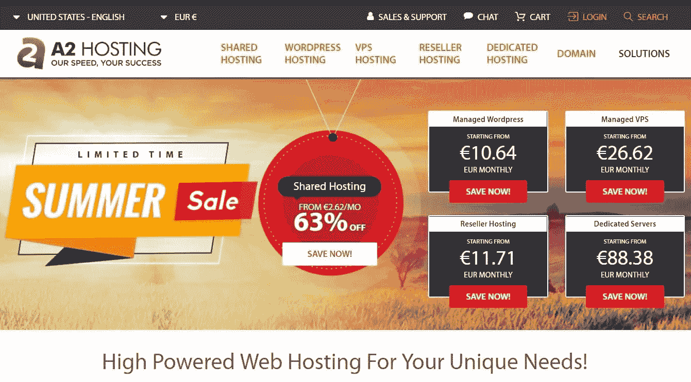](http://www.a2hosting.com?aid=5d3547bd95249)

A2 Hosting 于 2003 年在美国密歇根州成立。他们提供入门级的共享主机包、托管 VPS 和专用服务器以及卖家主机。

他们的共享包是标准的 cPanel 包，具有基于 SSD 的存储和预留 CPU 和 RAM 资源的承诺——即使是最小的计划。

他们的 LITE 计划从每月 2.96 美元开始，允许一个网站。他们的 SWIFT 计划有无限的网站，每月 3.70 美元起。他们的 TURBO 计划起价为每月 7.03 美元。这些价格——正如 A2 网站声称的——是 63%的折扣。

他们提供免费迁移、24/7 支持、DDOS 保护和*“99.99%正常运行时间承诺”*，知道这些总是很好。

[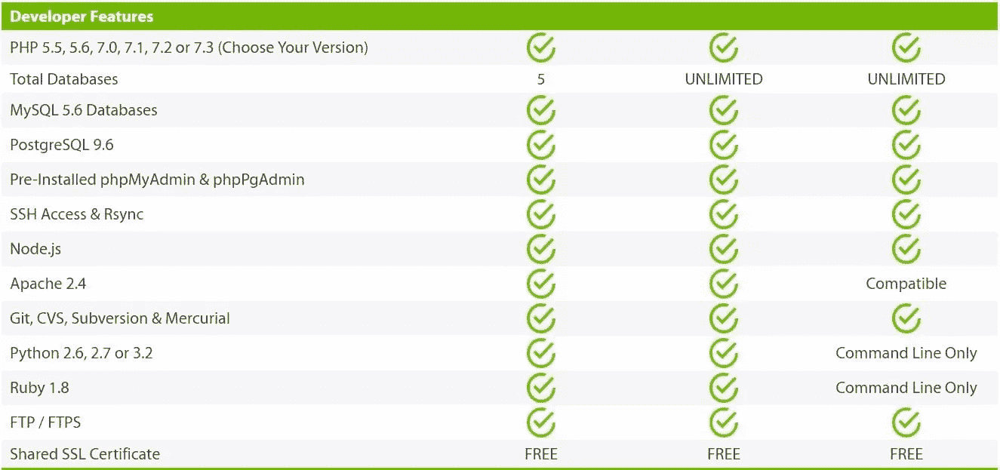](http://www.a2hosting.com?aid=5d3547bd95249)

使 A2 与众不同的旗舰计划是 *TURBO* 包，[使用 LiteSpeed](https://www.litespeedtech.com/products/litespeed-web-server/features/apache-drop-in-replacement) 服务器——这是 Apache 的绝佳替代品，也带来了[的性能优势](http://www.webhostingtalk.com/showthread.php?t=1730973)。

底层 LiteSpeed 允许 A2 在 TURBO 计划中提供 [QUIC](https://kinsta.com/blog/http3/) 作为实验性的[功能。](https://www.a2hosting.com/kb/a2-hosting-products/turbo-web-hosting/quic-quick-udp-internet-connections)

A2 提供了四个可能的服务器位置——两个数据中心在美国，一个在新加坡，一个在阿姆斯特丹，因此它们将覆盖您在世界上的大部分地区。

更多详情请查看他们的网站。

### [场地](https://www.siteground.com/web-hosting.htm?afcode=fede49d1072def2f644d030664beee6c)

SiteGround 是“在美国、英国、保加利亚和西班牙注册的公司的控股公司，管理着世界各地的四个办事处和几个数据中心位置。成立于 2004 年，它已经成为 WordPress 自己推荐的托管界的一个机构。

SiteGround 的托管范围与 A2 类似，从入门级的共享包一直到云产品和专用服务器。该公司还提供定制的企业解决方案。

SiteGround 提供类似于 A2 计划的[套餐](https://www.siteground.com/web-hosting.htm?afcode=fede49d1072def2f644d030664beee6c)——尽管它的 GrowBig 和 GoGeek 计划比类似的 A2 计划贵一点。

[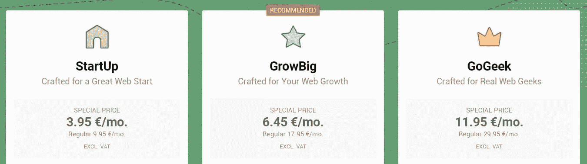](https://www.siteground.com/web-hosting.htm?afcode=fede49d1072def2f644d030664beee6c)

然而，SiteGround 确实提供所有计划的免费每日备份、GrowBig 和 GoGeek 上的免费迁移，以及 *staging* 安装，这对于更专业的设置来说很方便。

每个计划的资源使用在服务器进程、并发连接、CPU 秒、RAM、cronjob 间隔方面都是有限的——而且它们是特定的、透明的，这是一个优点。

需要注意的一点是，上面提到的价格是注册第一年的促销价格，之后会以更高的价格续订。

SiteGround 的服务器堆栈由 [NGINX 组成，作为 Apache 前面的缓存解决方案](https://www.sitepoint.com/server-side-optimization-with-nginx-and-pm-static/)——这意味着即使是 SiteGround 的启动计划也不受 [Apache 限制](https://kinsta.com/blog/nginx-vs-apache/)的约束。

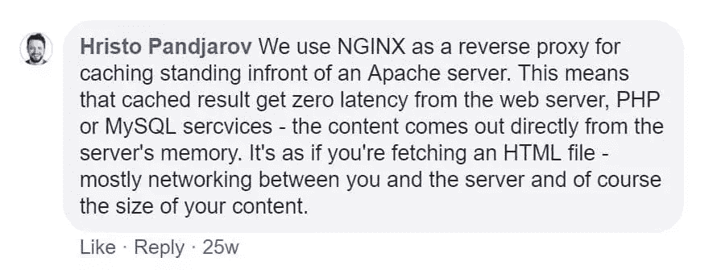

> 我们使用 NGINX 作为缓存的反向代理，站在 Apache 服务器前面。这意味着缓存的结果从 web 服务器、PHP 或 MySQL 服务获得零延迟。内容直接来自服务器的内存。这就好像你正在获取一个 HTML 文件——主要是你和服务器之间的网络，当然还有你的内容的大小。赫里斯托·潘贾罗夫

他们在英国、美国、欧洲大陆和亚洲(新加坡)提供服务器位置。

SiteGround 最近[也宣布支持 QUIC 下一代协议](https://www.siteground.com/blog/quic/)，这将提高网站加载速度，即使你所在位置的互联网连接很差。

更多详情请查看他们的网站。

### [蓝主机](https://www.bluehost.com/)

Bluehost 由马特·希顿于 2003 年创立，在 2011 年被 EIG 收购之前一直广受欢迎。自被收购以来，它一直是托管领域最突出的参与者之一，但它一直受到关于其用户体验的[褒贬不一的困扰。](https://www.reviewhell.com/blog/eig-arvixe-alternatives/)

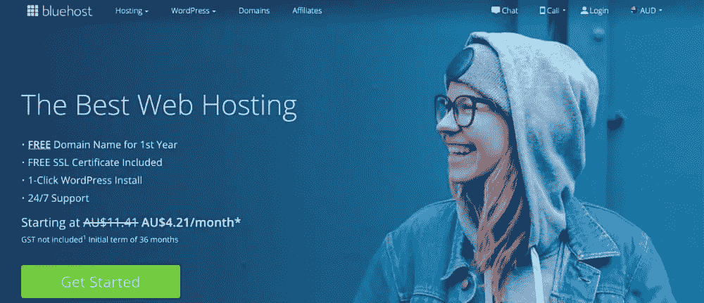

Bluehost 提供了与其他公司类似的产品系列——从入门级的共享计划到 VPS、专用服务器、电子商务和 WordPress 软件包。但它目前提供的价格是这一类别中提到的三种价格中最低的(36 个月的期限；短期内价格会上涨)。

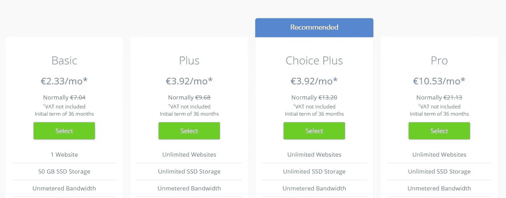

除了最小的计划之外，所有这些计划都包括无限的资源(SSD 存储)。但是，请注意，在他们的[服务条款注释](https://www.bluehost.com/hosting/shared#usage-policies)的细则中:

> 虽然很少，但我们偶尔会限制帐户使用比个人或小型企业网站正常运行更多的资源。

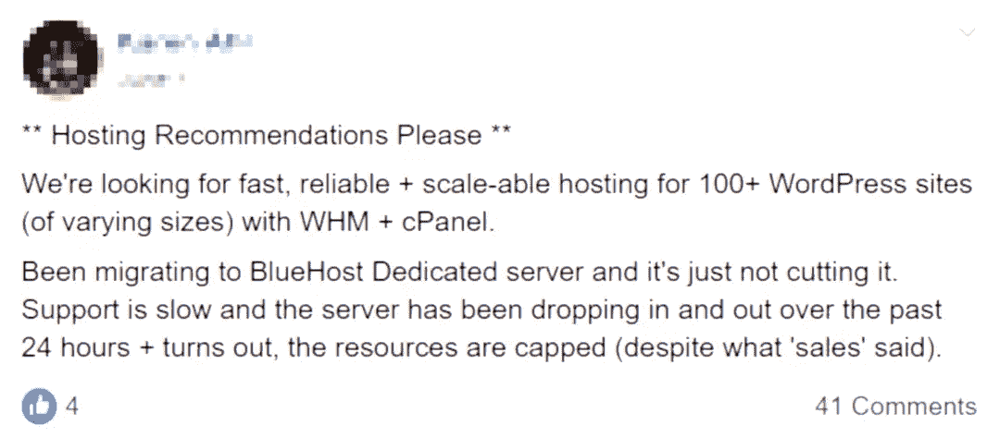

> **请主持推荐**
> 
> 我们正在寻找快速，可靠+100+WordPress 网站(不同规模)与 WHM + cPanel 可扩展的主机。
> 
> 一直在迁移到 Bluehost 专用服务器，它只是没有削减它。支持速度缓慢，服务器在过去 24 小时内时断时续，结果是资源有限(尽管“销售人员”是这么说的)。

在这种情况下，“对资源没有具体限制”可以理解为“没有有保证的资源”。甚至在收购 EIG 之前，Bluehost 就已经引入了一种 CPU 节流策略，所以要小心。你可以在这里阅读更多关于 Bluehost 对资源[的限制。](https://www.wp-tweaks.com/checking-bluehost-disk-bandwidth-and-cpu-restrictions/)

在更大的计划中，Bluehost 提供 SSH 访问、cron 作业、每日备份等。但它主要面向入门级市场。

Bluehost 有一些额外的好处，并且为 WordPress 的用户提供了一个定制的管理网页界面。

至于服务器的位置——blue host 没有提供直接的信息，但除了美国犹他州，他们似乎在中国和印度(孟买)都有数据中心。

## 专业的高级 WordPress 主机

### [WPEngine](https://shareasale.com/r.cfm?b=1343154&u=1443690&m=41388&urllink=&afftrack=)

WPEngine 于 2010 年在美国德克萨斯州成立，并迅速征服了企业 WordPress 主机市场。2011 年，Automattic(WordPress 背后的公司)参加了第一轮融资。

他们有三种固定的主机方案，分别是每月 35 美元、115 美元和 290 美元，还有针对关键任务的大型网站的定制方案。

[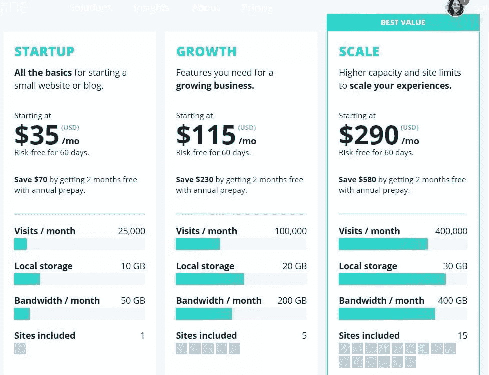](https://shareasale.com/r.cfm?b=714568&u=1443690&m=41388&urllink=&afftrack=)

WPEngine 网站对于所使用的服务器堆栈以及分配给每个计划的资源并不完全透明。除了提到最新的 PHP 版本和 MySQL，以及一些关于[他们的技术](https://wpengine.com/technology/)的相当模糊的描述，它没有指定许多关于服务器软件、容器化等其他细节。

但是使用 WPEngine 的一些额外好处包括迁移到 WPEngine，通过他们的定制软件提供[，以及暂存环境和 SSH 访问。此外，WPEngine 的数据中心遍布全球。](https://wpengine.com/support/wp-engine-automatic-migration-powered-by-blogvault/)

2018 年，WPEngine 收购了 StudioPress 和 Array 主题，因此现在他们的用户可以免费获得 Genesis 主题框架及其子主题的所有好处。

最近在 2019 年 6 月，WPEngine [收购了另一家优质 WordPress 主机提供商 Flywheel](https://wptavern.com/wp-engine-acquires-flywheel) ，因此这绝对是一个可以关注其产品范围和质量改进的空间。

WPEngine 拥有顶级声誉，他们与 Automattic 的合作令人印象深刻。但是我们也必须注意到，最近，对他们表现的抱怨层出不穷。尽管如此，也有大量用户为 WPEngine 的质量担保。你可以在这个[脸书集团](https://www.facebook.com/groups/wphosting/search/?query=wpengine)里读到一些。

如果你对 WPEngine 感兴趣，我们还应该注意，如果你注册了年度计划，现在你可以获得 3 个月的免费服务。[更多详情点击此处。](https://shareasale.com/r.cfm?b=1343154&u=1443690&m=41388&urllink=&afftrack=)

### [金斯塔](https://kinsta.com/?kaid=RJLABYZQYAFM)

金斯塔是这一类的新人。它成立于 2013 年，在美国、英国和匈牙利设有办事处。Kinsta 提供二十个服务器位置，其基础设施建立在谷歌云基础设施之上。

[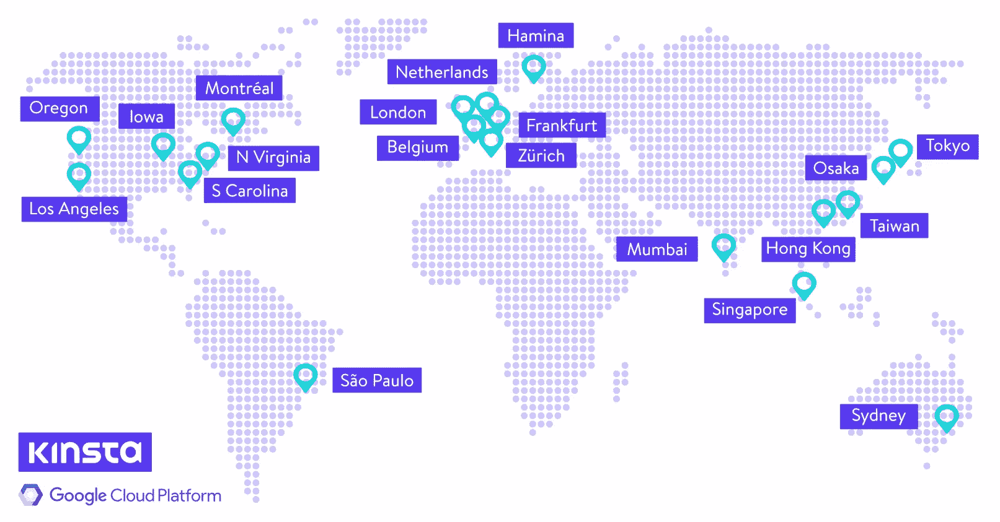](https://kinsta.com/knowledgebase/google-cloud-data-center-locations/?kaid=RJLABYZQYAFM)

像这个类别中的其他产品一样，Kinsta 的套餐不是市场上最便宜的，但它们是物有所值的。

他们有十种不同的计划，从每月 30 美元到每月 1500 美元不等，所以根据你的需求和预算，你有很多选择。

除了价格之外，这些计划的差异还包括存储空间(SSD)、PHP 工作人员数量、每月访问量和 WordPress 安装数量限制等。

Kinsta 提供了其计划中相当广泛的技术内容清单。它包括一键式暂存环境、每日备份、对其所有计划的 SSH 访问、详细的性能分析。金斯塔的所有计划还包括[自由移民](https://kinsta.com/wordpress-migration/?kaid=RJLABYZQYAFM)。

Kinsta 在谷歌云基础设施上使用 LXD 主机容器，每个站点使用 LXC 容器。这些 LXC 容器然后使用最新的 LEMP 栈——NGINX、PHP 7.3、MariaDB。

Kinsta 还声称提供 WordPress 专家的 24/7 支持——保证在两分钟内回复，尽管我们还没有亲自证实这一点。

### [华丽地](https://pagely.com/)

[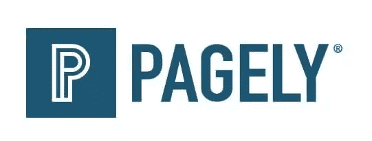](https://pagely.com/)

Pagely 于 2009 年在美国亚利桑那州成立，所以它是这个团体中历史最悠久的。Pagely 主要专注于企业客户，包括 VISA、迪士尼、Booking.com、时代公司、松下和康卡斯特，因此它在客户方面有着令人印象深刻的血统。Pagely 的[计划](https://pagely.com/plans-pricing/)反映了这一点:其最便宜的计划起价 199 美元，最贵的每月 2249 美元。

Pagely 提供 VPS 服务器，即使是最便宜的方案——所以资源隔离应该不是问题。

Pagely 在 WordPress 领域也有一些非常创新的产品，比如 WordPress 的无服务器基础设施(这个产品在撰写本文的时候还很新，所以我们可能会在这个问题上回复你)。

Pagely 的[基础设施](https://pagely.com/tech/)建立在亚马逊 AWS 之上。

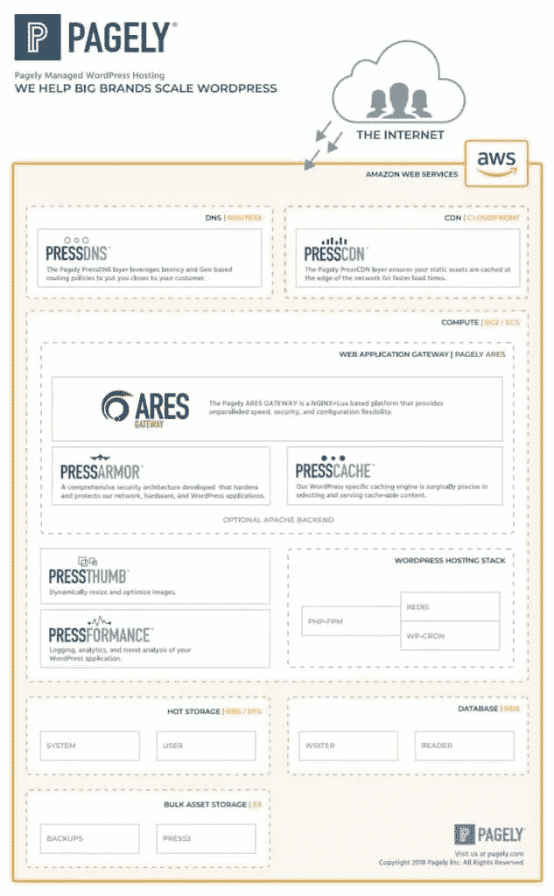

Pagely 还提供免费迁移、每日备份和一些[相当精细的暂存工作流](https://pagely.com/kb/en/staging-dev-workflows-support/)——甚至是针对最特殊的需求。据报道，它的支持者[是可靠的](https://www.cloudwards.net/pagely-review/)——但在这个价格范围内，你会希望如此。

## 非托管 VPS 托管

### [数字海洋](https://www.digitalocean.com/)

DigitalOcean 成立于 2011 年，总部位于美国纽约。它有 12 个可用的服务器区域，分别在美国、加拿大、英国、欧洲和亚洲。

DigitalOcean 提供 VPS“droplets”——基于 KVM 的虚拟机。KVM 虚拟化提供了一些防止过度销售的保护和体面的隔离，价格从每月 5 美元起，如果您主要是出于开发目的需要它，这是一个不错的选择。

DigitalOcean 还提供每日备份，这在这一类别中是奢侈的——但自动备份是单独收费的，每周执行一次。备份是给定时刻的 droplet 的快照。

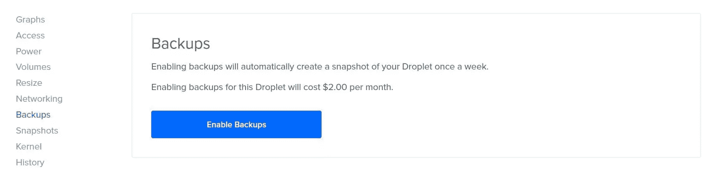

它还有[负载平衡器](https://www.digitalocean.com/docs/networking/load-balancers/)可用于水平扩展和防火墙。

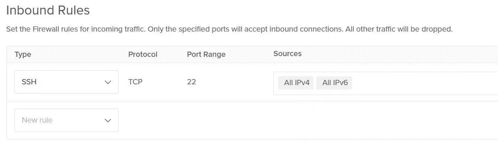

DigitalOcean 还提供 Kubernettes 容器编排、云数据库和存储，以及运行数据库集群和分布式系统的机器之间的专用网络。

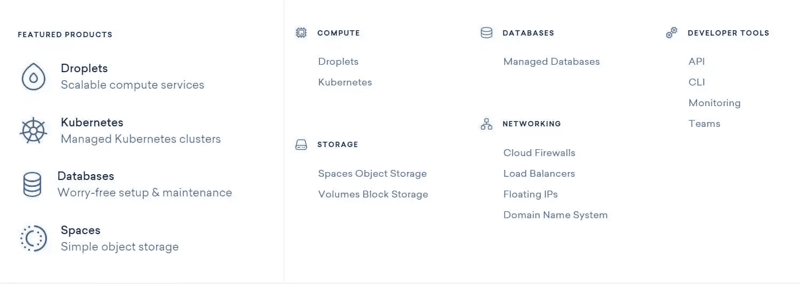

数字海洋的[一键式应用](https://marketplace.digitalocean.com/)甚至允许不太懂技术的用户使用 Linux 服务器，它的[知识库](https://www.digitalocean.com/community/tutorials/)相当广泛，远远超出了它自己的产品。

总而言之，DigitalOcean 为非托管 VPS 托管类别提供了一个非常强大的选项。它还有众多价格合理的计划选项，所以你只需支付你需要的费用，这总是很方便的。

### 里诺德

Linode 于 2003 年在美国费城成立。它是非托管 VPS 市场上的老玩家之一。它有 11 个数据中心，分别位于美国、加拿大、英国、澳大利亚、德国、印度、新加坡和日本。

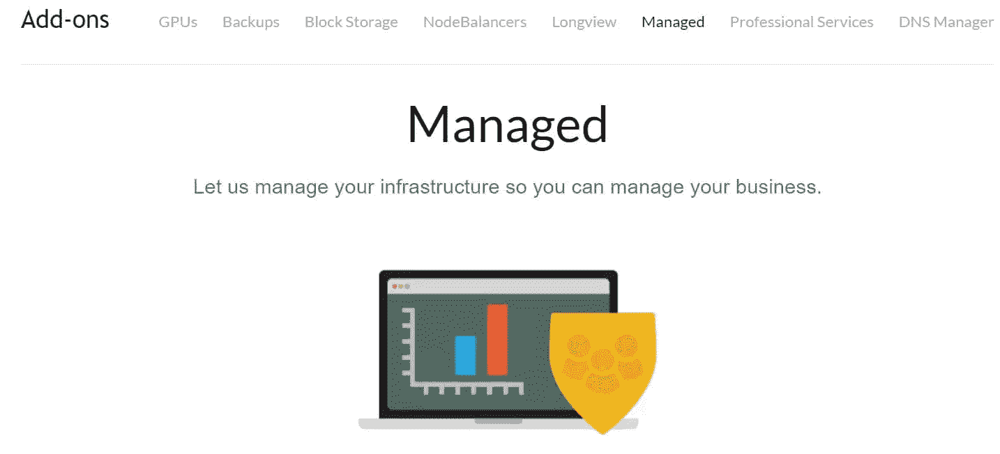

作为这一类别中罕见的事物，Linode 还提供托管服务，从服务器调优到迁移、软件部署和系统管理——当然是收费的。它为网络连接存储需求提供块存储，为非结构化数据和静态站点托管提供 S3 兼容对象存储，以及托管 Kubernetes 服务。

它的计划以前起价是每月 20 美元，但随着来自 DigitalOcean 和其他竞争对手的激烈竞争，Linode 的计划现在起价是每月 5 美元，就像 DigitalOcean 一样。

Linode 让事情比 DigitalOcean 简单一点——但它确实提供了许多有趣的附加功能。像许多提供商一样，这包括一系列一键安装，从像 WordPress、《我的世界》和 cPanel 这样的应用程序到像 LAMP、LEMP 或 MEAN 这样的技术栈。它的 [Longview](https://www.linode.com/longview) 服务器监控解决方案是一个更有趣的附加组件，还有它的[专用 GPU 实例](https://www.linode.com/gpus)。

### [Vultr](https://www.vultr.com/)

Vultr 于 2014 年在美国新泽西州成立，是一家“裸机”VPS 提供商。它在北美、欧洲和亚洲有 16 个服务器站点。

Vultr 还为其最流行的服务器软件提供一键式安装。但是 Vultr 的主要关注点一直是简单性、基础设施的质量和速度——以及最少的人工操作。Vultr 提供每日、每周或每月的自动备份，每月/每小时的基本备份率提高 20%。但它确实提供免费快照。

通过最少的忙乱和牵手，Vultr 能够提供极具竞争力的价格。Vultr 的计算实例起价为令人难以置信的每月 2.50 美元——这将为用户提供 512MB 内存——并以每月 640 美元的价格增加到 96GB 内存实例。定价计划也非常细化，因此您可以只选择您需要的。

## 结论

我们比较了三个不同类别的主机提供商。

**在通用类别中，我们推荐去[场地](https://www.siteground.com/web-hosting.htm?afcode=fede49d1072def2f644d030664beee6c)T3。它在[信任试点](https://www.trustpilot.com/review/www.siteground.com)上取得了迄今为止最好的成绩，在脸书上也得到了[专业团体的好评。它的计划和资源分配也非常透明。](https://www.facebook.com/groups/wphosting)**

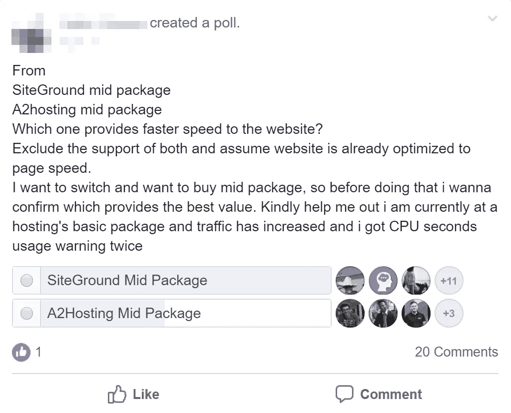

然而，要注意的一点是，尽管 SiteGround 拥有所有的功能，但它并不是最便宜的选择。它第一年的促销价格非常优惠，但之后价格会比竞争对手的价格高一些。SiteGround 更像是一个中间层选项，而不是入门级提供商。

在高级 WordPress 类别中——这是一个很接近的类别，但是我们把它给了 [Kinsta](https://kinsta.com/?kaid=RJLABYZQYAFM) 。凭借其提供的一系列产品，华丽地走在前面；很难否认这一点。但和 SiteGround 一样，Pagely 的定价也更高。但我们认为，Kinsta 提供了非常好的性价比，它对基础设施是透明的，它通过隔离提供了专用资源的保证，用户谈到了顶级的支持。我们还应该提到，Kinsta 也有一个非常用户友好的仪表板，应该可以让不太精通技术的用户更容易管理。

在 VPS 类别中， [Vultr](https://www.vultr.com) 凭借其*极具竞争力的价格和简单的管理摘得桂冠——digital ocean 紧随其后。我们更喜欢便宜、简单的选项，这让我们投票支持 Vultr，但如果你更喜欢或需要更多的支持和文档，我们会推荐像 DigitalOcean 这样更强大的选项。*

我们知道，不同供应商的体验可能会有所不同。你对这个比较有什么要补充的吗？请在评论中告诉我们。

## 分享这篇文章