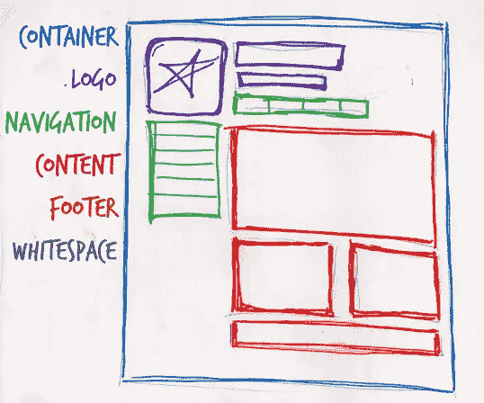

# 网页剖析

> 原文：<https://www.sitepoint.com/web-page-anatomy/>

即使从非设计者的角度来看，定义一个满足前面概述的所有需求的设计也是一项简单的任务。这类似于在你的冰箱上用有磁性的诗词做一个短语。虽然有数百万种排列单词的方法，但只有少数排列有意义。磁性词就像网页的组成部分或模块。虽然这些必要区块的数量取决于网站的大小和主题，但大多数网站都有下图所示的组件:

让我们依次看看这些组件:

## 包含块

每个网页都有一个容器。这可以是页面主体标签的形式，一个包含所有内容的`div`标签。如果没有某种容器，我们就没有地方放置页面内容。这些元素将会超出浏览器窗口的边界，进入空白区域。该容器的宽度可以是可变的，这意味着它会扩展以填充浏览器窗口的宽度；或者是固定的，这样无论窗口大小如何，内容的宽度都是一样的。

## 标志；徽标

当设计师提到身份时，他们指的是存在于公司各种营销形式中的标志和颜色，如名片、信笺、小册子等等。出现在网站上的标识块应该包含公司的徽标或名称，并位于网站每个页面的顶部。identity block 提高了品牌认知度，同时告诉用户他们正在查看的页面是单个网站的一部分。

**注:**很多人交替使用“身份”和“品牌”这两个词。品牌是一个广义的术语，描述的是一个公司、产品或服务的认知发展过程。品牌过程包括广告、市场研究、客户反馈等等。身份实际上是品牌的一个子集，因为它只处理品牌的视觉方面。

## 航行

网站的导航系统必须易于查找和使用。用户希望在页面顶部看到导航。无论你计划在页面下方使用垂直菜单，还是在页面上使用水平菜单，导航都应该尽可能靠近布局的顶部。至少，所有主要的导航项目都应该出现在“文件夹上方”

### 在“折叠”之上

许多设计师称之为*折叠*，是用户向下滚动之前页面内容的终点。这个**比喻**来源于报纸上的折页。如果你看一份折叠报纸的封面，大部分的标题和最大的新闻都出现在上半部，这样当报纸折叠时，最重要的新闻条目就能一目了然。网页上折叠的位置取决于浏览器的尺寸和用户的屏幕分辨率。在 1024×768 像素的分辨率下，考虑到浏览器镶边，即浏览器应用程序本身以选项卡、按钮、地址栏和底部状态栏的形式占据的空间，折叠通常距离顶部 500 像素多一点。

## 内容

内容为王。一个典型的网站访问者会在几秒钟内进入和离开一个网站。如果访问者找不到他们想要的东西，他们无疑会关闭浏览器或者转到另一个网站。将主要内容块作为设计的焦点是很重要的，这样访问者就可以浏览页面，找到他们需要的信息。

## 页脚

页脚位于页面底部，通常包含版权、联系方式和法律信息，以及一些到网站主要部分的链接。通过将最终内容与浏览器窗口的底部分开，页脚应该向用户表明他们在页面的底部。

## 空白

图形设计术语空白(或负空间)字面上指的是页面上没有类型或插图的任何区域。虽然许多网站设计新手(和大多数客户)都觉得需要用照片、文本、表格和数据填满网页的每一寸空间，但页面上的空白空间和内容一样重要。如果没有精心设计的留白，设计会感觉封闭，就像一个拥挤的房间。空白通过引导用户的视线来帮助设计者呼吸，但也有助于创造平衡和统一——这是两个重要的概念，我们将在本章后面详细讨论。

在这一点上，我们已经与我们的理论客户史密斯先生进行了第一次会面，这很有帮助。他非常透彻地解释了他的业务是做什么的，以及他希望网站实现什么。即使我们还没有看到实际的内容，我们可以使用标准的网页解剖块来开始开发布局。虽然许多网站布局的设计中也包含了其他特定网站的模块，但是网页分析总结了最常见的模块。

现在我们有了这些信息，我们如何利用它们来为 Smith 的服务创建一个基础布局呢？是时候了解一些网格理论了，我们将在接下来讨论，所以请继续关注。

## 美丽网页设计的原则

这篇文章来自杰森·比厄德的 [*美丽网页设计的原则*一书](https://www.sitepoint.com/books/design2/ "SitePoint.com: The Principles of Beautiful Web Design, 2nd Edition")(第二版现已出版)。这是第一章的第三部分。

如果你更喜欢色彩，请务必在设计节上查看现有的[色彩章节的数字化版本。](https://www.sitepoint.com/design-ux/color/ "DesignFestival.com: Everything on Color")

## 分享这篇文章