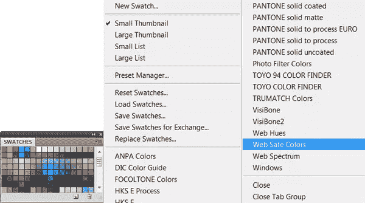
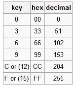

# 网页安全调色板-它仍然相关吗？

> 原文：<https://www.sitepoint.com/web-safe-color-palette-is-it-still-relevant/>

最近在教室里有人问我，是否仍然有必要在网上使用的图形中考虑和使用“网页安全色”。这个问题是因为我们在 Photoshop 中查看色板调色板时，在上下文菜单中有一个可用的选项是网页安全色。

如果你从事网页设计已经很多年了，你可能对这个概念非常熟悉，但是对于任何刚接触网络设计的人来说，这里有一个简单的解释，什么是网页安全色，为什么它们是必要的。

电脑显示器并不总是我们今天所知道的那种精美的显示器。很长一段时间，许多显示器只能显示 256 色。当图像中使用的颜色在显示器上不可用时，必须使用不同的替换颜色。这要么是最接近的颜色，要么是着色较慢但看起来更好的抖动颜色。为了在能够显示 256 种颜色的显示器上安全地使用标准调色板，选择了一组 216 种颜色，这些颜色被称为网页安全色。

“网页安全色”并不都有标准名称，但每种颜色都可以由 RGB 三元组指定:每个组件(红色、绿色和蓝色)都从下表中的六个值中选择一个值(在全 24 位颜色中，每个组件有 256 个可能的值)。

*表自[百科](http://en.wikipedia.org/wiki/Web_colors#Web-safe_colors)*

如今，现代计算机一般至少有 16 位颜色，通常有 24 位颜色，这允许显示数百万种颜色。即使是现代的手机、iPods 和平板电脑也能比 90 年代初的显示器显示更多的颜色，所以真的没有必要再坚持使用网络安全调色板了(除非你的客户用的是一台非常旧的电脑，他坚持认为一切都很好看)。如今，更重要的是看图像的对比度，而不是使用了多少种颜色。

## 分享这篇文章