# 10 多个 jQuery Web 教程、帮助和指导插件

> 原文：<https://www.sitepoint.com/web-tour-instructional-plugins/>

通过将这些非常有趣的 **jQuery Web Tour、帮助和指导插件**整合到您的网站中，将您的用户体验提升到另一个水平。你会发现这些插件对于改善你网站的整体用户体验非常有用。玩得开心！

**2013 年 02 月 06 日更新:**新增 11。tourist . js
更新 21/06/2013: 新增 12。动力之旅

**相关帖子:**

*   [**10 个 jQuery 插件，帮助快速响应布局**](http://www.jquery4u.com/page-layout/10-jquery-plugins-responsive-layouts/)
*   [**10 个在线工具帮助优化和格式化 CSS**](http://www.jquery4u.com/dynamic-css-2/10-online-tools-apps-optimize-format-css/)
*   [**10 jQuery 全景图像显示插件**](http://www.jquery4u.com/plugins/10-jquery-panorama-image-display-plugins/)

## 第一个 jquery joyride

非常灵活，让您可以控制人们如何与您的游览互动。我们将其编程为跨浏览器兼容现代浏览器，甚至使用一些花哨的 CSS 来避免图像。
[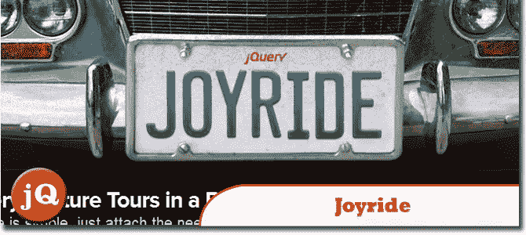](http://www.zurb.com/playground/jquery-joyride-feature-tour-plugin) 
[源+演示](http://www.zurb.com/playground/jquery-joyride-feature-tour-plugin)

## 2.Clippy.js

微软代理(又名 Clippy 和 friends)的完整 Javascript 实现，可以嵌入任何网站。
[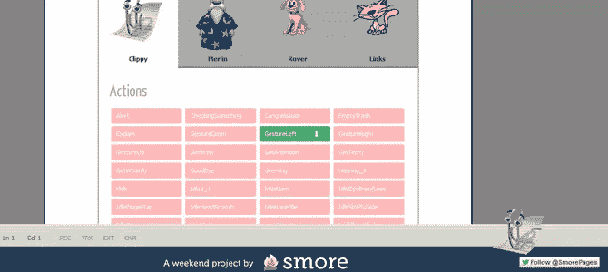](http://www.smore.com/clippy-js) 
[源+演示](http://www.smore.com/clippy-js)

## 3.银河

只需点击上面的菜单项，无需使用 Flash 就可以缩放我的世界并了解更多关于网络动画的信息。
 
[源+演示](http://playground.adambecker.info/galaxy/)

## 4.pageguide.js

使用 jQuery 和 CSS3 的网页元素的交互式指南。
[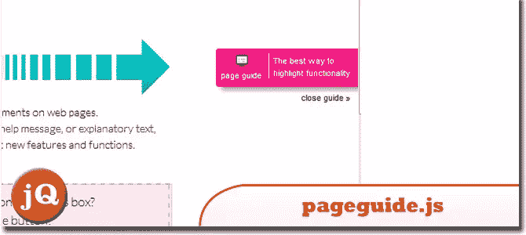](http://tracelytics.github.com/pageguide/) 
[源+演示](http://tracelytics.github.com/pageguide/)

## 5.使用 jQuery 浏览网站

如果您想以交互的方式向用户解释 web 应用程序的功能，这将非常有用。你可能已经注意到脸书使用了类似…
[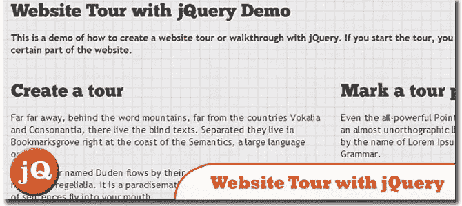](http://tympanus.net/codrops/2010/12/21/website-tour/)
[Source](http://tympanus.net/codrops/2010/12/21/website-tour/)[Demo](http://tympanus.net/Development/WebsiteTour/)的东西

## 6.aSimpleTourPlugin

一个 jQuery 插件，可以帮助你浏览网站。
[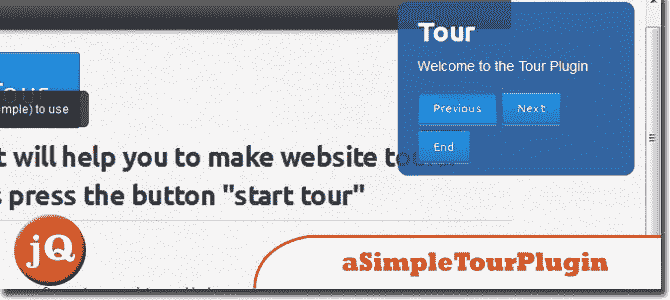](http://alvaroveliz.github.com/aSimpleTour/) 
[源+演示](http://alvaroveliz.github.com/aSimpleTour/)

## 7.jQuery 之旅

灵活的旅游插件。
[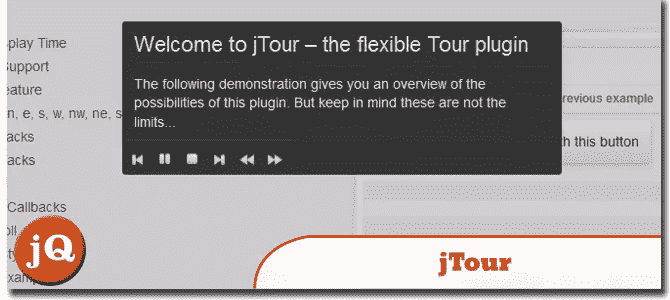](http://revaxarts-themes.com/?t=tour) 
[源+演示](http://revaxarts-themes.com/?t=tour)

## 8.guidely-jQuery 网站之旅

一个功能性的 jQuery 插件，为你的新用户或老用户提供网站导览。
[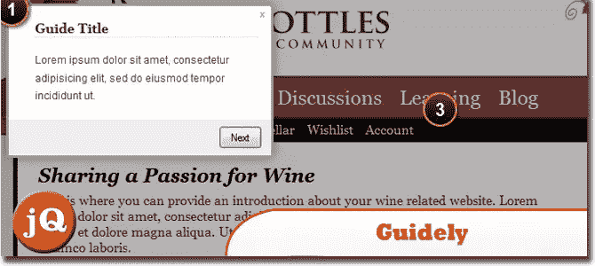](http://codecanyon.net/item/guidely-jquery-website-tours/372309) 
[来源](http://codecanyon.net/item/guidely-jquery-website-tours/372309) [演示](http://codecanyon.net/item/guidely-jquery-website-tours/full_screen_preview/372309)

## 9.jQuery 电子帮助

是一个程序性(“How to…”web 用户界面帮助的插件，可以很容易地集成到任何支持 jQuery 的 web 界面中。有用的所有网络应用程序，内容管理系统和电子商务系统。
[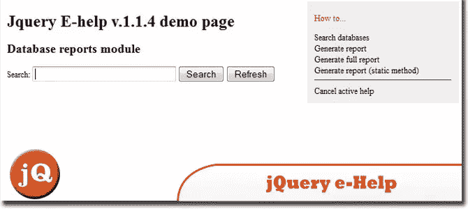](http://embedded-help.net/) 
[来源](http://embedded-help.net/) [演示](http://embedded-help.net/ehelp/v114/)

## 10.自助旅游

Bootstrap Tour 是一个基于 Twitter Boostrap 并受 Joyride 启发的易于配置的站点游览向导。
[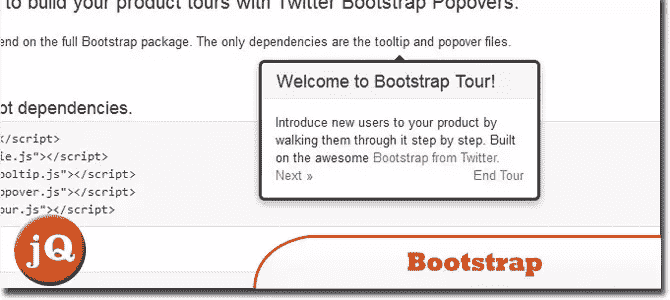](https://github.com/Gild/bootstrap-tour#readme) 
[来源](https://github.com/Gild/bootstrap-tour#readme) [演示](http://pushly.github.com/bootstrap-tour/)

## 11.Tourist.js

Tourist.js 是一个简单的库，用于通过应用程序创建导游。它比网站更适合复杂的单页应用。我们的主要需求是控制每一步界面的能力。
[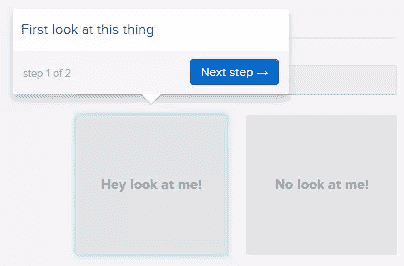](http://easelinc.github.io/tourist/) 
[源+演示](http://easelinc.github.io/tourist/)

## 12.动力之旅

Power Tour 是一个功能强大的 jQuery tour 插件，可以用作游览、助手、向导或工具提示。这个插件非常强大，有很多选项，可以让你创建一个非常酷的旅游。
[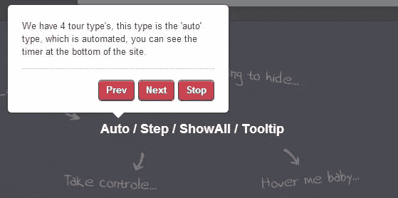](http://www.jquerypowertour.com/) 
[源+演示](http://www.jquerypowertour.com/)

## 分享这篇文章