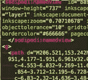
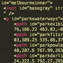
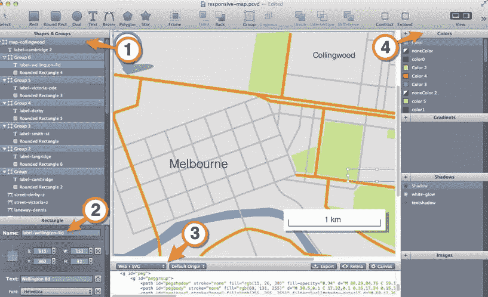
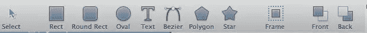
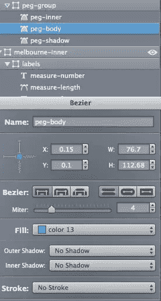
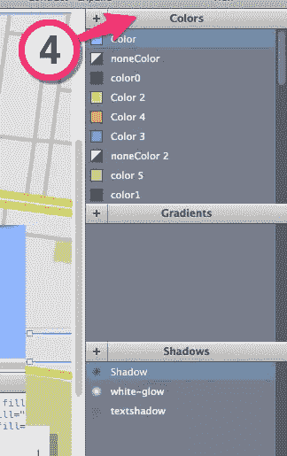
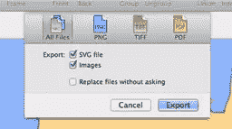
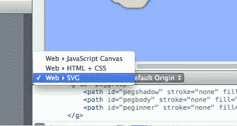
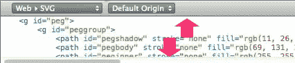
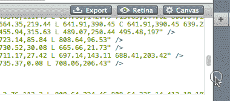

# 回顾:web code——制作 SVG 的更好方法？

> 原文：<https://www.sitepoint.com/webcode-review-create-better-svg/>

在过去的一年里，我一直在使用 SVG，有时我觉得 SVG 有两种不同的类型。

### “另存为”挽救（saving 的简写）

这些“另存为”的 SVG 文件错综复杂，不必要的复杂，通常来自一系列矢量编辑应用程序。它们充斥着糟糕的标记实践和毫无意义的特定于应用的代码。

这些文件对于 SVG，就像 MS Word 对于 HTML 一样。

当然，它们可能在现代浏览器中表现良好，但是底层代码非常难看，在创建它的编辑器之外很难操作。

### “手工切割”SVG

另一种类型的 SVG 更简单，组织良好，通常是手工编辑的文件。当您遇到这些文件时，您会知道它们，因为当您在文本编辑器中浏览它们时，它们与任何编写良好的 HTML 文件一样有意义。

正是这种清晰性真正释放了 SVG 在 web 上的灵活性，因此将第一种类型的 SVG 转变为第二种类型是一个非常有价值的举措。

PixelCut 的 [**WebCode**](http://www.webcodeapp.com/ "WebCode product page.") 是一种不同类型的矢量图形应用——一种从基本框架构建 SVG 的应用——而不是事后的想法。

澄清一下，WebCode 只适用于 OSX——但我一直在寻找跨平台的对等物。

那么，让我们来看看 WebCode 接口。

## 盛大的旅行

WebCode 界面

### 绘图工具

WebCode 的绘图工具相对简单——尤其是与 Illustrator 或 Inkscape 相比——但这并不是一件坏事。

WebCode 工具栏

首先，这些工具是为编写好的 SVG 而设计的，所以您会本能地理解 SVG 擅长的事情。你也开始明白什么是**不**擅长的，并开始避免做那些事情。

请注意，WebCode *的*也有一个 IMPORT 命令，对于引入 Illustrator 或 Inkscape 中制作的较小的 SVG 组件很有用。

### 形状和组

“形状和组”面板

“形状和组”面板是 web 代码的核心。

在某些方面，它看起来很像任何图形应用程序中典型的“图层”面板，当然工作方式也类似。您可以上下拖动层，轻松地对组件进行分组和取消分组。

每一层的最右边都有一个“眼睛”图标。关闭此图标不仅会隐藏粘贴板上的对象，还会暂时将它从下面的 SVG 代码预览中删除——这对于将 SVG 组件复制到其他文档中来说非常方便。

在“形状和组”面板中选择任何元素都会自动将其加载到下面的属性面板中(2)。

这允许您在属性级别编辑每个 SVG 元素。这包括:

*   给它一个 ID
*   缩放它
*   X/Y 位置
*   颜色填充
*   笔画类型
*   不透明
*   笔画颜色
*   阴影

### 资源调色板

资源面板

重用资产不仅是良好的编码实践，而且从设计角度来看也很有意义，减少了视觉混乱和文件大小。

WebCode 的整个右侧专用于 WebCode SVG 中的四个可重用资产。

这些是:

*   颜色；色彩；色调
*   梯度
*   阴影
*   形象

您在“形状和组”面板中创建的每个新颜色、渐变、图像或阴影都会自动添加到这些资产面板中。只需单击一下，就可以将它们重新应用到其他元素。

这让你不断意识到你拥有的资产，并鼓励你重用和简化你的调色板。

这在使用 SVG 时非常有用。

### 导出格式

WebCode 提供后备 PNGS、
tiff 和 pdf

WebCode 的开发者 PixelCut 也制作 [PaintCode](http://www.paintcodeapp.com/ "PixelCut website") ，这是一款为 OSX/IOS 应用制作图形的工具。换句话说，他们深谙为不同环境制造不同资产的理念。

使用 SVG 的一个现实是，您需要有适当的后备。

WebCode 可以自动生成 PNGS、TIFFs 和 pdf 格式的 SVG 文件。

选择你的毒药:SVG，画布或 HTML。

有趣的是，只需轻轻一拉下拉菜单，WebCode 就可以轻松地生成 web 就绪的 HTML & CSS 渲染或 Canvas/JavaScript 就绪的图形。

## 问题和警告

WebCode 并不是没有问题。我认为在未来的版本中有两个方面可以改进。

### SVG 代码窗口

SVG 预览–曾经偷看过信箱吗？

对于一个如此强调 SVG 代码的应用程序来说，底部小小的 SVG 代码窗口是一个挫折。也许这是为了阻止人们*认为*他们可以在这里直接编辑他们的 SVG 标记？我不确定。

这个窗口可以让你直接查看和复制代码段，但是目前根本不能调整大小——更不用说踢到一个“类似 Web Inspector”的浮动窗口了，就像我希望的那样。

这是我想改变的第一件事。

光标指示水平调整大小，但不是垂直。

**更新:3 月 27 日:**[的 PixelCut 人员通过 twitter](https://twitter.com/PixelCutCompany/status/448913901972119552 "Tweet: PixelCut's response to my resizing query.") 告诉我，事实上，你可以拖动代码预览窗口的顶部来调整它的大小。

当前的问题是您的光标指示面板可水平调整大小，但当悬停在代码预览的顶部边缘时，不会变为调整大小光标。

我被告知这将很快得到纠正。

## 没有模式和使用支持

作为前端人员，我们直观地理解一次声明一个类，然后在我们的文档中一次又一次地调用该类的价值。

事实上，我们大多数人觉得使用单一用途的内联样式很脏。

SVG 规范为图形元素提供了类似的强大功能。

在 SVG 文档的顶部，您可以放置一个定义块(`<DEFS>`)，它的工作方式有点像 HTML 中的`STYLE`块。

在 DEFS 块中声明的 SVG 块都有一个 ID，然后可以从该 SVG 中的任何地方再次引用——只需一行代码。

元素是图标和其他可重用组件的理想选择。元素允许你用 SVG 的其他部分来平铺 SVG 的各个部分。

这些都是强大而有效的函数，如果你已经习惯了 CSS 工作流，它们是非常直观的工作方式。

不幸的是，目前 WebCode 不能与`USE`或`PATTERN`一起工作。

我已经为未来的发行祈祷了。

## 洗碗

I think the concepts behind WebCode are a fundamental improvement on the ways we’ve developed SVG before.

在传统的矢量编辑应用程序中，很难控制“在向导的幕后”你的代码发生了什么。通常*应该是一个简单的 SVG 矩形会被转换成一个更复杂的路径形状。*

一个让 SVG 标记就在你眼前的应用程序——即使窗口很小——感觉很适合处理这些文件。

虽然有一些弱点(如上所述)，我认为这个应用程序已经拥有的一系列技巧，证明了标价的合理性。

50 美元，我认为对于任何对 SVG 感兴趣的人来说，这是一笔值得的投资。

看看这个。

## 分享这篇文章