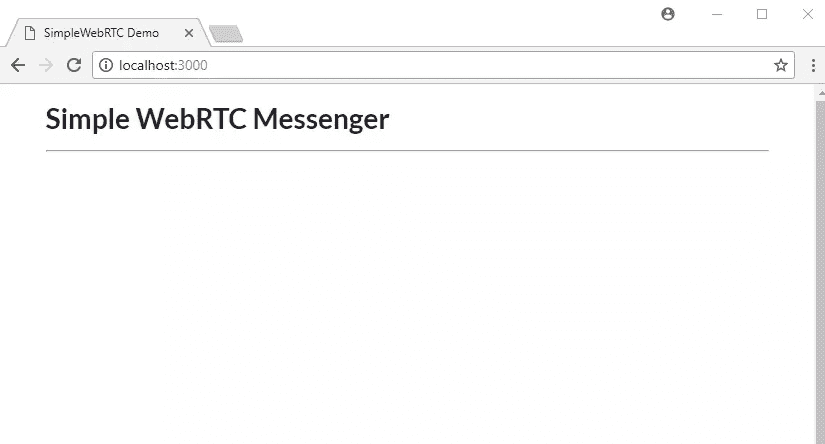
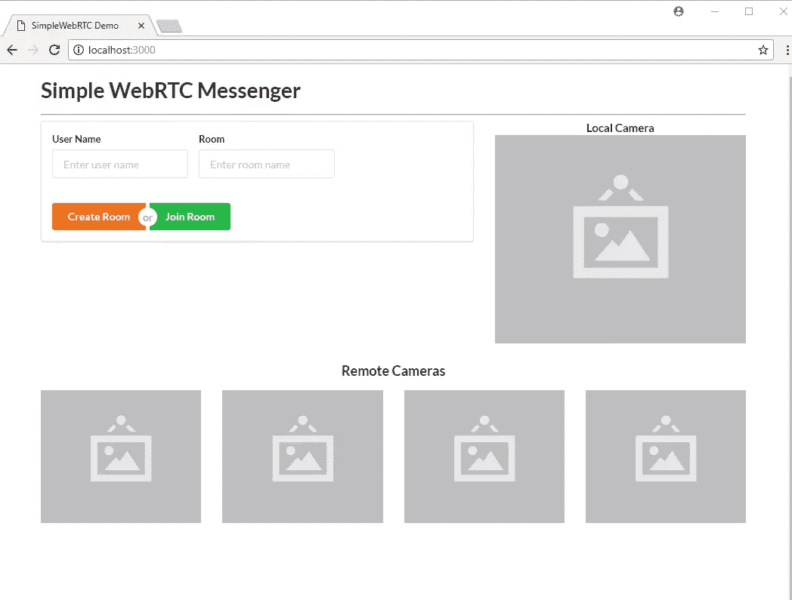
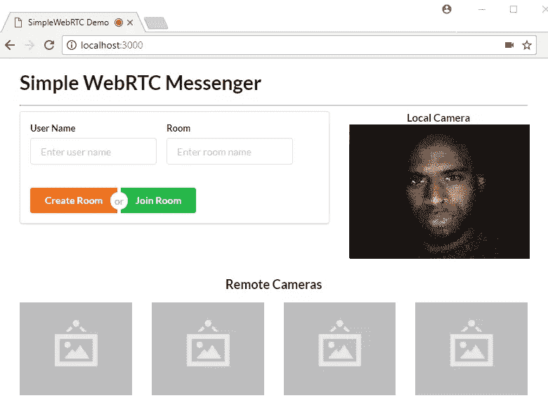
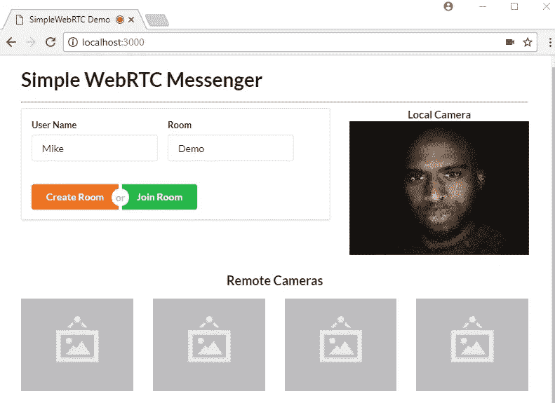
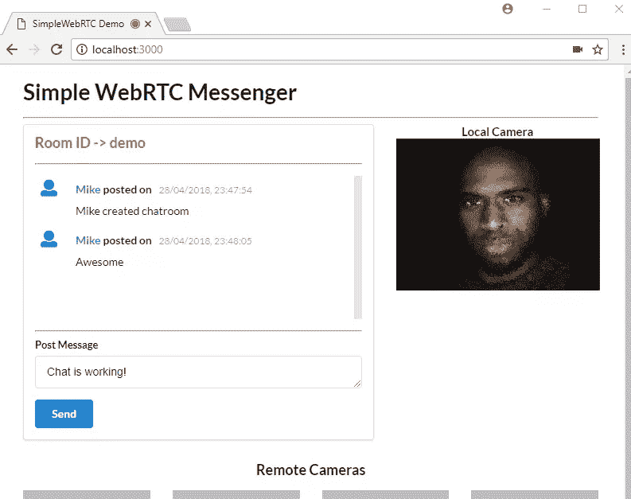
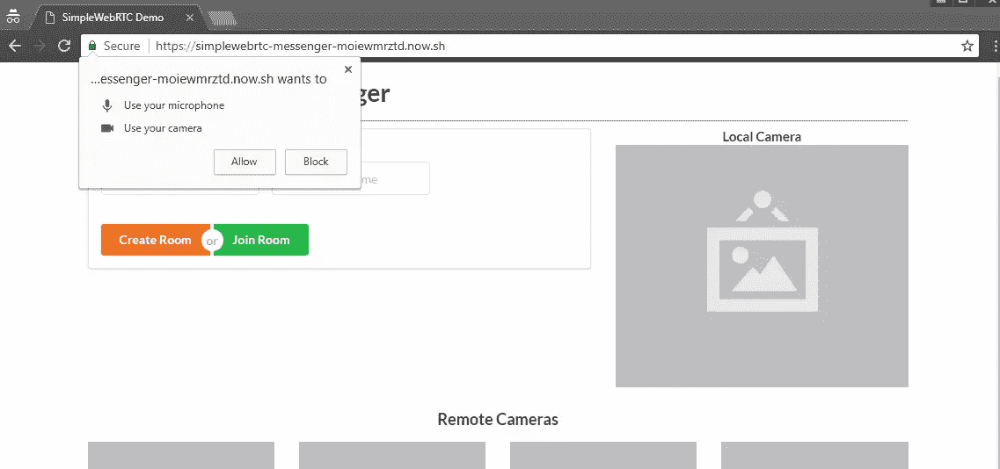
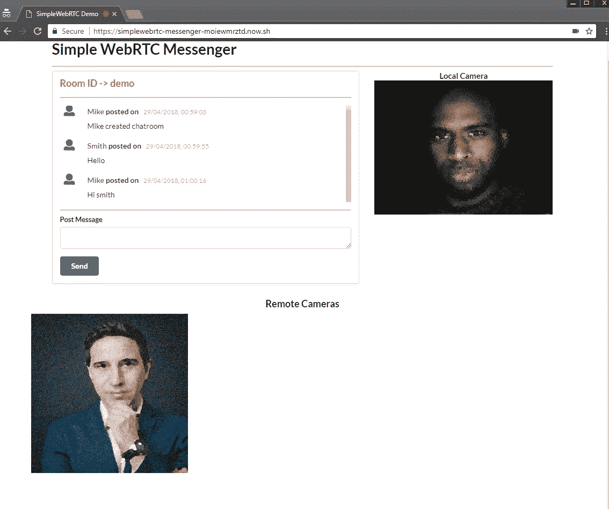

# 用 SimpleWebRTC 构建 WebRTC 视频聊天应用程序

> 原文：<https://www.sitepoint.com/webrtc-video-chat-application-simplewebrtc/>

*本文精选于我们的书，* [6 JavaScript 项目](https://www.sitepoint.com/premium/books/6-javascript-projects?ref_source=sitepoint&ref_medium=article_copy&ref_campaign=6-javascript-projects) *。构建能够让您非常熟悉现代 JavaScript 开发的项目。*

随着 WebRTC 的出现和浏览器实时处理点对点通信能力的提高，构建实时应用程序比以往任何时候都更容易。在本教程中，我们将看看 [SimpleWebRTC](https://simplewebrtc.com/) 以及它如何在实现 WebRTC 时让我们的生活变得更简单。在整篇文章中，我们将构建一个具有消息传递功能的 WebRTC 视频聊天应用程序。

如果你需要一些关于 WebRTC 和点对点通信的背景知识，我推荐你阅读[WebRTC 的黎明](https://www.sitepoint.com/the-dawn-of-webrtc/)和[getuser media API 简介](https://www.sitepoint.com/introduction-getusermedia-api/)。

## 什么是 SimpleWebRTC

在我们继续之前，了解我们将使用的主要工具是很重要的。 [SimpleWebRTC](https://github.com/andyet/SimpleWebRTC) 是一个 JavaScript 库，它简化了 WebRTC 点对点数据、视频和音频调用。

SimpleWebRTC 充当浏览器的 WebRTC 实现的包装器。正如您可能已经知道的，浏览器供应商在实现不同特性的单一方式上并不完全一致，这意味着每个浏览器都有不同的 WebRTC 实现。作为开发人员，您必须为您计划支持的每个浏览器编写不同的代码。SimpleWebRT 充当该代码的包装器。它公开的 API 易于使用和理解，这使它成为实现跨浏览器 WebRTC 的一个非常好的候选。

## 构建 WebRTC 视频聊天应用程序

现在是时候通过构建应用程序来动手了。我们将构建一个运行在 Express 服务器上的单页面应用程序。

请注意，您可以从我们的 [GitHub repo](https://github.com/sitepoint-editors/simplewebrtc-messenger) 下载本教程的代码。要运行它，或者在家继续，您需要安装 Node 和 npm。如果您对这些不熟悉，或者需要一些帮助来安装它们，请查看我们以前的教程:

*   [使用 nvm 安装多个版本的 Node.js】](https://www.sitepoint.com/quick-tip-multiple-versions-node-nvm/)
*   [NPM 初学者指南—节点包管理器](https://www.sitepoint.com/beginners-guide-node-package-manager/)

你还需要一台带有网络摄像头的电脑或笔记本电脑。如果没有，你需要给自己一个 USB 摄像头，可以挂在显示器的顶部。您可能需要一个朋友或第二台设备来测试远程连接。

## 属国

我们将使用以下依赖项来构建我们的项目:

*   [simple WebRTC](https://simplewebrtc.com/)—WebRTC 库
*   语义 UI CSS——一个优雅的 CSS 框架
*   [jQuery](http://jquery.com/) —用于选择页面上的元素和事件处理。
*   一个 JavaScript 模板库，我们将使用它为消息生成 HTML
*   [快递](https://expressjs.com/) — NodeJS 服务器。

## 项目设置

转到您的工作区并创建一个文件夹`simplewebrtc-messenger`。在 VSCode 或您喜欢的编辑器中打开文件夹，并创建以下文件和文件夹结构:

```
simplewebrtc-messenger
├── public
│   ├── images
│   │   └── image.png
│   ├── index.html
│   └── js
│       └── app.js
├── README.md
└── server.js 
```

或者，如果您愿意，也可以通过命令行执行相同的操作:

```
mkdir -p simplewebrtc-messenger/public/{images,js}
cd simplewebrtc-messenger
touch public/js/app.js public/index.html .gitignore README.md server.js 
```

打开`README.md`，复制以下内容:

```
# Simple WebRTC Messenger

A tutorial on building a WebRTC video chat app using SimpleWebRTC. 
```

如果您计划使用 git 存储库，将行`node_modules`添加到`.gitignore`文件中。使用以下命令生成`package.json`文件:

```
npm init -y 
```

您应该得到以下输出:

```
{
  "name": "simplewebrtc-messenger",
  "version": "1.0.0",
  "description": "A tutorial on building a WebRTC video chat app using SimpleWebRTC.",
  "main": "server.js",
  "scripts": {
    "test": "echo \"Error: no test specified\" && exit 1",
    "start": "node server.js"
  },
  "keywords": [],
  "author": "",
  "license": "ISC"
} 
```

现在让我们安装我们的依赖项:

```
npm install express handlebars jquery semantic-ui-css simplewebrtc 
```

随着安装的进行，将此代码复制到`server.js`:

```
const express = require('express');

const app = express();
const port = 3000;

// Set public folder as root
app.use(express.static('public'));

// Provide access to node_modules folder from the client-side
app.use('/scripts', express.static(`${__dirname}/node_modules/`));

// Redirect all traffic to index.html
app.use((req, res) => res.sendFile(`${__dirname}/public/index.html`));

app.listen(port, () => {
  console.info('listening on %d', port);
}); 
```

服务器代码非常标准。看看评论就明白怎么回事了。

接下来，让我们设置我们的`public/index.html`文件:

```
<!DOCTYPE html>
<html lang="en">
<head>
  <meta charset="UTF-8">
  <meta name="viewport" content="width=device-width, initial-scale=1.0">
  <meta http-equiv="X-UA-Compatible" content="ie=edge">
  <link rel="stylesheet" href="scripts/semantic-ui-css/semantic.min.css">
  <title>SimpleWebRTC Demo</title>
  <style> html { margin-top: 20px; }
    #chat-content { height: 180px;  overflow-y: scroll; } </style>
</head>
<body>
  <!-- Main Content -->
  <div class="ui container">
    <h1 class="ui header">Simple WebRTC Messenger</h1>
    <hr>
  </div>

  <!-- Scripts -->
  <script src="scripts/jquery/dist/jquery.min.js"></script>
  <script src="scripts/semantic-ui-css/semantic.min.js"></script>
  <script src="scripts/handlebars/dist/handlebars.min.js "></script>
  <script src="scripts/simplewebrtc/out/simplewebrtc-with-adapter.bundle.js"></script>
  <script src="js/app.js"></script>
</body>
</html> 
```

接下来，让我们设置基本的客户端 JavaScript 代码。将此代码复制到`public/js/app.js`:

```
window.addEventListener('load', () => {
  // Put all client-side code here
}); 
```

最后，从我们的 GitHub 库下载这张[图片](https://github.com/sitepoint-editors/simplewebrtc-messenger/blob/master/publimg/image.png)，并保存在`public/images`文件夹中。

现在我们可以运行我们的应用程序了:

```
npm start 
```

在浏览器中打开 URL [localhost:3000](http://localhost:3000) ，您应该会看到以下内容:



## 利润

现在让我们来研究一下`public/index.html`。为了简单起见(特别是如果你已经熟悉手柄的话)，你可以从我们的 [GitHub 库](https://github.com/sitepoint-editors/simplewebrtc-messenger/blob/master/public/index.html)复制整个标记代码。要不，我们一步一步来。首先，复制这段代码，并将其放在`ui container` div 中的`<hr>`标签之后:

```
<div class="ui two column stackable grid">

  <!-- Chat Section -->
  <div class="ui ten wide column">
    <div class="ui segment">
      <!-- Chat Room Form -->
      <div class="ui form">
        <div class="fields">
          <div class="field">
            <label>User Name</label>
            <input type="text" placeholder="Enter user name" id="username" name="username">
          </div>
          <div class="field">
            <label>Room</label>
            <input type="text" placeholder="Enter room name" id="roomName" name="roomName">
          </div>
        </div>
        <br>
        <div class="ui buttons">
          <div id="create-btn" class="ui submit orange button">Create Room</div>
          <div class="or"></div>
          <div id="join-btn" class="ui submit green button">Join Room</div>
        </div>
      </div>
      <!-- Chat Room Messages -->
      <div id="chat"></div>
    </div>
  </div>
  <!-- End of Chat Section -->

  <!-- Local Camera -->
  <div class="ui six wide column">
    <h4 class="ui center aligned header" style="margin:0;">
      Local Camera
    </h4>
    
    <video id="local-video" class="ui large image hidden" autoplay></video>
  </div>

</div>

<!-- Remote Cameras -->
<h3 class="ui center aligned header">Remote Cameras</h3>
<div id="remote-videos" class="ui stackable grid">
  <div class="four wide column">
    
  </div>
  <div class="four wide column">
    
  </div>
  <div class="four wide column">
    
  </div>
  <div class="four wide column">
    
  </div>
</div> 
```

浏览标记代码并阅读注释，以了解每个部分的用途。如果你不熟悉 CSS 库，也可以看看语义 UI 文档。刷新您的浏览器。您应该有以下视图:



我们使用一个空白图像作为占位符来指示摄像头位置在网页上的位置。请注意，这个应用程序将能够支持多个远程连接，前提是你的互联网带宽可以处理它。

## 模板

现在让我们添加三个把手模板，它们将使我们的 web 页面具有交互性。

将下面的标记放在`ui container` div 之后(尽管位置并不重要)。我们将从聊天容器开始，它简单地由以下部分组成:

*   房间 ID
*   空的聊天消息容器(稍后将通过 JavaScript 填充)
*   用于发布消息的输入。

```
<!-- Chat Template -->
<script id="chat-template" type="text/x-handlebars-template"> <h3 class="ui orange header">Room ID -> <strong>{{ room }}</strong></h3>
  <hr>
  <div id="chat-content" class="ui feed"> </div>
  <hr>
  <div class="ui form">
    <div class="ui field">
      <label>Post Message</label>
      <textarea id="post-message" name="post-message" rows="1"></textarea>
    </div>
    <div id="post-btn" class="ui primary submit button">Send</div>
  </div> </script> 
```

接下来，添加以下模板，该模板将用于显示用户聊天消息:

```
<!-- Chat Content Template -->
<script id="chat-content-template" type="text/x-handlebars-template"> {{#each messages}}
    <div class="event">
      <div class="label">
        <i class="icon blue user"></i>
      </div>
      <div class="content">
        <div class="summary">
          <a href="#"> {{ username }}</a> posted on
          <div class="date">
            {{ postedOn }}
          </div>
        </div>
        <div class="extra text">
          {{ message }}
        </div>
      </div>
    </div>
  {{/each}} </script> 
```

最后，添加以下模板，该模板将用于显示来自远程摄像机的流:

```
<!-- Remote Video Template -->
<script id="remote-video-template" type="text/x-handlebars-template"> <div id="{{ id }}" class="four wide column"></div> </script> 
```

标记代码很容易理解，所以让我们继续为我们的应用程序编写客户端 JavaScript 代码。

## 主应用程序脚本

打开文件`public/js/app.js`并添加以下代码:

```
// Chat platform
const chatTemplate = Handlebars.compile($('#chat-template').html());
const chatContentTemplate = Handlebars.compile($('#chat-content-template').html());
const chatEl = $('#chat');
const formEl = $('.form');
const messages = [];
let username;

// Local Video
const localImageEl = $('#local-image');
const localVideoEl = $('#local-video');

// Remote Videos
const remoteVideoTemplate = Handlebars.compile($('#remote-video-template').html());
const remoteVideosEl = $('#remote-videos');
let remoteVideosCount = 0;

// Add validation rules to Create/Join Room Form
formEl.form({
  fields: {
    roomName: 'empty',
    username: 'empty',
  },
}); 
```

这里我们初始化了几个我们打算操作的元素。我们还在表单中添加了验证规则，这样用户就不能将任何一个字段留空。

接下来，让我们初始化 WebRTC 代码:

```
// create our WebRTC connection
const webrtc = new SimpleWebRTC({
  // the id/element dom element that will hold "our" video
  localVideoEl: 'local-video',
  // the id/element dom element that will hold remote videos
  remoteVideosEl: 'remote-videos',
  // immediately ask for camera access
  autoRequestMedia: true,
});

// We got access to local camera
webrtc.on('localStream', () => {
  localImageEl.hide();
  localVideoEl.show();
}); 
```

现在你知道为什么叫 SimpleWebRTC 了吧。这就是我们初始化 WebRTC 代码所需做的全部工作。注意，我们甚至没有指定任何冰服务器或眩晕服务器。它只是工作。但是，您可以使用其他 TURN 服务，如 [Xirsys](https://xirsys.com/simplewebrtc/) 。您需要设置一个本地 [SignalMaster](https://github.com/andyet/signalmaster) 服务器来处理 WebRTC 信令。

让我们快速刷新一下网页，以确认新代码正在工作:



该页面应该请求访问您的摄像头和麦克风。只要点击*接受*就应该得到上面的视图。

## 聊天室脚本

现在让我们使表单具有功能性。我们需要编写创建和加入房间的逻辑。此外，我们需要为显示聊天室编写额外的逻辑。为此，我们将使用`chat-room-template`。让我们从将点击处理程序附加到表单的按钮开始:

```
$('.submit').on('click', (event) => {
  if (!formEl.form('is valid')) {
    return false;
  }
  username = $('#username').val();
  const roomName = $('#roomName').val().toLowerCase();
  if (event.target.id === 'create-btn') {
    createRoom(roomName);
  } else {
    joinRoom(roomName);
  }
  return false;
}); 
```

接下来，我们需要声明`createRoom`和`joinRoom`函数。将以下代码放在单击处理程序代码之前:

```
// Register new Chat Room
const createRoom = (roomName) => {
  console.info(`Creating new room: ${roomName}`);
  webrtc.createRoom(roomName, (err, name) => {
    showChatRoom(name);
    postMessage(`${username} created chatroom`);
  });
};

// Join existing Chat Room
const joinRoom = (roomName) => {
  console.log(`Joining Room: ${roomName}`);
  webrtc.joinRoom(roomName);
  showChatRoom(roomName);
  postMessage(`${username} joined chatroom`);
}; 
```

创建或加入房间就这么简单:只需使用 [SimpleWebRTC 的 createRoom 和 joinRoom 方法](https://github.com/andyet/SimpleWebRTC#methods)。

你可能也注意到了我们还有尚未定义的`showChatroom`和`postMessage`函数。现在，让我们通过在调用代码之前插入以下代码来实现这一点:

```
// Post Local Message
const postMessage = (message) => {
  const chatMessage = {
    username,
    message,
    postedOn: new Date().toLocaleString('en-GB'),
  };
  // Send to all peers
  webrtc.sendToAll('chat', chatMessage);
  // Update messages locally
  messages.push(chatMessage);
  $('#post-message').val('');
  updateChatMessages();
};

// Display Chat Interface
const showChatRoom = (room) => {
  // Hide form
  formEl.hide();
  const html = chatTemplate({ room });
  chatEl.html(html);
  const postForm = $('form');
  // Post Message Validation Rules
  postForm.form({
    message: 'empty',
  });
  $('#post-btn').on('click', () => {
    const message = $('#post-message').val();
    postMessage(message);
  });
  $('#post-message').on('keyup', (event) => {
    if (event.keyCode === 13) {
      const message = $('#post-message').val();
      postMessage(message);
    }
  });
}; 
```

花些时间浏览代码，理解其中的逻辑。你很快就会遇到另一个我们还没有声明的函数，`updateChatMessages`。现在来补充一下:

```
// Update Chat Messages
const updateChatMessages = () => {
  const html = chatContentTemplate({ messages });
  const chatContentEl = $('#chat-content');
  chatContentEl.html(html);
  // automatically scroll downwards
  const scrollHeight = chatContentEl.prop('scrollHeight');
  chatContentEl.animate({ scrollTop: scrollHeight }, 'slow');
}; 
```

这个函数的目的只是用新消息更新聊天 UI。我们还需要一个函数来接受来自远程用户的消息。将以下功能添加到`app.js`:

```
// Receive message from remote user
webrtc.connection.on('message', (data) => {
  if (data.type === 'chat') {
    const message = data.payload;
    messages.push(message);
    updateChatMessages();
  }
}); 
```

这就是我们让聊天室运作的全部逻辑。刷新页面并登录:



点击*创建房间*按钮。你会被带到这个地方。发布一些消息以确认聊天室正在运行。



一旦你确认它在工作，就进入下一个任务。

## 远程摄像机

如前所述，SimpleWebRTC 支持多个对等点。以下是新用户加入房间时添加远程视频流的代码:

```
// Remote video was added
webrtc.on('videoAdded', (video, peer) => {
  const id = webrtc.getDomId(peer);
  const html = remoteVideoTemplate({ id });
  if (remoteVideosCount === 0) {
    remoteVideosEl.html(html);
  } else {
    remoteVideosEl.append(html);
  }
  $(`#${id}`).html(video);
  $(`#${id} video`).addClass('ui image medium'); // Make video element responsive
  remoteVideosCount += 1;
}); 
```

就是这样。如果你期待更复杂的事情，我很抱歉。我们所做的只是为`videoAdded`添加一个事件监听器，其回调接收一个可以直接添加到 DOM 的`video`元素。它还接收一个`peer`对象，该对象包含关于我们的对等连接的有用信息，但是在这种情况下，我们只对 DOM 元素的 ID 感兴趣。

不幸的是，如果不在 HTTPS 服务器上运行，测试这段代码是不可能的。理论上，您可以为您的 Express 服务器生成自签名证书，以便在您的内部网络中运行应用程序。但坏消息是，如果证书不是来自可信机构，浏览器将不允许你访问网络摄像头。

测试上述代码的最简单的解决方案是将其部署到支持 HTTPS 协议的公共服务器上。

## 部署

我们将要执行的这个方法是部署 NodeJS 应用程序最简单的方法之一。我们要做的就是先用 [now.sh](https://zeit.co/pricing) 注册一个账号。

只需选择免费计划。你需要提供你的电子邮件地址。您还需要验证您的电子邮件地址才能激活您的帐户。接下来，在您的系统上安装`now` CLI 工具:

```
npm install -g now 
```

安装完成后，您可以部署应用程序。只需在项目文件夹的根目录下执行以下命令:

```
now --public 
```

如果这是您第一次运行该命令，系统会要求您输入电子邮件地址。然后，您将收到一封电子邮件，您需要用它来验证您的登录。验证完成后，您需要再次执行命令`now --public`。几秒钟后，您的应用程序将启动并运行在终端上打印出来的指定 URL 上。

如果您使用的是 VSCode 集成终端，只需按下`ALT`并点击即可在浏览器中打开 URL。



您需要允许该页面访问您的摄像头和麦克风。下一步创建一个房间，就像以前一样。登录后，您需要访问另一台设备，例如另一台带有前置摄像头的笔记本电脑或智能手机。你也可以请一个能上网的朋友来帮你。只需访问相同的 URL，输入新的用户名和相同的房间名。远程用户必须点击*加入房间*按钮。几秒钟之内，两台设备都应该连接到聊天室。如果设备没有摄像头，那也没关系，因为聊天功能仍然有效。



## 结论

在本教程中，您了解了 SimpleWebRTC 以及如何使用它来创建实时应用程序。具体来说，我们已经创建了一个消息应用程序，允许用户发送文本并与远程对等方进行视频通话。SimpleWebRTC 是一个非常棒的跨浏览器库，可以轻松地在 web 应用程序中实现 WebRTC。

别忘了本教程中使用的代码可以从 GitHub 上的[获得。克隆它，做一些很酷的东西，玩得开心！](https://github.com/sitepoint-editors/simplewebrtc-messenger)

## 分享这篇文章