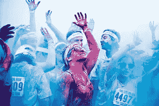
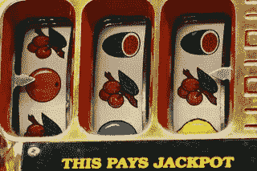
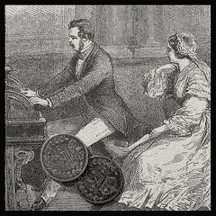
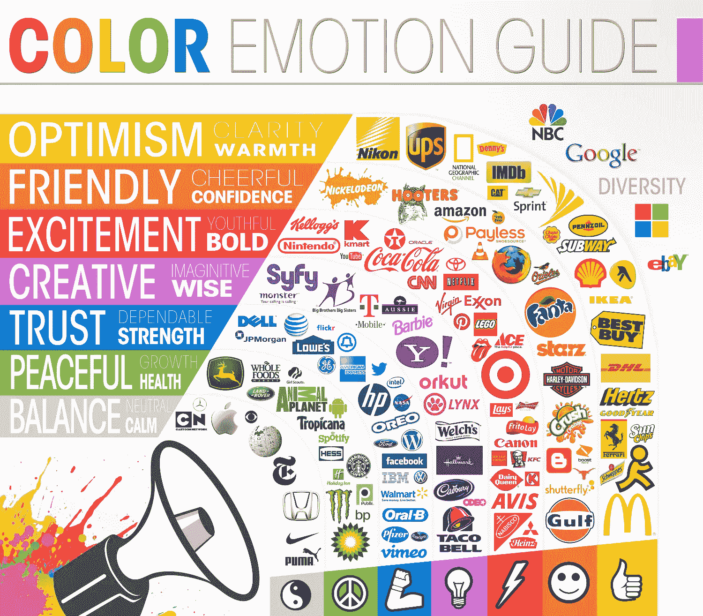
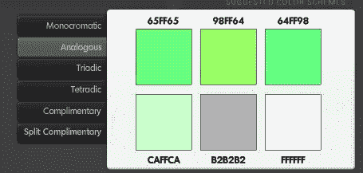
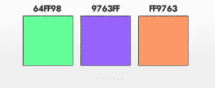

# 伟大网站颜色选择的艺术与科学

> 原文：<https://www.sitepoint.com/website-color-selection/>

豪尔赫金特罗斯

网站设计者经常为颜色的选择而苦恼。大约有 1000 万种可辨别的颜色可供选择，这个决定带来很多焦虑也就不足为奇了。

虽然一些设计师受过艺术和图形方面的正规训练，并且对颜色的决定感到舒适，但我们其余的人却被迫与之斗争。我们寻求规则和指导，却遇到了意见和陈词滥调。

有些决定看似显而易见。

例如，你可能不会在万圣节主题的网站上使用蓝色。另一方面，你会为致力于 JavaScript 编程的网站选择什么颜色呢？

在这篇文章中，我们将把颜色选择分为三个部分。

我们将从一些确实已经根植于我们心灵的颜色开始(数量不多)，然后继续讨论颜色的文化和历史影响。

最后，我们将看到一旦我们选择了基线颜色，创建相似和互补色是多么容易。

## 硬连线颜色

garryknight

让我们从回顾一些关于我们人类的事实开始:我们的身体是十亿多年工程的结果。所有这些工程的唯一目的是帮助个体生存足够长的时间来延续物种。

因此，我们的基本本能作为一种确保我们生存的手段，已经根植于我们的心灵之中。虽然我们的自我和性欲是这种硬连线在工作中的物理表现，但更微妙的品质，如我们精致的视觉和相关的识别模式的能力，被用来帮助我们收集所有重要的食物。

更具体到我们的视觉，我们的眼睛对细微的运动和相当大范围的颜色非常敏感，因为这些属性对于捕捉猎物和寻找可食用的植物非常有用。

我们视网膜中的视觉感受杆和视锥偏向于看到更多的绿色和更少的红色，大概是为了辨别不同类型的植物，也许是为了确定其成熟度。

此外，我们的大脑能够快速理解各种模式，因此我们可以立即区分威胁和机会，并采取相应的行动。

因此，让我们暂时走出丛林，看看所有这些知识是如何在我们的网页上呈现的。

食物也许是人类所有需求中最重要的。我们可以在没有住所和衣服的情况下生活一段时间，但饥饿的痛苦通常会在我们最后一顿饭后的几个小时内袭击我们。

因此，与食物相关的颜色成为最迫切的本能。这个地区最重要的颜色是红色、绿色和黄色，其中红色代表鲜肉，绿色和黄色代表可食用的植物。

当然，这些颜色也有变化，但在大多数情况下，寻找食物的人类会被这些基本颜色的色调所吸引。

餐馆的标志利用这些颜色来推广他们的品牌也就不足为奇了。

值得一提的是，一些食品的标志，如奥利奥，是蓝色的。这似乎与我们对食物的吸引力不一致。

毕竟，蓝色食物很少，甚至有证据表明蓝色是一种饥饿抑制剂。(也许蓝色与变质的食物联系在一起。)

但一致的品牌效应是强大的，就奥利奥而言，它可以经受住对蓝色食品的天然厌恶。

所以人类天生就把颜色和食物联系在一起，就我们的生存本能而言，颜色没有其他重要作用。对于努力为非食品相关网站选择颜色的开发者来说，这是不幸的。

但是我们并不是完全没有希望，因为颜色仍然在我们的现代生活中发挥着作用，这要归功于社会影响下载到我们大脑中的倾向。

## 文化倾向

事实证明，关于颜色和相关情绪的某些“规则”是基于个人偏好的，这些偏好通常(原谅这个双关语)受到文化影响。

因此，针对大量网络受众的颜色选择就变成了对特定颜色所扮演角色的人类共识的研究。虽然这些角色看起来显而易见，但从历史的角度来看，它们是不断变化的。

1970 年系列丛书

例如，在当代受欧洲影响的文化中，婚纱是白色的，据说是为了传达纯洁。但是白色与纯洁的联系是一个相对较新的发展，因为传统的纯洁的颜色是蓝色。

从蓝色到白色的变化始于 1840 年维多利亚女王的婚礼，她穿着白色的婚纱。在那之前，婚纱没有特别的颜色，但因为英国女王有如此强大的社会影响力，婚纱很快过渡到白色。

随着白色婚纱在流行文化中流行，白色与纯洁的联系也随之而来。

上面的例子表明，我们对颜色的偏好是不断变化的，关注颜色正确选择的网站设计师应该明智地理解与网站所服务的业务类型相关的当代颜色。

为此，下图由 [Logo Company](http://thelogocompany.net/) 提供，传达了当今一些更流行的颜色联想，以及围绕它们构建的公司徽标:

图表由 Logo 公司提供，

更具体地说，当代西方文化使当前的联想:

*   红色——爱、兴奋、欲望、饥饿、大胆、年轻、紧急、危险、浪漫、温暖、快速、负面问题
*   黑色:稳定、可信、力量、权力、精密、专业、准确、老练、悲伤、恐惧、顺从
*   **棕色**–滋养、历史、安全、保守、可靠、粗犷
*   紫罗兰色/紫色——权威、皇室、灵性、神秘、魔法、宗教、性感、爱、智慧、创造力、想象力、春天
*   **黄色**——活力、清晰、温暖、创新、动力、活力、能力、快乐、乐观
*   绿色——有机、自然、年轻、教育、冒险、生态、冷静、健康、和平、夏天、羡慕
*   **橙色**——创造力、活力、精力、表现力、天真、热情、秋天、自省
*   **蓝色**——信誉、冷静、信任、可靠、清洁、医学、权力、司法、专业、男性、能力、质量、大公司、冬天
*   **白色**——幸福、纯洁、真诚、洁净、临床、药用、平衡、宽敞、简单、容易、新鲜、冬季

请记住，上述关联代表了时间和地理上的文化快照。

随着网站变得越来越全球化，颜色上的文化差异可能会趋同；然而，它们会随着时间的推移不断变化，所以网站设计师应该了解最新的社会影响，并准备好相应地重构他们的网站颜色。

还要记住，绝对的颜色会吸引绝对的心态，这导致了性别上的一些差异。

研究表明，男人对绝对颜色很敏感，对色调的细微变化视而不见，或者根本不在乎。([在 KISSmetrics 博客](http://blog.kissmetrics.com/gender-and-color/ "Kissmetrics post on gender associations with colors")上可以找到关于这个话题的有趣信息图。)

例如，男性很可能将“洋红色”和“鲑鱼色”称为“粉红色”。相反，女性更喜欢柔和的音调；即色调有细微变化的颜色。

因此，有人可能会说，虽然绝对颜色具有文化和时间意义，但为你的网站选择绝对颜色是不明智的；相反，使用绝对颜色作为选择相关但不精确的颜色的基础。

## 颜色关系

为了避免我们的网站使用绝对的颜色，我们需要根据颜色之间的相对联系来选择调色板。这被证明是一个相当简单的练习，因为颜色之间确实表现出特定的关系。

例如，我们可能决定在网站上使用绿色来强调教育产品。为了避免绝对化，同时又能挑选出与绿色互补的调色板，我们可以选择使用相邻或相似的颜色。

几十种在线颜色工具简化了相邻颜色的计算，例如唐纳德·约翰逊在 Web 网站上的[颜色。](http://www.colorsontheweb.com/colorwizard.asp "Colors on the Web website")

下面的颜色是通过首先选择绝对的绿色(#00FF00)，然后点击类似的颜色#65FF65 来选择的。(在这种情况下，类似的颜色实际上是不同的阴影；也就是说，它没有改变色调，只是使基线颜色变浅了一点。)

结果是两个“类似的”世代远离绿色，产生了两个有趣的色调变化#64FF98 和#98FF64。见下图。

在我们的绿色例子中，我们可以继续实验下一代类似的颜色，为我们的网站获得正确的绿色色调和阴影。

请注意，你可以——也应该——在你的色彩关系中使用补色。这些补充是用来抵消你想抓住观众的注意力的地方。

例如，众所周知的“网站转换”包括哄骗用户采取一些想要的行动，如下载白皮书或点击“立即购买”按钮。

问题是，人类的大脑以快速适应基线颜色的能力而闻名(这种现象被称为“颜色恒常性”)，需要一些不寻常的东西才能引起它的注意。因此，您应该实现一个使用互补色的转换按钮或链接。

有几种方法可以得到这些互补色；也许最广泛使用的是所谓的“三元”关系。

通过在色轮上创建一个等边三角形来找到三元关系，其中将三角形的一个顶点设置为基线色，另外两个顶点将指向互补色。

例如，如果我们从上面的图表中选择#64FF98 颜色作为我们站点的基线颜色，那么可以根据网站上的颜色#9763FF 和#FF9763 来计算三原色。(就我个人而言，我不喜欢这些三原色，所以我可能会选择稍微不同的基线颜色。)

你也可以选择一个单一的互补色，它位于色轮的另一侧，以及其他互补色的变体。这些在线颜色计算器的伟大之处在于有如此多的变化，其中许多会让你惊喜。

底线是，一旦你选择了一个基线颜色，就很容易找到好的相似和互补的变化。

### 摘要

你的网站颜色选择过程可能看起来很随意。事实上，除了食物来源之外，人类并没有天生将颜色与任何事物联系起来。个人的颜色偏好主要是由于文化的影响，而这些影响是随着时间而变化的。

因此，在为你的网站选择基线颜色时，有必要了解你的目标文化。做出选择后，您可以使用一些免费的在线工具来帮助找到一些有趣的变化。

您也可以使用这些工具来寻找补色，这将有助于吸引人们对网站上重要区域的注意。

## 分享这篇文章