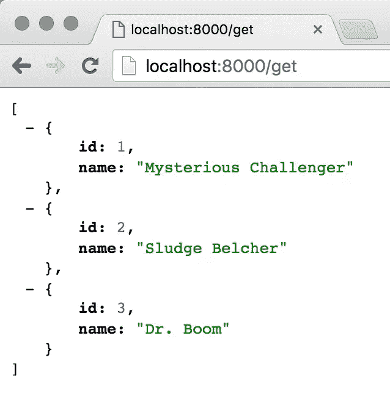
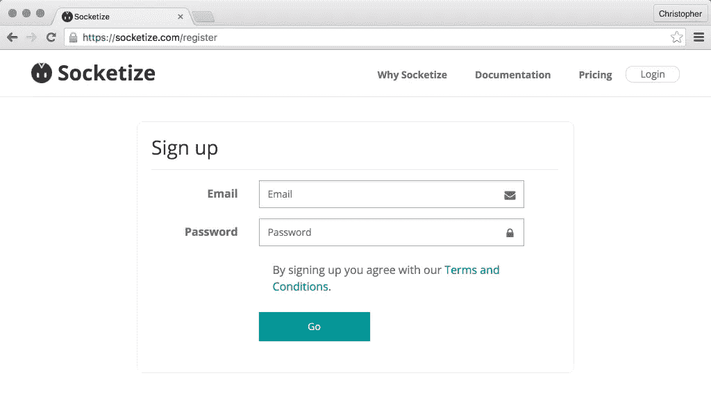

# 同步站点中的 Websockets

> 原文：<https://www.sitepoint.com/websockets-in-your-synchronous-site/>

*这篇文章由 [Wern Ancheta](https://www.sitepoint.com/author/wancheta/) 在进行了[同行评审。感谢 SitePoint 的所有同行评审员使 SitePoint 的内容尽可能做到最好！](https://www.sitepoint.com/introduction-to-sitepoints-peer-review/)*

我总是抱怨写异步 PHP 代码，这是有原因的。我认为获得新的视角是健康的——接触新的编程范例。

异步架构在其他编程语言中很常见，但在 PHP 中才刚刚站稳脚跟。问题是，这种新架构是有成本的。

我不谈论那足够的花费。

当我推荐像 [Icicle](https://github.com/icicleio/icicle) 、 [ReactPHP](http://reactphp.org/) 和 [AMPHP](https://github.com/amphp) 这样的框架时，最明显的出发点是创造新的东西。如果你有一个现有的站点(可能通过 Apache 或 Nginx 运行)，向你的应用程序添加守护进程化的 PHP 服务可能不像重新开始那么简单。


将新的异步特性集成到现有的应用程序中需要做大量的工作。通常有很好的理由和很大的好处，但重写总是很难。也许您可以在不使用事件循环的情况下获得并行执行的一些好处。也许你可以在没有新架构的情况下获得 web sockets 的一些好处。

我将向您展示一个名为 [Socketize](https://socketize.com) 的套接字即服务服务。*试着大声说几遍…*

注意:Web sockets 涉及到大量的 JavaScript。幸运的是，我们不需要设置任何复杂的构建链。你可以在这里找到本教程[的示例代码。](https://github.com/assertchris-tutorials/tutorial-sockets-in-your-synchronous-site/tree/master)

## 设置！

让我们建立一个简单的 CRUD 例子。[下载 SQL 脚本](https://gist.github.com/assertchris/83a1cb771d62fcb6d2fe)，导入到本地数据库。然后让我们创建一个 JSON 端点:

```
$action = "/get";
$actions = ["/get"];

if (isset($_SERVER["PATH_INFO"])) {
    if (in_array($_SERVER["PATH_INFO"], $actions)) {
        $action = $_SERVER["PATH_INFO"];
    }
}

$db = new PDO(
    "mysql:host=localhost;dbname=[your_database_name];charset=utf8",
    "[your_database_username]",
    "[your_database_password]"
);

function respond($data) {
    header("Content-type: application/json");
    print json_encode($data) and exit;
} 
```

这段代码将决定请求是否针对一个有效的端点(目前只支持`/get`)。我们还建立了一个到数据库的连接，并定义了一个允许我们以最小的努力响应浏览器的方法。然后我们需要为`/get`定义端点:

```
if ($action == "/get") {
    $statement = $db->prepare("SELECT * FROM cards");
    $statement->execute();

    $rows = $statement->fetchAll(PDO::FETCH_ASSOC);

    $rows = array_map(function($row) {
        return [
            "id" => (int) $row["id"],
            "name" => (string) $row["name"],
        ];
    }, $rows);

    respond($rows);
} 
```

`/get`是默认操作。如果没有其他要求，这就是我们想要这个 PHP 脚本做的事情。随着我们增加功能，这实际上会变得更加有用。我们还定义了一个支持动作的列表。您可以将此视为白名单，以保护脚本免受奇怪的请求。

然后，我们检查`PATH_INFO`服务器属性。我们将(马上)看到这些信息来自哪里。假设它包含 URL 路径。所以，对于[http://localhost:8000/foo/bar](http://localhost:8000/foo/bar)，这个变量将包含`/foo/bar`。如果它被设置，并且在允许的动作的数组中，我们覆盖默认动作。

然后我们定义一个函数来响应浏览器。它将设置适当的 JSON 内容类型头，并打印一个 JSON 编码的响应，我们可以在浏览器中使用它。

然后我们连接到数据库。您的数据库细节可能会有所不同。请密切注意您的数据库名称、您的数据库用户名和数据库密码。其他的应该没问题。

对于`/get`动作，我们从`cards`表中获取所有行。然后，对于每张卡，我们将列转换为适当的数据类型(使用`array_map`函数)。最后，我们将这些传递给`respond`函数。

为了运行它，并获得适当的`PATH_INFO`数据，我们可以使用内置的 PHP 开发服务器:

```
$ php -S localhost:8000 server.php 
```

*内置的 PHP 开发服务器对生产应用并不好。使用合适的网络服务器。在这里使用它很方便，因为我们不需要在本地机器上设置一个生产服务器来测试这段代码。*

此时，您应该能够在浏览器中看到以下内容:



如果您没有看到这一点，您可能应该在继续之前尝试解决这个问题。欢迎您使用替代的数据库结构或数据，但是您需要小心使用其余的示例。

现在，让我们为这些数据创建一个客户端:

```
<!doctype html>
<html lang="en">
    <head>
        <title>Graterock</title>
    </head>
    <body>
        <ol class="cards"></ol>
        <script type="application/javascript"> fetch("http://localhost:8000/get")
                .then(function(response) {
                    return response.json();
                })
                .then(function(json) {
                    var cards = document.querySelector(".cards");

                    for (var i = 0; i < json.length; i++) {
                        var card = document.createElement("li");
                        card.innerHTML = json[i].name;
                        cards.appendChild(card);
                    }
                }); </script>
    </body>
</html> 
```

我们创建一个空的`.cards`列表，我们将动态填充它。为此，我们使用 HTML5 `fetch`函数。它返回承诺，这是回调的组合模式。

*这是所有这些中最具技术性的部分。我保证它会变得更容易，但如果你想了解更多关于`fetch`的信息，请查看 https://developer.mozilla.org/en/docs/Web/API/Fetch_API 的[。它可以在 Chrome 和 Firefox 的最新版本中工作，所以使用它们来确保这些例子可以工作！](https://developer.mozilla.org/en/docs/Web/API/Fetch_API)*

我们可以在 PHP 服务器脚本中使用这个客户端:

```
$action = "/index";
$actions = ["/index", "/get"];

// ...

if ($action == "/index") {
    header("Content-type: text/html");
    print file_get_contents("index.html") and exit;
} 
```

现在我们可以加载客户端页面，并获得一个卡片列表，所有这些都来自同一个脚本。我们甚至不需要改变我们运行 PHP 开发服务器的方式——这应该就可以了！

## web 套接字的一个案例

这些都是非常标准的 PHP/JavaScript 东西。嗯，我们正在使用一个新的 JavaScript 特性，但是它和`$.ajax`几乎一样。

如果我们想增加实时功能，我们可以尝试一些技巧。假设我们想要添加实时卡移除；我们可以使用 Ajax 请求来移除卡片，并使用 Ajax 轮询来自动刷新其他客户端。

这是可行的，但是也会给我们的 HTTP 服务器增加大量的流量(即使是重复的响应)。

或者，我们可以打开浏览器和服务器之间的持久连接。然后，我们可以从服务器推送新数据，避免连续轮询。这些持久连接可以是 web 套接字，但是有一个问题…

PHP 的创建和广泛使用是为了快速响应请求。大多数脚本和应用程序都不是为长期运行的进程而设计的。正因为如此，传统的 PHP 脚本和应用程序在一次打开多个连接时效率很低。

这种限制通常会将开发人员推向其他平台(如 NodeJS)，或者新的架构(如 Icicle、ReactPHP 和 AMPHP 提供的那些)。这是 Socketize 要解决的一个问题。

## 拯救世界！

为了简洁起见，我们将使用 Socketize 的未认证版本。这意味着我们将能够在不验证每个用户的情况下读写数据。Socketize 支持身份验证，这是推荐的(甚至是首选的)方法。

进入[https://socketize.com/register](https://socketize.com/register)创建一个 Socketize 账户:



然后，转到[https://socketize.com/dashboard/member/payload/generate](https://socketize.com/dashboard/member/payload/generate)，为`admin`生成一个密钥。把这个记下来。前往[https://socketize.com/dashboard/account/application](https://socketize.com/dashboard/account/application)获取您的账户密钥(“公钥”)。现在我们需要在 HTML 页面中添加一些新的 JavaScript:

```
<script src="https://socketize.com/v1/socketize.min.js"></script>
<script type="application/javascript"> var params = {
        "public_key": "[your_public_key]",
        "auth_params": {
            "username": "admin",
            "payload": "[your_admin_key]"
        }
    };

    var socketize = new Socketize.client(params);

    socketize.on("login", function(user) {
        var user = socketize.getUser();
        console.log(user);
    }); </script> 
```

如果用合适的键替换`[your_public_key]`和`[your_admin_key]`，并刷新页面，您应该会看到一条控制台消息:“[Socketize]连接已建立！”。您还应该看到一个描述已登录的 Socketize 用户帐户的对象。注意用户`id`。

这是什么意思？我们的 HTML 页面现在连接到 Socketize 数据库(对于我们的帐户)。我们可以从命名的消息列表中读取和写入。让我们修改我们的服务器脚本，将卡片的初始列表写入一个命名的 Socketize 列表。所有 Socketize API 请求都采用以下形式:

```
curl "https://socketize.com/api/[method]?[parameters]"
    -u [your_public_key]:[your_private_key]
    -H "Accept: application/vnd.socketize.v1+json" 
```

我们可以创建一个`request`函数，来简化这个过程:

```
function request($method, $endpoint, $parameters = "")
{
    $public = "[your_public_key]";
    $private = "[your_private_key]";

    $auth = base64_encode("{$public}:{$private}");

    $context = stream_context_create([
        "http" => [
            "method" => $method,
            "header" => [
                "Authorization: Basic {$auth}",
                "Accept: application/vnd.socketize.v1+json",
            ]
        ]
    ]);

    $url = "https://socketize.com/api/{$endpoint}?{$parameters}";
    $response = file_get_contents($url, false, $context);

    return json_decode($response, true);
} 
```

这个方法抽象了使用我们已经设置的端点的公共代码。我们可以通过以下请求看到它的实际应用:

```
$json = json_encode([
    "id" => 1,
    "name" => "Mysterious Challenger",
]);

request(
    "PUT",
    "push_on_list",
    "key=[your_user_id]:cards&value={$json}"
);

request(
    "GET",
    "get_list_items",
    "key=[your_user_id]:cards"
); 
```

最好使用一个健壮的 HTTP 请求库，比如 [GuzzlePHP](http://guzzlephp.org) ，向第三方服务发出请求。在[https://github.com/socketize/rest-php](https://github.com/socketize/rest-php)也有一个官方的 PHP SDK，但是我更喜欢使用这些简洁的方法来对抗 JSON API。

`request`函数采用 HTTP 请求方法、Socketize API 端点和查询字符串参数。您需要用正确的值替换`[your_public_key]`、`[your_private_key]`和`[your_user_id]`。这两个示例调用应该对您有用。`cards`是我们写入这个卡对象的列表的名称。您可以将 Socketize 想象成一个 HTTP 版本的对象存储。

我们可以调整 HTML 页面来从这个列表中提取项目。此时，我们可以添加一个按钮来删除不需要的卡片:

```
var socketize = new Socketize.client(params);
var cards = document.querySelector(".cards");

cards.addEventListener("click", function(e){
    if (e.target.matches(".card .remove")) {
        e.stopPropagation();
        e.preventDefault();

        socketize.publish("removed", e.target.dataset._id);
        socketize.updateListItem("cards", null, e.target.dataset._id);
    }
});

socketize.subscribe("removed", function(_id) {
    var items = document.querySelectorAll(".card");

    for (var i = 0; i < items.length; i++) {
        if (items[i].dataset._id == _id) {
            items[i].remove();
        }
    }
});

socketize.on("login", function(user) {
    var user = socketize.getUser();

    socketize.getListItems("cards")
        .then(function(json) {
            for (var i = 0; i < json.length; i++) {
                var name = document.createElement("span");
                name.className = "name";
                name.innerHTML = json[i].name;

                var remove = document.createElement("a");
                remove.dataset._id = json[i]._id;
                remove.innerHTML = "remove";
                remove.className = "remove";
                remove.href = "#";

                var card = document.createElement("li");
                card.dataset._id = json[i]._id;
                card.className = "card";
                card.appendChild(name);
                card.appendChild(remove);

                cards.appendChild(card);
            }
        });
}); 
```

*`match`方法适用于 Chrome 和 Firefox 的最新版本。这不是唯一的方法，但比其他方法干净得多。*

在这个例子中，我们添加了一个点击事件监听器，拦截对`.remove`元素的点击。这叫事件委托，而且超级高效！这样我们就不必担心删除每个`.remove`元素上的事件监听器。

每次点击一个`.remove`元素，我们触发一个 Socketize 列表的更新。同时，我们发布一个`removal`事件。我们还监听`removal`事件，这样如果其他用户移除卡片，我们就可以更新我们的列表。

我们可以更新元素的`dataset`属性。这些是 HTML 属性的 JavaScript 表示。这样，我们可以存储每张卡的 Socketize `_id`。最后，我们调整代码来创建新元素，并将生成的元素添加到`.cards`元素中。

## 我们将何去何从？

这个小例子应该说明如何开始用 Socketize 做有用的事情。我们添加了 web socket 通信(读写命名列表，发布特定类型的事件)。令人惊叹的是，我们做到了这一点，而没有显著改变我们的服务器端代码。我们不必为事件循环重写。我们只是添加了一两个函数，我们可以将事件推送到浏览器。

想想你可以用它做些什么有趣的事情。每次保存数据库记录时，都可以将事件推送到浏览器。你可以把玩家们彼此联系起来。当会议发言人靠近有问题的与会者时，您可以提醒他们。所有这些都在传统的 PHP 代码库中。

如果你想在这方面做得更好，也许可以考虑做一个添加和重新排序卡片的界面。如果你有疑问，或者能想到这种持续交流的其他有趣用途；请在下方留言评论。

## 分享这篇文章