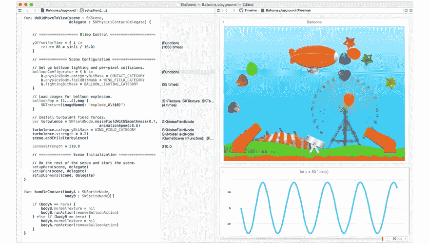

# 本周在网上:Swift，比特币计算器，等等！

> 原文：<https://www.sitepoint.com/week-web-swift-bitcoin/>

大家好，欢迎来到本周网络。

顾名思义，这是来自令人兴奋和眼花缭乱的 web 开发世界的趋势和主题的每周综述。

每周，我们都会收集一些文章和资源的链接，让设计人员和开发人员的生活更加轻松，并帮助您在这个快节奏的行业中保持领先。

所以事不宜迟，让我们直入主题吧。

## 迅速发生的

苹果[宣布 Swift](http://guardianlv.com/2014/06/apple-releases-new-programming-language-swift/) 已经有几周了，这是其[新的编程语言](https://developer.apple.com/swift/)，用于创建 iOS 和 Mac OS X 应用。该公告最初在社区中引发了很多议论，但现在他们有机会去看看人们都说些什么呢？

*   [苹果的 Swift 及其对开发者和用户的意义](http://www.anandtech.com/show/8140/apples-swift-and-what-it-means-for-developers-and-users)
*   [苹果的 Swift:开发者的第一印象](http://www.smashingboxes.com/apples-swift-a-developers-first-impression/)
*   [苹果的 Swift 毕竟没那么快](http://www.infoworld.com/t/development-tools/apples-swift-not-so-swift-after-all-244120)(讨厌的人会讨厌…)
*   [ruby ist 会喜欢 Swift 的 5 个理由](http://littlelines.com/blog/2014/06/11/why-rubyist-will-love-swift/)
*   [为什么 Swift 永远不会取代 RubyMotion](http://blog.motioninmotion.tv/why-swift-will-never-replace-rubymotion)

如果你已经被说服了，这里有一个方便的[十大技巧来加速快速学习](https://www.udemy.com/swift-learn-apples-new-programming-language-by-examples/#tentips)

## 学问

一些意大利学者声称:“学习永远不会耗尽大脑”。我猜他从来不需要跟上不断涌现的新技术，美国网络专业人士每天都被这些新技术轰炸。

考虑到这一点，这里有一些教程，只是为了让你的头脑永远不会疲惫:

*   [理解变量作用域&闭包而不失去理智](https://learnable.com/hub/play/63)
*   【Rails 程序员最常犯的 10 个错误
*   [jQuery 对象的奥秘:基本介绍](http://www.smashingmagazine.com/2014/05/29/mystery-jquery-object-syntax-basic-introduction/)
*   [120 秒内 PHP 命名空间](http://knpuniversity.com/screencast/php-namespaces-in-120-seconds/namespaces)
*   HTML5 表单:标记——关于 HTML5 web 表单的三部分系列
*   初学者 GIT:或者如果我能让时间倒流…——因为我们都使用版本控制，对吗？
*   Ember JS 框架简介——虽然有些冗长，但却是一个很好的资源

## 框架角

随着美国政府[出售 30，000 个比特币](http://www.coindesk.com/18-million-worth-of-silk-road-bitcoin-to-be-sold-by-us-government/)的消息传出，我们认为现在可能是研究如何使用 AngularJS 构建比特币投资计算器的好时机。

我们还考虑在生产中使用 node.js(显然很多公司都这样做)和在 Symfony 2 中使用表单验证(一定不要错过系列文章中的第一个[)。](http://code.tutsplus.com/tutorials/creating-reusable-forms-in-symfony-2--cms-21244)

*   [生产中的 node . js](http://blog.carbonfive.com/2014/06/02/node-js-in-production/)
*   [AngularJS by Example——构建比特币投资计算器](https://github.com/mjhea0/thinkful-angular)
*   [用 Angular 的$resource 在几分钟内创建一个 CRUD 应用](https://www.sitepoint.com/creating-crud-app-minutes-angulars-resource/)
*   [与 node . js ' Readline&socket . io](http://code.tutsplus.com/tutorials/real-time-chat-with-nodejs-readline-socketio--cms-20953)实时聊天
*   [插座。IO 1.0 发布带来二进制支持，新引擎。IO 模块](http://www.infoq.com/news/2014/06/socketio-1)
*   [Symfony 2 中的表单验证](http://code.tutsplus.com/tutorials/form-validation-in-symfony-2--cms-21397)

## 本周流行语–SVG

可缩放矢量图形现在风靡一时。使用它们的好处有很多:它们可以用任何文本编辑器创建，可以搜索，可以缩放(意味着图像可以缩放而不会退化)，[还有很多。](http://code.tutsplus.com/articles/why-arent-you-using-svg--net-25414)

如果您没有在项目中使用 SVG，现在可能是开始的好时机。

*   [SVG 渐变入门](https://www.sitepoint.com/getting-started-svg-gradients/)
*   [更多技巧&在 Adobe CC 中使用 SVG 的技巧](http://demosthenes.info/blog/886/More-Tricks--Tips-For-Working-With-SVG-in-Adobe-CC)
*   [喜欢用 JavaScript 生成 SVG？把它移到服务器上！](http://www.smashingmagazine.com/2014/05/26/love-generating-svg-javascript-move-to-server/)
*   [构建响应式 SVG 地图](http://responsivenews.co.uk/post/87988072178/building-a-responsive-svg-map)
*   [用 CSS 和 SVG 制作昼夜循环动画](http://demosthenes.info/blog/883/Animated-Day-Night-Cycle-With-CSS-and-SVG)
*   [一个随机的 SGV 图标提示](https://twitter.com/chriscoyier/status/474898286441017344)(来自[@ Chris coier](https://twitter.com/chriscoyier))

## 工具和资源

这里有一些工具和资源可以让您的生活变得更轻松(或者在使用 jSpy 的情况下让您感到有点紧张)。

我现在需要的是一个工具来黑掉我邻居的机器人割草机，并把它引到我的花园里。这意味着他可以避开园艺工作，转而在阳光下享受一品脱赚得的[啤酒。](http://pintsinthesun.co.uk/)

*   [jSpy](http://projects.milankragujevic.com/jspy/)–测试和检测您访问过的网站的 JavaScript 脚本
*   [laver na](https://laverna.cc/)–记笔记的网络应用和任务管理器
*   [types sample](http://www.typesample.com/)——一个识别和取样网页字体的工具
*   random color-JavaScript 的颜色生成器
*   [掌握 JavaScript 的资源](http://code.tutsplus.com/articles/resources-for-staying-on-top-of-javascript--cms-21369)

## 我向你道了晚安

我希望你喜欢这第一期，希望你下周同一时间再次收听，届时我的合著者将掌权。

同时，我们很想听听你的想法。你有使用 Swift 的经验吗？你掌握了 JavaScript 闭包吗？你目前选择的框架是什么？你如何跟上网络技术的发展？

最后，2014 年世界杯刚刚开始，想想那些不喜欢运动的人吧

## 分享这篇文章