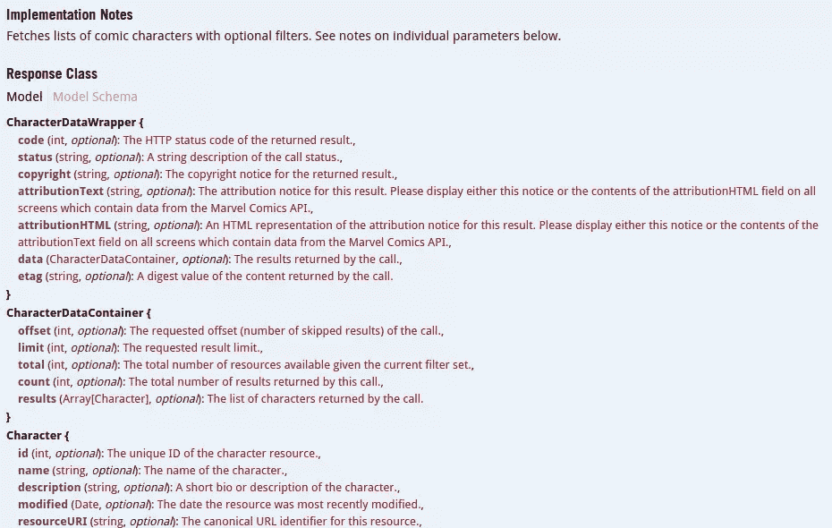
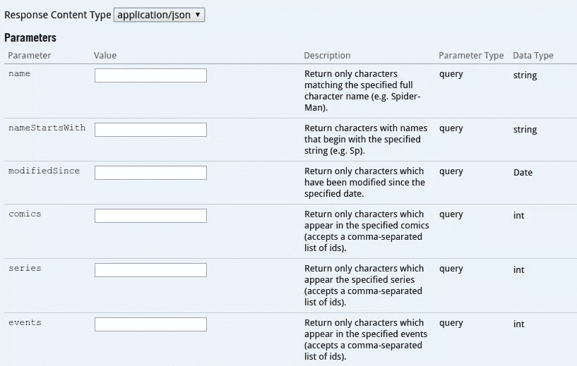
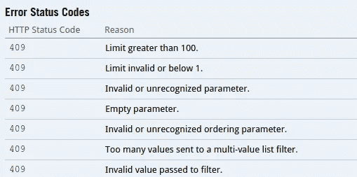
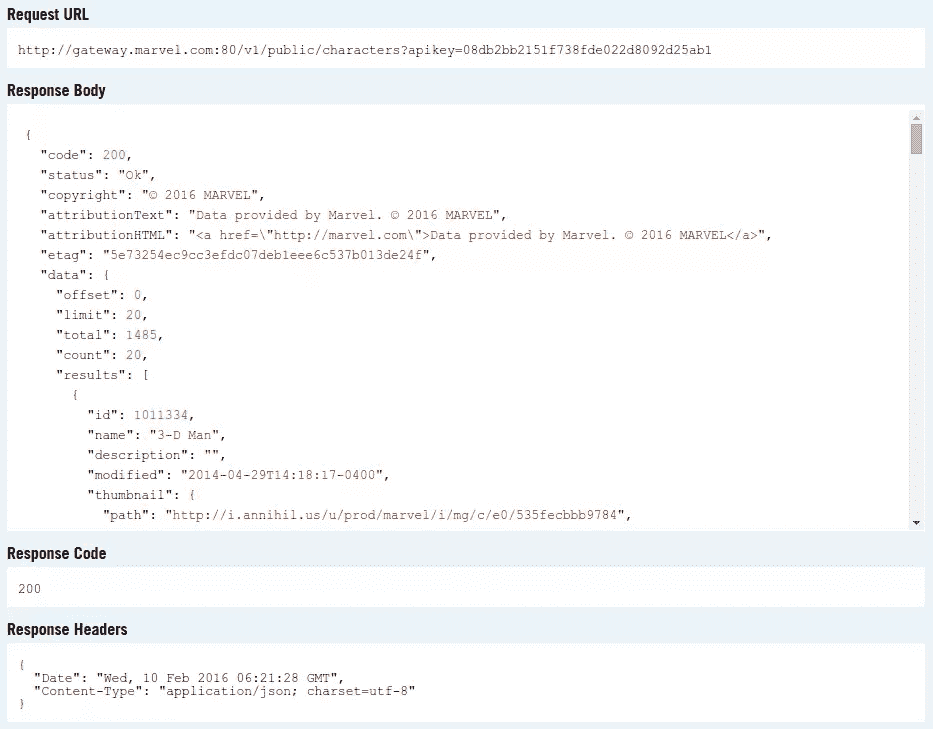
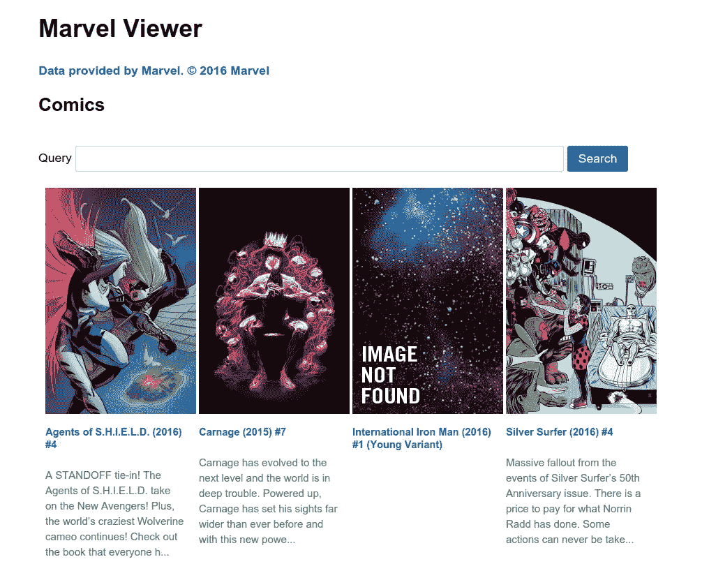
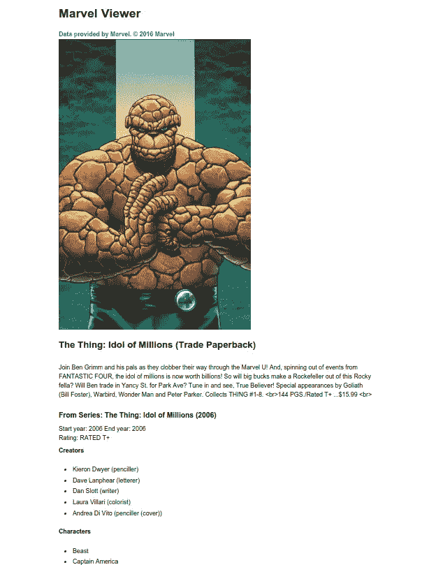
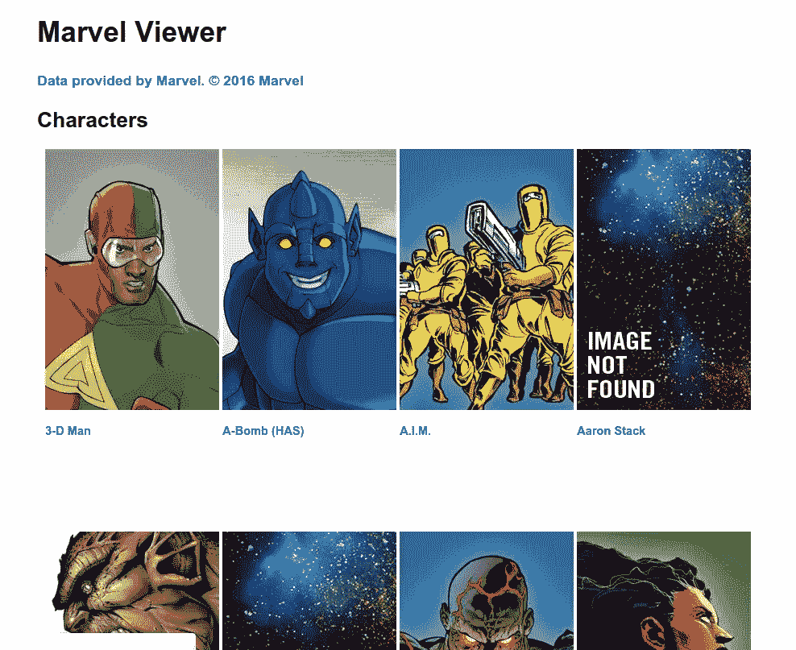

# 我们正在建立一个漫威目录阅读器！复仇者，集合！

> 原文：<https://www.sitepoint.com/were-building-a-marvel-catalog-reader-avengers-assemble/>

在本教程中，我们将看看[漫威 API](http://developer.marvel.com/) ，这是漫威为开发者提供的一个工具，用于访问漫威漫画 70 多年的数据。


首先，我们将介绍获取向 API 发出请求所需的密钥的步骤。然后，我们将看看可以用来测试 API 的工具。最后，我们将建立一个使用 API 的网站。

## 报名

我们需要做的第一件事是去[漫威开发者网站](http://developer.marvel.com/)，点击*获取密钥*链接。然后我们将获得公钥和私钥，我们可以用它们来执行对 API 的请求。如果您计划在生产中使用该项目，您还可以将您网站的域名添加到授权推荐人列表中。这提供了一个安全层，以防您意外地将您的公钥和私钥推送到 Github。

## 关于 API 使用的重要注意事项

有关限额和规则，请参见其文档的[属性、链接和利率限额第](http://developer.marvel.com/documentation/attribution)页。如果你打算在生产中使用 API，也一定要阅读[漫威 API 使用条款](http://developer.marvel.com/terms)。我总结如下:

*   **小心 API 比率限制**。在撰写本教程时，速率限制是每天 3000 次通话。这适用于所有的端点。
*   **在显示 API 数据和图像时，始终将漫威视为来源**。漫威推荐使用本文:*漫威提供的数据。2016 年漫威。*

## 使用 API

API 附带了一个[交互式文档](http://developer.marvel.com/docs)，它允许您轻松测试所有可用的 API 端点。

我们可以期待数据上的信息:



…用于指定为请求提交的不同参数的文本字段:



…错误状态代码:



…请求 URL、响应正文、响应代码和响应标题:



请注意，如果您在 API 测试工具之外访问请求 URL，它实际上不会返回任何内容。这是因为它缺少请求所需的参数。最起码，您必须提供公钥、当前的 unix 时间戳、时间戳的 md5 散列以及私钥和公钥的组合。

```
<?php
$ts = time();
$public_key = 'your public key';
$private_key = 'your private key';
$hash = md5($ts . $private_key . $public_key); 
```

一旦有了这些，就可以执行对 API 的请求了:

```
<?php
$query_params = [
    'apikey' => $public_key,
    'ts' => $ts,
    'hash' => $hash
];

//convert array into query parameters
$query = http_build_query($query_params);

//make the request
$response = file_get_contents('http://gateway.marvel.com/v1/public/comics?' . $query);

//convert the json string to an array
$response_data = json_decode($response, true); 
```

当我们到达开始请求我们将要构建的应用程序的部分时，我们将更详细地了解这一点。

## 建设网站

希望你已经花时间玩了 API 工具，因为现在我们要开始构建网站了。在本教程中，我们将使用 Laravel。

```
composer create-project --prefer-dist laravel/laravel marvel-viewer 
```

上面的命令将把 Laravel 安装在`marvel-viewer`目录中。

一旦完成，安装 [Guzzle](http://docs.guzzlephp.org/en/latest/overview.html) 。

```
php composer require guzzlehttp/guzzle 
```

在项目目录的根目录下创建一个`.env`文件，并放入以下内容:

```
APP_ENV=local
APP_DEBUG=true
APP_KEY=fxxq7HcbypI36Cil5cmOxO7vWFZu0QOD 

CACHE_DRIVER=file 
```

接下来，在`config`目录下创建一个`marvel.php`文件。然后，返回一个包含您之前从漫威开发者网站获得的私有和公共密钥的数组:

```
<?php
return [
    'private_key' => 'xxx',
    'public_key' => 'yyy'
]; 
```

这允许我们调用`config`函数来获得这些值:

```
echo config('marvel.private_key');
echo config('marvel.public_key'); 
```

### 缓存 API 结果

从[漫威开发者网站本身](http://developer.marvel.com/documentation/attribution)来看，保持在速率限制内的一个技巧是缓存结果。这使得应用程序的性能更高，特别是对于返回大量数据的 API 调用。

首先，让我们使用 artisan 创建一个新的控制台命令:

```
php artisan make:console CacheApi 
```

这将创建`app/Console/Commands/CacheApi.php`文件。打开它，用以下内容更改签名和描述的值:

```
protected $signature = 'cache:api';
protected $description = 'Saves data from marvel API into the cache'; 
```

要注册使用该命令，打开`app/Console/Kernel.php`并将其作为一个项目添加到`$commands`数组下。

```
protected $commands = [
    Commands\Inspire::class,
    Commands\CacheApi::class // add this
]; 
```

这将让我们在命令行上执行它，如下所示:

```
php artisan cache:api 
```

要定义该命令将做什么，返回到`CacheApi.php`文件，并在`handle`函数中添加以下内容:

```
$ts = time();
$hash = md5($ts . config('marvel.private_key') . config('marvel.public_key'));

$client = new Client([
    'base_uri' => 'http://gateway.marvel.com/v1/public/',
    'query' => [
        'apikey' => config('marvel.public_key'),
        'ts' => $ts,
        'hash' => $hash
    ]
]);

$endpoints = [
    'characters',
    'comics'
];

$results_per_page = 20;
$total_page_count = 10;

$minutes_to_cache = 1440; // 1 day

foreach($endpoints as $ep){

    $data = [];

    for($x = 0; $x <= $total_page_count; $x++){

        $query = $client->getConfig('query');
        $query['offset'] = $results_per_page * $x;

        $response = $client->get('http://gateway.marvel.com/v1/public/' . $ep, ['query' => $query]);
        $response = json_decode($response->getBody(), true);
        $current_data = $response['data']['results'];
        $data = array_merge($data, $current_data);
    }

    Cache::put($ep, $data, $minutes_to_cache);

} 
```

我们来分解一下。首先，我们将漫威 API 所需的所有数据赋给一个变量。第一个是当前的 unix 时间戳(`$ts`)，第二个是`$ts`、漫威私钥和公钥的级联值的 md5 散列。

```
$ts = time();
$hash = md5($ts . config('marvel.private_key') . config('marvel.public_key')); 
```

然后，创建一个新的 Guzzle 客户端，其中我们提供 API 使用的基本 url 和所有请求所需的数据。

```
$client = new Client([
    'base_uri' => 'http://gateway.marvel.com/v1/public/',
    'query' => [
        'apikey' => config('marvel.public_key'),
        'ts' => $ts,
        'hash' => $hash
    ]
]); 
```

定义将缓存其数据的端点。在这种情况下，我们只需要缓存角色和漫画数据。

```
$endpoints = [
    'characters',
    'comics'
]; 
```

定义 API 为每个请求返回的总结果、每个端点请求的总页数以及缓存结果的总分钟数。在这种情况下，我们只希望它存储一天。

```
$results_per_page = 20;
$total_page_count = 10; // there's a bazillion characters and comics, we don't want to take all day

$minutes_to_cache = 1440; // 1 day 
```

遍历所有端点。对于每个端点，我们都有一个基于`$total_page_count`的值执行的`for`循环。对于每次迭代，我们获得当前的查询配置并分配一个`offset`。在第一次迭代中，这将是 0 ( `20 * 0`)，在第二次迭代中，这将是 20 ( `20 * 1`)，依此类推。然后我们向端点发出请求，将响应对象转换为数组，然后将结果与`$data`数组合并。最后，我们将数据放入缓存。

```
foreach($endpoints as $ep){

    $data = [];

    for($x = 0; $x <= $total_page_count; $x++){

        $query = $client->getConfig('query');
        $query['offset'] = $results_per_page * $x;

        $response = $client->get('http://gateway.marvel.com/v1/public/' . $ep, ['query' => $query]);
        $response = json_decode($response->getBody(), true);
        $current_data = $response['data']['results'];
        $data = array_merge($data, $current_data);
    }

    Cache::put($ep, $data, $minutes_to_cache);

} 
```

完成后，我们可以执行命令开始缓存:

```
php artisan cache:api 
```

### 路线

该应用程序将只有三个页面:一个页面用于查看随机漫画，一个页面用于查看漫画的细节，一个页面用于查看不同的角色。

```
<?php
Route::get('/comics', 'HomeController@comics');
Route::get('/comics/{id}', 'HomeController@comic');
Route::get('/characters', 'HomeController@characters'); 
```

### 控制器

控制器处理来自路由的请求。执行以下命令以生成控制器文件:

```
php artisan make:controller HomeController 
```

这将创建一个`app/Http/Controllers/HomeController.php`文件。添加以下内容:

```
<?php

namespace App\Http\Controllers;

use Illuminate\Http\Request;
use App\Http\Controllers\Controller;
use GuzzleHttp\Client;
use Cache;
use Illuminate\Pagination\LengthAwarePaginator;
use Illuminate\Support\Collection;

class HomeController extends Controller
{
    private $client;

    public function __construct(){

        $ts = time();
        $hash = md5($ts . config('marvel.private_key') . config('marvel.public_key'));

        $this->client = new Client([
            'base_uri' => 'http://gateway.marvel.com/v1/public/',
            'query' => [
                'apikey' => config('marvel.public_key'),
                'ts' => $ts,
                'hash' => $hash
            ]
        ]);

    }

    public function comics(Request $request){

        $search_term = '';
        if($request->has('query')){

            $search_term = $request->input('query');

            $query = $this->client->getConfig('query');
            $query['titleStartsWith'] = $search_term;

            $response = $this->client->get('comics', ['query' => $query]);
            $response = json_decode($response->getBody(), true);

            $comics = $response['data']['results'];

        }else{
            $comics = Cache::get('comics');
            shuffle($comics);
            $comics = array_slice($comics, 0, 20);
        }

        return view('comics', ['comics' => $comics, 'query' => $search_term]);

    }

    public function comic($id){

        $page_data = [];

        $response = $this->client->get('comics/' . $id);
        $response = json_decode($response->getBody(), true);

        $comic = $response['data']['results'][0];
        $page_data['comic'] = $comic;

        if(!empty($comic['series'])){

            $series_response = $this->client->get($comic['series']['resourceURI']);
            $series_response = json_decode($series_response->getBody(), true);

            $page_data['series'] = $series_response['data']['results'][0];
        }

        return view('comic', $page_data);
    }

    public function characters(Request $request){

        $characters = Cache::get('characters');  

        $current_page = LengthAwarePaginator::resolveCurrentPage();

        if(is_null($current_page)){
            $current_page = 1;
        }

        $characters_collection = new Collection($characters);

        $items_per_page = 8;

        $current_page_results = $characters_collection->slice(($current_page - 1) * $items_per_page, $items_per_page)->all();
        $paginated_results = new LengthAwarePaginator($current_page_results, count($characters_collection), $items_per_page);

        return view('characters', ['paginated_results' => $paginated_results, 'characters' => $characters]);

    }

} 
```

分解一下，首先我们定义并初始化 Guzzle 客户端。这和我们之前在`CacheApi.php`做的事情差不多。

```
private $client;

public function __construct(){

    $ts = time();
    $hash = md5($ts . config('marvel.private_key') . config('marvel.public_key'));

    $this->client = new Client([
        'base_uri' => 'http://gateway.marvel.com/v1/public/',
        'query' => [
            'apikey' => config('marvel.public_key'),
            'ts' => $ts,
            'hash' => $hash
        ]
    ]);

} 
```

`comics`功能负责服务漫画页面。如果没有提供查询，它会列出从缓存中获取的随机项目。如果提供了查询，它将使用该查询向 API 发出请求。这里，我们提供了`titleStartsWith`参数，然后提供了用户输入。如果幸运的话，您还可以使用`title`参数，它只返回用户输入的直接匹配。

```
public function comics(Request $request){

    $search_term = '';
    if($request->has('query')){

        $search_term = $request->input('query');

        $query = $this->client->getConfig('query');
        $query['titleStartsWith'] = $search_term; //supply the query

        //make a request to the api
        $response = $this->client->get('comics', ['query' => $query]);
        $response = json_decode($response->getBody(), true); //convert response object to array

        $comics = $response['data']['results']; //extract the item/s

    }else{
        $comics = Cache::get('comics'); //get items from the cache
        shuffle($comics); //jumble the array
        $comics = array_slice($comics, 0, 20); //extract the first 20 items from the jumbled array
    }

    //return the page with the data
    return view('comics', ['comics' => $comics, 'query' => $search_term]);

} 
```

`comic`函数负责提供详细的漫画页面。这仍然使用了`comics`端点，但是这次它将漫画 ID 附加到了 URL 的末尾，所以它将只从 API 请求一个条目。一旦获取了单个漫画数据，它就使用`series`项来获取该特定系列的更多细节。把一个系列想象成故事的集合。我们用它来获取创作者、角色和故事等数据。您将在后面的视图部分看到如何使用这些数据。

```
public function comic($id){

    $page_data = [];

    //get a specific comic
    $response = $this->client->get('comics/' . $id);
    $response = json_decode($response->getBody(), true);

    $comic = $response['data']['results'][0];
    $page_data['comic'] = $comic;

    if(!empty($comic['series'])){
        //get series data
        $series_response = $this->client->get($comic['series']['resourceURI']);
        $series_response = json_decode($series_response->getBody(), true);

        $page_data['series'] = $series_response['data']['results'][0];
    }

    return view('comic', $page_data);
} 
```

`characters`函数负责为字符页面提供服务。与`comics`和`comic`函数不同，它不直接从 API 请求数据。它只使用存储在缓存中的字符数据。此外，它不选择随机项目，而是对所有可用的项目进行分页。

```
public function characters(Request $request){

    $characters = Cache::get('characters');  

    $current_page = LengthAwarePaginator::resolveCurrentPage();

    if(is_null($current_page)){
        $current_page = 1;
    }

    $characters_collection = new Collection($characters);

    $items_per_page = 8;

    $current_page_results = $characters_collection->slice(($current_page - 1) * $items_per_page, $items_per_page)->all();
    $paginated_results = new LengthAwarePaginator($current_page_results, count($characters_collection), $items_per_page);

    return view('characters', ['paginated_results' => $paginated_results, 'characters' => $characters]);

} 
```

让我们来分解一下——首先，我们从缓存中获取字符:

```
$characters = Cache::get('characters'); 
```

获取当前分页器页面:

```
$current_page = LengthAwarePaginator::resolveCurrentPage(); 
```

如果没有，我们假设它是第一页:

```
if(is_null($current_page)){
    $current_page = 1;
} 
```

从字符数组创建一个集合。这允许我们以更方便的方式操作数据。它基本上把你的数组变成了类似于你用 concertive 或查询生成器得到的结果。

```
$characters_collection = new Collection($characters); 
```

指定每页显示的项目数。

```
$items_per_page = 8; 
```

提取当前页面的项目。这里，我们调用`slice`方法来提取数组的一部分。

```
$current_page_results = $characters_collection
    ->slice(($current_page - 1) * $items_per_page, $items_per_page)
    ->all(); 
```

创建分页的结果。

```
$paginated_results = new LengthAwarePaginator($current_page_results, count($characters_collection), $items_per_page); 
```

### 视图

我们只有四个视图:显示随机漫画列表的漫画视图，显示单个漫画的漫画视图，显示角色列表的角色视图，以及所有其他视图继承的父视图。

#### 漫画视图

comics 视图有一个用于输入用户查询的表单，表单下面是结果。对于每一项，都会显示照片、标题和漫画的描述。

```
@extends('layouts.default')

@section('content')
<div id="content">
    <h2>Comics</h2>
    <form action="/comics">
        <p>
            <label for="query">Query</label>
            <input type="text" name="query" id="query" value="{{ $query }}">
            <button>Search</button>
        </p>
    </form>

    <div id="comics" class="results">
        @foreach($comics as $com)
        <article class="card">
          
          <footer>
            <h5>
                <a href="/comics/{{ $com['id'] }}" class="card-title">{{ $com['title'] }}</a>
            </h5>
            <p>
                {{ str_limit($com['description'], 160) }}
            </p>
          </footer>
        </article>
        @endforeach
    </div>
</div>
@stop 
```

照片的链接是通过使用缩略图路径构建的，然后我们连接我们想要的图像类型。在这里，我们使用的是*肖像 _ 不可思议的*变体。还有许多其他可用的图像变体——如果您想了解更多，请查看[图像文档](http://developer.marvel.com/documentation/images)。

```
 
```

标题链接到个人漫画页面:

```
<h5>
    <a href="/comics/{{ $com['id'] }}" class="card-title">{{ $com['title'] }}</a>
</h5> 
```

描述被截断，这样就不会与较长描述的样式混淆:

```
<p>
    {{ str_limit($com['description'], 160) }}
</p> 
```

以下是漫画页面的外观:



#### 喜剧视角

漫画视图显示标题、完整描述、系列标题、系列的开始和结束年份、分级、创作者、人物和系列中的故事。

```
@extends('layouts.default')
@section('content')
<div id="content">

    <div class="results">
        <article>
            

            <h2>{{ $comic['title'] }}</h2>
            <p>
                {{ $comic['description'] }}
            </p>
            <div id="series">
                <h3>From Series: {{ $series['title'] }}</h3>
                <div class="years">
                    <span>Start year: {{ $series['startYear'] }}</span>
                    <span>End year: {{ $series['endYear'] }}</span>
                </div>
                <div class="rating">
                    Rating: {{ $series['rating'] }}
                </div>
                @if($series['creators']['available'] > 0)
                <div class="creators">
                    <h4>Creators</h4>
                    <ul>    
                    @foreach($series['creators']['items'] as $creator)
                        <li>{{ $creator['name'] }} ({{ $creator['role'] }})</li>
                    @endforeach
                    </ul>
                </div>
                @endif

                @if($series['characters']['available'] > 0)
                <div class="characters">
                    <h4>Characters</h4>
                    <ul>    
                    @foreach($series['characters']['items'] as $character)
                        <li>{{ $character['name'] }}</li>
                    @endforeach
                    </ul>
                </div>
                @endif

                @if($series['stories']['available'] > 0)
                <div class="stories">
                    <h4>Stories</h4>
                    <ul>    
                    @foreach($series['stories']['items'] as $story)
                        <li>
                        {{ $story['name'] }} <br>
                        type: {{ $story['type'] }}
                        </li>
                    @endforeach
                    </ul>
                </div>
                @endif
            </div>
          </footer>
        </article>

    </div>
</div>
@stop 
```

这是漫画页面的样子:



#### 字符视图

“字符”视图在分页视图中显示漫威字符。对于每个角色，我们只显示照片和标题。标题链接到角色的维基页面(如果有的话)。结果下面是分页链接。

```
@extends('layouts.default')

@section('content')
<div id="content">
    <h2>Characters</h2>

    <div id="characters" class="results">

        @foreach($paginated_results as $char)
        <article class="card">
          
          <footer>
            <h5>
                <a href="{{ getCharacterURL($char) }}" class="card-title">{{ $char['name'] }}</a>
            </h5>
          </footer>
        </article>
        @endforeach

    </div>
    <div id="pagination">   
    {{ $paginated_results->setPath('characters')->render() }}
    </div>
</div>
@stop 
```

以下是字符页面的外观:



#### 父视图

在`resources/views`目录中创建一个`layouts/default.blade.php`文件，并添加以下代码:

```
<!DOCTYPE html>
<html lang="en">
<head>
    <meta charset="UTF-8">
    <title>Marvel Viewer</title>
    <link rel="stylesheet" href="{{ url('lib/picnic/releases/picnic.min.css') }}">
    <link rel="stylesheet" href="{{ url('css/style.css') }}">
</head>
<body>
    <div id="wrapper">  
        <div id="header">
            <h1>Marvel Viewer</h1>
        </div>
        @yield('content')
    </div>
</body>
</html> 
```

父视图产生主要内容。我们在前面使用的子视图的`content`部分定义的内容将被渲染。这也是我们链接网站使用的样式表的地方。

### 助手

早先我们在*角色视图*中使用了`getCharacterURL`函数，但是我们还没有真正定义它。要定义它，在`app`目录中创建一个`helpers.php`文件，并添加以下代码:

```
<?php
function getCharacterURL($character){

    $urls = [];
    if(!empty($character['urls'])){
        foreach($character['urls'] as $curl){
            $urls[$curl['type']] = $curl['url'];
        }
    }

    return (!empty($urls['wiki'])) ? $urls['wiki'] : '#';
} 
```

这个函数所做的就是遍历所有可用的字符 URL，如果可用就返回 wiki URL，如果不可用就返回井号。

接下来，打开`composer.json`文件并将其添加到`autoload`对象中的`files`数组中:

```
"autoload": {
    "classmap": [
        "database"
    ],
    "psr-4": {
        "App\\": "app/"
    },
    "files": [
        "app/helpers.php" 
    ]
}, 
```

执行`composer dump-autoload`以使更改生效。

### 风格

现在是时候撒点 css 让 app 看起来像样点了。

父视图使用 [picnic.css](http://www.picnicss.com/) 使事物看起来更好。你可以在这里下载 css 文件[放在指定的目录下，或者使用](https://raw.githubusercontent.com/picnicss/picnic/master/releases/picnic.min.css) [bower](http://bower.io/) 或者(最好是) [BowerPHP](https://www.sitepoint.com/bower-vs-bowerphp/) 安装。

下面是放在项目根目录下的`.bowerrc`文件:

```
{
  "directory": "public/lib"
} 
```

接下来，在`public/css`目录下创建一个`style.css`文件，并添加以下代码:

```
#wrapper {
    width: 900px;
    margin: 0 auto;
}

#query {
    width: 700px;
}

.card {
    width: 200px;
    float: left;
    margin-left: 10px;
    margin-right: 10px;
    margin-bottom: 25px;
}

#comics .card {
    height: 650px;
}

#characters .card {
    height: 450px;
}

.card p {
    font-size: 15px;
    color: #676767;
}

.card h5 {
    line-height: 18px;
}

.results {
    overflow: auto;
}

.pagination li {
    display: inline-block;
    padding: 30px;
    list-style: none;
} 
```

## 结论

在本教程中，您已经学习了如何使用漫威 API 来获取漫威 70 多年来创作的不同漫画和角色的数据。你可以在这个 [Github repo](https://github.com/sitepoint-editors/marvel-viewer) 中访问本教程使用的源代码。

你用他们的 API 构建过什么有趣的东西吗？你对一些很酷的漫威驱动的应用程序有什么想法吗？请在评论中告诉我们！

## 分享这篇文章