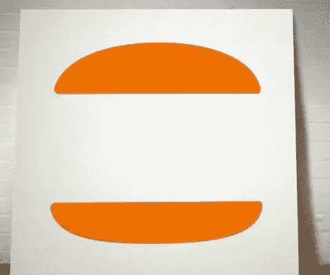
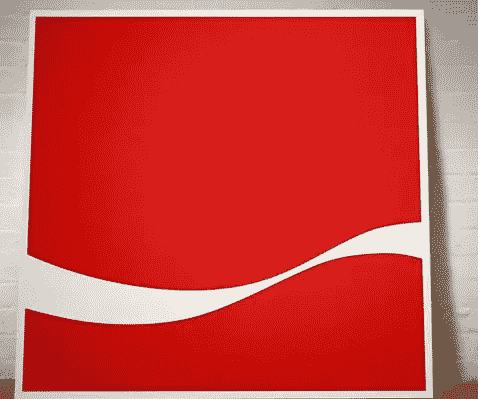
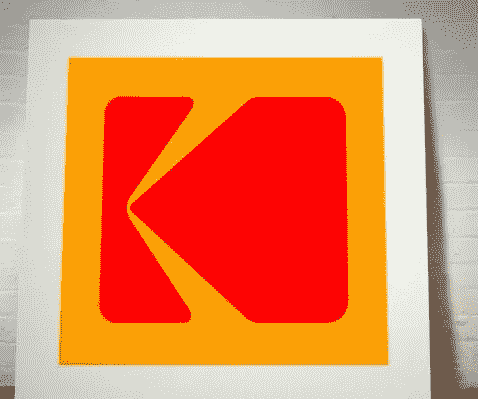
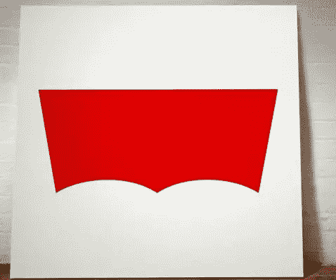
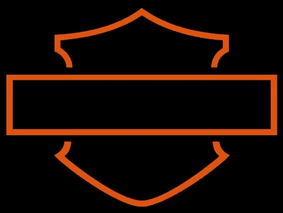
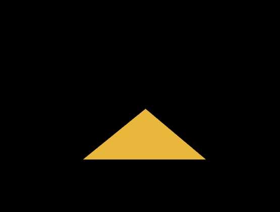
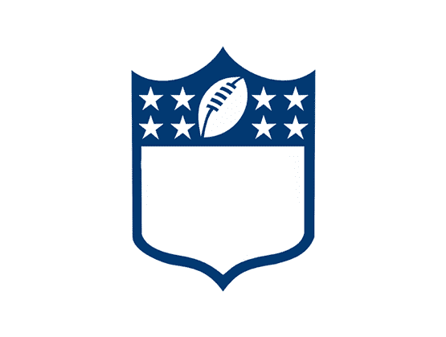

# 从一个无名的 Logo 我们能学到什么？

> 原文：<https://www.sitepoint.com/what-can-we-learn-from-a-nameless-logo/>

我偶然发现了一个有趣的项目，叫做“你用了我的名字”，由艺术和设计集体[桃乐丝](http://www.wearedorothy.com/)发起。该项目是一系列绘画，将著名的标志剥离回其基本的图形形式。令人惊讶的是，所有的作品都很容易辨认，这让我想到一些品牌实际上是多么熟悉和强大。这是多萝西项目的一些样本，你认得出它们吗？

*所有图片由[多萝西](http://www.wearedorothy.com/)拍摄。*

徽标可以大致分为三类:

*   印有公司或品牌名称的印刷标识，例如 Harrods 和 Calvin Klein。
*   由某种符号与公司名称组合而成的类型和符号标志，例如捷豹、法拉利和奔驰。
*   仅符号标志。这些都是品牌世界的大男孩，如此著名，他们不需要一个公司的名字就能被认出来，例子包括耐克，壳牌和苹果。

有时人们会认为印刷标识很容易制作，但事实是，选择(或制作)合适的字体来代表品牌需要很多技巧。最受欢迎的标志是类型和符号标志，因为它们覆盖了所有的基础——这是一个美观、可识别、代表公司理念的标志，但还包括公司名称的提示。如上所述，只有符号的标志通常被非常成熟的公司使用，在这些公司中，公司代表谁或代表什么是毫无疑问的。

看过 Dorothy 项目后，我认为这可能是一个有趣的项目，任何新的标志设计师都可以尝试，他们可以选择自己的著名标志。将一个已有的知名 logo 分解成最基本的形式，看看是否还有辨识度。我发现，在我自己的课堂上，当学生们第一次开始设计标志时，有一种诱惑，那就是把除了厨房水槽以外的所有东西都扔进去，渐变、扭曲的文字和斜面经常出现。好的设计包括去掉一些元素，直到你完成为止，而不是添加一些元素，试图让一些东西看起来像是“设计好的”。简单是标志设计的一个重要原则。

我决定自己用一些相当知名的品牌来尝试这个练习，看看当我们去掉文字而留下基本形状时会发生什么。

如果你没有认出它们，它们是哈雷戴维森，猫，百视达，通用电气，国家地理和 NFL 的标志。你可能会发现这是一个有用的练习，看看如何简化你自己的标志设计。

## 分享这篇文章