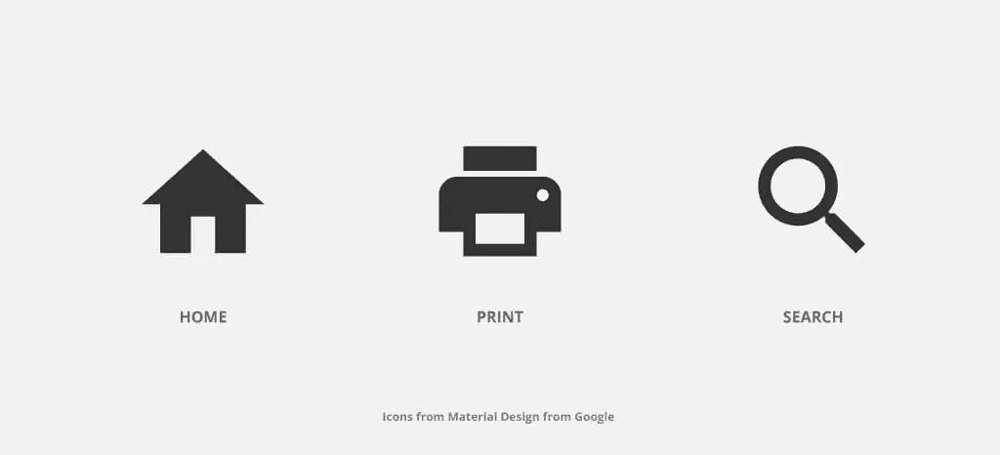
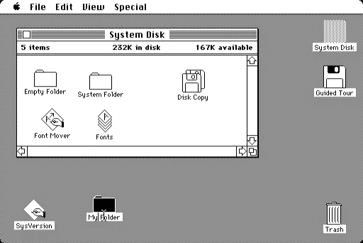
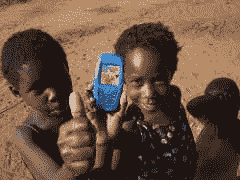
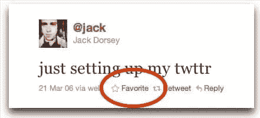
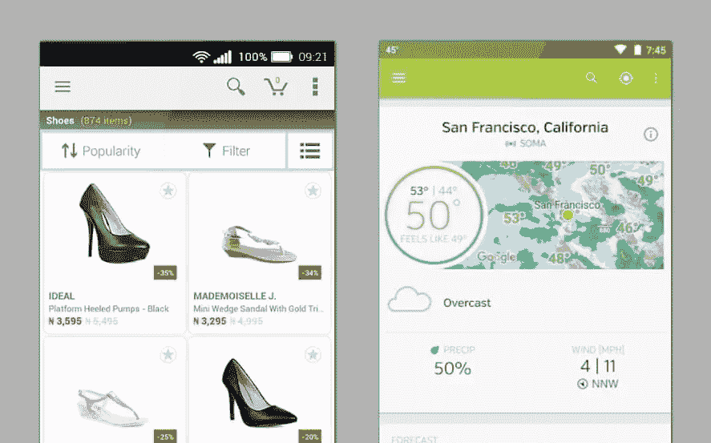
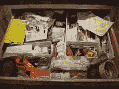

# 如果你的图标选择毁了你的工作怎么办？

> 原文：<https://www.sitepoint.com/what-if-an-icon-choice-ruined-your-work/>

随着小屏幕移动计算在世界范围内的爆炸式增长，图标通常是在用户界面中使用的最节省空间的技术。

图标是一个物体，一个动作，甚至一个想法的视觉表现，使用它们，而不是一个单词，按钮，标签或超链接，通常会给你一个更空间，更整洁的界面。

图标还可以让你通过使用“[视觉隐喻](http://grammar.about.com/od/tz/g/vismeterm.htm)”来简化给用户的信息传递。常见的例子包括:

*   编辑字段的铅笔图标；
*   相机图标拍照；
*   软盘保存你的工作。

图标简单、实用，你可能每天都在使用它们。它们完全说得通，对吗？如果你的用户觉得和这些图标没有联系，或者更糟，根本不理解它们，那该怎么办？

## 图标:隐喻和多余的上下文

所以，让我们思考一下你在典型界面中使用的图标的含义。大多数图标的功能对大多数用户来说都是显而易见的。但是有几个常见的图标不太清楚。

事实上，事实证明，只有少数图标可以被定义为“通用的”——在我们看到的每一个上下文中，它们都具有相同的含义。

尼尔森诺曼集团([https://www.nngroup.com](https://www.nngroup.com))测试了这一理论，他们定义唯一可以被认为是通用的图标是:

我不能夸大这对于用户界面的每一个实现的重要性。当我们用不同的母语(甚至多语言)和其他文化模式为另一个文化/国家设计 UI 时，他们对图标的理解可能会非常不同。

让我给你看一些简单的例子。

## 保存图标

“保存图标”这个比喻是在图形用户界面(GUI)的早期随着软盘的绘制而诞生的。总的来说，这是一个很好的图标。

但是让我们试着转换一下视角。

图: [山姆·邱吉尔——非洲手机](https://www.flickr.com/photos/samchurchill/14986656837)

新的新兴市场——非洲、印度、中国和南美的大部分地区——正在利用最近的技术繁荣。虽然他们中的大多数人没有实际接触到电脑，但他们几乎肯定会在口袋里放一部智能手机。这些人以前可能从未见过任何基于磁盘的存储。

事实上，在全球范围内，任何 20 岁以下的人都不太可能使用过软盘。早在 1998 年，苹果就有争议地从 G3 台式机上移除了软驱。

那么，我们怎么能期望这些用户理解并感受到“保存”功能的视觉表现呢？

就我个人而言，我已经在一个非常相似的环境中，在职业层面上面对过一次这个问题，其中“保存”动作是完成任务的关键一步。最终用户遇到的困难比我们预期的要多，因为软盘图标没有相关的标签。

## 最喜欢的图标

为了收集项目并保存它们以备后用，许多用户界面允许您将它们标记为收藏夹。

示例:最喜爱的图标

这通常由三个符号中的一个来表示——星形、心形或书签图标。书签的概念可以追溯到 Netscape Navigator 浏览器的最早版本。

微软的 Internet Explorer 将他们的书签系统称为“收藏夹”，并使用了一个“带星号的文件夹”图标。

@jack 展示了 2006 年使用星星的 Twitter。

10 年来，Twitter 一直使用五角星来表示对推文的喜爱，直到去年，他们改用心形图标。

所有这些图标自然会相互竞争。星形图标通常用于评级系统和功能项目，心形图标用于愿望列表和分享您对某件事情的感受，书签图标用于标记上下文。

最好的办法是定义一个清晰的策略来避免让你的用户感到困惑。如果你在评分和收藏夹中使用一个星形图标，首先用户测试一下，用户不会把它们看成一回事。

## 汉堡图标

汉堡包图标最初被设计成代表施乐“星形”界面的列表。最近，它通常被用来表示菜单导航。

这是一个几乎被认为是通用的图标，但是，因为它并不总是用于相同的目的，而且视觉表现是如此主观，以至于用户并不清楚最终结果是什么。在一些界面中，对于完全不同的操作，经常会看到非常相似的图标，如果不是相同的话。让我们看一些例子。

在第一个例子中，电子商务应用程序，你可以在顶栏上看到一个汉堡图标，另一边是另一个非常相似的图标。如果你认为汉堡包图标是打开菜单的上下文按钮，那你就错了。相反，汉堡包图标用于过滤产品类别。

照片:[芭芭拉·奥尔森—](ttps://www.flickr.com/photos/candyheartsandpaperflowers/3467650188)前的垃圾抽屉 

第二个例子——天气预报应用程序——同样的图标显示你最喜欢的地方列表。另一个打开一个小对话框，里面有分享、评级和设置菜单。

很困惑，不是吗？

你可以认为汉堡图标已经成为现代移动用户界面的“垃圾抽屉”。藏东西的地方没有合适的地方。

## 那么…使用图标、标签还是两者都用？

为了获得良好的体验和 UI 交互，没有任何疑问、困惑或挫折，当你使用一个图标时，以某种方式给它一个标签。真的很重要，尤其是对于想要实现一个任务完成的图标。

在智能手机和智能手表等小屏幕上，你可以搜索操作系统指南，帮助你实现最佳解决方案，并为你提供用户习惯的备忘单。

如果你正在为 iPhone/iPad 设计一个应用程序，看看 iOS 人机界面指南，尽管如果你正在设计一个 Android 应用程序，请检查谷歌的材料设计。当涉及到是否使用标签时，这些指南有不同的方法，但最终，真正重要的是你的用户研究。

秘诀是深入理解你的人物角色，做 UI 用户测试和 A/B 测试。只有这样你才能给你的用户一个真正好的体验。

## 少一些美感，多一些设计

一个好的图标族可以让一个界面更丰富，更优雅，但是，“保持简单”。不要把你的图标看作是一个测试你所有插图技巧的机会。毕竟，它应该是一个被认可的标志。

一般来说，一个好的 UI 设计并不是最艺术化的创新，也不是最奇妙的动画，甚至不是最流行的功能。

界面的成功基于:

1.  清晰，激发用户的信心，并导致进一步的使用。
2.  保持简单。不要试图让你的 UI 成为一件鼓舞人心的艺术品。你的用户只是希望你的界面有用，易于交互。
3.  测试图标的可识别性。
4.  对图标使用 5 秒规则。如果你花了超过 5 秒的时间来思考图片，这可能不是传达想法/行动的最佳方式。
5.  将控制权交给你的用户。
6.  为更好的体验和品牌意识建立一致性。
7.  最重要的是，不要忘记你是在设计一个界面，不是为你自己，而是为你那些了不起的用户。

## 分享这篇文章