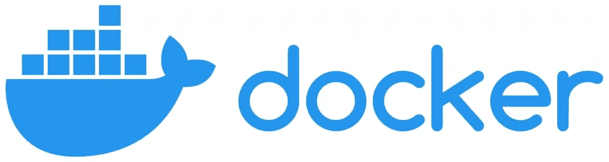
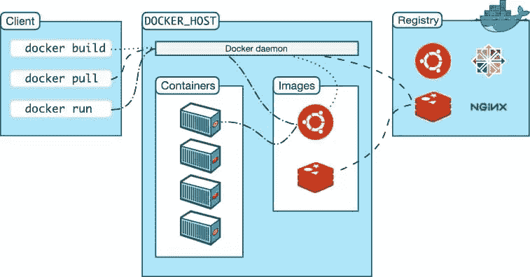
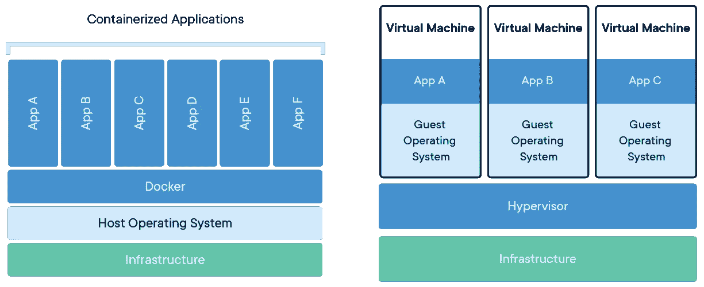

# Docker 是什么？

> 原文：<https://www.sitepoint.com/what-is-docker/>

Docker 是彻底解决软件容器和虚拟化问题的灵丹妙药。是的，这是一个强有力的主张！其他产品试图解决这些问题，但 Docker 的新方法和生态系统已经将竞争从地图上抹去。本指南将帮助您理解 Docker 的基本概念，这样您就可以开始在自己的应用程序中使用它，并将其应用到您的工作流程中。

**内容:**

1.  [码头工人的历史](#thehistoryofdocker)
2.  [Docker 是如何工作的？](#howdoesdockerwork)
3.  [Docker 组件和工具](#dockercomponentsandtools)
4.  [了解 Docker 容器](#understandingdockercontainers)
    *   [用 Docker 图像构建 Docker 容器](#buildingadockercontainerwithdockerimages)
    *   码头集装箱里有什么？
5.  [如何运行容器？](#howtorunacontainer)
6.  为什么要使用容器？
7.  [有用的提示](#usefultips)
    *   [Docker 最佳实践](#dockerbestpractices)
    *   [Docker 命令](#dockercommands)
8.  [最终想法](#finalthoughts)

## 码头工人的历史

<center style="margin: 1em 0;"></center>

[Docker](https://www.docker.com/) was created in 2013 by [Solomon Hykes](https://twitter.com/solomonstre) while working for [dotCloud](https://www.docker.com/press-release/dotcloud-inc-now-docker-inc/), a cloud hosting company. It was originally built as an internal tool to make it easier to develop and deploy applications.

Docker containers 基于 Linux [containers](https://en.wikipedia.org/wiki/OS-level_virtualization) ，后者在 21 世纪初就已经出现，但直到 Docker 创建了一个简单易用的运行容器的平台，才被广泛使用，该平台很快受到开发人员和系统管理员的欢迎。

2014 年 3 月，Docker 将其技术开源，并成为 GitHub 上最受欢迎的项目之一，不久后就从投资者那里筹集了数百万美元。

在非常短的时间内，Docker 已经成为开发和部署软件最流行的工具之一，并且几乎被 DevOps 社区的每个人所采用！

## Docker 是如何工作的？



<small>Docker 架构，由[nhumrich](https://openclipart.org/artist/nhumrich)</small>

Docker 是一种允许您构建、运行、测试和部署分布式应用程序的技术。它使用操作系统级别的虚拟化来交付被称为容器的软件包中的软件。

Docker 实现这一点的方法是将应用程序及其依赖项打包到一个可以在任何计算机上运行的虚拟容器中。与[虚拟机](https://en.wikipedia.org/wiki/Virtual_machine)相比，这种容器化允许更好的可移植性和效率。

这些容器相互隔离，捆绑了它们自己的工具、库和配置文件。他们可以通过明确定义的渠道相互交流。所有容器都由一个操作系统内核运行，因此使用很少的资源。

如上所述，操作系统虚拟化已经出现了一段时间，其形式有 [Linux 容器](https://linuxcontainers.org/)(LXC)[Solaris Zones](https://en.wikipedia.org/wiki/Solaris_Containers)和 [FreeBSD jail](https://en.wikipedia.org/wiki/FreeBSD_jail) 。然而，Docker 通过提供一个易于使用的平台，在容器中自动部署应用程序，进一步发展了这一概念。

以下是 Docker 容器相对于传统虚拟机的一些优势:

*   它们是可移植的，可以在任何有 Docker 运行时环境的计算机上运行。
*   它们相互隔离，可以运行同一软件的不同版本，而不会相互影响。
*   它们非常轻便，因此启动速度更快，使用的资源更少。

现在，让我们来看看让这一切成为可能的一些组件和工具。

## Docker 组件和工具

Docker 由三个主要组件组成:

*   **[Docker 引擎](https://docs.docker.com/engine/)** ，容器的运行时环境
*   **[Docker 命令行](https://docs.docker.com/engine/reference/commandline/cli/)** 客户端，用于与 Docker 引擎进行交互
*   **[Docker Hub](https://hub.docker.com/)** ，一个为 Docker 镜像提供注册和存储服务的云服务

除了这些核心组件之外，Docker 还有许多其他工具，包括:

*   Swarm ，一个用于 dockerized 应用程序的集群和调度工具
*   Docker 桌面，Docker 机器的继任者，也是容器化应用程序的最快方式
*   Docker Compose ，一个定义和运行多容器 Docker 应用程序的工具
*   [Docker Registry](https://docs.docker.com/registry/) ，一种用于存储和管理 Docker 图像的内部注册服务
*   Kubernetes ，一个可以和 Docker 一起使用的容器编排工具
*   [Rancher](https://www.rancher.com/) ，一个交付 Kubernetes 即服务的容器管理平台

甚至有许多服务支持 Docker 生态系统:

*   [亚马逊弹性容器服务](https://aws.amazon.com/ecs/)(亚马逊 ECS)，来自亚马逊网络服务的托管容器编排服务
*   微软 Azure 的托管容器编排服务 Azure Kubernetes Service (AKS)
*   [Google Kubernetes 引擎](https://cloud.google.com/kubernetes-engine) (GKE)，一个运行在 Google 云平台上的完全托管的 Kubernetes 引擎
*   [Portainer](https://portainer.io/) ，用于在任何云、数据中心或设备中的 Kubernetes、Docker、Swarm 和 Nomad 上在几分钟内部署、配置、故障排除和保护容器

## 了解 Docker 容器



Docker 容器与虚拟机。来源:[维基百科](https://upload.wikimedia.org/wikipedia/commons/0/0a/Docker-containerized-and-vm-transparent-bg.png)

容器经常被比作虚拟机，但是两者之间有一些重要的区别。虚拟机运行操作系统的完整副本，而容器与其他容器共享主机内核。这使得容器比虚拟机更加轻量级和高效。

对于初学者来说，*容器是一个自包含的软件单元，它包括运行应用程序所需的所有依赖关系*。这使得打包和运输应用程序变得容易，而不必担心兼容性问题。Docker 容器可以在任何安装了 Docker 引擎的机器上运行。

这些容器相互隔离，捆绑了它们自己的工具、库和配置文件，它们可以通过定义明确的通道相互通信。

### 用 Docker 图像构建 Docker 容器

[Docker 容器由映像](https://www.sitepoint.com/how-to-build-an-image-with-the-dockerfile/)构建，这些映像是只读模板，包含运行应用程序所需的所有依赖项和配置。

事实上，容器是图像的运行时实例——图像在实际执行时在内存中变成什么样。默认情况下，它完全独立于主机环境运行，仅在配置后访问主机文件和端口。因此，容器有自己的网络、存储和进程空间；这种隔离使得在主机之间移动容器变得容易，而不必担心兼容性问题。

可以通过使用`Dockerfile`(包含创建图像的所有必要指令)或使用`Docker commit`来创建图像，后者获取一个现有的容器并从中创建一个图像。

### 码头集装箱里有什么？

Docker 容器包括应用程序运行所需的一切，包括:

*   代码
*   运行时间
*   图书馆
*   环境变量
*   配置文件

Docker 容器由三个主要部分组成:

*   **Dockerfile** ，用于构建镜像。
*   **图像**本身是一个只读模板，包含创建 Docker 容器的指令
*   **容器**，一个从映像创建的可运行实例(您可以使用 Docker API 或 CLI 创建、启动、停止、移动或删除容器)

容器与其他容器及其主机共享内核。这使得它比虚拟机更轻量级。

如需更深入的指导，请参见[了解 Docker、容器和更安全的软件交付](https://www.sitepoint.com/docker-containers-software-delivery/)。

## 如何运行容器？

Docker 容器是可移植的，可以在任何安装了 Docker 引擎的主机上运行(参见[如何在 Windows 10 Home 上安装 Docker](https://www.sitepoint.com/docker-windows-10-home/))。

要运行容器，首先需要从注册表中提取图像。然后，您可以使用这个映像创建并启动容器。

<center style="margin: 1em 0;"></center>

For example, let’s say we want to launch an [Alpine Linux](https://www.alpinelinux.org/) container. We would first pull the [Alpine Docker image from Docker Hub](https://hub.docker.com/_/alpine). To do that, we use the `docker pull` command, followed by the name of the repository and tag (version) that we want to download:

```
docker pull alpine:latest 
```

这张图片非常小，只有 5MB 大小！在使用`docker pull`将其下载到我们的系统之后，我们可以通过运行`docker images`来验证它是否在本地存在。这将为我们提供如下所示的输出:

```
REPOSITORY          TAG                 IMAGE ID            CREATED             SIZE
alpine              latest              f70734b6b2f0        3 weeks ago         5MB 
```

现在我们已经有了本地图像，我们可以使用它启动一个容器。为此，我们使用`docker run`命令，后跟图像的名称:

```
docker run alpine 
```

这会给我们一个错误消息，告诉我们需要指定一个要在容器内部执行的命令。默认情况下，Docker 容器在创建时不会启动任何进程或命令。

我们可以将该命令作为参数提供给`docker run`，如下所示:

```
docker run alpine echo "Hello, World!" 
```

在这里，我们所做的就是运行`echo`程序并传入“Hello，World！”作为输入。当您执行这一行时，您应该会看到如下所示的输出:

```
Hello, World! 
```

太好了！我们已经成功推出了我们的第一个 Docker 容器。但是如果我们想在阿尔卑斯山的容器里发射炮弹呢？为此，我们可以将`sh`命令作为输入传递给`docker run`:

```
docker run -it alpine sh 
```

`-i`标志代表“交互”,用于保持[标准输入](https://en.wikipedia.org/wiki/Standard_streams)打开，即使没有连接。`-t`标志分配一个伪 TTY 设备。这两个标志一起允许我们直接附加到正在运行的容器，并为我们提供一个交互式 shell 会话:

```
/ # 
```

从这里，我们可以执行 Alpine Linux 发行版中可用的任何命令。例如，让我们试着运行`ls`:

```
/ # ls
bin  dev  etc  home  lib    media  mnt  proc    root  run   sys   tmp      var
boot  home  lib64  media    mnt   opt  rootfs   sbin usr 
```

如果我们想退出这个 shell，我们可以简单地输入`exit`:

```
/ # exit 
```

就是这样！我们现在已经成功地启动和退出了我们的第一个 Docker 容器。

[https://www.youtube.com/embed/iqqDU2crIEQ?rel=0](https://www.youtube.com/embed/iqqDU2crIEQ?rel=0)

<br>

对于另一个实际案例，请查看使用 Docker 设置现代 PHP 开发环境的[。](https://www.sitepoint.com/docker-php-development-environment/)

## 为什么要使用容器？

使用容器有很多很好的理由:

*   **灵活性**。容器可以在任何支持 Docker 的平台上运行，无论是笔记本电脑、服务器、虚拟机还是云实例。这使得移动应用程序变得容易，并帮助 DevOps 团队在开发、测试和生产中实现一致的环境。
*   **隔离**。每个容器都在自己的隔离环境中运行，并有自己的一组进程、文件系统和网络接口。这确保了一个容器不能干扰或访问另一个容器的资源。
*   **密度和效率**。多个容器可以在同一主机系统上运行，而不需要操作系统的多个副本或额外的硬件资源，并且容器是轻量级的，比虚拟机需要更少的资源，使它们运行起来更高效。在大规模部署应用程序时，所有这些都可以节省宝贵的时间和金钱。
*   **可扩展性**。容器可以很容易地放大或缩小，以满足不断变化的需求。这使得有可能在需求高时有效地利用资源，并在需求降低时快速释放资源。
*   **安全**。容器的隔离功能有助于保护应用程序免受恶意攻击和意外泄漏。通过在各自独立的环境中运行每个容器，您可以进一步降低危害的风险。
*   **便携性**。容器可以很容易地在不同的主机之间移动，这使得跨服务器群分发应用程序变得很容易。这使得高效利用资源成为可能，并有助于确保应用程序在需要时始终可用。
*   **再现性**。容器可以很容易地被复制以创建环境的相同副本。这有助于创建与生产相匹配的测试和试运行环境，或者将应用程序分布在一组服务器上。
*   **速度**。容器可以快速启动和停止，这使得它们非常适合需要立即启动和运行的应用程序。
*   **简约**。容器范式简单且易于理解，因此很容易开始使用容器。
*   **生态系统**。Docker 生态系统包括各种各样的工具和服务，使构建、运输和运行容器变得容易。

## 有用的提示

在本指南的最后，我们将提供一些最佳实践技巧和方便的命令，以充分利用 Docker。

### Docker 最佳实践

使用 Docker 时，您应该遵循一些最佳实践:

*   使用一个`.dockerignore`文件从您的构建上下文中排除文件和目录。
*   保持你的`Dockerfile`简单易读。
*   使用 Docker 时避免使用`sudo`。
*   使用`docker network` create 命令为您的应用创建一个用户定义的网络。
*   使用 Docker secrets 来管理容器使用的敏感数据。

### Docker 命令

如果你想了解更多关于 Docker 的知识，这里有一个命令列表供你参考:

*   `docker`，用于管理系统中的容器
*   `docker build`，用于从`Dockerfile`创建新图像
*   `docker images`，用于列出系统上所有可用的图像
*   `docker run`，用于从图像中启动新的容器
*   `docker ps`，用于列出系统中所有正在运行的容器
*   `docker stop`，用于优雅地停止正在运行的容器
*   `docker rm`，用于从系统中移除停止的容器
*   `docker rmi`，用于从系统中删除图像
*   `docker login`，用于登录 Docker 注册表
*   `docker push`，用于将图像推送到 Docker 注册表
*   `docker pull`，用于从 Docker 注册表中提取图像
*   `docker exec`，用于在运行的容器中执行命令
*   `docker export`，用于将容器导出为 tar 归档文件
*   `docker import`，用于将 tar 归档文件作为图像导入

最后，使用 Vim 或 Emacs 之类的文本编辑器来编辑您的`Dockerfile`。

如果你想深入了解 docker，可以看看 Craig Buckler 的《Docker for Web Developers 》一书。

## 最后的想法

Docker 是一个强大的工具，可以帮助你自动化应用程序的部署。它使用简单，不需要您在主机上安装任何依赖项。

在过去的几年中，Docker 已经成为开发和部署软件最流行的工具之一。开发人员使用它将他们的代码和依赖项打包成一个标准化的单元，然后可以部署在任何服务器上。此外，Docker 还使开发人员能够在单个主机上运行多个隔离的应用程序，使其成为微服务的理想工具。

如果你正在寻找一种工具，可以帮助你简化工作流程，让你作为开发人员*和系统管理员*的生活变得更容易，那么 Docker 是一个必须添加到你的盒子里的工具。

## 分享这篇文章