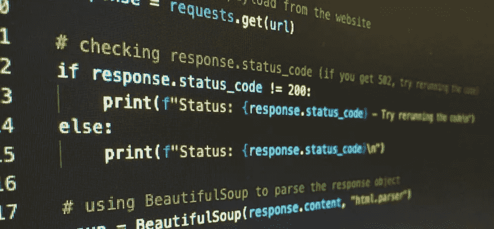

# Python 是什么，是用来做什么的？

> 原文：<https://www.sitepoint.com/what-is-python/>

在这篇文章中，我们将解释什么是 Python，它能用来做什么，以及为什么它如此受欢迎。

1.  [Python 简介](#anintroductiontopython)
    *   [Python 增强提案(pep)](#pythonenhancementproposalspeps)
    *   [Python 之禅](#thezenofpython)
    *   [皮达尼斯塔,“皮达尼之路”,以及仁慈的终身独裁者](#thepythonistasthepythonicwayandthebenevolentdictatorforlife)
2.  [什么 Python 用于](#whatpythonisusedfor)
    *   [网页开发](#webdevelopment)
    *   [机器学习和人工智能](#machinelearningandartificialintelligence)
    *   [数据科学和数据分析](#datascienceanddataanalysis)
    *   [软件测试](#softwaretesting)
    *   [游戏开发](#gamedevelopment)
3.  [为什么要学习 Python 编码？](#whyshouldyoulearnpythoncoding)
    *   [Python 好用](#pythoniseasytouse)
    *   [Python 是开源的](#pythonisopensource)
4.  [Python 为什么这么受欢迎？](#whyispythonsopopular)
5.  [六个有用的 Python 技巧](#sixusefulpythontips)
    *   [1。使用适当的缩进](#1useproperindentation)
    *   [2。不要忘记冒号](#2dontforgetthecolons)
    *   [3。在变量名中使用正确的语法](#3usepropergrammarinyourvariablenames)
    *   [4。使用内置帮助功能](#4usethebuiltinhelpfunction)
    *   [5。使用和滥用标准库](#5useandabusethestandardlibrary)
    *   [6。加入社区](#6jointhecommunity)
6.  [最终想法](#finalthoughts)

“什么是 Python？”这个问题有一个简单的答案你可以在维基百科条目的第一段找到。但是它不会告诉你为什么 Python 一直是最受欢迎的编程语言之一，或者为什么它可以用于这么多不同的事情，以及为什么它在几乎所有这些方面都非常出色。


但是我们想要回答这些问题，所以让我们快速地探究一下是什么让 Python 如此独特、流行和有趣。

## Python 简介


[XKCD #353，【Python】](https://xkcd.com/353/)

简而言之， [Python](https://www.python.org/) 是一种高级编程语言，由[吉多·范·罗苏姆](https://gvanrossum.github.io/)于 1991 年创造。此后，它以开源许可的形式发布，任何想使用或修改该软件的人都可以免费获得。

Python 以其易用性而闻名，其语法允许程序员用比 C++或 Java 等语言更少的代码行来表达概念。

### Python 增强提案(pep)

Python 区别于其他编程语言的一个特性是包含了所谓的“ [Python 增强提议](https://peps.python.org/)”(PEPs)。pep 是描述提议的语言更改的文档，并为机构群体对这些提议的意见提供了一种机制。社区的任何成员都可以提交 PEP，然后在被 Python 的核心开发人员接受或拒绝之前，经过讨论和改进的过程。

这一过程确保了添加到语言中的新特性是经过精心设计的，并且在被包含到 Python 的代码主体中之前在社区中得到广泛的支持。

### Python 的禅

一个这样的 PEP 现在已经成为传奇:“[PEP 20——Python 的禅宗](https://peps.python.org/pep-0020/)”，由 CPython 核心开发人员(Python 的[参考实现](https://en.wikipedia.org/wiki/Reference_implementation))Tim Peters 编写。

Python 的禅为语言及其相关库的设计提供了指导，强调了美观、简单和明确的重要性:

```
Beautiful is better than ugly.
Explicit is better than implicit.
Simple is better than complex.
Complex is better than complicated.
Flat is better than nested.
Sparse is better than dense.
Readability counts.
Special cases aren't special enough to break the rules.
Although practicality beats purity.
Errors should never pass silently.
Unless explicitly silenced.
In the face of ambiguity, refuse the temptation to guess.
There should be one-- and preferably only one --obvious way to do it.
Although that way may not be obvious at first unless you're Dutch.
Now is better than never.
Although never is often better than *right* now.
If the implementation is hard to explain, it's a bad idea.
If the implementation is easy to explain, it may be a good idea.
Namespaces are one honking great idea -- let's do more of those! 
```

### Pythonistas，“Pythonic 之道”，和仁慈的终身独裁者

新的 Python 程序员最常问的一个问题是“做 X 的 Python 方式’是什么？”这通常是指以一种特别优雅或有效的方式利用语言的特性来解决问题的特殊方式。

虽然在 Python 中通常有多种方法来完成任何给定的任务，但有经验的 Python 爱好者通常对什么是好的代码有强烈的看法，并且他们不羞于分享这些看法！正如 Python 的[仁慈的终身独裁者](https://en.wikipedia.org/wiki/Benevolent_dictator_for_life) (BDFL)吉多·范·罗苏姆的名言:“只有一种方法可以做到，这就是为什么它行得通”。

[https://www.youtube.com/embed/J0Aq44Pze-w?rel=0](https://www.youtube.com/embed/J0Aq44Pze-w?rel=0)

<br>

## Python 有什么用途

现在我们来看看 Python 通常用于哪些方面。

### Web 开发

Python 经常用于 web 开发。流行的 Python web 框架有 [Django](https://www.djangoproject.com/) 和 [Flask](http://flask.pocoo.org/) ，很多大型网站包括 [Reddit](https://reddit.com) 和 [Instagram](https://instagram.com) 都是用 Python 搭建的。

### 机器学习和人工智能

Python 在机器学习和人工智能领域非常流行，像 [TensorFlow](https://www.tensorflow.org/install/) 和 [scikit-learn](https://scikit-learn.org/stable/) 这样的软件包为这些目的提供了强大的工具。

还有很多其他流行的机器学习库，比如 [Keras](https://keras.io/) 和 [PyTorch](https://pytorch.org/) ，都是用 Python 写的。

### 数据科学和数据分析

Python 也主要用于数据科学和数据分析。熊猫库为处理表格数据提供了强大的工具，而 T2 库 matplotlib 是一个创建数据可视化的流行工具。

用于 Python 的笔记本环境 Jupyter ，也经常被数据科学家用于探索性分析和创建可重复的研究。

### 软件测试

Python 广泛应用于软件测试。 [unittest](https://docs.python.org/3/library/unittest.html) 模块是一个内置的库，提供了用于此目的的工具， [pytest](https://docs.pytest.org/) 框架是 unittest 的一个流行的第三方替代方案。(查看[关于使用 unittest 和 pytest 进行 Python 单元测试的介绍](https://www.sitepoint.com/python-unit-testing-unittest-pytest/)，了解更多相关信息。)

### 游戏开发

Python 也在游戏开发中使用，例如,[、PyGame](https://www.pygame.org/news) 等软件包提供了创建游戏和其他图形应用程序的功能，它也经常用于大型游戏引擎中的脚本编写，例如 Unity ( [docs](https://docs.unity3d.com/Packages/com.unity.scripting.python@2.0/) 和 Unreal Engine 4 ( [docs](https://docs.unrealengine.com/4.27/en-US/ProductionPipelines/ScriptingAndAutomation/Python/) )。

## 为什么要学习 Python 编码？

让我们来看看为什么你应该考虑学习 Python 编码的理由。



### Python 很容易使用

Python 被认为是最容易学习的语言之一。这是因为 Python 代码非常容易阅读和理解，而且与其他语言相比，它可以用更少的行来编写。这种语言具有简洁的语法，允许程序员用比其他语言更少的代码行来表达概念。这意味着新手可以快速掌握 Python 编码的基础知识，而有经验的程序员可以通过编写更高效的代码来节省时间。

尽管 Python 很容易学，但也要确保它足够强大，可以构建专业级的应用程序。

### Python 是开源的

任何人都可以为 Python 的开发做出贡献，使用或开发这种语言没有许可费。

这也意味着有一个巨大的开发者社区，他们愿意帮助新手入门，并且一直致力于改进语言。因为它是开源的，所以你可以确信将会有免费的工具和库供 Python 使用。

## Python 为什么这么受欢迎？

Python 是如此的通用，以至于它既可以用于开发桌面应用程序，也可以用于开发 web 应用程序。对于初学者来说很容易学习，并且有强大的数据分析和机器学习库。

实际上，让我们快速回顾一下它的一些关键特性:

*   **面向对象**:代码可以组织成类和模块。这使得重用代码和创建新库变得容易。
*   **解读** : Python 运行前不需要编译。这使得开发更快更容易，因为您不需要在每次做出更改时都等待编译过程完成。
*   **高层** : Python 抽象出了实现的许多细节(比如内存管理)，这样程序员就可以专注于更大的图景。
*   **动态**:变量可以在运行时创建和销毁。这使得开发更快，因为你不需要预先声明变量。
*   **多范例**:包括[功能性](https://en.wikipedia.org/wiki/Functional_programming)、[过程性](https://en.wikipedia.org/wiki/Procedural_programming)、[面向对象](https://en.wikipedia.org/wiki/Object-oriented_programming)。这使得根据手头的任务在不同的编程风格之间切换变得容易。
*   **可移植性** : Python 代码可以在任何支持解释器的平台上运行，这使得将代码从一个平台移植到另一个平台变得很容易。

## 六个有用的 Python 技巧

让我们来看一些充分利用 Python 的技巧。

### 1.使用适当的缩进

Python 对缩进非常讲究。应该一起运行的所有代码行必须缩进相同的量，否则 Python 会给出一个错误。这可以是四个空格，或者一个制表符，但是无论你选择什么，都要保持一致！

### 2.不要忘记冒号

在声明了一个`for`循环或者一个`if`语句之后，不要忘记在行尾加上一个冒号！否则 Python 会给你一个错误。

### 3.在变量名中使用正确的语法

这可能看起来像是一个吹毛求疵的规则，但是它实际上使你的代码更容易被其他人阅读(和你自己，当你以后再来看的时候！).坚持在变量名中使用小写字母和下划线(`_`)，并尽量使它们描述变量存储的内容。

### 4.使用内置的帮助功能

Python 有很多函数和方法(预先编写的代码，您可以调用这些代码来完成某些任务)，要记住所有这些函数和方法可能会让人不知所措。这就是`help`函数的作用！如果您忘记了某个函数是如何工作的，或者它需要什么参数，只需在 Python shell 中键入`help(function_name)`。

### 5.使用和滥用标准库

[标准库](https://docs.python.org/3/library/)是一组模块，包含在 Python 的每个新安装中。这些模块提供了大量的功能，很有可能你想做的事情已经在标准库中实现了。

### 6.加入社区

有很多方法可以参与社区，无论是通过报告 bug 还是通过 GitHub 上的 pull 请求贡献新功能，回答关于堆栈溢出的问题，或者在世界各地的会议上发表演讲。

## 最后的想法

Python 理应得到所有的关注。它是一种通用的语言，可以用来开发桌面 GUI 应用程序和网站。您还可以使用 Python 开发复杂的科学和数字应用程序。Python 的设计具有便于数据分析和可视化的特性。

我要再说一遍:参与进来不仅会让你更好地学习 Python(因为你会从其他人那里学到东西)，还会让 Python 对其他人更好！

准备好深入潜水了吗？以下是 SitePoint 上的一些 Python 课程:

*   [Python 简介](https://www.sitepoint.com/premium/courses/introduction-to-python-3112)
*   [学习 Python 编程基础](https://www.sitepoint.com/premium/courses/learn-programming-fundamentals-with-python-2916)

## 分享这篇文章