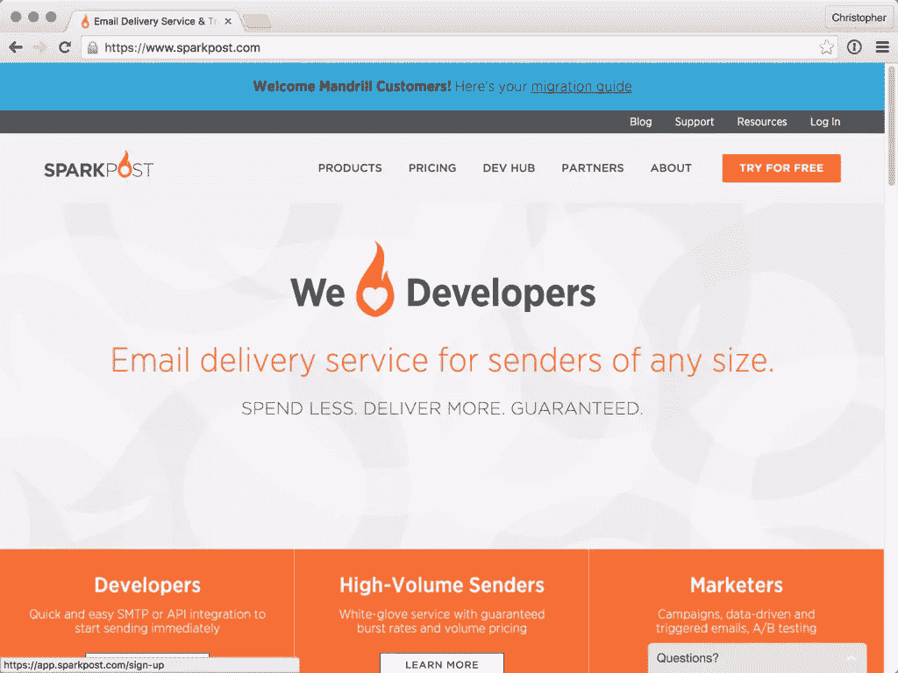
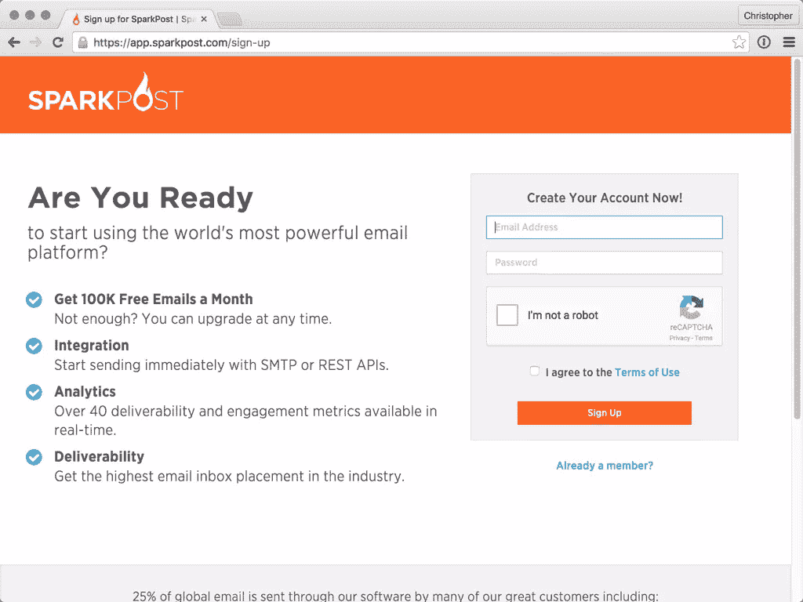
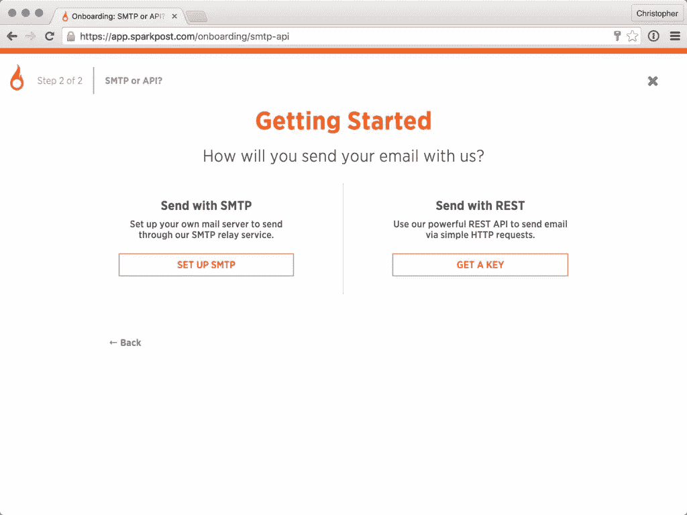

# SparkPost 是什么？

> 原文：<https://www.sitepoint.com/what-is-sparkpost/>

从我记事起，我就一直使用[曼德拉草](https://mandrillapp.com)。它发送交易邮件，就像你注册新账户时收到的那种。像我一样，许多人乐于使用免费账户每月发送相对较少的电子邮件。


直到最近，Mandrill 引起了一点轰动。问题的核心是山魈移除了它们的自由层。任何希望通过 Mandrill 发送邮件的人现在都需要一个付费的 MailChimp 帐户。

也许他们厌倦了发大量邮件不赚钱。不管是什么原因，许多人都感到惊讶，有些人甚至对此举感到愤怒。这类似于一个流行的开源库突然关闭源代码。

## SparkPost 是什么？

考虑到人们正在寻找替代品(为他们的个人通讯或其他东西提供动力)，我与艾德里安·霍华德进行了交谈。Aydrian 是我在 FluentConf 遇见的 [SparkPost](https://www.sparkpost.com) 的开发者倡导者。我们讨论了一下 SparkPost 以及它与 MailChimp 的不同之处…

### 1.你对最近的 MailChimp/Mandrill 新闻有什么看法？

我们非常尊重 MailChimp，认为他们是一家伟大的公司。当他们说交易型电子邮件不是他们的业务时，我们理解。由于我们与 MailChimp 的良好关系，他们推荐我们作为山魈的替代品。

### 2.这项服务已经存在多久了，它的目的是什么？

我们开始于 20 世纪 90 年代末，当时 Message Systems 推出了 Momentum，这是一个高性能的消息平台，为大量发送者提供服务。随着时间的推移，势头客户群增长到发送超过 25%的合法电子邮件，并见证了托管云产品的推出。2014 年，我们推出了 SparkPost，在一个易于集成的云服务中，为开发人员提供了与我们为世界上最大的发送者提供的相同的送达能力、可扩展性和速度。

### 3.山魈和火花柱有什么共同点？

我们都是 SMTP 和 API 驱动的电子邮件基础架构服务。

### 4.你能用 SparkPost 做什么你不能用 Mandrill 做的事？

有了 SparkPost，你就可以使用一个平台来发送你所有的批量和交易信息。这意味着单一的 API、模板语言、跟踪、元数据和指标。我们是行业领先的电子邮件递送服务，近 98%的收件箱放置率比行业平均水平高 15 个百分点。我们还提供所有 35 个以上指标的精确跟踪数据(相对于每小时)。作为我们对透明度承诺的一部分，我们将交付延迟数字纳入了我们的衡量标准。我们高度关注开发者。我们维护着 8 个客户端库(到目前为止)和越来越多的集成选择。我们的开发者社区是 SparkPost 非常重要的一部分。我们喜欢鼓励和帮助每个人去创造一些令人敬畏的东西。

### 5.SparkPost 如何定价？

我们刚刚发布了一篇关于我们定价的的[精彩 FAQ 博文。](https://www.sparkpost.com/blog/sparkpost-pricing-faq/)

## 使用 SparkPost

在与艾德里安交谈后，我决定尝试 SparkPost。事实证明这很容易设置！要使用它，您必须创建一个帐户:





当你第一次注册时，你会看到几个步骤来设置你的第一个应用程序。




您可以选择通过 SMTP 或 JSON API 发送邮件。点击“获取一把钥匙”,将钥匙放在手边，以备我们将要编写的代码使用。

接下来，创建一个工作目录，并下载官方的 SparkPost PHP SDK:

```
composer require sparkpost/php-sparkpost 
```

您可能会看到一条关于过时依赖关系的警告。SDK 维护人员知道这一点，并正在开发新版本。

创建一个`config.php`文件，用于存储密钥:

```
return [
    "sparkpost" => [
        "key" => "<your key here>",
    ],
]; 
```

在 Git 中忽略这个文件是个好主意，所以创建一个`.gitignore`。这也是忽略其他常见文件的好地方:

```
config.php
vendor/ 
```

现在，让我们创建`send.php`，通过 SparkPost 发送电子邮件:

```
require("vendor/autoload.php");

use SparkPost\SparkPost;
use GuzzleHttp\Client;
use Ivory\HttpAdapter\Guzzle6HttpAdapter;

$config = require("config.php");

$adapter = new Guzzle6HttpAdapter(new Client());

$client = new SparkPost($adapter, [
    "key" => $config["sparkpost"]["key"],
]);

$results = $client->transmission->send([
    "from" => "Sandbox <sandbox@sparkpostbox.com>",
    "html" => "<html><body>hello html email</body></html>",
    "text" => "hello plain text email",
    "subject" => "Testing SparkPost Email",
    "recipients" => [
        [
            "address" => [
                "name" => "Chris",
                "email" => "cgpitt@gmail.com",
            ],
        ],
    ],
]); 
```

官方的 PHP SDK 需要一个名为`Ivory\HttpAdapter`的适配器库。这抽象了 HTTP 层，因此您可以从 GuzzleHttp 切换到其他层。这可能只是为了迎合那些困在 PHP 5.4 上的人，他们不能使用最新最棒的版本。

有了这个适配器，我们就可以创建一个 SparkPost 客户端的实例。在这里我们可以访问`transmission`属性和`send`方法。

## 结论

这里的属性只是您可以通过 JSON API 指定的一小部分。我很想知道直接使用它有多容易，但希望这说明了如何以最小的努力开始使用 SparkPost。

请继续关注这个主题，我们将探索如何使用 SparkPost API 做更多有趣的事情。如果你有兴趣将 SparkPost 集成到你的应用程序或你喜欢的框架中，请在下面的评论中告诉我们。

## 分享这篇文章