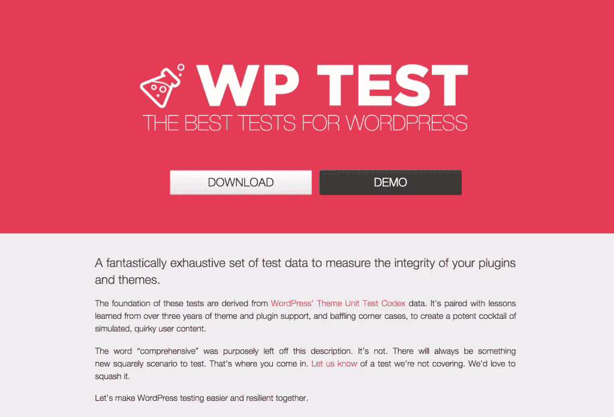
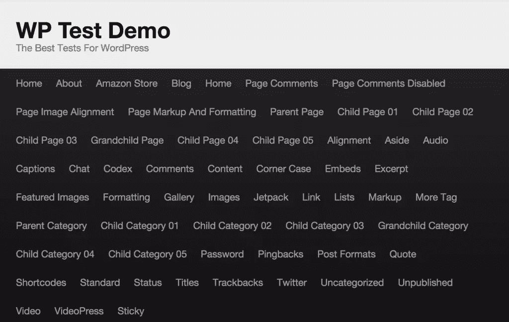
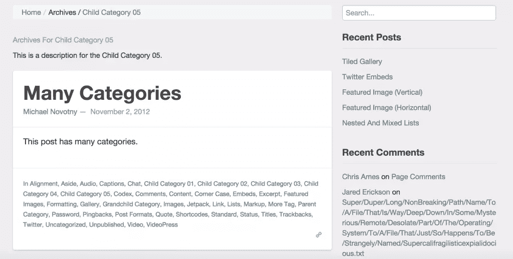
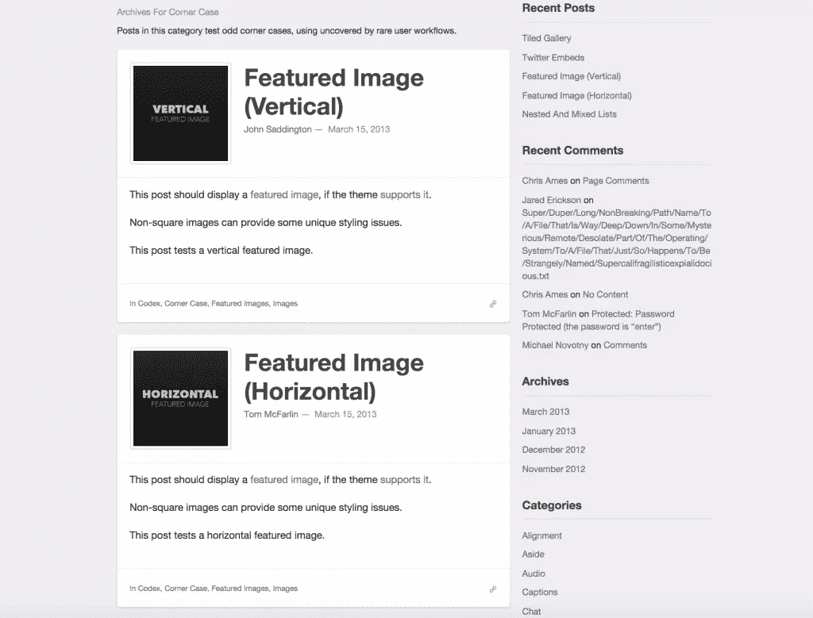
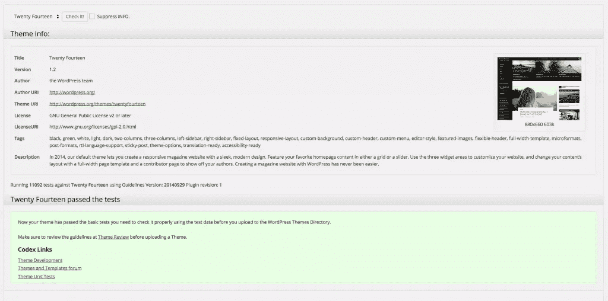
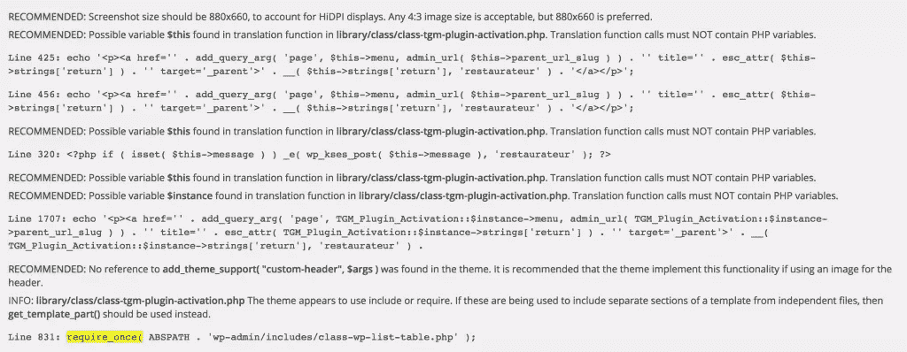
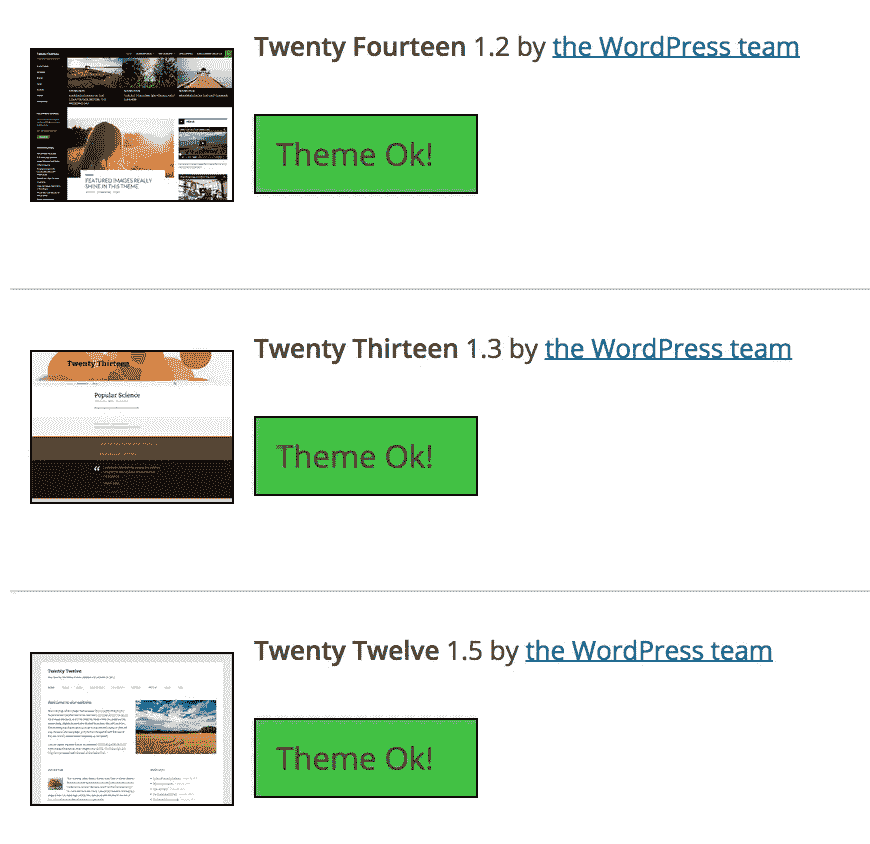

# 最好的 WordPress 主题是什么？

> 原文：<https://www.sitepoint.com/what-is-the-best-wordpress-theme/>

你对主题的选择决定了你网站的许多重要方面。对于 WordPress 的新用户来说，选择正确的主题可能很棘手，因为大多数人只会被赏心悦目所吸引。一个好的主题不仅要好看，还要精简、轻量、易于定制、灵活、积极开发并得到良好支持。

在 SitePoint，我们定期讨论与主题和主题开发相关的话题，下面是一些近期主题相关文章的快速回顾:

*   [下划线入门](https://www.sitepoint.com/wordpress-theme-development-getting-started-with-underscores/)
*   [10 个最佳 WooCommerce 主题](https://www.sitepoint.com/10-of-the-best-woocommerce-themes/)
*   [Divi:拖放 WordPress 主题](https://www.sitepoint.com/divi-the-drag-and-drop-wordpress-theme/)
*   [4 个最流行的 WordPress 主题框架](https://www.sitepoint.com/4-popular-wordpress-theme-frameworks/)
*   [如何识别流氓或低劣的 WordPress 主题](https://www.sitepoint.com/how-to-spot-a-rogue-or-subpar-wordpress-theme/)

正如您所看到的，这是一个很大的话题，从页面生成器风格的产品，一直到定制开发选项。即使网上有大量的信息，我经常被问到的一个问题是什么是最好的 WordPress 主题？没有所谓的“最好”主题，对你来说什么才是最好的主题。这包括你的经验，你的偏好和你正在建立的网站的类型。

在这篇文章中，当你选择一个主题时，我将会介绍几个我推荐的领域。这些是我在测试了很多主题并与客户已经购买的主题一起工作后形成的观点。

我也有意不提及任何供应商、框架或购买主题的地方——你可以将这里的建议应用于任何地方、任何主题。我还假设你的主题来源可靠。

## 什么是好的 WordPress 主题？

因为主题都是关于设计和 UX 的，所以我们纯粹根据外观和感觉来判断主题是正常的，但是你应该考虑更多的因素来做出明智的决定。

### 出色的文档

优秀的文档是高质量产品的标志。这可能是我首先寻找的第一件事。我并不是说你找不到缺少文档的高质量主题，但是我肯定会看好文档记录良好的主题。

详细的文档将帮助你配置和定制你的主题，并解释如何修改主题——如果你是一个开发者或者你需要一个开发者的帮助，这是很有用的。

### 标准功能

你应该期待你的主题满足一些基本要求，如搜索引擎友好和移动响应。我仍然惊讶地看到许多主题也不是。

你也应该期待一个不错的窗口小部件区域，布局和模板范围。有必要弄清楚一个主题是否在主侧边栏之外有 widgetized 区域，例如，这给了你控制主题元素的能力。你还应该检查一个主题是否为你提供了多种布局(例如全幅、侧栏和内容、博客、登陆页面)，这将为你提供选项，使你能够非常容易地定制网站的不同区域。

主题定制器在 WordPress 4.0 中已经看到了一些改进。许多主题将让你能够轻松地操作关键元素，如徽标/背景图像、颜色和字体。您通常可以在您的主题设置或主题定制器视图(在外观>定制下)中评估这些选项。

重要的是不要混淆标准特性和过多的特性，我将在下一点中介绍这些特性。

### 轻薄小巧

对于大多数项目来说，这是另一个非常重要的因素。一般来说，一个写得好的主题不仅会更快，而且更容易理解和修改。

复杂性永远是我们的敌人，所以要避免有很多依赖的复杂主题。包含一切和厨房水槽的主题并不少见，以插件的形式提供的功能更好。这同样适用于自定义帖子类型，这会使切换更加麻烦。

我个人尽量避免过多花里胡哨的主题。也许这是基于我自己糟糕经历的个人偏好，但这些通常是更新时最先崩溃的站点。

### 很好的支持

我们都经历过。你被一些不工作的东西卡住了，所以你登记了一张票，祈祷着等待回复。虽然大多数供应商会吹嘘他们拥有世界一流的支持，但这往往与现实相去甚远。了解支持质量的最好方法是查看各种社区渠道，如 Twitter 或当地 WordPress 开发者聚集的任何地方。

### 积极开发

如果你长期致力于一个主题，你要确保你的主题会继续发展，以确保与 WordPress 未来版本的兼容性，并且所有的错误和可能的安全问题都会及时得到解决。

### 审查和反馈

集体智慧是一件伟大的事情。当然可以游戏化，但是值得一查。总是寻找有正面反馈和好评的主题和/或供应商。这是建立你的经验丰富的开发人员网络的另一个很好的理由，大多数人会很乐意告诉你他们喜欢什么主题，应该避免什么主题。

## 有用的工具和资源

### WP 测试(wptest.io)

我第一次提到 [WP Test (wptest.io)](http://wptest.io/) 是在[之前的一篇文章](https://www.sitepoint.com/modern-ie-can-improve-wordpress-theme-development/)中，但还是值得再提一下，尤其是在任何谈论 WordPress 主题的文章中。由[迈克尔·诺沃特尼](http://manovotny.com/)开发的 WP Test 将自己描述为“一组极其详尽的测试数据来衡量你的插件和主题的完整性”。它本质上是 WordPress 的一个导入文件，旨在将主题推向极限。解释它的作用的最好方式是给你看一些例子。

WP 测试–菜单

WP 测试–类别

WP 测试–图像

这些测试旨在确保你的主题能够处理开发者可能没有想到的真实内容。

WP 测试文件大约是 30MB，你需要安装 WordPress Importer 插件，但是它也可以通过 WP-CLI 安装。你可以在这里找到更多关于 WP 测试的信息。

### WordPress 主题开发标准

WordPress.org 上发布了文档化的编码标准，遵守这些标准有助于提高主题的整体质量。不幸的是，这些指导方针并不总是得到遵守。我们可以用几种方法测试主题的代码质量，但是最简单的方法是使用主题检查插件，我将在下面介绍。

### 主题检查

主题检查插件检查你的主题代码中的各种质量点。你会在下面的例子中看到默认的 Twenty Fourteen 主题通过了所有的测试。

这里有一个主题的例子和一些建议:

主题检查需要 WordPress 调试来启用，你可以通过添加`define('WP_DEBUG', true);`到你的 wp-config.php 文件来实现。你可以通过[访问主题检查插件页面](https://wordpress.org/plugins/theme-check/)了解更多信息。

### 主题真实性检查器(TAC)

主题真实性检查是一个插件，检查恶意或不需要的代码。如果你正在处理一个来自未知或不可信来源的主题，运行这个总是值得的。查尔斯·科斯塔(Charles Costa)在他题为“[如何发现一个流氓或不合格的主题](https://www.sitepoint.com/how-to-spot-a-rogue-or-subpar-wordpress-theme/)”的文章中提供了发现坏主题的建议，我推荐阅读。你可以通过[访问主题真实性检查插件页面](https://wordpress.org/plugins/tac/)了解更多信息。

## 你最好的 WordPress 主题是什么？

设计往往被作为判断一个主题好坏的主要标准。当然，这很重要，但是俗话说“不要以貌取人”，这也适用于主题。做好你的功课，深入挖掘，做出你自己的决定，而不仅仅是基于它在演示网站上的样子。

正如我在本文开头提到的，这些只是我的观点。我对其他 WordPress 用户和开发者在使用什么非常感兴趣。请在下面的评论区分享你自己推荐的主题、要避免的主题和选择主题的一般建议。

## 分享这篇文章