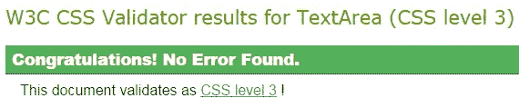
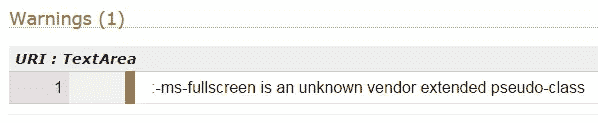
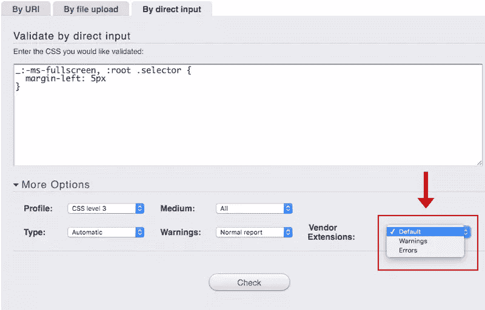
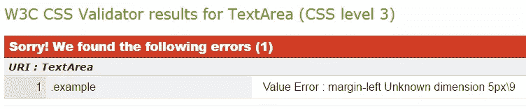

# “CSS 黑客”的定义是什么？

> 原文：<https://www.sitepoint.com/what-is-the-definition-of-a-css-hack/>

如果你已经写了至少几年的 CSS，那么你肯定用过 CSS hack。但是如果你对 CSS 比较陌生，你可能听说过这个术语，但是不确定它的确切含义。

在这篇文章中，我将解释术语 **CSS hack** 的确切含义以及 CSS hack 是如何使用的。但首先，一些背景来解释为什么我觉得这个职位是必要的。

## 许多开发人员似乎误解了这个术语

正如你们许多人所知，SitePoint 最近公布了我整理的一项大型 CSS 调查的结果。调查提出的问题之一如下:

***您目前为以下哪些微软浏览器编写或包含 CSS hacks？***

当我第一次研究结果时，我似乎忽略了这个问题结果中的一个奇怪之处。幸运的是，开发微软最新浏览器的工程师大卫·斯托里指出了这一点。在回答这个问题的 1418 人中，结果是这样的:

*   IE9–62%
*   IE10–61%
*   IE11–57%
*   优势–45%
*   工业工程 8–35%
*   IE7–9%
*   IE6–3%
*   工业工程 5.5–1%

超过 60%的开发人员声称为 IE9 和 IE10 编写 CSS 代码，这已经够糟糕了，但 45%的开发人员声称为 Edge 编写 CSS 代码？虽然 Edge 有一些公开的黑客攻击，但它们还没有出现在[浏览器黑客](http://browserhacks.com/)网站上，所以似乎不太可能有这么多人在使用该浏览器的黑客攻击。但更重要的问题是:开发人员在 Edge 中渲染 CSS 时遇到了什么问题，他们需要黑客攻击？

起初，我认为可能是许多参与者混淆了黑客和通过用户代理嗅探进行的浏览器检测。但即便如此，也无法解释 Edge 的数字为何如此之高。

[然后我意识到](https://twitter.com/ImpressiveWebs/status/711465687831744512)他们肯定完全误解了这个问题；他们认为‘为浏览器 x 编写 CSS hacks’和‘支持浏览器 x’是一样的。真的没有其他合乎逻辑的解释，尤其是当你考虑到其他浏览器也不需要黑客攻击的高比例时。

因此，对于那些可能对这个术语感到困惑的人，让我们确切地定义一下什么是黑客。

## 什么是 CSS Hack？

对于 CSS 文件中被认为是“黑客”的东西，它必须只对目标浏览器应用它的样式，而其他所有浏览器都忽略它。

让我们考虑一个例子。这是一个 CSS 黑客:

```
* html .sidebar {
  margin-left: 5px;
}
```

上例中的 CSS(通常被称为" [star-html hack](http://css-discuss.incutio.com/wiki/Star_Html_Hack) ")将只针对*版本 6 及以下版本*。大多数支持 IE6 的开发人员并不真正关心 IE6 之前的任何事情，所以这通常是一个只支持 IE6 的黑客。

“黑”的部分是星号，后面是“html”。这是[通用选择器](https://www.w3.org/TR/css3-selectors/#universal-selector)和[元素类型选择器](https://www.w3.org/TR/css3-selectors/#type-selectors)的组合。在某个时候，有人发现这两个选择器一起放在另一个选择器之前，只在某些版本的 IE 中有效，而在其他浏览器中无效。这意味着上述代码示例中定义的`.sidebar`元素的左边距将只适用于 IE6 或更早版本。在这种情况下，CSS 实际上是有效的，因此您不会得到关于它的错误或警告(稍后将详细介绍)。

这里有另一个来自 Browserhacks 网站的例子[，这次是针对 IE11 的:](http://browserhacks.com/#hack-f1070533535a12744a0381a75087a915)

```
_:-ms-fullscreen, :root .selector {
  margin-left: 5px;
}
```

我不打算详细说明为什么这是一个黑客(部分原因是我不完全确定我理解它)，但上述 CSS 将只适用于 Internet Explorer 版本 11。从技术上来说，Browserhacks 说的是“IE11 及以上”，所以我假设这意味着它也可以在微软的 Edge 浏览器中工作，但我没有验证这一点。

这里重要的一点不是针对哪些浏览器，而是我们都在理解什么是 CSS 黑客的同一页上。

## CSS Hacks 是不是无效的 CSS？

如果你的样式表中有黑客，你的 CSS 可能会产生警告和/或错误，如果你通过 W3C 的 CSS 验证器运行它的话。但这不是一种保证，也不是一种识别某个东西是否是黑客的方法。

您的 CSS 可能包含黑客攻击，并且不会产生警告或错误。例如，如果您使用的唯一 CSS 攻击是针对 IE6 的 star-html 攻击，那么您的样式表将很好地验证，没有与攻击相关的错误或警告。

此外，一些攻击(如我上面讨论的 IE11 攻击)使用特定于供应商的代码(例如`:-ms-fullscreen`)。在这种情况下，validator 中的默认设置可以显示带有“通过”绿屏消息的 CSS:



但是如果您向下滚动验证器屏幕，您会看到如下警告:



在这种情况下，它警告我，因为`:-ms-fullscreen`被认为是“一个未知供应商扩展的伪类”。如果您更愿意将这种 CSS 视为错误而不仅仅是警告，您可以使用验证程序输入区域下面的“更多选项”部分来调整验证程序的设置:



如果样式表包含供应商前缀或其他特定于浏览器的 CSS(不一定是黑客)，将“供应商扩展”选项更改为“错误”将会阻止样式表通过验证。

另一方面，您可能会使用类似这样的内容:

```
.example {
  margin-left: 5px\9;
}
```

以上 CSS 针对 IE8 及以下。“hack”是反斜杠和九(`\9`)的组合。大多数浏览器会忽略整行，因为`\9`部分使该行成为无效 CSS。但是，不管出于什么原因，Internet Explorer 版本 8 和更低版本仍会将其视为有效，并将应用边距设置。

但是，在这种情况下，无论您为验证器选择什么设置，它都会显示一条错误消息，并且样式表不会通过验证:



## 哪些技术不是黑客？

以下方法和技术不一定属于 CSS 黑客:

### ！重要声明不是黑客

一行附加了`!important`关键字的 CSS 完全是另外一个问题。这是有效的 CSS，不用于针对特定的浏览器。这不是一个黑客，但它可以被视为坏的 CSS。

### 供应商前缀不一定是黑客

厂商前缀针对特定的浏览器，但这些并不是我们习惯上所说的黑客。在大多数情况下，如果您使用供应商前缀，那么您也提供了有效的附带标准代码。那不是黑客。也就是说，在某些情况下，你会针对某个浏览器编写特定于供应商的代码，从而被视为黑客。上面使用`_:-ms-fullscreen`的代码就是一个例子。另一个很好的例子是 WebKit 浏览器中的[触发硬件加速](https://davidwalsh.name/translate3d)。但是供应商前缀在很大程度上是一个独立的主题。事实上，W3C [有关于供应商特定代码](https://drafts.csswg.org/css2/syndata.html#vendor-keywords)的文档，支持这些代码本身不应该被视为黑客的观点。

### 高特异性选择器不是黑客

使用特定的选择器来覆盖样式表另一部分的内容(例如`body .content #sidebar p`)并不是 CSS 黑客。它是糟糕的 CSS，但它不是黑客。

### 旧语法不是黑客

一个很好的例子就是[Flexbox 中深度浏览器支持所需的复杂代码](https://css-tricks.com/using-flexbox/)。除了这在今天可能是不必要的这一事实之外，我不会将这种事情归类为黑客行为。当这些浏览器支持它时，它是有效的代码，所以它可能与黑客有相同的效果，但我不认为这是一回事。

## 条件注释呢？

[条件注释](https://msdn.microsoft.com/en-us/library/ms537512%28v=vs.85%29.aspx)允许你写 CSS 甚至 HTML 来针对某些版本的 ie 浏览器(甚至排除某些版本的 ie 浏览器)有点灰色地带。如果以某种方式编写，它们是有效的 HTML，但它们是“黑客”。

早在 2008 年，Paul Irish 推广了我们所说的“条件班”，我相信我们很多人都用过。这些使用条件注释来生成类，您可以在样式表中使用这些类来使用有效的 CSS 来定位 IE 的特定版本。

那么条件注释的使用是不是“CSS hack”呢？我会说是的，只是因为它们完成了与使用更常见的 CSS 黑客时完全相同的事情。

## 你应该使用 CSS 黑客吗？

与许多 web 开发主题一样，这里的答案不是简单的*是*或*否*。正确答案是*视情况而定*。大多数纯粹主义者会说不要使用它们。但往往没那么简单。说到黑客，我的建议是:

1.  在项目的预算和时间限制内，尽你所能编写有效的、基于标准的、跨浏览器的 CSS，而不使用黑客。
2.  如果你已经用尽了所有的方法，或者没有时间或预算用有效的、免黑客攻击的 CSS 来解决这个问题，那么就继续使用黑客吧。
3.  当编写你的 hack 时，做一些像 Harry Roberts 推荐的那样的事情，这样当你的时间和预算允许时，你的 hack 是独立的，更容易重构。
4.  一定要在代码中包含注释(或文档),并尽可能快地重构代码。

## 概括起来

如果你不记得这篇文章的其他内容，请记住:

CSS 黑客在一个或多个特定浏览器版本中应用 CSS，而相同的 CSS 将被其他浏览器忽略。

这就是 CSS 黑客的简单定义。所以仅仅因为你在你的 CSS 中支持微软 Edge，并不意味着你为 Edge 写黑客；支持是一个完全不同的话题。

这篇文章中可能有一些事情不是每个人都同意的，但我认为大多数理解什么是黑客的开发者都会同意上面的总结。

如果我遗漏了什么或者犯了什么错误，请在评论中告诉我，我会做出必要的修改。

## 分享这篇文章