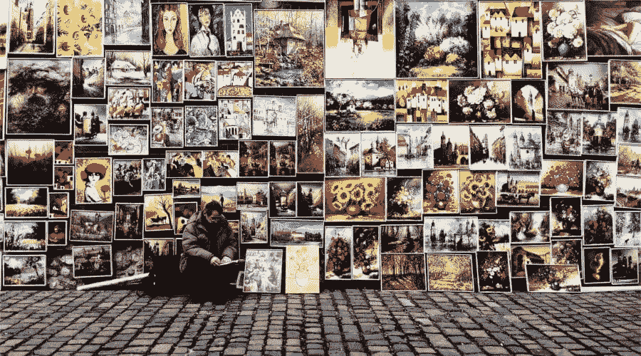
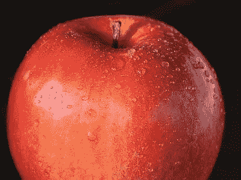
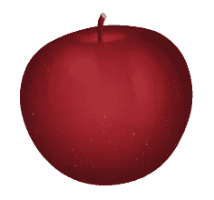
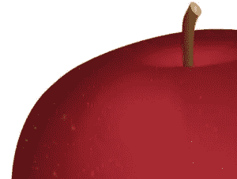

# 什么是适合你网站的图片格式？

> 原文：<https://www.sitepoint.com/what-is-the-right-image-format-for-your-website/>

*本文是与 [SiteGround](https://www.siteground.com/sitepoint-recommended?afcode=97a975da3502771c04e59cbae092b1dd&campaign=image-format) 合作创作的系列文章的一部分。感谢您对使 SitePoint 成为可能的合作伙伴的支持。*

截至 2017 年 3 月，图片占网络内容的[超过 65%](http://httparchive.org/interesting.php?a=All&l=Mar%2015%202017#bytesperpage) 。

这并不奇怪:图片增加了美感，传达了信息，讲述了故事，并与你的网站访问者建立了联系。

另一方面，如果使用不当，图片通常是网站运行缓慢和用户体验不佳的主要原因。

在网络上正确使用图片主要涉及两件事:

*   选择正确的图像格式
*   [优化](https://developers.google.com/web/fundamentals/performance/optimizing-content-efficiency/image-optimization)您的图像。

在本文中，我讨论第一点。特别是，我介绍了最适合 web 的图像格式以及它们最适合什么样的图像。

但是在我继续之前，让我们先简单地澄清一些术语。

## 光栅/位图与矢量图像

光栅或位图图像由二维像素网格组成。每个像素存储颜色和透明度值。

光栅图像缩放不太好:如果放大光栅图像，它将失去清晰度和质量。网络上流行的光栅图像类型有 JPEG 或 JPG、GIF 和 PNG 格式。

这里有两个苹果的光栅图像(JPG)。第一个是自然大小的图像。第二张是同一张图片的放大图

自然大小的光栅图像示例。

光栅图像的细节放大超过其自然大小。

请注意图像放大版本相对于原始副本的质量下降。

相比之下，矢量图像由线条、形状和路径点组成。向量的信息不是以像素存储的。相反，它们存储在完全独立于像素的数学绘图指令中。Alex Walker 说得很好，他提到了 SVG，这是 web 上最流行的矢量格式，如下所示:

> SVG 不是一种图像格式——它更像是一种图像*。*
> 
>  *[为什么 JPEGs 像麦当劳的苹果派(而 SVG 不像)](https://www.sitepoint.com/svg-vector-effects-non-scaling-strokes/)*

 *独立于分辨率的一个含义是，你可以随心所欲地缩放矢量图像:它们看起来总是清晰而令人敬畏，非常适合视网膜屏幕。

小比例 SVG 图形。

放大的 SVG 图形的细节。

上面的两幅图像是同一个矢量图形的视图，但是在第二幅图像中，矢量的大小是第一幅图像的两倍多。然而，质量并没有下降。

## 有损与无损

*有损*和*无损*都是指应用于数字媒体，即图像、音频和视频的文件压缩技术。

有损压缩:

> 不会将数字数据解压缩回 100%的原始数据。有损方法可以提供高度的压缩，并产生较小的压缩文件，但某些原始像素、声波或视频帧会被永久删除。
> 
> [PCMag.com 百科](http://www.pcmag.com/encyclopedia/term/46335/lossy-compression)

这实际上意味着，有损文件压缩得越多，它就变得越小。然而，文件越小，你也不可逆转地失去了一些原始文件的质量。有损压缩涉及小文件大小和质量之间的权衡。

你在网上经常看到的有损图像类型是 JPEG。

相比之下，无损压缩不涉及压缩资源和原始资源之间的数据丢失。这意味着压缩不会导致文件质量下降。但是，由于这个原因，无损文件格式通常比有损文件格式的文件大。

你可以在网上很容易找到的无损图像格式是 GIF 和 PNG。

在决定内容的最佳图像格式时，这些初步信息很有帮助。

下面我要介绍的前三种图像文件类型，即 JPG、GIF 和 PNG，已经在网站上使用了很长时间。最后两种，即 SVG 和 webP，虽然不完全是新的格式，但还不是主流。然而，由于它们非常适合响应迅速、加载速度快的网站的需求，它们的受欢迎程度一直在大幅增长。

## 联合图像专家组

JPEG 或 JPG 是由联合图像专家组开发的一种有损图像格式

网站上几乎 3%的内容类型是由 JPG 图片组成的。这就是这种图像格式如此受欢迎的原因:

*   JPG 格式可以显示数百万种颜色。这使得它成为在网上展示照片的理想选择
*   作为一种有损文件类型，您可以使用压缩来大大减小其文件大小。JPG 文件提供了不同的压缩级别:大约 60%对于网页图像是可以的，而任何高于 75%的压缩都会导致图像质量下降。
*   所有支持互联网的设备都支持 JPG 图像格式，这使得在网站上使用非常方便。

JPG 文件中缺少的一个值得注意的东西是对透明度的支持。因此，如果你打算使用透明背景来将你的图片与网页的背景颜色或纹理融合，JPG 图片并不是一个合适的选择。最好选择我下面列出的一个选项。

## GIF 格式

GIF 代表图形交换格式。这是一种 8 位无损格式，最多支持 256 种颜色。这种限制使得 GIF 文件不适合显示宽颜色范围和照片图像。

以下几点对 GIF 文件在网站上的长期使用起到了巨大的作用:

*   考虑到 256 色的限制，文件大小通常很小
*   支持透明度
*   支持动画。这使得它们适合显示循环动画图像，如图标、表情符号、横幅等。
*   适用于颜色单调的简单图像，但不适用于照片

## PNG

PNG 代表便携式网络图形。这是由 W3C 开发的 GIF 的替代格式。像 GIF 一样，它使用无损压缩算法，有 8 位或 24 位格式。这两种风格都支持透明。但是，24 位 PNG 图像的透明度是使用 alpha 通道以及红色、绿色和蓝色通道实现的。因此，尽管 GIF 和 8 位 PNG 图像要么完全不透明，要么完全透明，但 PNG 图像中的每个像素都提供了多达 256 种级别的不透明度。

您可以将 24 位 PNG 格式用于

*   具有不同透明度级别的 Web 图像
*   复杂的照片和图形
*   您需要经常编辑和导出的图形:它们的无损格式确保了质量不会下降。

与 GIF 格式不同，PNG 图像类型不支持动画，并且它们的文件大小可能相当大。

## 挽救（saving 的简写）

SVG 代表可缩放矢量图形，它是一种基于 XML 的矢量文件类型。虽然它从 2001 年就存在了，但是直到最近才在 web 开发人员中变得非常流行。这种迟来的爱的原因在于 SVG 已经享受了多年的糟糕的浏览器支持。幸运的是，我很高兴地说，在撰写本文时， [SVG 在所有主流浏览器](http://caniuse.com/#search=svg)中都得到了支持，尽管还存在一些不一致和错误。

SVG 格式有大量的特性值得推荐，是 web 图形格式的绝佳选择，尤其是用于简单的图像，如徽标、地图、图标等。，这是非常适合的。

### SVG 格式的优点

*   SVG 通常比它们的栅格副本文件小，特别是如果你[为网络优化它们并以 gzipped](https://www.sitepoint.com/svg-good-for-website-performance/) 格式提交它们
*   它们是可扩展的，这意味着无论屏幕分辨率如何，它们看起来都很清晰
*   您可以在 HTML 标记中使用 SVG 代码并保存 HTTP 请求
*   SVG 代码适合使用 CSS 进行定制
*   你可以用 CSS 和 JavaScript 来制作 SVG 图像的动画，包括它们的各个部分，这非常酷。

因为文件大小可能会增长很多，所以尽量避免过于复杂的 SVG 图像用于 web。最后，对于摄影图像，SVG 是不适合的，你最好坚持 JPG 格式或 webP。

## WebP

尽管自 2010 年就已经存在，但我不会说 webP 仍然感觉很新，它不如 JPG 或巴布亚新几内亚那样知名。然而，这种图像格式有网络的基因:它生来就是专门用于网络的，这使得它非常有趣

WebP 是 Google 开发的开源图像格式。以下是它的主要特点:

> WebP 是一种现代的**图像格式**，为网络上的图像提供卓越的**无损和有损**压缩。…与 png 相比，WebP 无损图像的大小要小 26%。WebP 有损图像比可比较的 JPEG 图像小 25-34%…无损 WebP 支持**透明** …成本只是 22%的额外字节。对于可接受有损 RGB 压缩的情况，**有损 WebP 也支持透明性**，通常提供比 PNG 小 3 倍的文件大小。
> 
> [WebP 网站](https://developers.google.com/speed/webp/)

webP 的美妙之处在于它结合了 JPG 和 PNG 格式的优点，而没有庞大的文件大小。

此时[浏览器支持已经相当不错了](http://caniuse.com/#search=webp):基于 Blink 的浏览器从一开始就已经全部上船了，毕竟 webP 是 Google 的创造物之一。为了在不支持的浏览器中向后兼容，例如 IE/Edge、Firefox 和 Safari，一些聪明人已经设计了适当的解决方法。

这里有一些很棒的资源，您可以从中了解更多关于 webP 的知识，以及如何立即实现它:

*   [WebP 常见问题解答](https://developers.google.com/speed/webp/faq#how_can_i_detect_browser_support_for_webp)
*   什么是 WebP 图像格式(为什么重要)？
*   [如何选择完美的图片格式来优化你的网站](https://www.sitepoint.com/how-to-select-the-perfect-image-format-to-optimize-your-website/)
*   [今天使用 WebP 图片的指南:案例研究](https://www.smashingmagazine.com/2015/10/webp-images-and-performance/)
*   [使用网页图片](https://css-tricks.com/using-webp-images/)

## 结论

在本文中，我概述了 web 图像格式，并简要讨论了它们更适合的图像类型。

JPG、GIF 和 PNG 是非常流行的格式，已经使用了很长时间。SVG 和 webP 是更新的、令人兴奋的替代品。SVG 非常适合插图和简单的图像，webP 很好地涵盖了所有可以使用 JPG 和 PNG 的实例。

你在开发工作中使用过 SVG 或者 webP 吗？你面临过哪些挑战？您是否体验到任何显著的性能提升？

点击评论框分享！

## 分享这篇文章*