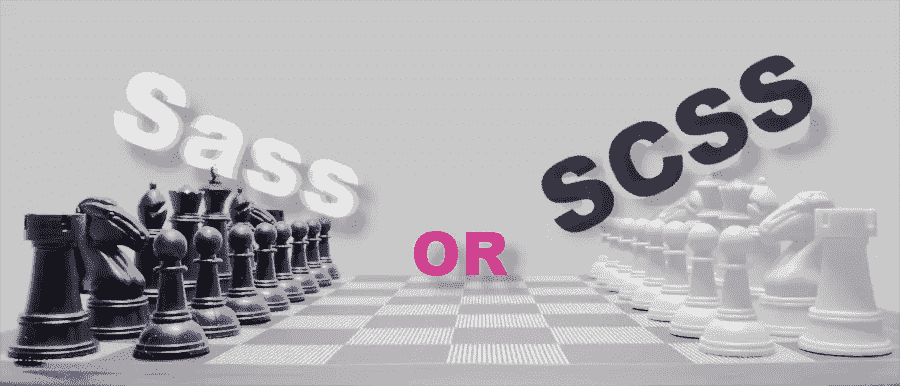

# 萨斯和 SCSS 有什么不同？

> 原文：<https://www.sitepoint.com/whats-difference-sass-scss/>



*这是一篇文章的更新版本，最初发表于 2014 年 4 月 28 日。*

我已经写了很多关于萨斯的文章，但是我得到的一些评论表明，并不是每个人都确切知道萨斯指的是什么。这里有一点需要澄清:

当我们谈论 *Sass* 时，我们通常将预处理器和语言作为一个整体来看待。例如，我们会说，“我们正在使用 Sass”，或者“这是一个 Sass mixin”。同时，Sass(预处理器)允许两种不同的语法:

*   **Sass** ，又称*缩进语法*
*   **SCSS** ，一个类似 CSS 的语法

## 萨斯的历史

最初，Sass 是另一个名为 [Haml](http://haml.info/) 的预处理器的一部分，由 Ruby 开发者设计和编写。因此，Sass 样式表使用了类似 Ruby 的语法，没有大括号、分号和严格的缩进，就像这样:

```
// Variable
!primary-color= hotpink

// Mixin
=border-radius(!radius)
-webkit-border-radius= !radius
-moz-border-radius= !radius
border-radius= !radius

.my-element
color= !primary-color
width= 100%
overflow= hidden

.my-other-element
+border-radius(5px)
```

正如你所看到的，与普通的 CSS 相比，这是一个很大的变化！即使您是一个 Sass(预处理器)用户，您也可以看到这与我们所习惯的完全不同。变量符号是`!`而不是`$`，赋值符号是`=`而不是`:`。很奇怪。

但这就是 Sass 的样子，直到 2010 年 5 月 3.0 版本的到来，引入了一个全新的语法，称为 SCSS，代表 Sassy CSS。这种语法旨在通过引入 CSS 友好的语法来缩小 Sass 和 CSS 之间的差距。

```
// Variable
$primary-color: hotpink;

// Mixin
@mixin border-radius($radius) {
-webkit-border-radius: $radius;
-moz-border-radius: $radius;
border-radius: $radius;
}

.my-element {
color: $primary-color;
width: 100%;
overflow: hidden;
}

.my-other-element {
@include border-radius(5px);
}
```

SCSS 绝对更接近 CSS 而不是 Sass。也就是说，Sass 的维护者还通过将缩进语法中的`!`(变量符号)和`=`(赋值符号)移至 SCSS 的`$`和`:`，努力使两种语法更加接近。

现在，当开始一个新项目时，您可能想知道应该使用哪种语法。让我来启发一下路径，解释一下每种语法的优缺点。

## Sass 缩进语法的优点

虽然这个语法看起来很奇怪，但是它有一些有趣的地方。首先，**更短，更容易打字**。没有大括号和分号，你不需要所有这些东西。甚至更好！不需要`@mixin`或者`@include`，单个字符就够了:`=`和`+`。

此外，Sass 语法**依靠缩进来执行干净的编码标准**。因为一个错误的缩进很可能会破坏整个`.sass`样式表，所以它确保代码始终是干净的和格式良好的。有一种方法可以编写 Sass 代码:好的方法。

但是要小心！缩进*在 Sass 中的意思是*。当缩进一个选择器时，意味着它嵌套在前一个选择器中。例如:

```
.element-a
color: hotpink

.element-b
float: left
```

…将输出以下 CSS:

```
.element-a {
color: hotpink;
}

.element-a .element-b {
float: left;
}
```

将`.element-b`向右推一级的简单事实意味着它是`.element-a`的子元素，改变了生成的 CSS。*非常小心*你的压痕！

作为题外话，我觉得基于缩进的语法可能更适合 Ruby/Python 团队，而不是 PHP/Java 团队(尽管这是有争议的，我很乐意听到相反的意见)。

## SCSS 语法的优点

对于启动器，它是完全符合 CSS 的**。这意味着，你可以在`.scss`中重命名一个 CSS 文件，它就会*正常工作*。自 SCSS 发布以来，让 SCSS 与 CSS 完全兼容一直是 Sass 维护者的首要任务，在我看来这是一件大事。此外，他们试图尽可能接近将来可能成为有效的 CSS 语法(因此有了`@directives`)。**

 **因为 SCSS 与 CSS 兼容，这意味着几乎没有学习曲线。语法是已知的:毕竟，它只是带有一些额外功能的 CSS。当与没有经验的开发人员一起工作时，这一点很重要:他们将能够在不知道 Sass 的第一件事的情况下快速开始编码。

此外，**更容易读懂**，因为它实际上是有意义的。看了`@mixin`，就知道是 mixin 宣言；当你看到`@include`的时候，你在叫一个 mixin。它没有任何捷径，大声读出来一切都有意义。

此外，大多数现有的 Sass 工具、插件和演示都是使用 SCSS 语法开发的。随着时间的推移，这种语法变得越来越重要，成为默认选择，主要是出于上述原因。

## 最后的想法

选择权在你，但是除非你有很好的理由使用缩进语法编码，否则我强烈建议你使用 SCSS 而不是 Sass。不仅更简单，也更方便。

我曾经自己尝试过缩进语法，并且很喜欢。我喜欢它的简短和简单。实际上，在最后一刻改变主意之前，我正准备将整个代码库转移到 Sass。我感谢过去的自己停止了这一举动，因为如果我们使用缩进语法，那么使用我们的一些工具将会非常困难。

另外，请注意 *Sass* 从来不是大写的，无论你谈论的是语言还是语法。同时， *SCSS* 总是大写。需要提醒吗？【SassnotSASS.com】来救援了！

## 分享这篇文章**