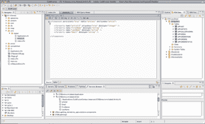
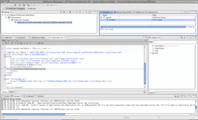
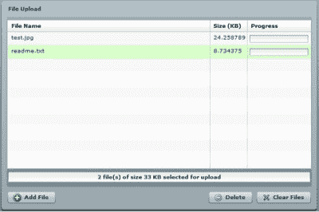

# ColdFusion 9 有什么新功能？

> 原文：<https://www.sitepoint.com/whats-new-coldfusion-9/>

ColdFusion 9 测试版终于来了，有很多值得兴奋的事情。如果您准备好迎接挑战，[通过我们的测验来测试您对 ColdFusion 新功能的了解！](https://www.sitepoint.com/quiz/adobe/whats-new-coldfusion-9/)此外，对于输入详细信息的前 200 名竞猜参赛者，还有一份免费赠品可供争夺——ColdFusion 福音传道者工具包，其中包含您需要了解的关于 cold fusion 世界正在发生的一切。

ColdFusion 和 ColdFusion 标记语言(CFML)最近获得了广泛的关注，有两个替代引擎引起了开源社区的兴趣；现在，人们的兴趣越来越大，下一代 Adobe cold fusion——以前称为**Centaur**——作为公共预览版推出。ColdFusion 9 的预发布版本推出了一组非常有趣的新功能。

其中包括对各种标签、CFScript 语言、整体语法和编码风格、PDF 子系统和 Ajax 组件的改进。可能最公开讨论和期待的两个功能是 ColdFusion IDE ColdFusion Builder(也以其代号 Bolt 而闻名)和 ColdFusion 9 的新 ORM(对象关系映射)系统。我们将看一些代码示例——如果你热衷于跟随，你可以[在这里获得所有这些，](https://www.sitepoint.com/examples/coldfusion9/code.zip)和[观看实际演示](http://sitepointdemos.fasthit.net/cf9new/)。让我们开始吧！

*小心！本文中描述的功能和所有代码示例都基于发布时在 [Adobe Labs](http://labs.adobe.com) 上提供的 ColdFusion 9 预发布版本。请理解，Adobe 可能会随时更改甚至删除预发布软件的功能，因此本文中的某些功能可能会从最终版本中删除。*

Kay Smoljak 为本文贡献了关于 ORM 和 Ajax 特性的章节和例子，这是一个巨大的荣誉。

##### ColdFusion Builder

让我们从即将发布的 ColdFusion 9 版本中最引人注目的特性之一开始这篇文章: [ColdFusion Builder。](http://labs.adobe.com/technologies/coldfusionbuilder/)虽然 ColdFusion Builder 9 是一款独立的产品，与 ColdFusion 9 服务器产品本身是分开的，但我们认为这是 Adobe 在过去几年中最重要的举措之一。ColdFusion 老手可能会记得 Allaire 的 ColdFusion Studio 的美好时光，这是最后一个商用的专用 ColdFusion IDE。

ColdFusion Builder 是在 Eclipse 之上创建的，Eclipse 是一个著名的开发框架，支持许多流行的 ide。Adobe 过去很好地利用了 Eclipse——Flex Builder(现在称为 Flash Builder)和 Flash Catalyst 都是基于 Eclipse 的工具。

IDE 为自己提供了一个典型的类似 Eclipse 的工作区，由各种视图组成。在下图中，您将看到一个常见的开发设置，包括左侧的项目导航器、中间的代码视图以及右侧的多个帮助器视图，如 outline、RDS 数据库和文件服务器视图以及日志文件访问。



可以在 ColdFusion Builder 中设置多台服务器，这样就可以直接与开发、试运行和生产环境进行交互。代码视图还提供了用于快速访问常用 ColdFusion 标签、HTML 和 CSS 功能的工具栏。

ColdFusion Builder 包括一个行调试器，已经使用 Eclipse 的开发人员很快就会熟悉它。这是 Adobe 在 ColdFusion 8 中已经引入的一个功能，但现在随着专门的 IDE 迎合调试过程而焕发了新的生机。这是正在运行的调试器。



这里我们要介绍的第三组特性是非常有用的代码和内容帮助，以及语法检查。任何好的 IDE 都应该理所当然地包括语法突出显示和代码完成，但 Adobe 已经添加了对实例化 ColdFusion 组件(CFC)和内省 CFC 方法的有用支持，您将在下图中看到这一点。


ColdFusion Builder 还通过直接在 IDE 中解析文件来提供对代码的持续语法分析。仅这项功能就极大地提高了工作效率——不再需要在浏览器中运行页面来查看 ColdFusion 代码中是否有语法错误。

当然，ColdFusion 9 不仅仅是一个闪亮的新 IDE。让我们来看一些服务器特性和实际例子。

##### 语言规范增强

让我们来看看 ColdFusion 语言本身的一些变化和改进。这些改进中的第一项是围绕 CFScript 的，这些变化可以最好地描述为将 CFScript 升级为 ColdFusion 9 中的一等公民。CFScript 是一种以类似 JavaScript 的方式编写 CFML 代码的方法。不幸的是，CFScript 从未支持 ColdFusion 的全部语言功能，并且在许多方面都受到了限制。

在 ColdFusion 9 中，我们现在可以完全在 CFScript 中编写 ColdFusion 组件，并且可以从 CFScript 中运行 SQL 查询。为了进行比较，我们来看一个在 CFML 和 CFScript 中编写和调用的相同日志组件。使用 CFML，让我们创建一个简单的日志组件:

```
<cfcomponent>  

  <cffunction name="init" output="false" access="public"  

   returntype="logWithTags">  

    <cfargument name="logFile" default="customLogger"  

      type="string" required="no"/>  

    <cfset variables.logFile = arguments.logFile />  

    <cfreturn this/>  

  </cffunction>  

  <cffunction name="write" output="false" access="public"   

   returntype="void">  

    <cfargument name="message" type="string" required="yes"/>  

    <cfset writelog(text=arguments.message, file=variables.logFile)/>  

  </cffunction>  

</cfcomponent>
```

下面是我们调用组件并向日志中写入消息的方式:

```
<cfinvoke component="logWithTags" method="init"  

  logFile="LogTestDeleteMe" returnvariable="logger" />  

<cfinvoke component="#logger#" method="write"  

  message="Testing out the new logger with CFML." /> 
```

在 ColdFusion 9 中，我们可以使用 CFScript 来实现这一目的。这里有一个用 CFScript 编写的日志组件，它在功能上与上面的组件相同:

```
component  

  {  

    public log function init (string logFile="customLogger") output="false"  

      {  

      variables.logFile = arguments.logFile;  

      return This;  

      }  

    public void function write(string message) output="false"   

    {  

    writelog(text=arguments.message, file=variables.logFile);  

    }  

  }
```

在 CFScript 中，我们会像这样调用它:

```
<cfscript>  

  logger = new log('LogTestDeleteMe');  

  logger.write("Testing out the new logger.");  

</cfscript>
```

让我们探索如何从 ColdFusion 9 的新 CFScript 引擎执行数据库查询。如果您是 Java 开发人员，您会发现代码的结构与编写通过 JDBC 查询 SQL 数据库的 Java 代码是多么相似。方法`setDataSource`中传递的参数是对 SQL 数据库的命名引用，该数据库可以在 ColdFusion 的管理工具中设置:

```
<cfscript>  

  query = new Query();  

  query.setDataSource('cfartgallery');  

  query.setSQL("SELECT * from artists") ;  

  results = query.Execute().getResult();  

</cfscript>  

<cfdump var="#results#">
```

其他语言增强包括用于异常处理的[标签](http://help.adobe.com/en_US/ColdFusion/9.0/CFMLRef/WSc3ff6d0ea77859461172e0811cbec22c24-74dd.html)，嵌套[标签](http://help.adobe.com/en_US/ColdFusion/9.0/CFMLRef/WSc3ff6d0ea77859461172e0811cbec22c24-7c6b.html)的能力，赋值链接(`a=b=c=d`等等)，以及对三元运算符(如`a = (b<c)?b:c`)的支持。

ColdFusion 9 还提供了与 PDF 文档和电子表格的新集成。[更新的 PDF 子系统](http://help.adobe.com/en_US/ColdFusion/9.0/Developing/WSc3ff6d0ea77859461172e0811cbec22c24-70da.html)提供了从 PDF 中提取文本并优化它们的新工具。后者特别有趣:PDF 文档通常充满了书签、注释、JavaScript 和其他信息，但在许多用例中，最好去掉这些额外的数据。

从 PDF 文档中提取文本就像使用`cfpdf`标签的新动作`extracttext`一样简单。这里，我们将从测试文档中提取文本:

```
<cfpdf action="extracttext"   

  source="#ExpandPath('./testdocument1.pdf')#"   

  name="xTestdoc"  />
```

同样，使用新的`optimize`动作，我们可以从 PDF 中删除书签和注释，并将结果写入一个新的优化文件:

```
<cfpdf action="optimize"   

  source="#ExpandPath('./testdocument1.pdf')#"   

  destination="#ExpandPath('./testdocument1_optimised.pdf')#"  

  nobookmarks = true  

  nocomments = true />
```

另一个与外部数据格式集成的非常有趣的机会是用`cfspreadsheet`标签创建的。它提供了一种与两者的 Excel 文档进行交互的方式。xls 和。xlsx 类型，并使开发人员能够从电子表格读取数据和向电子表格写入数据。下面的代码从 Excel 2007 文档中读取数据，并将内容输出到表格中:

```
 <cfset XLSfile = "#ExpandPath('.')#/authorData.xlsx" />   

<cfspreadsheet action="read" src="#XLSfile#"   

    sheet="1" query="excelQuery" headerrow="1" />   

<table>   

  <tr>   

    <th>First Name</th>   

    <th>Last Name</th>   

    <th>Words written</th>   

  </tr>   

  <cfoutput query="excelQuery" startrow="2">   

  <tr>   

    <td>#firstName#</td>   

    <td>#lastName#</td>   

    <td>#wordsWritten#</td>   

  </tr>   

  </cfoutput>   

</table>
```

ColdFusion 的`SpreadsheetAddRow`功能允许您在 Excel 文件中创建新条目。ColdFusion 9 还支持 OpenOffice 电子表格:

```
<cfset XLSfile = "#ExpandPath('.')#/authorData.xlsx" />   

<cfspreadsheet action="read" src="#XLSfile#" name="excelObj" />   

<cfset SpreadsheetAddRow(excelObj,"Diane,Sieger,654,2",3,1) />   

<cfspreadsheet action="write" name="excelObj" filename="#XLSfile#" overwrite="true" />
```

##### ColdFusion 蠕虫

ColdFusion 9 中最令人兴奋的新功能之一是 [ColdFusion ORM](http://help.adobe.com/en_US/ColdFusion/9.0/Developing/WSD628ADC4-A5F7-4079-99E0-FD725BE9B4BD.html) 。ORM 代表对象关系映射——这是面向对象编程中的一个概念，其中代码对象被映射到关系数据库表以进行持久存储。ORM 允许您使用对象模型通过应用程序访问和更新数据，而无需了解底层数据库结构的任何细节。其思想是 ORM 为程序员处理所有平凡的、机械的任务:编写表格脚本、编写 CRUD 操作(创建记录、更新和删除——大多数应用程序的基本构建模块)等等，让他们专注于有趣的、具有挑战性的编程任务。ORM 的其他优势包括数据库供应商独立性和内置缓存特性。听起来不错，对吧？

编写面向对象应用程序的 ColdFusion 开发人员过去已经能够在外部框架的帮助下使用 ORM， [Transfer](http://transfer-orm.com) 和 [Reactor](http://trac.reactorframework.com) 是两个最著名的。然而，ColdFusion 9 的新内置 ORM 功能基于 [Hibernate](http://hibernate.org) ，这是一个开源 ORM 库，自 2004 年左右就出现在 Java 世界中了。它很受欢迎，经过尝试和测试，鉴于 ColdFusion 基于 Java，这是 ColdFusion 团队的明显选择。

那么它是如何工作的呢？使用 ORM 系统有两种方法:要么用代码创建数据对象，让 ORM 为您创建数据库表，要么从数据库开始，让数据对象为您构建。ColdFusion ORM 允许您以这两种方式工作。

举个非常基本的例子，如果您希望 ColdFusion 为您创建表格，您可以通过设置一些基本变量在应用程序组件中启用 ColdFusion ORM。假设您使用的 MySQL 数据源已经在 ColdFusion Administrator 中设置为`sampledb`:

```
<cfset this.ormenabled="true">    

<cfset this.datasource="sampledb">    

<cfset this.ormsettings={Dialect="MySQL"}>
```

接下来，创建 CFC，将`persistent`的值设置为`true`,将 CFC 映射到数据库表。这个例子中的 CFC 有两个属性——`name`和`email`:

```
<cfcomponent persistent="true">    

  <cfproperty name="Name">    

  <cfproperty name="Email">    

</cfcomponent>
```

现在，您可以使用 ORM 函数如`EntityLoad`和`EntitySave`来检索和更新数据。

当应用程序运行时，如果数据库中不存在该表，将会创建该表。另一方面，如果您已经有一个数据库结构，并希望 ColdFusion 生成您的代码，您将需要 ColdFusion Builder 来检查您的数据库并生成代码。如果您希望对 ColdFusion 创建代码的方式保持一定的控制，也没关系-您可以创建自己的基础模板来指定生成的代码应该如何排列，或者下载并安装他人的模板。

##### Ajax 特性

ColdFusion 8 更令人兴奋的更新之一是添加了新的 Ajax 组件，使 ColdFusion 程序员可以通过几个简单的标记来使用 ExtJS 和 YUI JavaScript 库的功能。现在，在 ColdFusion 9 中，Adobe 团队加大了赌注，升级了所有的库(包括将 ExtJS 从 1.0 版升级到 3.0 版)，这带来了许多全面的增强。

特别是，datagrid 和 accordion 组件已经更新，新组件包括多文件上传工具、进度指示器小部件、媒体播放器控件和 Google Maps 小部件。

最简单地说，用新的`cffileupload`标签创建的多文件上传组件只需要`url`属性，该属性指定将在服务器上处理文件上传的处理脚本:

```
<cffileupload url="ProcessFiles.cfm">
```

下面，您将看到上传组件是如何出现的。



有许多可用的配置选项，包括限制要上传的文件的大小、最大数量和类型，以及组件的按钮标签、大小和颜色。

新的`cfmediaplayer`标签以现在无处不在的 Flash 视频格式播放视频文件。flv)。同样，非常简单的实现只需要一个参数:要播放的文件的位置:

```
<cfmediaplayer source="sample.flv">
```

配置选项包括高度、宽度、定义边框和背景颜色的能力、显示视频控件的选择以及允许全屏播放视频，甚至还包括在加载、开始和完成时触发的 JavaScript 函数。以下是基本媒体播放器的外观:


一个非常有用的 Ajax 组件是[新的`cfmap`小部件](http://help.adobe.com/en_US/ColdFusion/9.0/CFMLRef/WSc3ff6d0ea77859461172e0811cbec22c24-7c6b.html)，它嵌入了谷歌地图。域的 Google Maps API 密钥可以在 ColdFusion Administrator 中指定，也可以在站点的 Application.cfc 文件中指定，或者在运行时通过`cfajaximport`标签导入。就像这样简单:

```
<cfajaximport params="#{googlemapkey='YOUR API KEY'}#">    

<cfmap centeraddress="345 Park Avenue, San Jose, CA, USA" zoomlevel="8"></cfmap> 
```

这将生成以下地图:


你会注意到`cfmap`有一个开始和结束标签。在标签对内部，您可以放置`cfmapitem`标签来表示其他项目。再加一个指出 Adobe 的总公司:

```
<cfajaximport params="#{googlemapkey='YOUR API KEY'}#">    

<cfmap centeraddress="San Jose, CA, USA" zoomlevel="6">    

  <cfmapitem name="marker01"    

   address="345 Park Avenue, San Jose, CA, USA"    

   tip="Adobe's Head Office"/>    

</cfmap>
```

现在，您的地图将显示附加标记，如下所示:


总之，ColdFusion 的预览版对 web 开发人员来说是一项非常有趣的技术。该产品有如此多的新功能和改进，我们无法详细讨论每个功能，甚至无法在此提及所有功能，但您可以在新的[管理员指南](http://help.adobe.com/en_US/ColdFusion/9.0/Admin/index.html)和 [CFML 参考文档](http://help.adobe.com/en_US/ColdFusion/9.0/CFMLRef/index.html)中找到大量关于 ColdFusion 9 的信息。 [ColdFusion 9](http://labs.adobe.com/technologies/coldfusion9/) 和 [ColdFusion Builder](http://labs.adobe.com/technologies/coldfusionbuilder/) 测试版也已经推出——现在是开始工作的时候了！

**ColdFusion 9 包含了许多新功能和改进。[通过我们的测验来测试您对新款 ColdFusion 产品的了解程度！](https://www.sitepoint.com/quiz/adobe/whats-new-coldfusion-9/)别忘了，填写详细信息的前 200 名参与者将会收到一个崭新的 ColdFusion 传道者工具包——非常适合说服你的老板尝试 ColdFusion！**

## 分享这篇文章