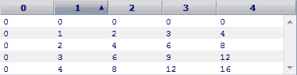
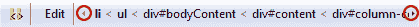
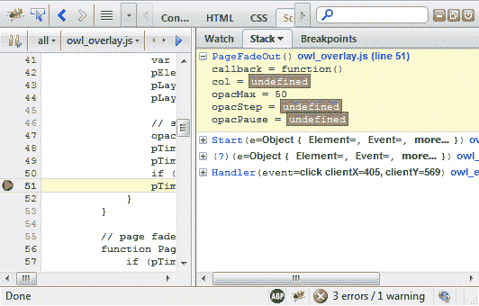

# Firebug 1.6 的新特性

> 原文：<https://www.sitepoint.com/whats-new-firebug-16/>

你还记得萤火虫出现之前的黑暗日子里的生活吗？许多年来，Internet Explorer 只提供了一个愚蠢的弹出框，其中包含模糊的消息，如*“对象不是第 0 行对象的实例。”*早期的 Firefox 和 Opera 控制台有所帮助，但只是针对 JavaScript 问题。

毫不夸张地说，Firebug 革新了客户端编码。如果没有它，许多应用程序将永远无法构建。你现在可能更喜欢 Opera 的蜻蜓、Webkit Inspector 或 IE 的开发者工具，但所有这些都受到了 Joe Hewitt 插件的影响。对我来说，Firebug 仍然是最好的浏览器开发工具。

## Firebug 1.6

Firebug 的 1.6 版本刚刚发布。你可以从[getfirebug.com](http://getfirebug.com/)或 [Mozilla 插件](https://addons.mozilla.org/en-US/firefox/addon/1843/)安装它。以下是最好的新功能…

## 任何地方的命令行

现在任何面板都可以使用命令行，而不仅仅是控制台。有一个新的工具栏图标来启用它，尽管它在脚本和 DOM 面板中最有用。例如，如果 JavaScript 执行在断点处停止，您可以输入变量的名称来查看其值。在某些情况下，这可能比使用“监视”窗口更快。

## 控制台消息过滤

控制台窗口中显示的消息现在可以按错误、警告、信息和调试输出进行过滤。这些信息也用颜色编码，即红色表示错误，黄色表示警告。

## 新的 console.table()日志命令

console.table()命令允许您将表格数据记录到控制台窗口，例如

```
 var data = [];
for (var i = 0; i < 5; i++) {
	data[i] = [];
	for (var j = 0; j < 5; j++) {
		data[i][j] = i * j;
	}
}
console.table(data); 
```



## 更容易的 HTML 检查

所有子节点和孙节点现在都可以在 HTML 面板中展开。右键单击任何元素并选择“全部展开”(或键入*)。

节点层次结构(或者面包屑轨迹)是可以滚动的——对于所有那些深度嵌套的元素非常有用…



最后，DOCTYPE 总是显示出来。

## 改进的 CSS 处理

现在可以复制规则的整个 CSS 声明或者只是样式本身。右键单击 HTML 窗格的样式窗口中的任何声明。这是我一段时间以来一直想要的功能。

计算窗口中显示的样式也可以折叠成文本、背景、框模型、布局和其他组。

## 更好的 JavaScript 工具

主要改进之一是堆栈面板，当调试器在断点处停止时，它会显示一个函数调用列表。到目前为止，查看起来有点棘手——但是 1.6 在单独的一行上显示了每个函数，可以展开该行来显示参数:



有用的是，在会话之间保存断点。你可以关闭 Firefox，重新启动浏览器，所有的断点仍然被设置。

如果您使用 HTML5 离线存储工具，您会很高兴听到 localStorage 和 sessionStorage 数据也显示在 DOM 面板中。

## 一个新图标！

如果这些功能还不够，也许你会对新图标印象深刻？还不满意？为什么[不在 Firebug 新闻组](http://groups.google.com/group/firebug)中提出 1.7 版本的改进建议？

Firebug 仍然是你主要的浏览器开发工具吗，还是你已经移植到另一个调试器了？请在 [SitePoint 投票](/)上投票，并在下面留下您的评论…

## 分享这篇文章