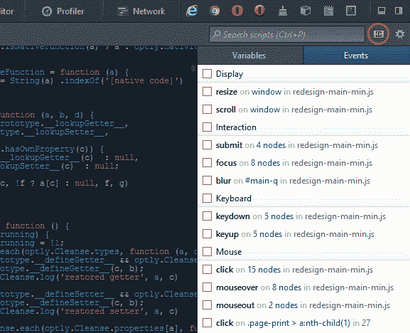

# 火狐 27 的新功能

> 原文：<https://www.sitepoint.com/whats-new-firefox-27/>

火狐 26 于去年发布[。没错，是 12 月 10 日，但那是 2013 年！版本 27 于 2014 年 2 月 4 日发布，你可以通过自动更新(菜单>帮助>关于火狐)或者从【getfirefox.com】T2](/whats-new-firefox-26/)下载全新安装来获得。

大多数用户会想知道这有什么大惊小怪的。幸运的是，Mozilla 为开发者提供了一些有趣的新特性…

## 开发人员工具更新

我喜欢火狐工具。它们还不是 Firebug 的替代品，但它们速度很快，非常适合快速和肮脏的编辑。Firefox 27 增加了一系列新功能:

*   HTML 元素可以编辑；您可以自由地将`div`更改为`section`或任何其他元素。
*   可以预览背景颜色和图像。
*   “选项”面板允许您选择默认颜色格式(十六进制、HSL(A)、RGB(A)或颜色名称)。
*   使用“{}”图标可以显示简化的 JavaScript 源代码。这将有助于你理解那些社交媒体小工具实际上在做什么。
*   浏览器回流可以记录在控制台中—在 **CSS** 按钮下拉菜单中启用**日志**。
*   可以检查 SVG 元素样式。
*   黑暗主题现在在窗格间一致有效。

此外，通过 DOM 事件断点，JavaScript 调试变得更加容易。您可以将断点设置为在特定浏览器事件发生时自动触发。导航到**调试器**窗格，点击**展开窗格**图标(高亮显示)，然后点击**事件**选项卡:

将显示页面中当前侦听器的列表。选中“任何”可在该点停止执行。

## 新 CSS 未设置值

Firefox 27 现在支持[新的`unset`值](https://www.w3.org/TR/css3-cascade/#valuedef-unset)，这是一个 [CSS 范围的关键字](https://www.w3.org/TR/css3-values/#common-keywords)，可以应用于任何属性。使用时，当继承值可用时，它的行为就像是`inherit`。如果它找不到一个——例如，如果属性是一个非继承的属性，如`box-shadow`——它将应用浏览器默认设置。

您可以将它与[的`all`属性](http://dev.w3.org/csswg/css-cascade/#all-shorthand)(例如`all: unset;`)一起使用，将值应用于每个属性(除了`direction`和`unicode-bidi`)。

不可否认的是，我在努力想这在什么情况下会有用。

## 杂项更新

除了常见的错误和安全修复，Firefox 27 还提供了…

*   `cursor`属性的`grab`和`grabbing`值不再需要前缀-moz(尽管这些值仍然没有在[规范](http://dev.w3.org/csswg/css-ui/#cursor)中列出)。
*   对前缀`-moz-rgba`和`-moz-hsla`的支持已经取消。
*   虚线支持在`canvas`元素上可用。
*   如果振动数组或持续时间被认为太长，则 [navigator.vibrate](/use-html5-vibration-api/) API 返回 false。那会让一些人失望的！
*   iframes 可以被沙箱化，以进一步将页面与其嵌入的页面隔离开来。
*   SocialAPI 支持多个提供者。尽管兴趣相对较低，但 Mozilla 似乎急于推动这项技术。
*   添加了 SPDY 3.1 协议支持。
*   传输层安全性(TLS) 1.2 已经实现。
*   Android 版本现在支持立陶宛语、斯洛文尼亚语、南非英语和泰语。

仅仅是开发者工具的更新就让 Firefox 27 成为一次值得的升级。版本 28 将在大约六周后发布，应该会提供一些面向用户的改进，如更好的 Windows 8/8.1 集成。

## 分享这篇文章