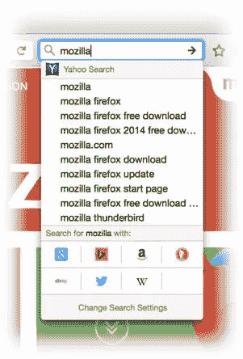
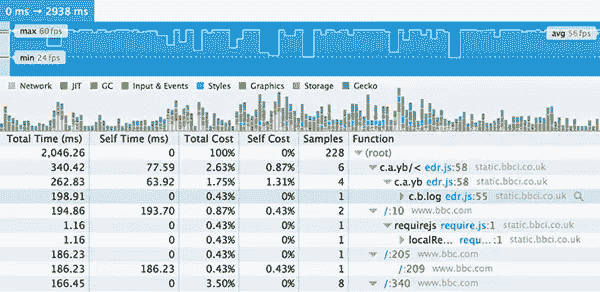
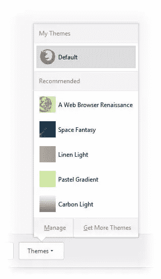

# 火狐 34 的新功能

> 原文：<https://www.sitepoint.com/whats-new-firefox-34/>

是时候进行另一次(基本上没有痛苦的)浏览器升级了。Mozilla 发布了 Firefox 34，为用户和开发者提供了许多新功能，并对默认搜索引擎进行了有争议的切换。让我们来看看引擎盖下…

## 再见谷歌，你好雅虎

默认谷歌搜索的十年已经结束。Mozilla 与谷歌的有利可图的合作关系已经结束，Firefox 用户每年执行的 1000 亿次搜索将有另一种选择。根据新闻稿:

> 在评估我们的搜索合作伙伴关系时，我们的首要考虑是确保我们的战略符合我们的选择和独立价值观，并使我们能够以最适合我们的用户和网络的方式创新和推进我们的使命。最后，我们可以选择的每一个合作伙伴都有着强大的、改善的经济条件，反映了 Firefox 给生态系统带来的巨大价值。

对于那些看不懂营销 BS 的人来说，这大致可以翻译成*“雅虎会给我们更多的钱”*。根据协议，未来五年:

*   雅虎将成为美国用户的默认搜索引擎。
*   Yandex 将是俄罗斯用户的默认选择。
*   百度将继续成为中国用户的默认选择。
*   谷歌仍将是全球其他用户的默认选择。不可避免地会有一些商业回报，但没有官方安排。
*   谷歌、必应、DuckDuckGo、易贝、亚马逊、Twitter 和维基百科将继续成为内置搜索选项。

除了资金方面的担忧，我怀疑谷歌的商业愿景和自己的浏览器与 Mozilla 并不契合。有传言称，谈判破裂是因为谷歌不急于遵循不追踪隐私标准。有趣的是，雅虎忽略了 DNT，但现在将启用它——但只针对火狐用户。

最有趣的是*没有*在说什么。雅虎不再为自己的搜索引擎提供动力；表面之下，是微软的必应。

最终，这对用户来说无关紧要:您可以继续使用您喜欢的任何引擎。Mozilla 不需要盈利，但发现这笔交易如何影响重新投入火狐开发的收入将是一件有趣的事情。



## 改进的搜索栏

一个新的一键式搜索栏提供了建议和一个带有替代引擎的图标集。奇怪的是，只有美国用户得到这种增强，所以我猜这是雅虎交易的一部分？

## 火狐你好

Hello 是由 [tokbox](https://tokbox.com/) 使用 [WebRTC](http://www.webrtc.org/) 搭建的实时视频聊天。本质上，它是 Skype 或 Google Hangouts，不需要额外的软件、插件或用户帐户。或者甚至是 Firefox——一个“你好”链接可以发送给任何一个有 WebRTC 兼容浏览器的人，比如 Chrome 或者 Opera。

与竞争对手不同的是，WebRTC 是一种点对点服务，所以你可以聊天，而不会有提供商打断你的谈话。它正在逐步推出——如果你看不到它，在 about:config 中启用 **loop.throttled** 并重启浏览器。您可能需要使用“自定义”将“Hello”图标拖到工具栏或菜单上的某个位置。


这项服务还在测试阶段，我收到过几次失败的消息，但这是一个有希望的开始。

## windows“Firefox 已经在运行”修复

有时，Firefox 不会在 Windows 上启动，因为它已经在后台运行了——通常情况下，这是因为用户的配置文件被锁定了。唯一的解决方案是打开 Windows 任务管理器并终止 Firefox 进程——这不是一般用户所知道的。

虽然问题没有完全解决，Firefox 34 显示了一条消息，允许您终止该过程。

## CSS 更新

添加了许多新的 CSS 字体级别 3 功能:

*   `[font-kerning](https://developer.mozilla.org/en-US/docs/Web/CSS/font-kerning)`控制字母的间距:`auto`、`normal`或`none`。
*   `[font-synthesis](https://developer.mozilla.org/en-US/docs/Web/CSS/font-synthesis)`控制如何合成缺失的粗体或斜体字体:`none`(都不应该合成)、`weight`、`style`或`weight style`(都可以合成)。
*   `[font-variant-position](https://developer.mozilla.org/en-US/docs/Web/CSS/font-variant-position)`可以设置为 normal、sub 和 super，分别定义更小的下标和上标字符。Firefox 试图使用正确的字体符号——例如 <sup>2</sup> 方形字符。在不存在的地方，它现在将创建合成替代品。
*   `[font-variant-caps](https://developer.mozilla.org/en-US/docs/Web/CSS/font-variant-caps)`控制大写字母的可选字形，例如小型大写字母、标题大写字母。
*   `[font-variant-numeric](https://developer.mozilla.org/en-US/docs/Web/CSS/font-variant-numeric)`控制数字、分数和序数标记的替代符号，如斜线零、对角线分数、堆叠分数等。
*   `[font-variant-east-asian](https://developer.mozilla.org/en-US/docs/Web/CSS/font-variant-east-asian)`控制东亚文字的替代字形，如中文和日文，如简体、繁体、jis90 等。
*   `[font-variant-ligatures](https://developer.mozilla.org/en-US/docs/Web/CSS/font-variant-ligatures)`控制两个或多个字母连接成一个字形的印刷连字，如普通连字、历史连字等。
*   `[font-variant-alternates](https://developer.mozilla.org/en-US/docs/Web/CSS/font-variant-alternates)`控制与`@font-feature-values`定义的备选名称相关的备选字形。
*   支持`[font-variant](https://developer.mozilla.org/en-US/docs/Web/CSS/font-variant)`，是`font-variant-caps`、`font-variant-numeric`、`font-variant-alternates`、`font-variant-ligatures`、`font-variant-east-asian`的简写。

此外，对`min-width`、`max-width`和转换进行了一些小的更新和修复，改变了显示、位置或溢出。

## JavaScript 更新

[模板](https://developer.mozilla.org/en-US/docs/Web/JavaScript/Reference/template_strings)是包含被解析的其他变量的字符串——类似于 PHP 中双引号字符串的求值。模板字符串用反引号(`)括起来，并使用`${}`来保存每个表达式，例如

```
var a = 5, b = 10;
console.log(`Fifteen is ${a + b} and not ${2 * a + b}.`);
// same result as:
console.log("Fifteen is " + (a + b) + " and not " + (2 * a + b) + ".");
```

现在可以采用新的 ES6 函数简写。例如，而不是:

```
var myObject = {
  methodOne: function() {},
  methodTwo: function() {},
  generator: function*() {}
};
```

您可以使用:

```
var myObject = {
  methodOne() {},
  methodTwo() {},
  * generator() {}
};
```

`[Object.assign](https://developer.mozilla.org/en-US/docs/Web/JavaScript/Reference/Global_Objects/Object/assign)`方法将可枚举的和自己的属性从一个或多个源对象复制到一个目标对象，而不需要你自己的递归循环，例如

```
var o1 = { a: 1 }, o2 = { b: 2 }, o3 = { c: 3 };
var obj = Object.assign(o1, o2, o3);
console.log(obj);
// { a: 1, b: 2, c: 3 }
```

如果指定的选择器字符串选择了一个元素，例如

```
var e = document.getElementById("myelement");

console.log( e.matches("body #myelement") ); // true
console.log( e.matches("#anotherelement") ); // false
```

`[Performance.now()](https://developer.mozilla.org/en-US/docs/Web/API/Performance.now)`方法返回以毫秒为单位的浮点日期戳，精确到千分之一毫秒！这类似于不太精确的返回整毫秒的`Date.now()`。零值表示:

*   1970 年 1 月 1 日的 Unix 时代
*   如果从 web worker 运行，则为该 worker 启动的时刻
*   如果从另一个工作进程创建的 web 工作进程运行，则为父工作进程的纪元时间

`window.scroll()`、`window.scrollTo()`、`window.scrollBy()`增加了平滑滚动的方法。是时候了！

最后， [ES6 weakset](/preparing-ecmascript-6-set-weakset/) 已经实现。

## 开发人员工具更新

新的存储检查器允许您查看 cookies、localStorage、sessionStorage 和 IndexDB 中的站点数据。需要通过打开工具，点击设置轮齿图标并检查**存储**选项来启用。

在设置中，启用**选择一个 iframe 作为当前目标文档**。这允许您单独检查 iframe 内容，而不是将其视为父文档的子文档。

页面检查器显示附加到带有 **ev** 图标的 DOM 节点的事件。然而，在以前的版本中，使用 jQuery 定义的事件会显示 jQuery 的内部处理函数。从版本 34 开始，检查器显示了父处理函数——这要有用得多。

性能工具和帧速率时间线已经过重新设计，有助于评估响应能力。



控制台现在支持 [console.table](/three-little-known-development-console-api-methods/) ，这对于输出存储在数组和对象中的结构化数据很有用。

最后，您可以访问 Web Audio inspector 和 WebIDE，如 [Firefox 开发者版](/mozilla-introduces-firefox-developer-edition/)中所提供的。

如果这还不够，一个新的 [dev/panel API](https://developer.mozilla.org/en-US/Add-ons/SDK/Low-Level_APIs/dev_panel) 允许你构建自己的开发者工具扩展和插件。*萤火虫的日子屈指可数了吗？*

## 杂项更新

还有更多…



*   一个新的**主题**按钮显示在自定义中。
*   HTTP/2 实现。
*   维基百科使用 HTTPS 进行安全搜索(再说一遍，是我们——只是出于某种原因？)
*   全屏视频在 Mac 上禁用睡眠和屏幕变暗。
*   (又一个)为安卓版重新设计。
*   Android 上的 Firefox 支持谷歌 Chromecast 设备的镜像。
*   各种[安全修复](https://www.mozilla.org/security/known-vulnerabilities/firefox/)。

唷。对于六周的开发时间表来说，这是一个令人印象深刻的更新数量。

现在还为时尚早，但 Firefox 34 似乎也比 33 版更快更稳定。也许是我使用的附加组件的组合，但我经历了各种问题和崩溃，并考虑降级到 v32。希望主要问题已经解决。

虽然雅虎的转变在很大程度上无关紧要，而且我对美国独有的功能数量感到有点担心，但 Firefox 34 是一个很好的更新。火狐 35 将于 2015 年初出现。

## 分享这篇文章