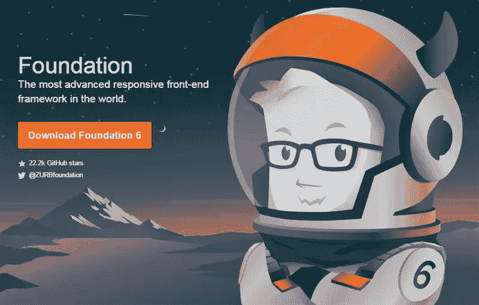
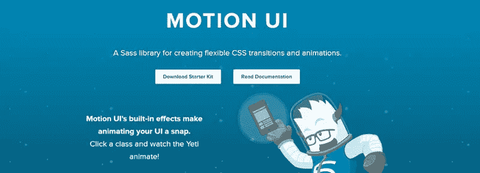
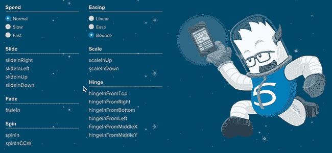
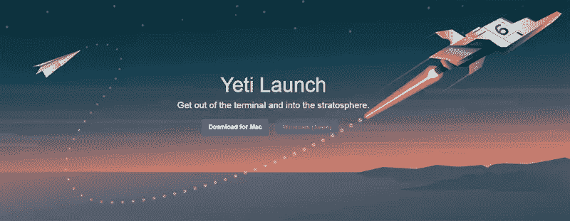
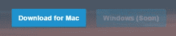
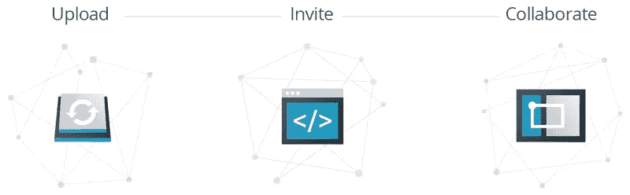
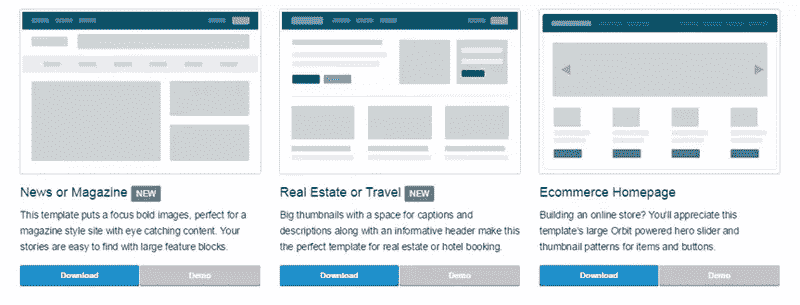
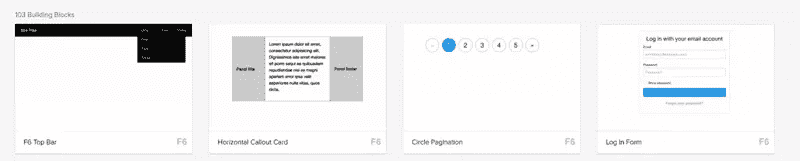
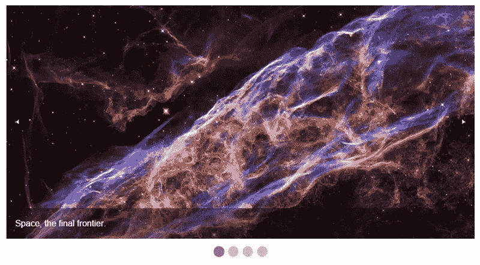

# Foundation 6 有什么新特性？

> 原文：<https://www.sitepoint.com/whats-new-in-foundation-6/>

尽管我喜欢从头开始构建系统，控制设计和开发的每一个部分，但有时让框架来处理对基础的控制会更快、更好、更容易，这样您就可以专注于有趣的事情。

CSS 框架已经存在有一段时间了，它们的目标是提供一个坚实的基础，你可以在你的项目中实现它来处理基础问题(重置、网格布局、媒体元素、排版等)。虽然有大量的框架，但两大巨头 **Bootstrap** 和 **Zurb 基金会**已经争论了一段时间，在每个版本中改进、精炼和更新他们的框架。

[基础框架的第 6 版现已发布](http://zurb.com/article/1416/foundation-6-is-here)，今天我将浏览一下最重要的部分，看看有什么变化和引入了什么。

[](http://foundation.zurb.com/)

## Foundation 6 对我有什么好处？

不像以前的版本关注于增量升级，Foundation 6 带来了对框架的大量修改。Zurb 几乎回到了绘图板，利用他们所有的技能、来自社区的反馈以及浏览器技术的进步来重新开发 Foundation。

该框架已经进行了重大改革，多个组件被削减，只提供一个基础结构。大多数元素都经过了简化，使它们比以前更快、更小、更容易使用，并且总体上更好。这个版本的核心口号似乎是让事情回归基本。

随着对现有组件的更改，出现了一些很酷的新功能，如 Flex Grid、Motion UI、Yeti Launch 以及其他构建块和模板。

## 优化基础:全面检修

当人们谈论框架时，我听到的主要抱怨之一是它们的规模。他们担心下载时间和网站臃肿。总的来说，这是一个合理的担忧，一些框架浪费了高达 90%的资产。有了这个最新版本，Zurb 已经能够显著减小其系统的整体大小，**与 Foundation 5** 相比下降了 50%以上。

如果您需要 Foundation 5 中的所有内容，CSS 和 JavaScript 文件将分别为 160KB 和 110KB。在 Foundation 6 中，这两个值分别降至 68KB 和 92KB。尺寸的减小是由于 Zurb 在发布前讨论的几个基本变化，包括:

1.  将几个较大的组件重新定义为较小的模块化组件(比如导航菜单)。
2.  降低特异性。框架不再有深度嵌套的选择器和样式，而是轻松地处理样式(让您更容易定制您的站点)。
3.  简化 Sass 变量和 mixins 以创建更少的选项(其目的是成为一个你自己定制的框架)。大多数组件都以某种形式进行了更改，以使其更加精简，不那么臃肿。
4.  重新定义他们的 JavaScript，这样每个组件都可以共享通用工具，而不是使用自己的功能(减少浪费，保持模块化)。

简而言之，这些改进是相当大的。优化已经保存了数千行渲染样式，并将各种 JavaScript 实用程序整合在一起。

## 运动用户界面:简单的动画和过渡

一个真正伟大的功能最终进入了生产阶段，那就是新的 [Motion UI 库](http://zurb.com/playground/motion-ui)。本质上，这个库是一系列过渡和动画，Foundation 使用它们来驱动自己的几个组件(如 [Reveal](http://foundation.zurb.com/sites/docs/reveal.html) 、 [Toggler](http://foundation.zurb.com/sites/docs/toggler.html) 和 [Orbit](http://foundation.zurb.com/sites/docs/orbit.html) 元素)。



Motion UI 实际上来自 Zurb 的 [Foundation for Apps](https://www.google.ca/url?sa=t&rct=j&q=&esrc=s&source=web&cd=1&cad=rja&uact=8&ved=0ahUKEwi3iOfD-5HKAhWLGB4KHYZ3ALsQFggfMAA&url=http%3A%2F%2Ffoundation.zurb.com%2Fapps.html&usg=AFQjCNEQ-y-B5ex9VGapMUig2l4BFLHnWA&sig2=rqAf5FRVZmCTMMUe_L5JzQ) 分支，但作为一个可选(但强烈推荐)的库进入了 Foundation。 [Zurb 知道动态很重要](http://zurb.com/article/1340/foundation-for-apps-motion-ui-is-the-new-)，如果使用得当，可以给你的网站带来额外的互动和活力。

您可以利用它的多个选项来控制动画的速度、缓动效果和一系列动作，如滑动、淡入淡出、缩放等。巧妙地使用移动可以给你的网站带来深度感，增强你的用户体验。



Motion UI 是可选的，所以你需要在下载你的定制包时[选择它。如果你有 Sass 版本，应该很简单，只要确保它包含在你的`app.scss`文件中。](http://foundation.zurb.com/sites/download.html/#customizeFoundation)

```
@include motion-ui-transitions;
@include motion-ui-animations;
```

### 预建过渡

使用这个库最简单的方法之一就是利用[预建的类](https://github.com/zurb/motion-ui/blob/master/docs/classes.md)。就像添加您想要的过渡一样简单(例如，`scale-in-up`)。Motion UI 会完成剩下的工作。

### 自定义过渡

如果您喜欢冒险，您可以通过使用各种 Sass mixins 并定制它们来构建自己的过渡。过渡文档概述了你需要做的事情(基本上你包括混音并定义你的选项来创建你的效果)。

### 自定义动画

您还可以使用该库来创建自定义动画和效果，使用各种 Sass mixins 来创建您自己的自定义效果。例如，您可能想让某物滑入、晃动，然后反弹。你可以通过创建自己的动画来做到这一点。[查看文档](https://github.com/zurb/motion-ui/blob/master/docs/animations.md)了解所有这些是如何组合在一起的。

### Motion UI 和 JavaScript

Motion UI 还附带了一个[小 JavaScript 插件](https://github.com/zurb/motion-ui/blob/master/docs/javascript.md)，用于帮助你处理过渡或动画。它的主要目的是您可以动态地触发一个转换并监听它的结束事件(您可以用它来触发更多的动画或做其他事情)。因为`fade-in`和`fade-out`转换显示和隐藏元素，所以包含了这个脚本。

## Yeti 启动:让您更快地启动和运行

你可能会问，什么是雪人发射？基本上[它是一个配套应用](http://foundation.zurb.com/develop/yeti-launch.html)，你可以通过命令行运行它来消除安装和配置 Foundation 的一些复杂性。



虽然你可以下载预编译的 CSS 和 JavaScript，但 Foundation 的一个优势是它可以用 Sass 定制，让你配置你想要的(定制网格、布局、颜色、混合等)。随着 Yeti 的推出，Zurb 将帮助您更快地启动并运行一个新项目。

你不仅可以用它来构建网站，还可以用 Foundation 的姐妹框架来构建 web 应用和电子邮件模板，让它成为你开发的一站式商店。

### Sass 基金会或 Zurb 开发堆栈

Yeti 提供的另一个很酷的特性是，在创建新项目时，它让您选择使用标准的 Sass-powered Foundation 设置或他们自己的开发框架。

Zurb 的开发堆栈附带了一些漂亮的附加功能，例如:

*   UnCSS(删除未使用的 CSS 样式)
*   UglifyJs(用于 JavaScript 压缩)
*   图像压缩
*   静态站点生成器(基于模板)
*   车把模板(用于构建动态模板)

这是 Zurb 在他们的项目中使用的相同设置，所以它如何被社区采用应该会很有趣。

### 平台支持

如果 Yeti Launch 听起来像是你热衷于尝试的事情，那么你应该从他们的网站上下载这个应用。一个小小的警告是，如果你在 Windows 上，你就不走运了，他们仍然在整理他们的 Windows 应用程序。



这很难抱怨，因为他们在这次更新中提供了如此多的新的和完善的工具，但是对于 Windows 用户来说，能够带着 Yeti 转一圈是很好的。

## 与著名代码的协作和反馈

Zurb 提供的另一项新服务是将您的开发站点推送到在线知识库，然后允许您的团队成员访问它以提供反馈。这项服务被称为[显著代码](http://foundation.zurb.com/upload.html)，提供了一种处理项目反馈和协作的独特方式。

值得注意的核心概念由几个简单的步骤组成:上传、邀请、合作。



值得注意的是，您可以使用他们的 Yeti 启动导出(仅限 OSX)、通过 Foundation 命令行界面(CLI)导出，或者压缩您的站点并上传，将您的开发站点推送到在线存储库。

您还可以邀请他人在线查看您的项目。每个团队成员都将获得一个安全的 URL 到您的站点，并且在您更新项目时会得到通知。

值得注意的一大部分吸引力在于，用户将能够在他们选择的任何设备上访问你的原型，然后能够对你的设计提供注释。

另一个特点是，值得注意的将让用户改变他们的屏幕大小，以便他们可以在不同的断点查看网站。用户将能够在每个设备尺寸上进行标注，这样你就可以很容易地获得关于你的网站响应度的反馈。

## 无障碍改进

有时候，在我们的开发过程中，易访问性可能会被忽略(在我们匆忙地整理这些信息时，我们忘记了网络应该是为每个人服务的)。Zurb 在重建其几个关键组件的过程中关注了可访问性。

在 Foundation 的早期版本中，键盘和屏幕阅读器可以访问几个组件，但是其中有几个组件存在问题(例如 JavaScript 驱动的菜单)。

在 Foundation 6 中，所有组件都考虑了可访问性。[网站文档概述了几个关于可访问性的有用资源](http://foundation.zurb.com/sites/docs/accessibility.html)并且整个网站的示例片段都支持 ARIA(具有适当的角色和属性)。这种对可访问性的关注应该有助于你创建任何人都能喜欢的网站。

## 模板和构建基块

Zurb 提供了一系列免费的完整代码示例，您可以从他们的网站下载。你可以下载[模板](http://foundation.zurb.com/templates.html)(完整的网站)或者[构建模块](http://foundation.zurb.com/develop/building-blocks.html)(组件)，你可以把它们直接放到一个项目中。

虽然这些元素是在旧版本的 Foundation(如 Foundation 5)中提供的，但这些元素已经过更新，使用了更新的框架，因此它们将更小，更容易定制，并且总体上比以前更好。

### 模板

模板是您开始新项目的快捷方式。它们包含了一个基本的布局，带有滑块、导航栏、社交媒体图标等常见元素。你可以把它们分开，选择你喜欢的特性，或者以它们为基础进行定制。



您可能想要查看的两个有趣的模板是[新闻/杂志](http://foundation.zurb.com/templates-previews-sites-f6/news-magazine.html)和[房地产/旅游](http://foundation.zurb.com/templates-previews-sites-f6/real-estate.html)模板。它们都具有全面的响应能力，并使用最新的菜单和组件。

### 积木

构建块用于展示特定的组件，如菜单、滑块、滚动区域和其他漂亮的 UI 事物。



在他们的库上有[堆各种各样的例子，但是它们并不都基于更新的 Foundation 6。Zurb 正在基于他们更新的组件慢慢发布新的，但是有几个真的很酷，比如](http://zurb.com/building-blocks)[顶部菜单](http://zurb.com/building-blocks/f6-top-bar)和[登录表单](http://zurb.com/building-blocks/log-in-form)模块。

## 创建插件的新的公共 JavaScript 实用程序

Foundation 设法缩小代码库的一个方法是将插件从通用函数中抽出来，放入实用程序中。实用程序现在是公开的，这意味着您可以在构建交互性时使用它们。

有一堆这样的助手工具，你可以利用它们来加速你的开发。你应该花点时间浏览一下，看看哪些是你感兴趣的。

我在下面列出了一些更有用的方法。

### 媒体查询实用程序

[媒体查询实用程序](http://foundation.zurb.com/sites/docs/javascript-utilities.html#mediaquery)与更新的断点更改设置结合使用[特别有用。该实用程序的主要好处是，它为您提供了一种与断点交互的简单方法。](http://foundation.zurb.com/sites/docs/media-queries.html#javascript)

我们通过访问`Foundation.MediaQuery`来实现。以下是您会发现有用的功能:

*   `get`–返回所选断点的最小像素值。
*   `atLeast`–检查当前断点是否至少与传入的断点一样大(如小或中)。

我们还可以通过获取`current`属性来获取当前断点名称。这将返回名称，如`small`或`medium`。

我们也可以[挂钩到当我们切换到另一个断点时调用的事件](http://foundation.zurb.com/sites/docs/media-queries.html#watching-for-breakpoint-changes)。`changed.zf.mediaquery`事件为我们提供了事件本身、我们移动到的新大小和我们离开的旧大小。

总的来说，这是一个非常有用的工具，可以帮助你与响应式设计元素进行交互，并且可以帮助你最大限度地利用断点。

### 时间和图像加载实用程序

这个[工具库](http://foundation.zurb.com/sites/docs/javascript-utilities.html#timer-amp-images-loaded)可以让你访问定时器和动作触发器。对象让你运行简单的定时器。这些定时器的作用类似于`setInterval`，除了它们给你更多的控制(比如能够暂停和恢复)。

例如，你可能想每 10 秒获取新的图像，但是如果发生了一些动作，你想停止计时器，只有当你好的时候才返回。这里我们每 10 秒执行一次`checkStuff()`函数:

```
var imagesTimer = new Foundation.Timer(myElement, 10000, checkStuff);
```

使用计时器功能意味着您可以通过`start`、`pause`和`continue`来控制体验。这由“动态观察”滑块在内部使用。

当所有传入的图像都已加载时，`onImagesLoaded`函数可用于执行一个函数。例如，您可能有一个包含 6 幅图像的图库网格，只有在它们都被渲染后，您才希望触发某些功能(或显示一条消息):

```
var $images = $('.gallery-image');
Foundation.onImagesLoaded($images, processGallery);

// called once all gallery images are loaded. 
function processGallery() {
  alert('Loaded!');
}
```

事实证明，该实用程序主要用于了解元素何时被加载并做出相应的反应。

### 触摸工具

[触摸实用程序](http://foundation.zurb.com/sites/docs/javascript-utilities.html#touch)正如其听起来的那样，是一种为你的元素添加触摸交互性的快速简单的方法。

我们可以通过调用选择器上的`addTouch()`方法来绑定触摸事件，然后传入一个函数来处理我们的逻辑:

```
// let's handle a right swipe
$('.my-element').addTouch().on('swiperight', 'handleSwipeFunction');
```

如您所见，通过使用该实用程序绑定基本触摸控件进行处理非常简单。其他组件如[轨道传送带](http://foundation.zurb.com/sites/docs/orbit.html)也使用这个，所以它应该工作可靠。

## 轨道滑块:一个更新的目的

虽然 Foundation 6 中引入了大量新工具和系统，但有几个现有功能已经过升级和改进，比以前更好。让我们来看看一些亮点



在 Foundation 5 中，轨道滑块是一个复杂的组件，允许用户创建完全响应的交互式图像、视频和内容滑块。Orbit 已经建立了很长一段时间，多年来已经有了几十个配置选项，导致维护它的工作量很大。

Zurb 宣布他们将停止为 Foundation 6 [提供 Orbit](http://foundation.zurb.com/forum/posts/14504-moving-on-from-developing-orbit) ，你可以想象，这让许多喜欢它所提供的灵活性的人感到不安。

然而，Foundation 6 [并没有完全移除它，而是将 Orbit 重新设计成一个轻量级的简单滑块](http://foundation.zurb.com/sites/docs/orbit.html)，虽然是基本的，但仍然提供了很好的定制。它现在更像是一个线框工具，而不是一个全面的滑块。

## 更新的响应断点

[Foundation 5 为您的响应式设计定义了一系列不同的断点](http://foundation.zurb.com/sites/docs/v/5.5.3/media-queries.html)，包括小型、中型、大型、xlarge 和 xxlarge。总的来说，在使用它的 Sass 变体时，它的工作方式是定义您想要作为目标的设备配置文件，然后在其中添加您的样式，如下所示:

```
// target small profiles
@media #{$small-only} {
  .primary{
 border: solid 1px red;
  }
}
// target medium profiles
@media {$medium-only} {
  .primary{
 padding: 25px;
  }
}
// standard styles 
.primary {
 position: relative;
 margin-bottom: 15px;
 padding: 15px;
}
```

在 Foundation 6 中，mixin 已经过更新，变得更加简单和直观。不是调用这些设备配置文件并为每个元素添加样式，现在**将 mixin 直接包含在元素**中，如下所示:

```
.primary {
  // small profiles
 @include breakpoint(small only) {
 border: solid 1px red;
  }
  // medium profiles
 @include breakpoint(medium only) {
 padding: 25px;
  }
  // standard styles
 position: relative;
 margin-bottom: 15px;
 padding: 15px;
}
```

这样做的好处是，你可以**将你所有的样式放在一起**，而不是在你的文件中搜寻每个个人资料的相关样式。这些都是为你保存的。

[断点混合](http://foundation.zurb.com/sites/docs/media-queries.html#the-breakpoint-mixin)允许你传入一系列不同的值，这些值会影响样式。

您想要的设备配置文件大小，如`small`、`medium`、`large`，以及可选的附加修饰符，如`down`、`up`或`only`(指定您想要选择更小、更大或正好是这个大小的断点大小)。如果你对你的设计特别挑剔，你甚至可以提供`landscape`、`portrait`或`retina`选项。

### 您自己的定制尺寸

既然我们在讨论断点，使用 Foundation 6，你可以通过定制你的`_settings.scss`文件中的`$breakpoints`变量来指定[你的站点](http://foundation.zurb.com/sites/docs/media-queries.html#changing-the-breakpoints)将使用什么大小的概要文件。

这个文件本质上是 Foundation 的 Sass 版本的配置点(它使用这些设置来构建生成的 CSS)。在这里你可以重新定义你的断点值，甚至包括新的断点值。

```
// the default Foundation 6 breakpoint ranges
$breakpoints: (
 small: 0,
 smedium: 420px, // my custom size
 medium: 640px,
 large: 1024px,
 xlarge: 1200px,
 xxlarge: 1440px,
);
```

如您所见，添加新的大小很容易(在本例中，我将`smedium`添加到了`420px`范围内的目标设备)。即使你在这里定义了你的尺寸，它们也不会输出任何 CSS，除非你也把它们添加到设置文件下面定义的`$breakpoint-classes()`变量中。

默认情况下，只使用`small`、`medium`和`large`配置文件，因此您需要在这里添加您的自定义配置文件来使其正常运行。

```
// including a new size (smedium)
$breakpoint-classes: (small smedium medium large);
```

你定义的尺寸越多，你生成的 CSS 就越多，所以要注意在你的站点中包含大量的新尺寸。

## 款式较少的独特设计

对于用流行框架构建的网站，一个常见的抱怨是“它们看起来都一样”。

Zurb 已经注意到了这件事的反馈，并大幅撤回了他们的风格。之前，base foundation 会为您提供一堆默认样式和设计元素，而 Foundation 6 中更新的样式留给您的更多是线框设计，而不是最终产品。

这对每个人来说都是一个好消息，因为这意味着你将得到框架的基础结构和布局的支持，但仍然可以轻松定制你的网站。作为这些变化的一部分，样式的特异性已经降低(因为对 Sass mixins 和变量的一些改变),使得定制你的站点的外观和感觉更加容易。

虽然只有时间能告诉我们社区将如何接受这些变化，但现在看来，每个人都必须加强他们的游戏，并从陈旧过时的设计中脱离出来。

## 基础网格和菜单呢？

在 Foundation 6 的新特性和改进特性列表中，明显缺少网格特性和菜单。这些领域也发生了一些重大变化，我将在未来几周详细介绍这些变化。

敬请关注！

## 最后的想法

虽然框架中仍然存在一些挥之不去的小错误和怪癖(Zurb 团队正在迅速解决)，但总的来说，这个版本是朝着正确方向迈出的重要一步。Zurb 不再为每个组件提供几十个选项，而是选择为您的结构提供最少的选项。

虽然一些开发人员可能会对组件被削减感到失望，从而减少了您的选择，并迫使您设计自己的元素，但总的来说，系统工作得更好，更像一个框架，而不是一个完整的网站解决方案。在这个过程中，他们减轻了大量的重量，提高了速度，并使基础更易于维护。

长话短说，Foundation 6 很棒，你应该试一试！

## 分享这篇文章