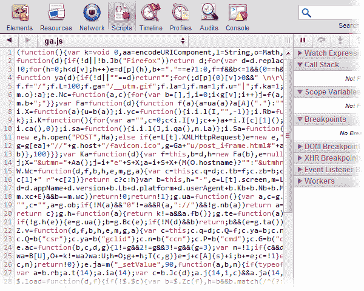
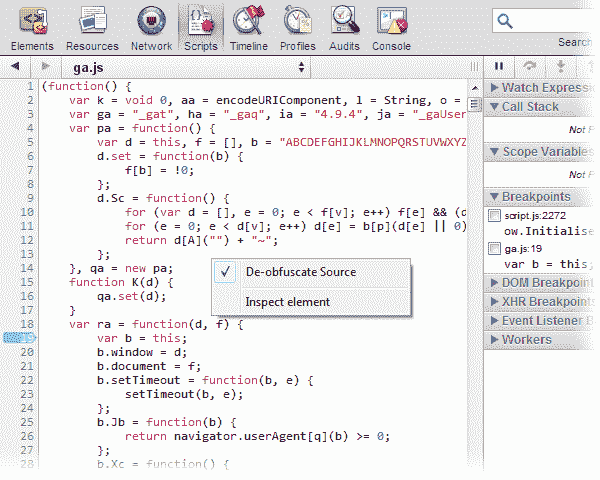

# 谷歌 Chrome 12 有什么新功能

> 原文：<https://www.sitepoint.com/whats-new-in-google-chrome-12/>

Chrome 12 于上周发布。你没注意到吗？很少有人知道。我并没有打算写这篇文章，但 Twitter 上的一些人说服了我(感谢 [@Mahen23](http://twitter.com/Mahen23) )。首先，让我们看一下常见的改进列表:

*   硬件加速的 3D CSS
*   能够在 Chrome 中分析和删除 Flash cookies
*   一个新的安全浏览功能，防止恶意文件下载
*   改进了浏览器设置的同步
*   更好的屏幕阅读器支持
*   新的 PDF 保存和打印按钮
*   从全向栏启动已安装的应用程序
*   堵塞了 14 个安全漏洞。

Chrome 12 也标志着一个时代的结束:Gears 已经不在了。Google Gears 于 2007 年推出，但一年后就停止了开发。该插件提供了本地数据存储、JavaScript 线程、桌面集成和地理定位，但这些已经被标准的 HTML5 技术取代。

## 内置 JavaScript 反混淆

合并和缩小 JavaScript 文件有几个好处:

1.  文件、大小和下载时间都减少了。
2.  可以提高代码处理速度。
3.  它隐藏了你最前沿的剧本。

不幸的是，缩小的脚本无法调试。代码是一团乱麻，包含在几行不能设置断点的代码中。这里有一个来自谷歌分析的例子:

恶心。然而，一个快捷的右键单击选项会将该脚本解模糊成可爱的可读源代码:

内置的模糊处理非常有用，尽管也有一些问题:

1.  JavaScript minifiers 经常用更短的名字替换长的函数和变量名，例如 MyLongFunctionName()变成了()。尽管您应该能够识别自己代码中的模式，但反混淆永远无法恢复原始名称。
2.  在反混淆代码上设置断点更受限制。可以分析响应事件或定时器而运行的函数。然而，当加载页面时，不可能在代码运行时中断，因为此时脚本还没有被反混淆。让我们期待 Chrome 团队在未来的版本中解决这个问题。

对我来说，这是 Chrome 最令人兴奋的发展。它可能会诱使你在测试实时代码时远离 Firebug 或蜻蜓。

有没有发现 Chrome 12 有什么很棒的新功能？

## 分享这篇文章