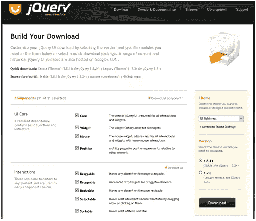
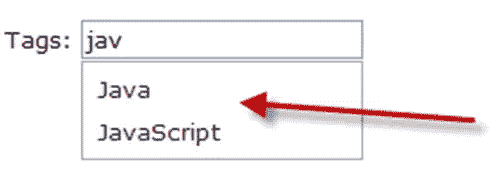

# jQuery UI 1.8 的新特性

> 原文：<https://www.sitepoint.com/whats-new-in-jquery-ui-1-8/>

当谈到在浏览器中构建交互式网站时，很少有像 jQuery UI 这样好的解决方案。jQuery UI 是一个建立在 jQuery 之上的免费库，它为低级交互、高级效果、动画以及主题化小部件提供了一个抽象。当前版本是 1.8 版。

本文将指导您使用 jQuery UI 1.8 下载和创建交互式 web 页面。

**开始之前**

jQuery UI 库由许多组件组成。组件封装了 UI 库特有的特定功能。被称为 UI 核心的必需组件是:

*   **核心**——jQuery UI 的核心，所有交互和小部件都需要它
*   **小部件**–小部件工厂，所有小部件的基础
*   **鼠标**–鼠标小部件，所有交互和大量鼠标交互的小部件的基类
*   **位置**–一个相对于其他元素定位元素的实用插件

允许用户与网站交互的组件分为以下几类:

*   **交互**——这些为任何元素添加基本行为，并被许多组件使用，如*可拖动*和*可排序*组件
*   Widgets-全功能 UI 控件-每个控件都有一系列选项，并且完全主题化
*   **特效**–一个丰富的特效 API 和随时可用的特效

可用组件的完整列表可在[这里](http://jqueryui.com/download)找到。

### 下载说明

下载 jQuery UI 库再简单不过了。只需访问[http://jqueryui.com/download](http://jqueryui.com/download)，选择组件并点击**下载**开始下载。图 1，“下载您的组件”显示这个屏幕。

**图一。下载您的组件**



对于这篇文章，我将下载所有的组件。下载完成后，会有一个包含三个文件夹的 *zip* 文件； *css* 、*开发-捆绑*和 *js* 。对于本文中的例子，您只需要提取 *css* 和 *js* 文件夹。本文中的所有例子都使用这些文件的相对路径。

【v1.8 版有什么新功能？

jQuery UI 的当前版本增加了两个新的实用程序、两个新的小部件、一个升级的小部件工厂和一个更加模块化的核心。一些更明显的变化概述如下。

**自动完成小工具**

Autocomplete 小部件使任何文本输入弹出一个菜单，以帮助用户完成文本输入或搜索框，或者为他们输入的搜索标准提供建议和改进。可以对自动完成功能进行自定义，以处理各种数据源。这是通过指定源选项来配置的。数据源可以是本地数据的数组，比如一个*数组*或*对象*，一个返回 JSON 数据的 URL，或者可以通过 Ajax 从服务器从外部数据存储(比如数据库)中检索。

为了让自动完成功能工作，您需要在页面中引用以下 JavaScript 和 CSS 文件:

```
<link rel="stylesheet" href="../../themes/base/jquery.ui.all.css" />

<script type="text/javascript" src="../../jquery-1.5.1.js"></script>

<script type="text/javascript" src="../../ui/jquery.ui.core.js"></script>

<script type="text/javascript" src="../../ui/jquery.ui.widget.js"></script>

<script type="text/javascript" src="../../ui/jquery.ui.position.js"></script>

<script type="text/javascript" src="../../ui/jquery.ui.autocomplete.js"></script>
```

这个数据源将是一个充满编程语言的数组。该数组将被设置为自动完成的源:

```
$(function () {

        Autocomplete.Init();

});

var Autocomplete = function () {

    var languages = [

                "ActionScript", "AppleScript",

                "Asp", "BASIC",

                "C", "C++",

                "Clojure", "COBOL",

                "ColdFusion", "Erlang",

                "Fortran", "Groovy",

                "Haskell", "Java",

                "JavaScript", "Lisp",

                "Perl", "PHP",

                "Python", "Ruby",

                "Scala", "Scheme"

    ];

    return {

            Init: function () {

                $("#tags").autocomplete({

                    source: languages

                });

          }

    }

} ();
```

图 2，“自动完成结果”显示了最终结果。

**图二。自动完成结果**



您可以使用许多不同的选项来配置 Autocomplete 小部件的行为。主要的有:

`disabled`–允许您启用或禁用自动完成功能:

```
$("#tags").autocomplete({

                source: languages,

                disabled: true

});
```

`delay`–自动完成在击键后激活自身前等待的延迟时间(毫秒):

```
$("#tags").autocomplete({

        source: languages,

        delay: 3000

});
```

`minLength`–在自动完成功能激活之前，用户必须键入的最少字符数:

```
$("#tags").autocomplete({

        source: languages,

        minLength: 2

});
```

`source`–用于自动完成的数据源。数据源包括返回 JSON 数据的 URL、本地对象或通过 Ajax 返回的 JSON 数据。以下示例使用免费的 GeoNames 数据库远程返回一个城市的结果:

```
$("#tags").autocomplete({

        minLength: 2,

        source: function (request, response) {

        $.ajax({

            url: "http://ws.geonames.org/searchJSON",

            dataType: "jsonp",

            data: {

                featureClass: "P",

                style: "full",

                maxRows: 5,

                name_startsWith: request.term

        },

        success: function (data) {

            response($.map(data.geonames, function (item) {

                return {

                        label: item.name + (item.adminName1 ? ", " +
                        item.adminName1 : "") + ", " + item.countryName,

                                 value: item.name

                }

            }));

        }

    });

}
```

**按钮小工具**

按钮小部件从页面上的任何元素创建一个可主题化的按钮。传统上，按钮的输入类型是提交、重置、图像或按钮，但开发人员逐渐从锚标签等元素开始创建。Button 小部件使其成为希望网站具有新风格的开发人员的一个有吸引力的选择。

为了让按钮小部件工作，您需要在页面中引用以下 JavaScript 和 CSS 文件:

```
<link rel="stylesheet" href="../../themes/base/jquery.ui.all.css" />

<script type="text/javascript" src="../../jquery-1.5.1.js"></script>

<script type="text/javascript" src="../../ui/jquery.ui.core.js"></script>

<script type="text/javascript" src="../../ui/jquery.ui.widget.js"></script>

<script type="text/javascript" src="../../ui/jquery.ui.button.js"></script>
```

要变换锚点元素，您需要找到锚点并将按钮小部件附加到它上面。像这样:

```
var anchor = $("a").button();

anchor.click(function () {

        alert('Hello');

});

<a href="#">My Anchor</a>
```

图 3，“锚作为一个按钮”显示了最终结果:

**图 3。锚定为按钮**


附加到锚点的是一个单击事件。您可以传入匿名函数或命名函数。Button 小部件还可以转换单选按钮。要转换单选按钮，调用 *buttonset* 函数来完成这项工作:

```
$("#radio").buttonset();

<div id="radio">

        <input type="radio" id="radio1" name="radio" /><label for="radio1">First</label>

        <input type="radio" id="radio2" name="radio" /><label for="radio2">Second</label>

        <input type="radio" id="radio3" name="radio" /><label for="radio3">Third</label>

</div>
```

图 4，“转换后的单选按钮”显示了最终结果:

**图 4。单选按钮转换**


这些仍然是单选按钮，所以任何时候只能选择一个。复选框也可以通过调用*按钮集*来转换:

```
$("#format").buttonset();

<div id="format">

<input type="checkbox" id="check1" /><label for="check1">One</label>

         <input type="checkbox" id="check2" /><label for="check2">Two</label>

         <input type="checkbox" id="check3" /><label for="check3">Three</label>

</div>
```

图 5，“复选框转换”显示了最终结果:

**图 5。复选框转换**


要查找选中的元素，请使用常规 jQuery:

```
$("#format input:checked").length;
```

【v1.8 版有什么变化？

jQuery UI 的当前版本也对核心库进行了更新。一些更明显的变化概述如下:

**jQuery UI 内核缩小了 71%**

jQuery UI 核心减少了 71%。这对开发人员来说意味着传输到客户端的有效负载更小。这将立即提高网站的性能。

**jQuery 1.5.1 库**

在其发布时，jQuery UI 发布了 jQuery 的最新版本 1.5.1。当你访问 jQuery UI 博客时，这并不完全清楚，因为它提到了一个旧的 jQuery 版本。

**Bug 修复**

与任何版本一样，该版本的很大一部分都致力于错误修复。对于本文来说，bug 修复列表太多太长了。所有错误修复的详细报告可以在[这里](http://jqueryui.com/docs/Changelog/1.8)找到。

**总结**

jQuery 团队为 jQuery UI 库付出了巨大的努力。我们在本文中介绍了一些新的小部件和增强功能。没有提到的是 jQuery UI 库中已经存在的所有其他好东西，比如对话框和日期选择器小部件，以及滑块和选项卡小部件。这个图书馆充满了美好的事物。

如果你开始一个绿地项目，或者继承一个棕地项目，你需要给你的网页注入一些光彩，jQuery UI 库就是为你准备的。

## 分享这篇文章