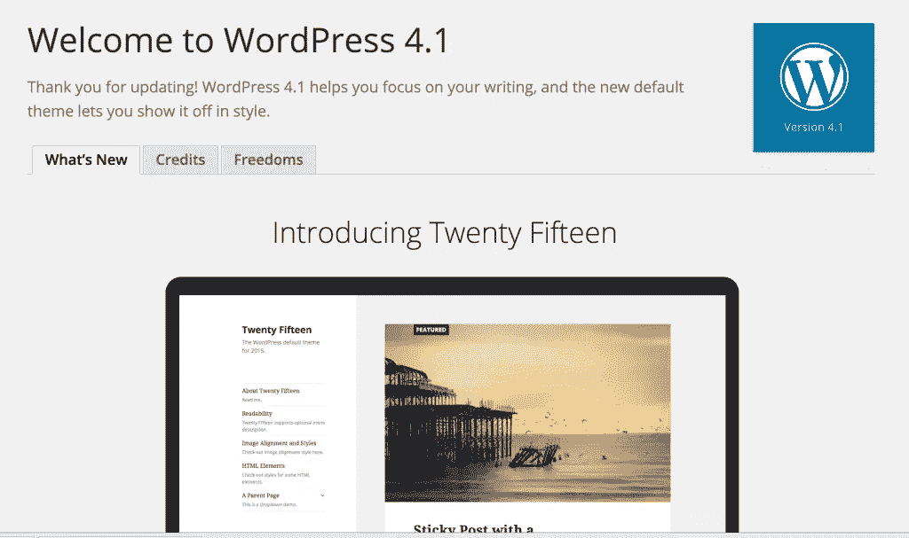
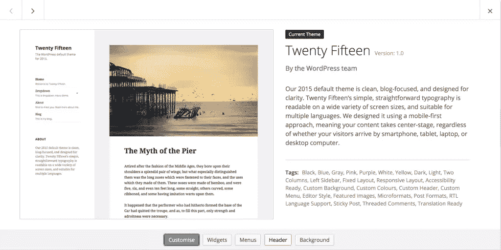
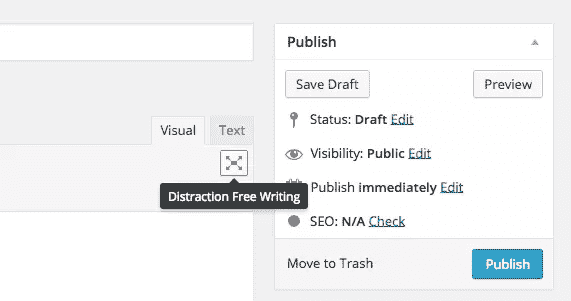
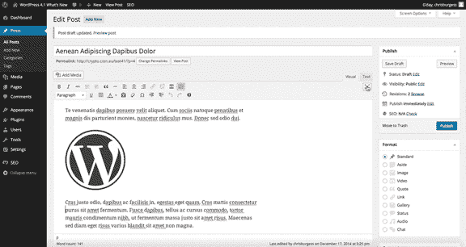
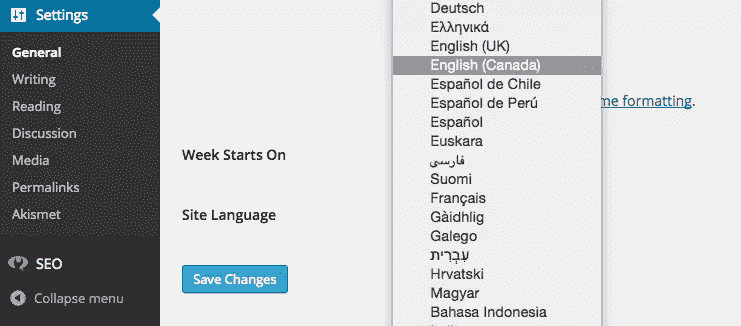
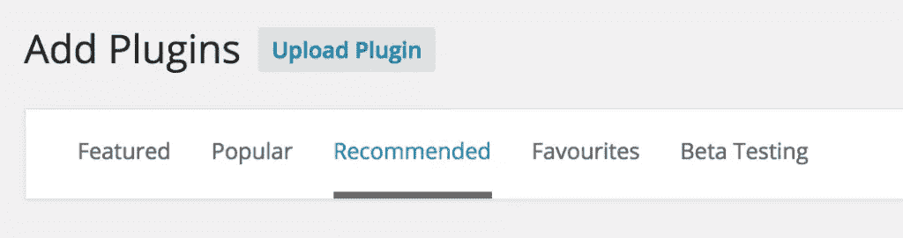
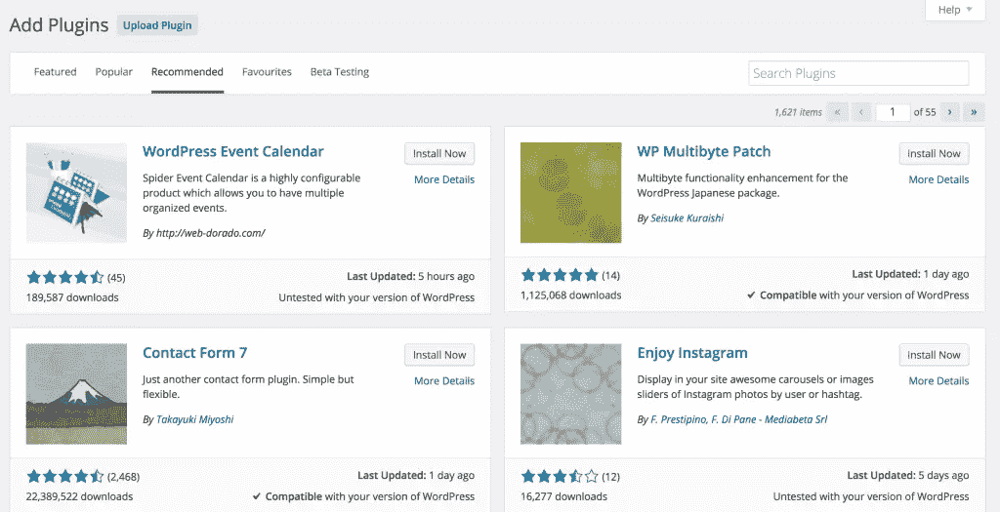
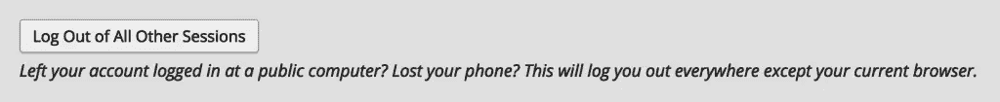
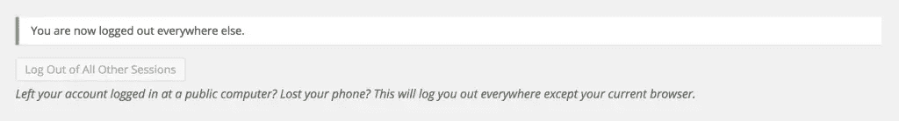
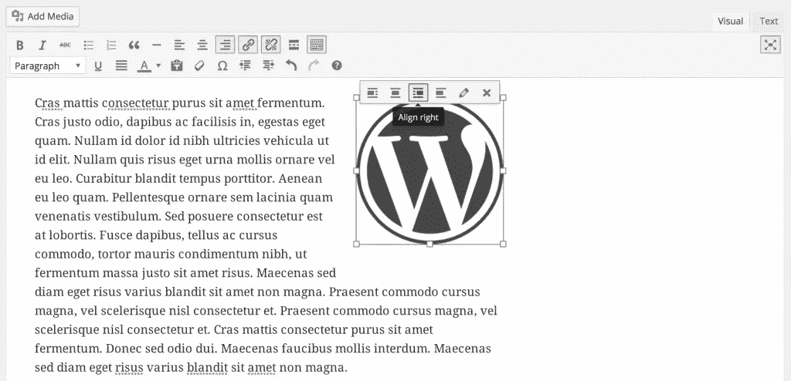

# WordPress 4.1 的新功能

> 原文：<https://www.sitepoint.com/whats-new-in-wordpress-4-1/>

*这篇文章已经过时了，[点击](https://www.sitepoint.com/whats-new-in-wordpress-4-6/)查看 WordPress 4.6 的新功能。*

以爵士歌手黛娜·华盛顿命名为“黛娜”的 WordPress 4.1 今天正式发布。这里有一个关于这个最新版本的综述。

大约七天前，WordPress 4.1 候选发布，本文基于候选发布中的信息。任何最后一分钟的更改将尽快更新。

## 如何获得 WordPress 4.1？

大多数用户会在他们的仪表盘上看到一条消息“WordPress 4.1 可用了！请立即更新”。单击此链接会将您带到一个页面，在该页面上可以一次性下载并应用更新。太容易了！

像往常一样，我想花一分钟时间提醒大家，在对你的网站进行任何更新之前，确保你有一个完整的备份，并且你已经测试了主题和插件与这个最新版本的兼容性。理想情况下，您应该有一个独立的环境，这样您就可以随时测试任何重要的东西。SitePoint 有关于[VVV](https://www.sitepoint.com/wordpress-meets-vagrant-vvv/)和[查西斯](https://www.sitepoint.com/using-chassis-for-wordpress-development/)的特色文章，这使得管理本地 WordPress 开发和测试环境变得轻而易举。

## 介绍新的 2015 主题

WordPress 4.1 将会发布一个新的默认主题，叫做 Twenty Fifteen。这个主题的设计考虑到了强烈的博客焦点，并利用了谷歌的 Noto 网络字体。这种字体覆盖了 30 多种文字，可以跨多种语言使用，非常适合帮助 WordPress 实现更强大的国际化目标。

## 专注——新的免分心写作

WordPress 作为一个发布平台大放异彩，所以毫不奇怪，内容创作将永远是 WordPress 核心开发者的焦点(没有双关语)。这个新版本的 WordPress 已经修改了现有的免分心写作功能。就像免分心写作一样，这可能会是一个让用户又爱又恨的功能，但是很高兴看到 WordPress 团队正在继续完善出版体验。

Focus 使您比以往任何时候都更容易专注于您的内容，而不会受到其他仪表板元素的干扰。

上面的动画 GIF 只能给你展示这么多，使用它是一种相当独特的体验。我还在适应它，但我期待着随着时间的推移尝试一下。如果你发现你不喜欢它，可以关闭对焦功能。

## 语言支持更新

随着 WordPress 4.0 的发布，你可以在安装 时[选择你自己的语言**。这可能是 WordPress 最强大的功能之一，很高兴看到在这个领域有更多的工作，让安装后切换语言变得很容易。**](https://www.sitepoint.com/whats-new-in-wordpress-4-0/)

WordPress 4.1 已经被翻译成 40 种语言，其他语言还在后面。如果您想更改您的网站使用的语言，请导航到“设置”和“常规”选项卡的底部。

## 推荐的插件

从 4.0 版本开始，我们现在迎来了一个新的插件安装体验，它允许你浏览一个平铺插件的网格，更清楚地显示关于下载次数、评分、上次更新时间以及是否已经用你当前版本的 WordPress 测试过的信息。

WordPress 4.1 现在也提供了一个“推荐插件”的过滤器，它会向你显示一个插件列表，这些插件是基于安装了与你的插件相似的插件的其他网站。

## 注销所有其他会话

在您的个人资料设置下可以访问，您现在可以注销所有会话。如果您可能在另一个设备上打开了一个会话，这是一个方便的安全功能。

## 添加到 oEmbed 的 Vine

Vine 是一个受欢迎的平台，人们可以上传 6 秒钟的视频片段。WordPress 4.1 已经将 Vine 视频添加到 oEmbed 支持的长长列表中，你可以在这里看到完整的列表。

## 图像对齐工具栏

WordPress 4.1 带来了一个新的图像对齐工具栏，我想用户会非常喜欢的。

这是一个微小的变化，但是对于有经验的用户来说，这将节省大量的时间，并且帮助新用户更舒适地使用图像。当我第一次读到这个功能时，我并没有太多的注意，但我已经开始欣赏它了。

## 开发人员的变化

和每一次 WordPress 的更新一样，在引擎盖下有很多变化。以下是开发人员可能感兴趣的一些更值得注意的变化:

*   [更好地支持文档`title`标签](https://make.wordpress.org/core/2014/10/29/title-tags-in-4-1/)
*   [定制器 API 的改进](https://make.wordpress.org/core/2014/10/27/toward-a-complete-javascript-api-for-the-customizer/)
*   [新模板标签](https://make.wordpress.org/core/2014/12/04/new-template-tags-in-4-1/)
*   [对分类、日期、元和评论查询的改进](https://make.wordpress.org/core/2014/10/20/update-on-query-improvements-in-4-1/)

你可以在这里得到一个更完整的列表。

## 你的想法

总之，这些更新为 WordPress 的开发者和经常用户带来了一些受欢迎的变化。作为一个做 WordPress 培训的人，我还没有看到分散注意力的写作有多大用处，所以我对每个人对新的“聚焦”功能的看法非常感兴趣。

## 分享这篇文章