# WordPress 4.3 的新功能

> 原文：<https://www.sitepoint.com/whats-new-in-wordpress-4-3/>

*这篇文章已经过时了，[点击](https://www.sitepoint.com/whats-new-in-wordpress-4-6/)查看 WordPress 4.6 的新功能。*

今天发布了 WordPress 4.3，包括 100 多处改动。如果你在你的网站上运行 WordPress，你可能已经在你的仪表盘上看到了下面的消息。

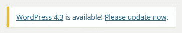

现在，我们都知道 WordPress 不会停滞太久。在发布了 4 个月之后，最新的版本出来了:WordPress 4.3。

代号为“比利”，以爵士乐传奇人物比莉·哈乐黛命名，这次发行由康斯坦丁·奥本兰德领导。据 WordPress 称，这一更新“使得格式化你的内容和定制你的网站更加容易”。4.3 版本有很多用户会喜欢的新特性。

## 更新到 WordPress 4.3

作为一个负责任的网站所有者，我们都应该定期维护我们的网站。关于这个话题更详细的背景，我推荐[查看我们的 WordPress 维护权威指南](https://www.sitepoint.com/definitive-guide-to-wordpress-maintenance/)。

更新不仅带来了新的功能，还解决了漏洞修复和安全问题，保证了网站的安全。

升级到 WordPress 4.3 非常简单:

1.  备份您的站点，以确保您在遇到任何问题时拥有完整、可靠的备份。
2.  登录你的 WordPress 仪表盘，点击“WordPress 4.3 可用！请立即更新”链接。
3.  选择“立即更新”,然后让 WordPress 做它的事情。然后你会看到下面的屏幕，让你知道更新已经完成。
4.  彻底测试你的网站，以确保它的功能如你所愿。

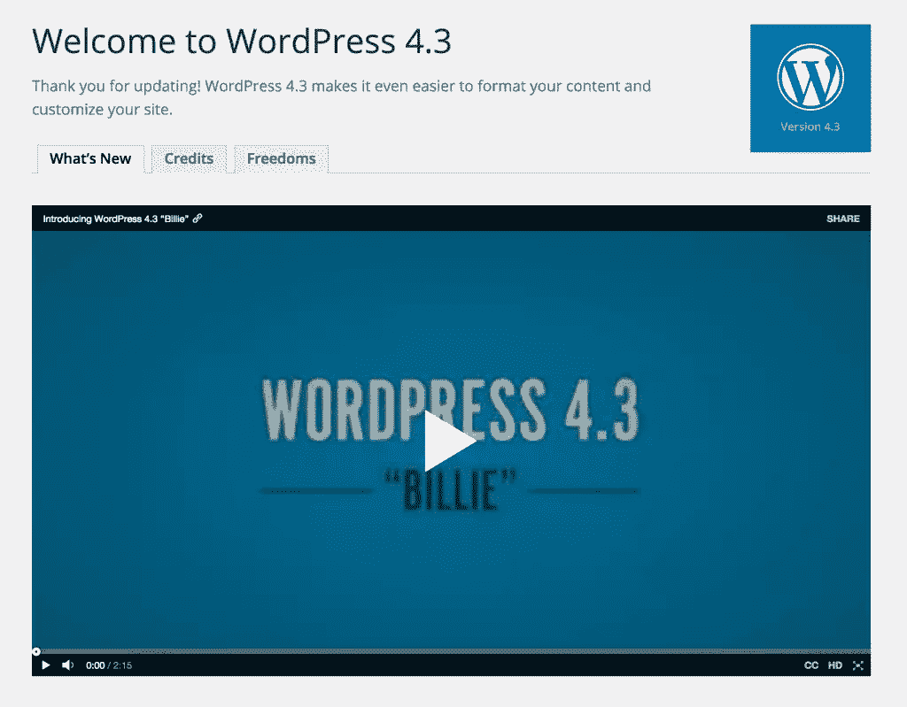

就像所有 WordPress 的核心更新一样，以我的经验来看，它们工作得非常完美。我个人遇到的问题总是与第三方主题和插件有关，特别是那些质量较低的，那些未经维护或被错误修改的。这是另一个很好的提醒，坚持只使用有信誉的主题和插件，最重要的是，对任何高价值的网站使用测试/暂存站点。

如果你想了解更多关于 WordPress 更新如何工作的信息，看看我们的[更新 WordPress](https://www.sitepoint.com/a-guide-to-updating-wordpress/) 指南。

## WordPress 4.3 的主要特点

### 文本模式和快捷方式

这个新功能是为所有的博客作者和广告文案准备的。WordPress 4.3 包含了一系列新的文本格式快捷方式，和 Markdown 标记中使用的没有什么不同。

例如:

*   #创建一个 H1，##创建一个 H2，###创建一个 H3(以此类推)
*   星号和破折号变成了项目符号
*   数字(后跟句号或括号)成为一个编号列表
*   使用>，然后创建一个报价

它快速、简单，不需要摆弄编辑器工具栏。这将有助于我们这些花大量时间在 WordPress 内容编辑器上的人。

### 管理定制器中的菜单

此次更新带来了管理菜单的新方式。用户现在可以在启用实时预览的定制器中创建、更新和分配菜单。

这一变化背后的想法是，通过定制面板提供的新的移动友好界面，使菜单构建更加移动友好。此外，您可以实时看到您的菜单在您的网站上的确切外观，从而简化网站构建过程。

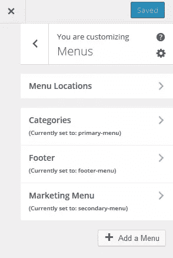

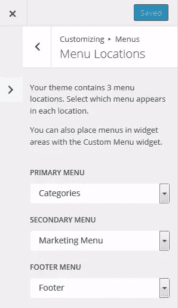

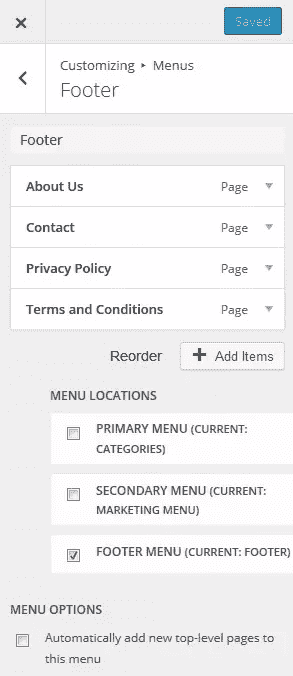

### 安全改进

WordPress 4.3 的安全性已经通过一些重要的改进得到了增强。很高兴看到更多面向用户的安全功能，这些变化肯定会让所有用户受益。

#### 默认安全密码

默认情况下，生成的密码现在更强，因为不再需要用户提供自己的密码。密码强度计现在也更智能了。

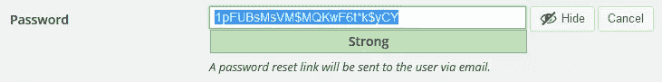

#### 密码管理改进

现在有一个新的密码管理流程。网站所有者将收到一个重置密码的链接，而不是像以前那样通过电子邮件接收密码。此链接将有一个有限的保存期限，以确保绝对的保护，如果电子邮件帐户或信息成为妥协。如果你碰巧添加了新用户，WordPress 会为每个用户生成安全的密码。

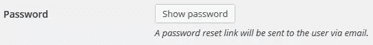

### 网站图标功能

WordPress 4.3 让你有机会使用定制器添加一个 favicon 或站点图标(在浏览器标签和移动设备的主屏幕上代表你的网站的小“徽章”)，如下图所示。

如果你决定改变网站的主题和设计，你的新图标甚至会一直保持不变。只需通过定制添加一个图标。

### 默认情况下，页面上的注释是关闭的

以前，评论的默认设置是“开”，在 WordPress 4.3 中，它被切换到“关”。每当你创建一个新页面时，评论将被关闭(当然，除非你手动打开它们)。

当创建页面时忘记关闭评论时，这将节省宝贵的时间，我们都这样做过！这也将大大有助于保护不知情的用户免受垃圾评论的攻击。

这将是一个大众喜闻乐见的消息，正如官方的公告所说:“默认情况下，新页面上的评论现在是关闭的。大家都很高兴”。所以让我们欢呼吧！

### 移动友好列表视图

整个后端仪表板区域都引入了新版本的列表视图。这个新的视图被设计成在更小的移动设备上使用 WordPress 时更加用户友好。列不再被截断。相反，您可以将它们切换回正确的视图。

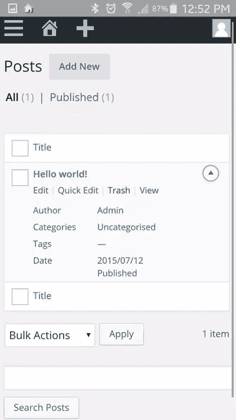

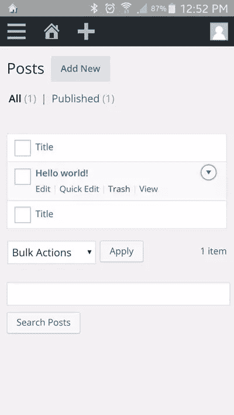

### 超链接预览

在 WordPress 4.3 可视化编辑器中，当你点击超链接锚文本或超链接 URL 时，链接工具栏会弹出。该工具栏包含完整的 URL，以及“编辑”和“删除”按钮。这个漂亮的小功能将节省时间，让您避免使用编辑器工具栏中的“插入/编辑链接”按钮。

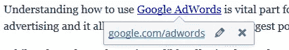

### 对管理栏的更改

当登录并浏览网站时，页面顶部的菜单栏已被更改，以便更容易直接进入各种管理页面。

第二个菜单项(在 WordPress 标志旁边)已经被简化为只包含主要的顶层项目。

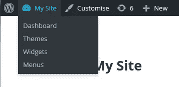

接下来是一个到新改进的定制器的直接链接，一个任何未决更新的链接，通知有多少可用，然后是一个“新”项目，它可以更快地添加新用户、页面等，如下所示。

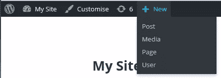

### 字数和字符数

虽然不是主要变化，但值得注意的是 WordPress 计算单词和字符的方式在这个版本中有所改变。

WordPress 现在不会在用户点击“回车”时更新字数和字符数，而是在你停止输入时更新字数。

### 多站点更改

Multisite 有许多改进，在 4.3 生命周期中还会有更多改进。关于到目前为止已经做了什么和计划做什么的信息，请查看核心开发人员 Jeremy Felt 的帖子[这里](https://make.wordpress.org/core/2015/07/24/multisite-focused-changes-in-4-3/)。

## 面向开发者的 WordPress 4.3 的主要特性

还发布了许多面向开发人员的新特性，包括:

*   为了让 WordPress 支持 PHP7，PHP4 风格的构造函数在 WordPress 核心中已经被否决了。
*   分类法路线图已经进行了更新，一个或多个分类法之间共享的术语现在被拆分成单独的术语。
*   singular.php 已被添加到模板层次结构中，作为 page.php 和 single.php 的后备。
*   现在可以为一个列表定义一个主列，并且更容易子类化。

## 更多关于 WordPress 4.3 的信息

如果你想了解这个最新版本的更多信息，我收集了一些链接:

*   [WordPress 4.3 字段注释](https://make.wordpress.org/core/2015/08/08/wordpress-4-3-field-notes/)
*   [编辑改进](https://make.wordpress.org/core/2015/08/01/editor-enhancements-in-4-3-%E2%9C%A8/)
*   [安全改进](https://make.wordpress.org/core/2015/07/28/passwords-strong-by-default/)

请在下面分享你对 WordPress 4.3 的想法和经验。

## 分享这篇文章