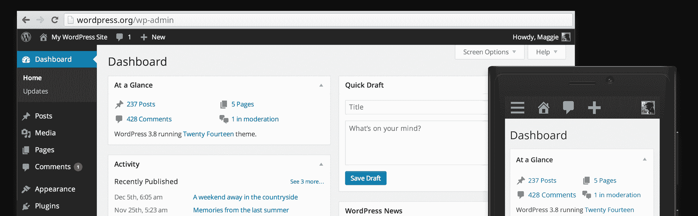
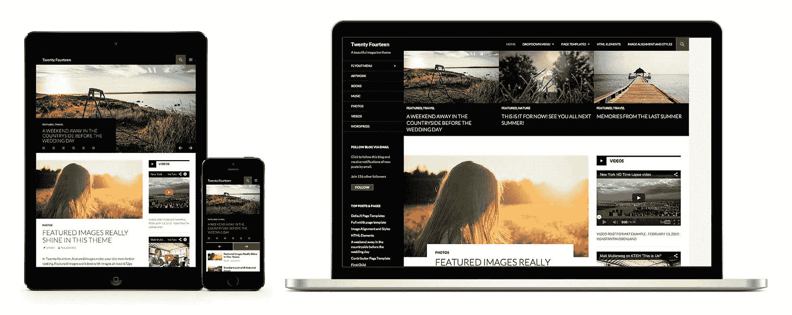

# WordPress 3.8 的新功能

> 原文：<https://www.sitepoint.com/whats-new-wordpress-3-8/>

*这篇文章已经过时了，[点击](https://www.sitepoint.com/whats-new-in-wordpress-4-6/)查看 WordPress 4.6 的新功能。*

如果你还没有升级到 WordPress 3.7 ，不要担心——WordPress 3.8 现在可以在[下载](https://wordpress.org/download/)。

由于这是一个重大的修订，你需要手动升级，而不是依靠自动更新。这意味着登录并点击“升级”。记得先备份你的文件和数据库。我也建议在你的网站的离线版本中检查插件和主题的兼容性。

3.7 版本的变化主要是在幕后，但是 WordPress 3.8 引入了更明显的更新。整个管理界面已经过彻底检查…

乍一看，我认为它让人想起了 WordPress 的早期版本，但是环顾四周，你会注意到几个有趣的变化:

*   现代的平面设计贯穿始终。
*   它反应灵敏，智能手机/平板电脑视图比以前更加可用。
*   Open Sans 是默认字体——它看起来更清晰、更整洁。
*   可缩放、快速加载的网络字体图标优先于图像使用。
*   在您的个人资料中可以选择八种管理颜色主题…

界面明显比以前的版本更快。大多数页面的重量小于 300Kb(压缩)，最大的很少超过 500Kb。我怀疑如果团队从基于 JavaScript 的动画切换到 CSS3，它可能会走得更远，但它仍然令人印象深刻。

智能手机和平板电脑的访问已经得到了显著改善。我推荐你试试。在我看来，它优于本地 iOS 和 Android WordPress 应用程序，后者很少像你预期的那样工作或支持插件功能。

## 新的 2014 主题

214 是新的杂志风格的默认主题:

如您所料，布局完全响应。主页上的重要内容链接可以显示在网格或滑块视图中。你需要做一些工作来充分利用它，但是主题和小部件管理比以往任何时候都要好。

其他的改动都是相当小的或者是 bug 修复。所有更新的完整列表可在[codex.wordpress.org/Version_3.8](https://codex.wordpress.org/Version_3.8)查看

目前有 20.9%的网站在使用 WordPress。在使用 CMS 的网站中，WordPress 几乎占了十分之六。3.8 版本感觉比以往更快更新鲜；任何其他应用程序都有希望获得同样的成功吗？

## 分享这篇文章