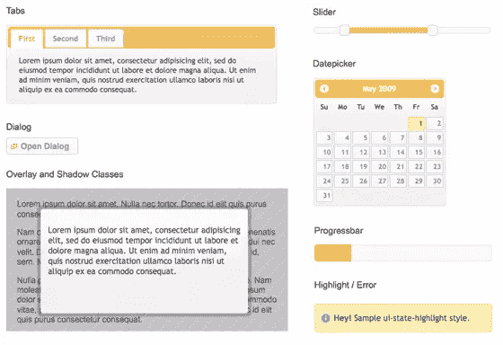
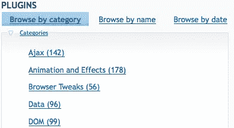

# jQuery 有什么好的？

> 原文：<https://www.sitepoint.com/whats-so-good-about-jquery/>

下面这篇文章是基于厄尔·卡斯尔丁&的《jQuery:忍者新手》节选的在线系列文章的第一篇。

您已经了解到 jQuery 使得使用 DOM、添加效果和执行 Ajax 请求变得很容易，但是还有什么比编写自己的库或使用其他(也很优秀的)JavaScript 库更好的呢？

首先，我们提到 jQuery 使得使用 DOM、添加效果和执行 Ajax 请求变得容易了吗？事实上，它让这变得如此简单，以至于它是彻头彻尾的好，书呆子般的乐趣——你经常需要从你刚刚发明的一些疯狂中抽身出来，戴上你的网页设计师的帽子，并行使一点点克制(啊，如果良好的品味不是一个障碍，我们可以创造出很酷的东西！).但是，如果您打算投入宝贵的时间学习 JavaScript 库，那么有许多值得注意的因素需要考虑。

**跨浏览器兼容性**

除了使用起来很有趣之外，jQuery 最大的好处之一是它为您处理了许多令人恼火的跨浏览器问题。任何过去写过严肃的 JavaScript 的人都可以证明，跨浏览器的不一致会让你发疯。例如，一个在 Mozilla Firefox 和 Internet Explorer 8 中完美呈现的设计在 Internet Explorer 7 中就分崩离析了，或者一个你花了几天时间手工制作的界面组件在所有主流浏览器中都工作得很漂亮，除了 Linux 上的 Opera。而客户端恰好在 Linux 上使用 Opera。这些类型的问题从来都不容易追踪，更难彻底根除。

即使跨浏览器问题处理起来相对简单，你也总是需要维护一个关于它们的心理知识库。当一个重大项目发布的前一天晚上 11:00 时，你只能希望你能回忆起为什么你忘记测试的浏览器上有一个奇怪的填充错误！

jQuery 团队敏锐地意识到跨浏览器问题，更重要的是，他们理解*为什么*会出现这些问题。他们已经将这些知识写入了库中——所以 jQuery 会为您解决这些问题。你写的大部分代码在所有主流浏览器上都是一样的，包括每个人都喜欢的小捣蛋鬼:Internet Explorer 6。

仅这个特性就能让普通开发人员免除一生的头痛。当然，您应该始终致力于跟上我们行业的最新发展和最佳实践——但是将搜寻不明显的浏览器错误的任务留给 jQuery 团队(他们会在每个新版本中修复越来越多的错误)可以让您有更多的时间来实现您的想法。

**CSS3 选择器**

让当今的技术跨浏览器兼容固然很好，但是 jQuery 也完全支持即将到来的 CSS3 选择器规范。是的，即使在 Internet Explorer 6.0 中也是如此！通过现在就在您的产品代码中学习和使用 CSS3 选择器，您可以在未来取得领先。选择想要更改的元素是 jQuery 的核心功能，CSS3 选择器为您提供了更多的工具。

**有用的工具**

还包括各种实用函数，这些函数实现了对编写 jQuery 有用的常用函数(或者 JavaScript 中没有的函数！):字符串修整、轻松扩展对象的能力等等。这些函数本身非常方便，但是它们有助于促进 jQuery 和 JavaScript 之间的无缝集成，从而使代码更容易编写和维护。

一个值得注意的实用程序是 supports 函数，它测试当前用户的浏览器上是否有某些功能可用。传统上，开发人员依靠浏览器嗅探(根据浏览器本身提供的信息来确定最终用户正在使用哪个 web 浏览器)来解决已知问题。这一直是一种不令人满意且容易出错的做法。使用 jQuery supports 实用程序函数，您可以测试某个特性是否对用户可用，并轻松地构建在旧浏览器或不符合标准的浏览器上正常运行的应用程序。

jquery ui

jQuery 已经被用来制作一些令人印象深刻的小部件和效果，其中一些非常有用，足以证明包含在核心 jQuery 库中是正确的。然而，jQuery 团队明智地决定，为了保持核心库的专注，他们将分离出更高级别的构造，并将它们打包成一个位于 jQuery 之上的整洁的库。

这个库被称为 *jQuery 用户界面*(通常简称为 *jQuery UI* )，它包括一系列有用的效果和高级小部件，可以通过使用主题进行访问和高度定制。图 1.1“几个 jQuery UI 小部件”展示了其中的一些特性。

**图 1.1。几个 jQuery UI 小部件**

手风琴、滑块、对话框、日期选择器等等——一切都可以立即使用！您可以花大量时间在 jQuery 中自己创建这些控件(正如这些控件一样),但是 jQuery UI 控件是可配置的，并且足够复杂，您的时间用在其他地方会更好——即实现您独特的项目需求，而不是确保您的自定义日期选择器在不同的浏览器中正确显示！

随着本书的深入，我们肯定会用到大量的 jQuery UI 功能。我们甚至将集成一些可用的时髦主题，并学习如何使用 jQuery UI ThemeRoller 工具创建我们自己的主题。

**插件**

jQuery 团队非常重视 jQuery 库的可扩展性。通过只包含一组核心特性，同时提供一个扩展库的框架，它们使得创建可以在所有 jQuery 项目中重用以及与其他开发人员共享的插件变得容易。jQuery 核心库中省略了许多相当常见的功能，并将其归入插件领域。放心，这是特点，不是缺陷。任何额外的所需功能都可以很容易地在逐页的基础上包含进来，以将带宽和代码膨胀保持在最低限度。

令人欣慰的是，很多人已经利用了 jQuery 的可扩展性，所以 jQuery 插件库中已经有数百个优秀的可下载插件，并且一直在添加新的插件。在图 1.2“jQuery 插件库”中可以看到其中的一部分。

**图 1.2。jQuery 插件库**

每当你遇到任务或问题时，首先检查一下是否有适合你需要的插件是值得的。这是因为几乎任何你可能需要的功能都可能已经变成了一个插件，可供你使用。即使事实证明你需要自己做一些工作，插件库通常也是指引你正确方向的最佳地方。

**保持标记整洁**

将脚本行为与页面表现分离是 web 开发游戏中的最佳实践——尽管它确实存在挑战。由于 jQuery 能够轻松地在页面上挂接元素，并以自然、类似 CSS 的方式将代码附加到元素上，因此 jQuery 使得完全摆脱内联脚本标记变得轻而易举。jQuery 缺乏添加内联代码的机制，所以这种关注点的分离会产生更精简、更干净、更易维护的代码。因此，用正确的方法做事情很容易，用错误的方法做事情几乎是不可能的！

jQuery 并不局限于处理页面现有的 HTML——它还可以通过一组方便的函数添加新的页面元素和文档片段。有一些函数可以在页面的任何地方插入、附加和预先放置新的 HTML 块。您甚至可以替换、删除或克隆现有的元素——所有这些功能都有助于逐步增强您的网站，从而为浏览器允许的用户提供功能齐全的体验，并为其他所有人提供可接受的体验。

**广泛采用**

如果你愿意把你能想到的每一个 JavaScript 库都放到 [Google Trends，](http://www.google.com/trends/)你会见证 jQuery 的指数级增长。当提到库的时候，加入进来是件好事，因为流行等同于更活跃的代码开发和大量有趣的第三方好东西。

Web 上无数的大玩家都加入了 jQuery 的行列:IBM、网飞、谷歌(既使用也托管 jQuery 库)，甚至微软，现在它的 MVC 框架中也包含了 jQuery。有这么多的大公司在身边，jQuery 在未来一段时间内肯定会存在——所以您在学习它上投入的时间和精力是值得的！

jQuery 的流行也催生了一个庞大而慷慨的社区，这个社区非常有用。无论您的技术水平如何，您都会发现其他开发人员有足够的耐心来帮助您解决任何问题。这种关心和分享的精神也传播到了更广泛的互联网上，发展成为高质量教程、博客帖子和文档的百科全书。

## 有什么坏处？

几乎没有不利的一面！反对使用任何 JavaScript 库的主要理由一直是速度和大小:一些人说使用库会给页面增加太多的下载量，而另一些人则认为与更精简的定制代码相比，库的性能很差。尽管这些观点值得考虑，但它们的相关性正在迅速消失。

首先，就大小而言，jQuery 是轻量级的。核心 jQuery 库的占用空间一直很小——大约 19KB，比一般的 JPG 映像要小。您的项目需要的任何额外组件(比如来自 jQuery UI 库的插件或组件)都可以以模块化的方式添加——因此您可以轻松地计算您的带宽卡路里。

随着计算机硬件规格的提高和浏览器的 JavaScript 引擎越来越快，速度(像大小一样)正在成为一个越来越少的问题。当然，这并不意味着 jQuery 很慢——jQuery 团队似乎痴迷于速度！每一个新版本都比上一个版本更快，所以您从开发自己的 JavaScript 中获得的任何好处都在一天天减少。

当谈到竞争对手 JavaScript 库时(现在已经有很多了)，jQuery 最擅长做 jQuery 所做的事情:操作 DOM、添加效果和发出 Ajax 请求。尽管如此，许多库质量很好，在其他领域也很出色，比如复杂的基于类的编程。寻找替代方法总是值得的，但是如果我们列出的原因吸引了你，jQuery 可能是一条好的途径。

但是说得够多了:是时候让 jQuery 把钱花在它该花的地方了！

**note:**Want more?

看看这本书，并在网上购买:jQuery:忍者新手，作者厄尔·卡斯尔丁&克雷格·沙尔基

## 分享这篇文章