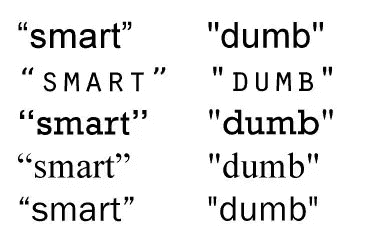
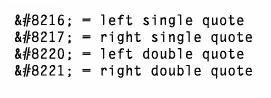

# 那些引语有什么聪明之处

> 原文：<https://www.sitepoint.com/whats-so-smart-about-those-quotes/>

在印刷工和打字爱好者中，使用错误类型的引号通常被认为是一种打字失礼。你知道有一种错误的引用吗，一种错误的引用？嗯，有些事情被称为聪明的报价和愚蠢的报价。智能引语(有时称为书籍引语)是引语的卷曲或弯曲样式。具有打开和关闭样式。哑引号或直引号是直上直下的，有时是锥形竖线。

这有什么大不了的？这真的取决于你希望你的网页或印刷排版有多迂腐。许多读者可能不会注意到你使用的是哪种类型的引号，但是如果你喜欢你的类型并且喜欢以正确的方式做事情，你可以具体说明你使用的引号。如果你用的是微软的 Word 或者类似的文本编辑器，你会发现这个软件会在你使用的时候帮你修改引号。桌面出版软件(如 InDesign)将智能引号设置为默认设置。哑引号仅用于测量值之间，例如 5' 11 "。

下图显示了带有智能引号和非智能引号的多种不同字体。

对于 web 排版，您可以使用十六进制代码手动添加智能引号，如下所示:

还有其他工具可以帮助您在网站上添加或删除智能引号。 [SmartyPants](http://daringfireball.net/projects/smartypants/) 是一个用于可移动类型、Blosxom 和 BBEdit 的免费插件，它将普通 ASCII 标点字符翻译成“智能”印刷标点 HTML 实体。WordPress 将智能引号设置为默认，但是有一个插件叫做[不常用引号](http://www.semiologic.com/software/unfancy-quote/)，可以让你关闭它们(弯引号会干扰代码)。

你关注聪明和愚蠢的报价吗？当你看到它们被错误地使用时，你会感到困扰吗？

## 分享这篇文章