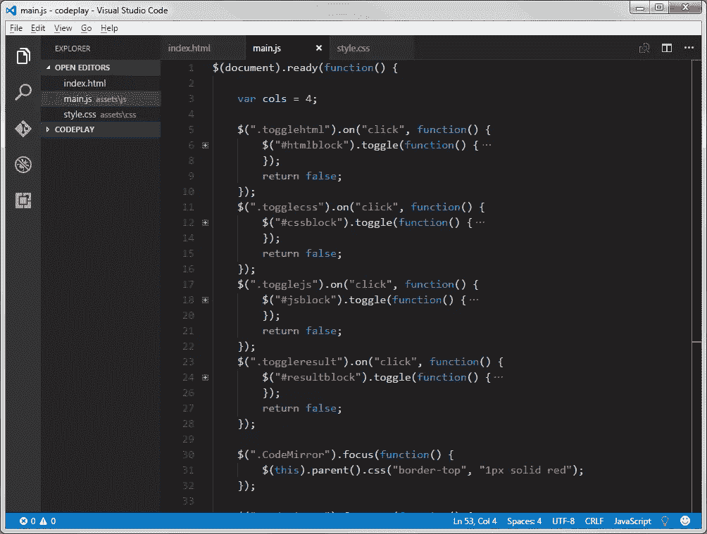

# 流星和电子有什么区别？

> 原文：<https://www.sitepoint.com/whats-the-difference-between-meteor-and-electron/>

**流星和电子有什么区别？又该学哪个用哪个呢？**

[Meteor](https://www.meteor.com/) 和 [Electron](http://electron.atom.io/) 都是使用 JavaScript、Node、HTML 和 CSS 等 web 语言和技术开发应用程序的跨平台框架。

有一段时间，我认为他们做同样的事情，并直接相互竞争。这是基于他们自己网站上的语言。Electron 说*“用 JavaScript、HTML 和 CSS 构建跨平台的桌面应用”*。另一方面,*说,“流星是一个用于网络、移动和桌面的开源平台。”*

我开始研究哪一个是创建“桌面”应用程序的“最佳”选择，以及哪一个是我应该花时间学习的。当我试图找出它们之间的主要区别时，我惊讶地发现没有太多的信息可以比较这两者。

困惑在于他们都声称创造了“桌面”应用。不知道流星为什么这么声称，也许有人能解释一下？

让我们仔细检查一下每一个的确切用途。

## 流星

Meteor 用于构建 web、移动和桌面的 JavaScript 应用程序。您可以通过在操作系统中安装程序并在项目中运行命令来使用它。

它是一个全栈 JavaScript 平台，包括来自 Node.js 和一般 JavaScript 社区的 API、构建工具和管理包。Meteor 本身包含 Node.js，或者您也可以在本地安装 Node。

要开始使用 Meteor，请访问网站并为您的操作系统安装该程序；Windows、Mac 或 Linux。然后用`meteor create myapp`创建一个应用程序，运行`meteor`，启动一个本地服务器进行开发。如果你想知道更多的细节，请看[流星指南](https://guide.meteor.com/)。

Meteor 有一个名为“Atmosphere”的包库，其中包含专门针对 Meteor 的库。一些库可以依赖于其他的 Atmosphere 库。流星也可以用 npm。将来，很可能所有的包都在 npm 上。完成的流星应用程序可以*自己*也可以成为一个库，可以包含在其他项目中。

项目准备就绪后，您就可以部署应用程序了。由于 Meteor 创建了一个基于节点的应用程序，您需要节点托管。Meteor 推荐他们自己的基于亚马逊网络服务(AWS)的托管服务，名为 [Galaxy](https://www.meteor.com/hosting) 。

如今，许多大型流星应用程序都托管在 Galaxy 上。使用它使部署变得更容易，基于 AWS 真的没有什么好嘲笑的。你应该有很好的扩展你的应用程序的能力。

使用 Galaxy 可以简化日志记录、分析、监控、更新和持续集成、迁移和暂存工具。你不一定要使用 Galaxy，但如果不仅仅是为了降低主机的复杂性，强烈推荐使用它。

你也可以部署为一个 Android 或 iOS 应用程序。这需要在您的开发环境中添加一些额外的设置和工具，但是您可以添加这些并运行模拟器进行测试。【Windows 版流星不支持移动构建。这种能力建立在 [Cordova](https://cordova.apache.org/) 之上，Cordova 本身就是一个将网络语言转化为移动应用的框架。

这里的要点是，即使 Meteor 网站上说“Meteor 是一个用于 web、移动和桌面的开源平台”，这实际上并不意味着它创建了桌面应用程序！这是我一开始困惑的地方，或许也是其他人困惑的地方。Meteor 是用来创建一个“网络应用程序”的，它可以运行在服务器、浏览器、iOS 或 Android 应用程序中(使用合适的构建工具)。Meteor 是一个全栈框架，同时具有前端和后端模块和能力。比如 Ember 等其他框架，只是针对前端的。

Meteor 支持集成和使用最流行的 JavaScript 库和框架，如 Angular 和 React。它在服务器端现成地深度集成了 MongoDB，在客户端集成了名为 [MiniMongo](https://guide.meteor.com/collections.html#client-collections) 的东西。同步两个数据库是关于发布/订阅(发布和订阅)功能的对话。创建数据集并立即开始使用它非常容易，几乎与创建和使用数组一样容易。

关于建立在 Meteor 上的网站的例子，查看他们的[展示区](https://www.meteor.com/showcase)，或者前往 [BuiltWithMeteor](https://builtwithmeteor.com) 。举个例子，这是一个类似特雷罗的看板板，叫做 [Wekan](https://github.com/wekan/wekan) 。

## 电子

Electron 用于构建跨平台应用程序**，作为桌面应用程序**运行。你也可以使用 JavaScript、HTML、CSS 和各种节点库进行编程，但它可以编译为 Windows、Linux 和 Mac 的原生桌面应用程序。流星不会做的事。

Electron 是 Github 为他们的 Atom 编辑器开发的，后来被微软和脸书等公司使用。

接口容器由 [Chromium](https://www.chromium.org/Home) 处理，使用捆绑节点。JS 服务器来“服务”容器中的应用程序。它是一个自包含的网络服务器，运行在一个框架中，与 Chrome 浏览器窗口中的选项卡没有太大区别。

所有典型的工具都可以使用，如 React、Angular 和 Node 库。但是你不会在那里运行 PHP 或者 Ruby 或者 Java！

通过 Chromium，您的应用程序可以访问某些本机操作系统功能，如对话框、菜单和通知。可以使用安装程序打包和部署 Windows 应用程序。您可以访问文件系统，并且可以用许多不同的方式存储数据。

可以构建包括自我更新、崩溃报告和剖析/调试的程序。

如果你想看到电子在工作，那么你可能已经在使用它了。许多应用程序都在上面运行，如 Slack、Visual Studio Code、Nylas N1、Brave Browser 和 Atom editor。更多[见此](http://electron.atom.io/apps/)。

为 Mac 编译的应用程序至少需要 10.9 64 位版本。对于 Windows，您需要 Windows 7 及更高版本，它们可以支持 32 位和 64 位，但不能支持 ARM 版本。Linux 依赖于库，但可以肯定的是 Ubuntu 12.04(和更高版本)，以及 Fedora 21 和 Debian 8 都被验证可以工作。

储物件有多种选择。最小的可能是本地存储，但它非常小，以兆字节来衡量。一个好的“next size up”JSON 存储(对设置和状态有用)被称为[电子 JSON 存储](https://github.com/jviotti/electron-json-storage)。从那里向上移动，你可以看到 [Pouchdb](https://pouchdb.com/) ，但是一些人认为在经过了数千行，大约 50k 以上之后，性能会受到影响。

也许最大的存储选项是 IndexedDB，其大小被限制为可用硬盘空间的三分之一。有各种适配器和 API 用于管理 IndexedDB，如 [Dexie.js](http://dexie.org/) 。你甚至可以找到替代的本地数据库存储，比如受 MongoDB 启发的 [NeDB](https://github.com/louischatriot/nedb) 。

## 所以主要的区别是…

Electron 为 Windows、Linux 和 Mac 编译桌面应用程序。Meteor 通过 Cordova 创建了一个全栈的 web 应用程序和潜在的 iOS 和 Android 应用程序。

我们可能会问的一个明显的问题是:我可以创建一个 Meteor 应用程序，但将其作为一个电子容器来运行，这样我就可以获得两者的所有好处了吗？

答案是肯定的。

需要注意的是，似乎没有一个可靠的、公认的方法来做到这一点。有很多方法，快速谷歌搜索就会发现。最好的起点是流星论坛。你可能会碰到 [Electrometeor](https://sircharleswatson.github.io/2015/04/30/Electrometeor-Build-Desktop-Applications-With-Electron-Meteor.html) ，一个在电子中运行 meteor 的项目，但是 commits 是一年和两年前的。我不知道是否仍然与最新的流星版本(截至本文写作，版本 1.4)一起工作。

将两者结合起来绝对是我自己的遗愿清单！

将它们结合起来的最终结果是，你有了一个将在 web 上运行的应用程序，可以编译为 iOS 和 Android 应用程序，并可以在多平台桌面上运行。所有不同的部署将共享大部分相同的代码库。

## 其他人

不言而喻，这两种框架都有替代方案。

电子的替代品很少，主要竞争对手是 [NW.js](http://nwjs.io/) ，前身是“node-webkit”。它们都是基于 V8 铬 JS 发动机，但电子只是在功能上领先。

还有其他方法可以为多个平台打包应用程序，但 Electron 适用于 HTML、JS、CSS 和 Node。例如，Xamarin 做了同样的事情，但是使用了 C#。

对于 Meteor 来说，最大的竞争可能是 [Express](https://expressjs.com/) ，它也是为 Node.js 构建的框架。补充 Express 的将是 [Feathers](http://feathersjs.com/) ，它为构建实时应用程序和完善 Express 的功能添加了更多模块和功能。

竞争是如此激烈，我会认真考虑研究流星与快递和羽毛，然后再作出选择。Express 已经很受欢迎，并且使得节点项目的引导变得非常快。Feathers 增加了实时功能和许多有用的模块来与 Express 携手工作。

## 结论

如果您想要一个本地开发工具在线创建和部署您的 JavaScript web 应用程序**，请使用 Meteor。利用 Galaxy hosting 和它提供的所有工具，这样你的应用就可以适当地伸缩和监控，节省系统管理员的工作量。**

 **Meteor 是一个用于开发、测试、分析、部署、更新和监控富 web 应用程序的框架。然后有了 Cordova，你可以把它打包成手机应用商店，部署到 iOS 和 Android 上。在此之后，你可以考虑用 Electron 打包应用程序，在 Windows、Mac 和 Linux 上创建桌面体验。

Meteor 不仅适用于小型应用程序。[这篇精彩的题为“进入 Meteor 的 3000 个小时”](https://www.youtube.com/watch?v=Iguedyg2cOI)的演讲讲述了 Qualia 如何在 Meteor 上构建他们的系统(拥有数十万条相关数据和一个非常数据密集型的界面)，值得一看！

如果您只对创建可以离线和在线工作的跨平台桌面应用程序感兴趣，并且希望使用 JavaScript、HTML、CSS、Node 和 npm 库等 web 语言进行构建，请使用 Electron。从本质上讲，electronic 只是一个运行在 Chromium 容器中的节点服务器，带有 JavaScript V8 引擎。理论上，你可以在里面运行任何旧的 Node 应用程序，不管是用 Meteor 还是别的什么构建的。

如果您首先使用 electronic 构建应用程序，然后想要部署到 web 上，您将不得不在不使用任何 Electron API 的情况下将其分解为基本节点项目。首先构建一个 web 应用程序**，然后考虑打包并利用 Electron 部署到桌面可能更容易。**

 **我希望这能帮助你决定是否在你的下一个项目中使用流星和/或电子！建议两者都熟悉！

如果你想看更多关于电子或流星的文章，请在评论中告诉我们。**** 

## ****分享这篇文章****