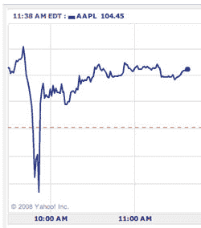

# 当公民新闻攻击:CNN 失言导致股票下跌

> 原文：<https://www.sitepoint.com/when-citizen-journalism-attacks-cnn-gaffe-causes-stock-drop/>

莎拉·佩雷兹报道今天早上，美国有线电视新闻网公民新闻网站 [iReport](http://www.ireport.com/) 上的一则虚假报道称苹果公司首席执行官史蒂夫·乔布斯突发严重心脏病，该报道在网络上“不胫而走”。这个故事已经被删除，后来被硅谷内幕——一个实际上采用新闻标准的博客——进行了事实核查，苹果很快将该报道作为谣言压制。乔布斯确实没有心脏病发作。

但是伤害已经造成了。苹果股价在早盘交易时段下跌了约 10%，因为这份虚假报告在互联网上传播开来(后来已经恢复)。佩雷斯说，公民新闻辜负了我们，指出像这样的事件反映了 CNN 和认真负责的公民记者的不良形象。

但是是公民新闻让我们失望了吗？或者是一般的互联网？过去一百年来，一系列新技术不断缩短新闻周期，从几天(报纸)到几小时(广播/电视)，从几分钟(博客/手机)到几秒钟(推特)，网络是其中最新的一项？越来越短的新闻周期存在危险。

这并不是第一次有股票因为谣言或错误而受到打击，这种谣言或错误在互联网上被广泛报道为事实。

一个月前，在谷歌新闻的一个 bug 暴露了一个六年前的破产故事后，联合航空公司的股票暴跌了 75%。无论是由于谷歌技术上的一个缺陷，还是报纸内容管理系统的缺陷，还是在旧文章上写错了日期，都仍然悬而未决。在即时信息的时代，关键是互联网上的“新闻”无论来源如何，都可能产生直接或灾难性的后果。

2007 年 5 月，传统媒体公司 AOL 旗下广受尊敬的博客 Engadget 上报道了一则关于苹果 iPhone [推迟上市的谣言，短短几分钟内苹果市值](http://www.techcrunch.com/2007/05/16/engadget-knocks-4-billion-of-apple-market-cap-on-bogus-iphone-email/)蒸发了 40 亿美元。在 Engadget 发布撤回声明后，该股有所回升，但由于信息传播的速度太快，一个劣质的消息来源在几分钟内就导致了灾难。

2006 年 2 月，美林的一份报告称，Playstation 3 将推迟上市，价格为 900 美元，这使得索尼的股票在一天内下跌了 3.6%。也许分析师的报告会影响股票的交易，但谣言像野火一样在互联网上传播。

所有这些轶事告诉我们的是，在网络上，谣言已经成为一种非常强大和危险的东西。比 10 年或 20 年前强大得多，当时谣言无法传播得如此之快，而且往往会被讨厌的事实所压制，然后才造成严重损害。

今天早上 CNN iReport 的具体案例强调了训练有素的记者审查谣言和报道事实真相的必要性。另一个可能被忽视的教训是，我们可以从中吸取教训，那就是我们都需要*放慢*和*呼吸*。花一些时间来确保我们得到事实真相，而不是急于成为第一个发表故事的人。

## 分享这篇文章