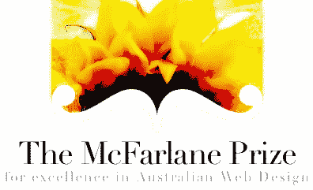

# 谁是澳大利亚最好的网页开发者？

> 原文：<https://www.sitepoint.com/who-is-the-best-web-developer-in-australia/>

由我们在 [Web Directions](http://webdirections.org/) 的朋友举办的[澳大利亚网页设计和开发卓越麦克法拉尼奖](http://mcfarlaneprize.com/)今年再次举行。该奖项始于 2006 年，旨在纪念澳大利亚网页技术专家(前 SitePoint 雇员)奈杰尔·麦克法拉尼，对任何澳大利亚网页设计师或开发者开放，参赛网站于 2007 年 8 月 1 日至今年 8 月 31 日之间完成。

麦克法拉尼奖在最广泛的意义上承认澳大利亚网页设计和开发的优秀，由设计、编码、可访问性和可用性方面的专家组成的评审团决定(包括 SitePoint 的常驻[可用性博主 Lisa Herrod](https://www.sitepoint.com/blogs/category/design/usability/) )。老读者会记得去年 SitePoint 竞赛网站(后来发展成 99 个设计)被[授予二等奖](https://www.sitepoint.com/sitepoint-contests-highly-recommended-in-mcfarlane-prize/)。

进入是免费的，而且非常简单。只需[使用此表格](http://mcfarlaneprize.com/nominationform.html)提名您的网站。请务必阅读提名标准。

今年的获奖者将于 9 月在悉尼举行的网络方向南方会议的最后一天宣布。如果您还没有购买本次会议的门票，[请务必尽快购买](https://secure.webdirections.org/wds08/register/billing)——“中鸟”折扣有效期至本月底，SitePoint 的读者在购买时输入代码 **WDS-SP** 还可以享受 55 美元的折扣。

## 分享这篇文章