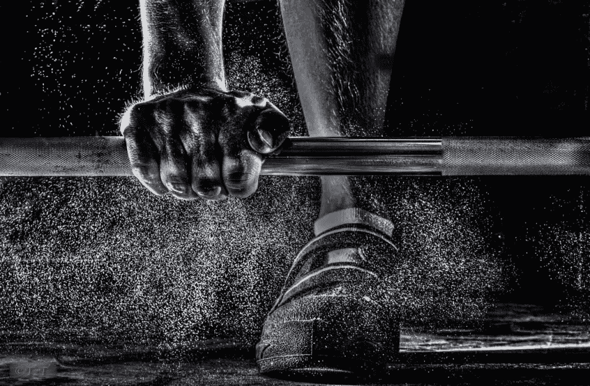

# 为什么企业家应该开始力量训练(以及从哪里开始)

> 原文：<https://www.sitepoint.com/why-entrepreneurs-should-start-strength-training-and-where-to-begin/>

这是企业家的时代。

看看你的社交媒体反馈。每个人似乎都在“忙碌”，试图将他们的爱好或业余爱好变成一份合法且有利可图的朝九晚五的职业。至少在一两年内，直到他们的“统治世界”的计划实现，他们可以退休到某个热带岛屿，随心所欲地发布泳池边的自拍。

当然，对于那些真正过着企业家生活而不只是发微博的人来说，现实并不乐观。像朝九晚五的时间表，无压力的假期，甚至周末和家人在一起都是白日梦。

取而代之的是凌晨 4 点的叫醒服务，难以处理的电子邮件，以及看似永无止境的灭火工作，这往往是以牺牲不太紧急但重要得多的优先事项为代价的。比如健康。

大多数真正从苦战中脱颖而出的企业家都意识到忽视健康是一个错误。因为如果你不能保持身体健康，你实际上是在浪费时间，损失生产力，更不用说生活质量了。

这就是为什么几乎每个成功人士在被问到“你每天都做些什么来掌控你的生意？”会将“锻炼”列为他们最重要的“必做之事”之一，无论是动感单车课、三英里慢跑，甚至是瑜伽课。

但是最近越来越多的企业家转向力量训练。

这似乎是一个奇怪的选择。负重训练？这需要健身房会员资格，每天通勤，在一个充满复杂设备的洞穴状体育场中摸索，或者与一个名叫布兰妮的穿着紧身衣的奴隶司机进行预定的酷刑会议。

此外，锻炼大块肌肉需要很长时间，在公司环境中，鼓起的二头肌看起来有点傻。这些都是健康的吗？

简而言之，它是健康的。如果你是一名企业家，我认为力量训练应该优先于你能做的任何选择性运动。原因如下。

## 1.重量训练可以增强肌肉

我知道，废话。但这不是关于建造一个像谷仓门一样宽的后背。只需要一点点额外的肌肉，你就可以像一个活泼的 14 岁孩子一样做日常工作，比如搬东西、提杂货、跑楼梯。

力量训练也是所有坐在办公桌前对你的臀部、下背部和姿势造成的不良影响的完美解毒剂。如果这还不够的话，你身上的肌肉量是你对抗衰老力量的第一防线。

## 2.举重训练非常健康

重量训练不仅仅是肌肉。你认为有氧运动是唯一能强化你的心脏或改善你血液状况的东西吗？以下是举重训练对健康有益的一部分:

*   改善胆固醇
*   降低患糖尿病的风险
*   降低心血管疾病的风险
*   血压下降
*   降低乳腺癌的风险
*   减少压力和焦虑
*   强化免疫系统

所有这些和更紧的衬衫袖子？我觉得不错。

## 3.重量训练提高柔韧性

肌肉捆绑是一个神话。通过全方位的运动锻炼肌肉，力量训练可以提高你的柔韧性。这大大降低了肌肉拉伤和背痛的风险。

## 4.重量训练燃烧脂肪

有氧运动燃烧卡路里，帮助你减肥。但是过多的有氧运动加上无重量训练会让你看起来更小，更柔软，兄弟们称之为“瘦脂肪”

然而，通过增加你的瘦体重，重量训练改善了你的身体组成，或肌肉脂肪比。因此，虽然与仅进行有氧运动的方法相比，规模可能不会有太大的变化，但几个月后，你的身体可能会发生巨大的变化。

## 5.重量训练强化结构

企业家通常非常严格。大多数人承认每天都在完全相同的时间醒来(即使是周末)，在有限的时间段内工作，避免像瘟疫一样的时间泄露。

举重训练最酷的一点是，它对这种心态非常有效。定期训练可以帮助建立和巩固结构，更不用说让你累得晚上睡不着觉了。

## 6.重量训练让你的大脑参与其中

所有的运动都会增加你的心率，扩张你的血管，向你的大脑输送更多的血液。然而，使用特定的肌肉群会使你大脑中与精细运动控制相关的部分参与进来，这进一步帮助“打开”你的高级电路。

作为一名作家，我数不清有多少博客帖子和文章的想法是在一个沉重的深蹲或卧推下产生的。这似乎违背了直觉，但是清理一个人的头脑并专注于进行一项练习的行为似乎会让想法“出现”

## 7.重量训练是完美的减压方式

力量训练基本上是一场有控制的对抗阻力的战斗。随着你越来越强壮，体重也越来越重。这是一场无休止的战争，每一次锻炼都为你提供了一次机会，让你在之前的锻炼基础上有所提高——如果你有勇气走出舒适区的话。这是商业成功的完美类比。

阿诺德·施瓦辛格有一句名言，他从健美运动中学到了“成功所需的一切”，他已经在三个不同的职业中赚了数百万。

## 8.你会更好看

长相很重要。许多企业家性格内向，这种品质可能会在最初的“崛起与磨砺”时期对他们有所帮助。

然而，在某些时候，即使是最深居简出的企业家也必须走出电脑，给人留下深刻印象。如果你能照照镜子，自信地宣称你的身材非常好，压力会小很多。

当然，在商业世界中，外表不应该如此重要，但是它们很重要——尤其是当你的角色是你公司不可或缺的一部分时。这可能是不对的，但正如孩子们所说的“不要恨玩家，要恨游戏。”

## 操作方法

所以你被卖了。你已经订购了满满一衣柜的运动服，并准备提升到男性健康保险的比例。

没那么快。无论你是 14 岁还是 64 岁，举重训练成功的关键是“慢慢开始，留有成长的空间。”所以你最初几年的举重训练应该是在基本运动模式和训练技巧上建立力量基础。

虽然一个真正的企业家可能会被诱惑，只是跳进去，并相信他们得到了这一点，这种类型的想法已经写满了脊椎指压治疗师的办公室。相信我。

超级企业家和最近的举重训练皈依者加里·维纳查克启发了以下训练。据 Syatt Fitness 的教练 Jordan Syatt 说，Gary 以他做生意时那种无拘无束的热情和现实主义接受了举重训练的生活方式。

受加里·维纳查克计划的启发，这里有一个很好的锻炼方法[,它会让你顺利地走向主宰世界，而不是主宰你的生活。你可以很容易地在 YouTube 上找到每个练习的指导。](http://www.businessinsider.com/gary-vaynerchuks-morning-routine-2015-3)

**热身**

*   自行车——快步 3 分钟
*   手臂转圈——向前 15 圈，向后 15 圈，每圈逐渐变宽
*   体重深蹲 x 15 次
*   体重步行弓步 x 每条腿 8 次
*   壁胸肌和肩部伸展

**周一–拉伸锻炼**(你拉伸的肌肉，即背部、二头肌。)

*   A.下巴抬高或向后拉 3 x 8-12 次
*   B.单臂哑铃排–3×8-12 次
*   C.用绳子从一排到另一排坐好——3 次 10-12 次
*   D.背部伸展–3 次 12-15 次
*   E.DB 锤卷 3 × 12-15

**周二——低强度有氧运动**

30 分钟的快步走，在户外或设置为低倾斜度的跑步机上

**周三–推动训练**(你推动的肌肉，即胸部、肩部和三头肌。)

*   A.倾斜 DB 卧推–3 x 10-12 次
*   B.头顶 DB 肩部按压-3 x 10-12 次
*   C.头顶 DB 三头肌拉伸器–3×10-12
*   D.DB 横向提升–2 x 10-12
*   E.绳索三头肌下压–2x 15
*   F.俯卧撑–3 次失败

**周四——更高强度的有氧运动**

在横卧的自行车或划手上。热身 5 分钟，然后尽全力做 20 秒冲刺，接着做 40 秒轻松蹬车或划船。重复总共 15 轮，然后做 10 分钟简单的有氧运动。

**星期五——腿&核心**

*   A.深蹲–3×8-10
*   B.DB 步行弓步–3×12/腿
*   C.仰卧屈腿–3 x 8-10°
*   D.腿部延伸–2 x 15-20
*   E.站立式小腿提举–2×15-20°
*   F.加权电缆挤压–3×8-10
*   G.俄罗斯麻花健身球–3×15
*   F.减重自行车–3×25

**周末**

周六:可选有氧运动、旋转课或球拍运动。瑜伽也是一个好主意。

周日:休息。

## 给肌肉企业家的建议

**1。热身。**

锻炼的效果取决于热身。

对于一天工作 18 个小时坐办公室的人来说尤其如此。坐 12 个小时，然后跳到一个沉重的杠铃下，这是一周止痛药和卧床休息的处方。

好消息是，有效的热身可以在 5 分钟或更短的时间内完成。

**2。专注于增加重量或重复每次锻炼**，但前提是你能保持良好的状态。

你需要不断地推动你的身体更加努力地工作，让它变得更大、更强、更好。

**3。有氧运动也是。**

仅仅因为你每周举重三次并不意味着你现在可以跳过跑步机。

进行有氧运动不仅可以增强你的心脏，还可以提高胰岛素敏感性，这是你的身体处理碳水化合物的能力，所以你可以在举重训练中锻炼更多的肌肉。低强度工作(如快走)和高强度间歇(自行车短跑)的混合是理想的。

**4。每天！**

让某事成为结构化企业家生活方式的积极组成部分，很大一部分是每天都做这件事。但是，每天的负重训练会让你过度训练。

这就是将有氧运动和负重训练分成单独的日常训练会有很大帮助的地方。它不需要每天花费太多时间——在三天的负重训练中只需 45 分钟，在休息日只需 20-30 分钟——并且带来难以置信的好处。每周不到 5 小时还不错！

大多数“想要创业的人”很快就会发现，生活中没有一件事是容易的。建立任何有价值的东西，无论是一个有利可图的生意还是一个健康强壮的身体，都需要纪律、决心和一只眼睛盯着目标线的能力。

但是，尽管举重训练绝对是对宝贵时间的投资，但回报远远超过成本。

毕竟，如果你不好意思脱掉衬衫，那么退休到某个热带海滩又有什么意义呢？

## 分享这篇文章