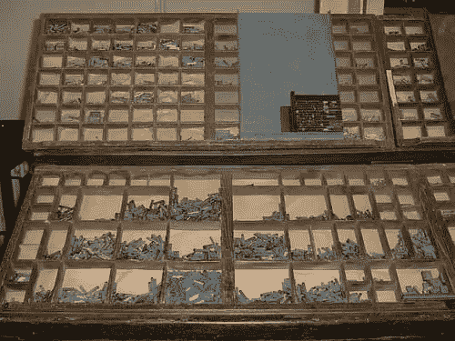

# 为什么一根弦叫弦？

> 原文：<https://www.sitepoint.com/why-is-a-string-called-a-string/>

这是 7 月 25 日 SitePoint PHP 时事通讯的社论。

* * *

为什么一根弦叫弦？你有没有想过这个问题？除了为一组粘在一起的字母编程之外，我们从来没有在上下文中使用过这样一个词，然而——在编程中，它和“变量”这个词一样无处不在。为什么会这样，它从何而来？

为了找到答案，我们必须先解决一些相关的术语。历史课时间！

*font* 这个词来源于法语*fonte*——被融化的东西；一场选角。鉴于印刷机上的字母实际上是由金属制成，在*型铸造厂*进行熔炼，这是有道理的。

术语*大写*和*小写*指的是字体被传输时的字面部分。因此，印刷者(人)有一个沉重的箱子，他拖着到处走，或者放在印刷机上，在这种情况下，有两个“层次”——一个大写字母和一个小写字母。大写字母只包含——你猜对了——大写字母，而小写字母只包含小写字母。

你会注意到小写字母比大写字母多。这是意料之中的——一个字母只能在一个页面上使用一次，毕竟，一个书面文本的小写字母要比大写字母多得多，因为那时还没有 Youtube 评论和 CAPS LOCK 这样的东西。

那么这一切与字符串有什么关系呢？

嗯，随着印刷变得更加主流，印刷机开始向个人提供服务，而不仅仅是报纸和出版商，[据说](http://dhhumanist.org/Archives/Virginia/v05/0863.html)他们决定根据印刷材料的长度——以英尺为单位的长度——来收费。诚然，这其中有很多是投机性的，但是如果他们*把生产出来的印刷材料串在一起*，他们可以很容易地估算出成本并向顾客开出账单。因此，我们可以合理地断定，他们在这个上下文中使用了单词*字符串*作为一个字符序列。

2017 年 7 月 26 日编辑:正如下面的评论中所指出的，在组装后运送到出版社的过程中，似乎有一根实际的绳子被用来将角色块绑在一起！一个推特粉丝甚至给我发了下面的视频，演示了这个过程！

[https://www.youtube.com/embed/chOwjArOQp4](https://www.youtube.com/embed/chOwjArOQp4)

但是，这与编程领域有什么关系呢？我的意思是，关于*的任何事情*，你可以说一串*的任何事情*，这在非编程领域会有一定的意义。这只是一个可以很容易地应用到事物上的词，尽管它通常不是。

如果我们在学术界寻找第一手参考资料呢？

在 1944 年的[正整数的递归可枚举集合及其决策问题](http://www.ams.org/journals/bull/1944-50-05/S0002-9904-1944-08111-1/S0002-9904-1944-08111-1.pdf)中，我们提到了一个可能与现代定义有些相似的问题:

> 出于工作目的，我们引入字母 6，并考虑由 1 和 b 组成的“字符串”,如 11b1bb1。

在本文中，该术语指的是一系列相同的符号，即一串 1 或一串 b。不完全是我们的定义，但这是一个开始。

然后，整整 14 年后，在 1958 年的[一种用于机械翻译的编程语言](http://www.mt-archive.info/MT-1958-Yngve.pdf)中，这个词被如此使用，而且只有一次:

> 标点符号或空格之间的每个连续字母串都在字典中查找。

好的，kill in 和我们对字符串的概念相似，但是看起来他只是在描述，嗯，*单词*。显然，这不适用——它太普通了。然而，出于某种原因，它似乎被卡住了。

在 1958 年的用于处理符号串的命令语言[中，单词 *string* 在](http://doi.acm.org/10.1145/610937.610965)[中的用法与我们今天使用的](http://www.hopl.info/showlanguage.prx?exp=7393&language=Perlis%20and%20Smith%20string%20command%20language)完全相同，尽管*并未如此定义*。

我们在 1959 年又找到了一个参考文献，[用于机械翻译的 COMIT 系统](http://mt-archive.info/IFIP-1959-Yngve.pdf):

> 如果我们想用 COS(F) D (F)来代替 D SIN(F)，其中 F 是不受限制的，可以是任意的成分序列，我们用符号$来代表这个字符串。

有意思！这是我们都知道的 PHP 中的美元符号，哪个是(是？)实际上是 BASIC 中的字符串符号。

我们在 1959 年又有了更直接的定义[709 共享系统:机器实现的符号编程](http://dl.acm.org/citation.cfm?id=320964.320968&coll=DL&dl=GUIDE) :

> 该文本是一个线性排序的位串，表示加载和列表过程中所需的其余信息。

事实上，正是通过 1960 年 4 月的 ALGOL，string 似乎获得了它的现代速记形式“string”(在此之前，人们称*string of something】*)。参见[本文的](http://dl.acm.org/citation.cfm?doid=367177.367210)摘要。

最后，在 1960 年 5 月，关于算法语言 Algol 60 的[报告以一种击中要害的形式提到了它。](http://web.eecs.umich.edu/~bchandra/courses/papers/Naure_Algol60.pdf)

从那以后，它就像现代迷因一样起飞了。

在 1963 年 [METEOR:一个用于字符串转换的 LISP 解释器](http://dspace.mit.edu/handle/1721.1/6106)中，使用了一个相当不具体的“…]但是线性列表(字符串)的某些简单转换在这个符号中很难定义。。

1964 年，[在声明任意编码的字母时](http://doi.acm.org/10.1145/364099.364236)提到了“字符串”。

搜索 ACM 会发现 60 年代和后来的一些其他资源，它们现在都经常使用这个术语，所以 60 年代似乎是这个术语演变的催化剂，并通过它所在的系统的需求，慢慢地使它成为今天的样子。有点有趣的是，它最终代表了与印刷时代相似的概念——一组有意义的字符，并带有一些成本(只是这一次，在记忆中)。

顺便提一下——想想 60 多年前的那些文件。60 年前，他们在穿孔卡片上解决计算机科学问题，并在学术论文中写道。我们现在是 2017 年，有 2017 年的 JavaScript 框架，在 Drupal 的社区中为谁可以和谁发生关系而斗争，并试图一次又一次地重新定义 Facade 这个词。当我们在争论现代网络发展的火箭科学“东西进一个盒子，东西出一个盒子”的时候，那些人当时通过将他们发现自己所处的模拟环境转换成数字环境，通过从本质上欺骗一点沙子来记忆数字，塑造了整个世界。

## 结论

所以现在我们知道——或者至少认为我们知道——弦从何而来。计算机科学一直是一个充满神秘和缓慢进化的黑暗空间，就像我们现在知道人类的眼睛在过去有半阶段和半眼睛一样，计算机科学中的术语也在过去和它们的原始含义周围进化，直到它们给了我们今天所拥有的。20 世纪 60 年代在不同的地方突然产生了相同的概念，有着相同的名字，直到它演变成一个统一的术语，我们今天都理解和使用，最重要的是，可以达成一致。

当你想一想，有没有更好的词我们可以用？虽然 string 很难让人感觉自然，因为它完全脱离了“现实世界”中的一个类似术语(我们不把一本书的页面上的单词称为“string”)，但我想不出还有哪个术语更适合这种流行的数据类型。可以吗？让我知道。

## 分享这篇文章