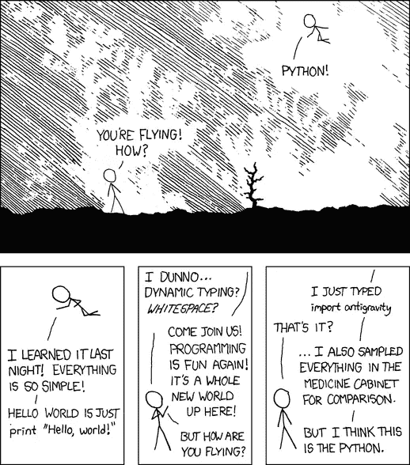

# 为什么要学 Python？

> 原文：<https://www.sitepoint.com/why-learn-python/>

**为什么要学 Python？因为它友好，无处不在，受欢迎，强大，可学，赚钱，有趣。为什么*不*学 Python？**

我应该把它打开一点。让我们看看你应该学习 Python 的一些主要原因。

## Python 是友好的

Python 是一种通用编程语言。你可以用它做几乎任何事情(我们很快就会知道所有东西有多宽)。但最重要的是，对于想学一点东西的人来说，Python 世界是一个友好的地方。

如果你过去做过任何编程，你可能会遇到“伪代码”:看起来像编程语言，但实际上不是，因为它的目标是向你展示程序做什么。解释如何做一件事的维基百科文章经常用一种模拟编程语言来描述……而这种模拟编程语言通常看起来很像 Python！

考虑向某人解释如何装入洗碗机:精致的东西不要放进去；确保你有足够的盐；加载并打开它。用代码来说，可能是这样的:

```
if dishwasher.salt < FULL:
    dishwasher.salt.fill()
for item in crockery:
    if item.dirty:
        if not item.delicate:
            dishwasher.add(item)
dishwasher.turn_on() 
```

这是编程代码，但希望它相对可读和可理解，即使你从未见过任何 Python 代码。而且没有`{braces}`也没有`(i++; i>5)`象形文字。

这在很大程度上得益于 Python 对整个 Python 社区的友好性。Stack Overflow 有一个充满活力的社区，人们在这里提问和回答 Python 问题，这是一个获得帮助的好地方。

Python 语言本身是建立在一套被称为 Python 的“[禅”的原则之上的，其中有一些指导思想，比如“简单比复杂好”和“可读性很重要”。](https://peps.python.org/pep-0020/)

认为编程应该是一种测试的人倾向于指责 Python 是为说“该死”而不是说脏话的人(以及由这些人)构建的，他们像你应该做的那样在刷牙时关掉水——但你最不需要的是在你试图完成事情时必须符合别人对正义的看法。这样他们就可以离开了。

## Python 无处不在

Python 在几乎每个技术领域都被使用，并且很受欢迎。机器学习是最近的热门事物，几乎所有你要写的与人工智能模型一起工作的代码都是用 Python 写的。PyTorch 是占主导地位的机器学习框架。

如果你对使用图像模型或其他可用的设置感兴趣，谷歌的 [Colab](https://colab.research.google.com/) 有数以千计的现有模型和代码示例，都是用 Python 构建的，运行在云中。用 [Django](https://www.djangoproject.com/) 和 [Flask](https://flask.palletsprojects.com/en/2.2.x/) 构建网络应用和网站，以及通过构建 [lambda 函数](https://docs.aws.amazon.com/lambda/latest/dg/lambda-python.html)和其他无服务器设置来构建云软件，这都是很好的。

Datasette 是记者和研究人员的一个工具，帮助他们以一种有用的方式分享数据，而不需要自己是程序员，它是用 Python 编写的。

很大一部分数据处理和数据科学软件都是用 Python 编写的，包括 [Numpy](https://numpy.org/) 、 [Scipy](https://scipy.org/) 和 [Matplotlib](https://matplotlib.org/) 库。

几乎任何与数学和统计有关的东西都会有大量的 Python 代码。PyQt 和 [Kivy](https://kivy.org) 让你为桌面和手机开发应用。

Python 非常适合处理设备、电子设备和机器。所有运行 YouTube 上令人惊叹的[这里制造的](https://www.youtube.com/c/stuffmadehere)作品的软件都是用 Python 编写的。

Python 非常适合“粘合代码”——解决特定问题的小脚本，或者在自己的机器上做一些事情；不是大项目，而是帮助自己解决问题的小事情——比如开始备份，或者找出哪些单词适合今天的 Wordle 字谜，或者将你的照片分割成一个相册。Python 无处不在。

## Python 在这里

学习 Python 的另一个好理由是，无论你在哪里，它就在这里。

如果你在 macOS 或 Linux 上，你已经有了 Python。打开一个终端，输入`python3`就可以了。

如果你用的是 Windows，那么它就在微软商店里:参见[微软自己关于如何从商店或网络开发途径安装 Python](https://docs.microsoft.com/en-us/windows/python/beginners) 的说明。

在 iPhone 上有 [Pythonista](http://omz-software.com/pythonista/index.html) 和 [Pyto](https://pyto.app/) ，在 Android 上有 [QPython](https://www.qpython.com/) 和 [Termux](https://termux.dev/en/) 。

为了体验 Python 的工作原理，你根本不需要安装任何东西。Pyodide 的人已经构建了完全版的 Python，无需任何安装就可以在网络浏览器中运行，T2 Jupyter 也可以让你在浏览器中试用 Python。

## Python 很受欢迎

学习 Python 的另一个好理由是它很受欢迎。TIOBE 指数每个月都会记录编程语言的流行程度。Python 总是处于或接近顶端(在撰写本文时，2022 年 8 月，它*处于顶端*)，TIOBE 自己说“很难找到一个编程领域不广泛使用 Python 的。”

同样，2022 年堆栈溢出开发者调查将 Python 并列为“最受欢迎”的编程语言，领先于 JavaScript、Go 和特定平台语言，如 Kotlin 和 Swift。

GitHub 的“Octoverse 状态”总结将 Python 列为 GitHub 所有存储库中第二受欢迎的语言。这部分是因为 Python 可以在所有平台上使用；一部分是因为它在几乎每个领域都有用；部分原因是因为它很容易掌握。

随波逐流通常是一种有用的方法——使用许多其他人都在使用的工具。这样，当有问题时，你有一个充满活力的社区来帮助你，通常你可能遇到的问题是别人已经为你解决了的。

## Python 很强大

由于无处不在和受欢迎，你可以用 Python 做很多事情。几乎没有问题是超越 Python 的。一些非常低级或非常关键性能的任务在更复杂的语言中更好，但这比你想象的要少得多。

特别是，即使您计划以后用低级语言构建一些东西，用 Python 做原型通常也是好的……然后努力加速最关键的性能路径。

Python 无处不在的部分原因是它已经并且可以适应各种各样的任务，正因为如此，Python 捆绑了相当多的模块来解决问题，作为其“标准库”的一部分，标准库是每个 Python 程序员现成可用的代码套件。

[Python 标准库](https://docs.python.org/3/library/index.html)有许多内置模块，用于处理您可能想要做的事情——例如运行 web 服务器、处理数据、处理日期、时间和时区、管理文件、进行加密操作、管理网络、处理 HTML、构建应用程序以及与操作系统对话。

除此之外， [Python 包索引](https://pypi.org/)有 30 万个以上的包来处理几乎任何可以想到的问题。这是一种触手可及的强大力量。

## Python 是可以学习的

因为 Python 很流行，也很有趣，所以也有大量的资源可以帮助你学习 Python。

当然，还有 SitePoint 自己的[编程教程](https://www.sitepoint.com/programming/)，其中很多都是专门针对 Python 的，还有所有有用的[社区论坛](https://www.sitepoint.com/community/c/python-perl-and-golang/)。

[FreeCodeCamp](https://www.freecodecamp.org/learn/) 有专门学习 Python 的免费编码训练营，有几十个练习帮助你从基础开始，然后转向 web 编程和数据库或科学计算， [Learn Python](https://www.learnpython.org/) 也有同样的。

Python 网站本身也给出了一些关于[开始使用 Python](https://www.python.org/about/gettingstarted/) 的指南。

学习 Python 的地方很多。

## Python 利润丰厚

当然，学习和知识是他们自己的奖励。但是，如果你不是上传到互联网上的纯能量生物，而是有一些账单要付，那么写 Python 的职业报酬会相当不错。

在撰写本文时，2022 年 8 月，[Indeed.com 的 Python 程序员在美国的平均基本工资为 115，965 美元](https://www.indeed.com/career/python-developer/salaries)。

而且有很多工作机会。Python 如此多才多艺，在如此多的不同技术领域中如此有用，其中的部分乐趣在于，对于那些拥有 Python 技能的人来说，总是有职位空缺。有报酬是好事。Python 有帮助。

## Python 很有趣

还能在哪里说`import antigravity`？



[XKCD #353，【Python】](https://xkcd.com/353/)

上图来自 XKCD，在`https://xkcd.com/353/`。但是如果您不记得它的 URL，只需打开您的 Python 提示符并键入`import antigravity`。真的！现在就试试吧！

## 那么，你准备好开始了吗？

那么为什么要学 Python 呢？为什么*不*学 Python？它友好、无处不在、在这里、受欢迎、强大、可学、有利可图、有趣。现在你已经准备好开始了，这里有一些关于先去哪里看的建议！

如果你通过学习获得了最好的学习效果，请查看 FreeCodeCamp Python bootcamps 。如果你更喜欢看视频，那么[Python](https://www.sitepoint.com/premium/courses/introduction-to-python-3112/)入门课程很适合，YouTube 是一个寻找教程和教学的地方，既有好的也有不太好的。

如果你想用 Python 构建 web 项目，[如何快速启动 Django 项目和 Django 应用](https://www.sitepoint.com/start-django-project-app/)是一个很好的起点，然后用 Django 进行 [Web 开发将会有很长的路要走。](https://www.sitepoint.com/premium/books/web-development-with-django/read/1/)

如果你想开始学习数据科学和统计学，可以看看《数据科学:导论》 这本书，然后是《T4》系列的其余部分。这两者都深入到工具、技能和实践方法的细节中。

如果你想在许多领域提高你的编程技能，我推荐这一系列的书:*[《Python 学徒》](https://www.sitepoint.com/premium/books/the-python-apprentice/read/1/)* ，以及它的[续集](https://www.sitepoint.com/premium/books/the-python-journeyman/read/1/)，以及它的[后续续集](https://www.sitepoint.com/premium/books/the-python-master/read/1/)，它们真正深入到了一些细节。

如果你通过实践学得最好，那就去做吧。选择一个小项目，一个你想解决的问题，然后用 Python 来解决它。不要担心构建一些东西给别人看；暂时把用户界面放在一边。

挑一个简单、真实的问题，然后解决它。也许这是一个通过找到所有匹配“-th-n”的单词来帮助解决早上纵横字谜的东西，或者是一个列出你在 2017 年拍摄的所有照片的小工具，或者是一个跟踪你今天吃的卡路里的东西。

看看上面的一些教程，了解如何开始，以及 Python 自己的文档了解 Python 开箱即用的全部细节:如何请求输入，或操作数字和字符串，读取文件，或处理日期。搜索答案并读取堆栈溢出。

对于那些通过实验来学习的人来说，接触 Python 是一个很好的方法。这是对错误的宽容，也是对新人的帮助。祝你好运。

*   [四个程序员如何得到他们的第一份 Python 工作](https://www.sitepoint.com/how-programmers-got-first-python-jobs/)
*   [Python 自然语言处理入门](https://www.sitepoint.com/natural-language-processing-python/)
*   [Python Web 应用:WSGI 基础知识](https://www.sitepoint.com/python-web-applications-the-basics-of-wsgi/)
*   [Python 多处理和并行编程指南](https://www.sitepoint.com/python-multiprocessing-parallel-programming/)
*   [了解 Python Decorators，带示例](https://www.sitepoint.com/understanding-python-decorators/)
*   [使用 unittest 和 pytest 进行 Python 单元测试的介绍](https://www.sitepoint.com/python-unit-testing-unittest-pytest/)

## 分享这篇文章