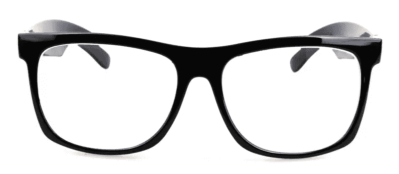
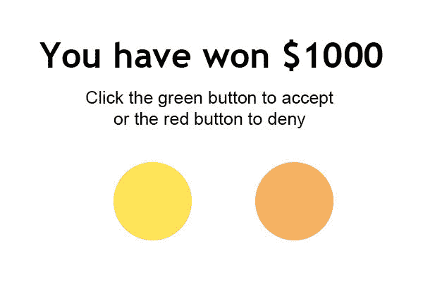
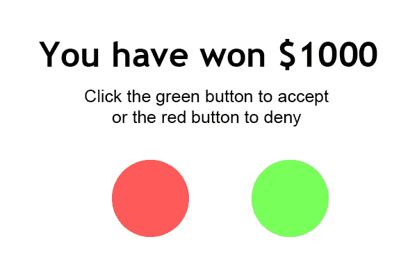

# 为什么要让网站具有可访问性？

> 原文：<https://www.sitepoint.com/why-make-websites-accessible/>

你的网页内容对所有人都是“可访问的”吗？如果没有，它可能会影响多少用户？

Web 可访问性是开发应用程序的过程，这些应用程序可以被最广泛的用户充分使用，而不管他们的能力如何。我相信你现在大概可以回答问题了。如果你的答案是“不”，那你来对地方了。

在 SitePoint，我们已经讨论了[如何让你的网络内容具有可访问性](https://www.sitepoint.com/design-ux/accessibility/)。然而，很有可能没有人告诉过你为什么你应该考虑努力让你的内容变得可访问——尤其是当你的网站“运行良好”的时候！

## 残疾和辅助技术的使用

你听说过*辅助技术* (AT)这个名词吗？即使你没有，让我给你看一个最常用的辅助技术的例子:

惊讶吗？很有可能你，或者至少你家里的某个人，戴着眼镜或者隐形眼镜。现在问题来了:如果眼镜在，你有残疾吗？

在某种程度上，是的。远视或近视是一种妨碍你像其他人一样体验世界的疾病，而眼镜的使用可以纠正这种残疾。

想象一下，如果你登录一个网站，而它对戴眼镜的人不起作用，你会有什么反应。

## 常见的残疾和相关的

虽然通过使用眼镜矫正的简单近视不会真正影响计算机的使用，但还有许多其他残疾。

*   **视觉障碍:**完全或部分失明的人使用键盘进行导航，并依靠屏幕阅读器阅读网页上的文本。色盲者需要网页中的高对比度来区分元素。
*   **马达:**有运动障碍的用户很难精确地控制鼠标，这就是为什么他们需要使用键盘来控制计算机。为了帮助有这种障碍的人，网页应该完全可以通过键盘导航。
*   **听觉:**失聪或听力困难的用户属于这一类。应为所有音频元素提供替代文本，以帮助这些元素。
*   **认知和神经:**此类别下的个人通常不得受到闪烁内容的影响。此外，它们通常仅限于使用键盘来浏览网站。

你可能很难理解一个有某种残疾的人的感受。请允许我用一个例子来说明。考虑一个网页对于一个色盲的人来说会是什么样子。

这是没有色盲的人看起来的样子:

上面的比较受到了 [Jared Smith 关于网页可访问性](http://www.slideshare.net/PlainTalkConf/jared-smith-introduction-to-web-accessibility)的演讲的启发。

现在，我已经能够让您对残疾世界和实现可访问性原则的必要性有所了解，您也可以从阅读患有不同残疾的 web 用户的故事中受益。

## 简单的统计数据

8.5%的人口患有禁止使用电脑的残疾。他们依靠辅助技术来纠正这一点。但这就够了吗？为什么需要付出额外的努力来使你的网站易于访问呢？

相比之下，在 2010 年 1 月，IE6 只占全球浏览器市场份额的 10%。当时，开发人员仍在大步前进，让他们的网站在 IE6 中工作。这需要对浏览器的工作原理有高度的理解。易访问性指南更容易遵循，我们基本上帮助了几乎相同比例的用户，但是是为了一个更好的目标。

## 法律

在决定网页可访问性不是你工作流程的一部分之前，你也应该考虑你所在国家的法律。

1999 年，布鲁斯·林赛·马奎尔(Bruce Lindsay Maguire)是一名盲人用户，他发现悉尼奥运会官方网站无法正常访问，于是对他们提起诉讼。结果他赢了 2 万澳元。如果你感兴趣的话，这里有关于马奎尔对悉尼奥组委的详细报道。

不同的国家有不同的法律，要求其管辖范围内的网站遵循特定的准则。然而，没有一个单一的国际机构来管理这些法律。

我提到法律是因为你不应该仅仅因为你想遵守法律就让你的内容可访问，主要是因为法律只规定了某些基本的准则。你的网站可以符合法律，但仍然是高度不可访问的。

## 资源和最终想法

如前所述，在 SitePoint 上，我曾经详细讨论过网页可访问性的话题。以下是一些例子:

*   [轻松检查网页可访问性](https://www.sitepoint.com/easy-checks-website-accessibility/)
*   [网页可访问性:工具和注意事项](https://www.sitepoint.com/web-accessibility-tools-considerations/)
*   [介绍可访问的折叠式小工具](https://www.sitepoint.com/introducing-accessible-accordion-widget/)

简而言之，确保网页内容的可访问性是一件相对容易的事情，尤其是当你的网页结构简单的时候。然而，坐在电脑上对你现有的网站做一些小的修改也是一件很无聊的事情。

因此，你应该把网页可访问性当作你应该执行的另一项任务(比如 SEO)。您也可以与您的设计师合作，创建或修改鼓励可访问性的设计。将网页可访问性作为开发周期的一部分只会让整个过程更加愉快！

另一个重要的观察结果是可及性是时间相关的。标准不断变化以适应最佳实践，您必须不断发展才能跟上。如果你的网站在去年是可访问的，那么它今天可能是不可访问的。你最近检查过吗？

正如我所展示的，网页可访问性肯定是值得努力的。如果您对如何将可访问性融入您的工作流程有任何想法，请在评论中告诉我们。

## 分享这篇文章