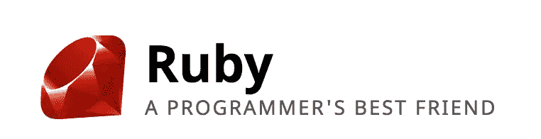

# 为什么是鲁比？

> 原文：<https://www.sitepoint.com/why-ruby/>


就在几个月前，我从 PHP 转到了 Ruby。这不是一个容易的转变，无论是在决策上还是在转变上。我正在使用 PHP，讽刺的是，我不知道我不喜欢它。然后，在当地的一次聚会上，我被介绍给了 Ruby。与会者向我展示了一些令我震惊的具体特征。这篇文章列出了 Ruby 最吸引我的 5 件事，并引导我每天使用它。

## 露比是我最好的朋友

我首先看到的是这个网站，它的标语让我大吃一惊:



那让我大吃一惊。

我使用过承诺给予指导、指示和给出答案的编程语言，但是一种语言是我的朋友吗？？？这种语言告诉我什么时候要做一个糟糕的决定，但还是让我去做。一种语言和一个社区，欣赏我的怪异版本，并接受我的怪癖。一种告诉我所有感情都没问题的语言。

看到那是一个令人毛骨悚然的时刻。我被迷住了。

不是 Ruby 看重程序员的生产力，而是看重程序员的*快乐*。

## 红宝石是所有世界中最好的

Ruby 并不提倡“一个真实的方式”。它从不同的文化和不同的生态系统中汲取精华，并以一种让你对编程充满诗意的方式将它们串联起来。

史蒂夫·耶格对此评论道:

> 在很大程度上，Ruby 原封不动地采用了 Perl 的字符串处理和 Unix 集成，这意味着语法是相同的，因此在发生任何事情之前，您已经拥有了 Perl 的精华。这是一个很好的开始，尤其是如果您没有学习 Perl 的其余部分。但是 Matz 从 Lisp 那里获得了列表处理的精华，从 Smalltalk 和其他语言那里获得了面向对象的精华，从 CLU 那里获得了迭代器的精华，并且几乎从每个人那里获得了所有东西的精华。

语言有好的一面，也有不好的一面，而 Ruby 最好的一面就是它试图吸取所有语言的精华

## Ruby 中的一切都是对象

上一节提到 Ruby 从 Smalltalk 中吸取了面向对象编程的精华。和 Smalltalk 一样，在 Ruby 中，一切都是对象。

让我来演示一下:

```
irb(main):001:0> nil.class
=> NilClass
irb(main):002:0> 1.class
=> Fixnum
irb(main):003:0> 1.2.class
=> Float
irb(main):004:0> "something".class
=> String
```

在 Ruby 中，`nil`是`NilClass`的实例，`1`是`Fixnum`的实例，`1.2`是`Float`的实例，以此类推。

在像 C 这样的编程语言中，你有一组固定的数据类型，以及一组固定的它们可以做的事情。但是在像 Ruby 这样一切都是对象的语言中，你可以创建新的数据类型，甚至改变现有的数据类型。这给了你巨大的力量，但是正如蜘蛛侠的本叔叔告诉你的:

> 权力越大，责任越大

这就引出了我的下一部分。

## 露比给你自由

还记得所有东西都是物体吗？将它与能够重新打开任何类、改变方法以及在运行时使用该方法结合起来。你现在是一个神用户。

这被称为“猴子打补丁”，应该适度使用。

正如《恐怖编码》的杰夫·阿特伍德所说:

> 如果猴子补丁的想法让你有点害怕，它可能应该。您能想象在调试代码时，String 类的行为与您已经学会使用的字符串有细微的不同吗？

让我来演示一下

```
irb(main):001:0> "Hello".class
=> String
irb(main):002:0> "Hello".reverse
=> "olleH"
```

我们现在知道“Hello”是`String`类的一个实例，并且`String`类的`reverse`方法按预期工作。但是，如果你真的很邪恶，你可以重新打开`String`类，并重新定义`reverse`方法。

```
irb(main):003:0> class String
irb(main):004:1> def reverse
irb(main):005:2> " UNICORNS ARE PRETTY "
irb(main):006:2> end
irb(main):007:1> end
=> :reverse
```

现在，如果有人在猴子补丁之后的某个地方试图调用`reverse`方法，他们得到的是猴子补丁方法:

```
irb(main):008:0> "Hello".reverse
=> " UNICORNS ARE PRETTY "
```

当不负责任地使用时，猴子补丁是危险的。然而它表达了 Ruby 给我们的自由。

这只是为了展示 Ruby 赋予您的能力以及您所肩负的责任。露比不会保护你远离自己。政府的存在是为了保护人们免受彼此伤害，而不是保护他们自己。它让你为自己的错误负责，并让你犯错误。

正如拉里·沃尔在他的精彩文章“Perl，第一种后现代计算机语言”中所说:

> 用 Perl 编写混乱的程序是可能的，这一事实也使得用 Perl 编写的程序比用一种试图加强整洁的语言编写的程序更整洁成为可能。更大的善的潜力伴随着更大的恶的潜力。

所以，猴子打补丁是好的，但也是不好的。有可能用它设计出一些非常棒的解决方案，但也有可能搞得一团糟。

责任在你身上。

### Ruby 有一个很棒的社区

每一个分享这种异想天开和怪异感觉的 Ruby 程序员都知道做我们所做的是什么。有些事情我们做了，有些事情我们没有做，这些事情造就了我们。厄尼·米勒的演讲[中的这些台词很好地解释了这一点:](https://www.youtube.com/watch?v=OB-xFC8AN_s)

> 我不相信是解释器决定了什么是或者不是 Ruby。我认为是人，这很酷，因为 Matz 设计 Ruby 是为了增加程序员的快乐。口译员不会快乐，人们会快乐。

这个社区的人们以及他们的友好、幸福和快乐造就了这个社区。社区影响语言，反之亦然。这对 Ruby 来说非常好，我喜欢成为社区的一员。

## 结论

Ruby 是一种美丽的语言。它给你的自由是你必须承担的最大的编程责任，但是我喜欢责任。正如 DHH 所说:

> Ruby 是一种面向成年人的语言

想想吧。Ruby 给了你能力和犯错的能力，这就是它的伟大之处。阻止你做自己想做的事的，不是永远的父母。它是在你的旅途中帮助你的朋友。它帮助你变成你想要的任何人，要么是历史英雄，要么是邪恶的恶棍。这取决于你。

> 英雄是懂得伴随自由而来的责任的人。鲍勃·迪伦

这就是我喜欢 Ruby 的原因，也是我鼓励你尝试它的原因。

## 分享这篇文章