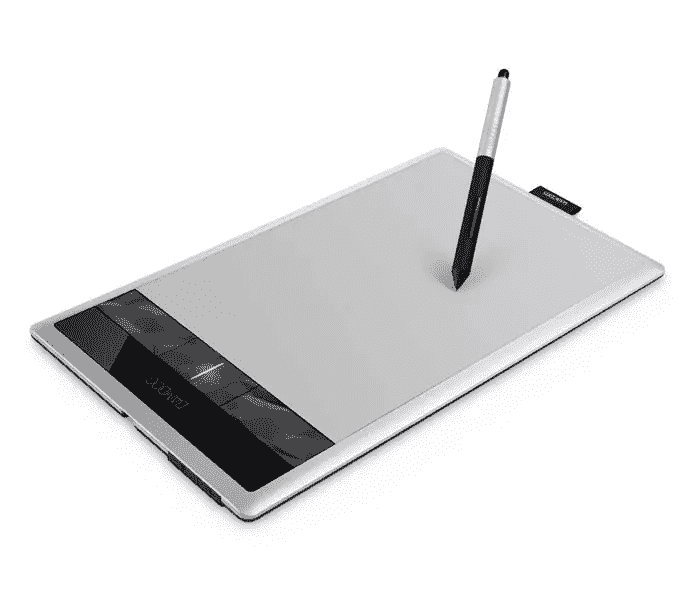
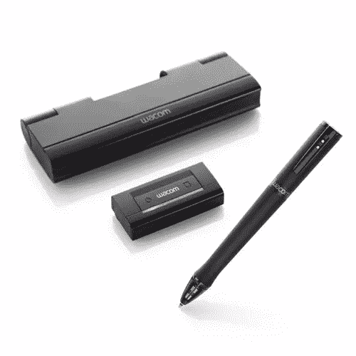
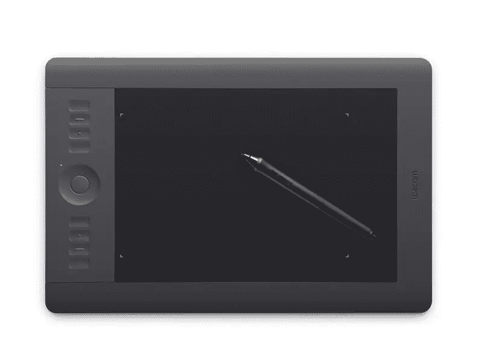
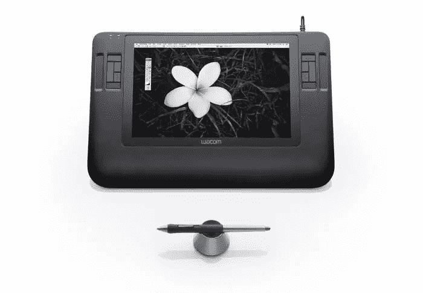
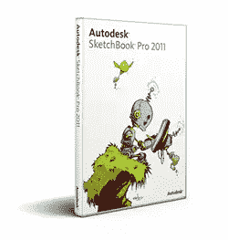

# 为什么你应该使用绘图板

> 原文：<https://www.sitepoint.com/why-you-should-be-using-a-drawing-tablet/>

如果你曾经有过一个大的图像修饰项目，用鼠标工作通常会使它不那么精确和费力。经过多年使用鼠标的经验，我已经提高了使用鼠标编辑图像的能力。然而，有比鼠标更好的工具可以让你的图像编辑更快，更容易，效果明显更好。

使用鼠标可能会很乏味，因为你的手腕是平的，而且你只能使用涉及整个手的粗糙拖动动作来工作。通常，鼠标在你手里是不精确和笨重的，长时间使用后，你的手会开始抽筋。鼠标很适合网上冲浪、滚动或做简单的工作，但绘图板可以让你更舒适地完成更多细节。

绘图板通常带有手写笔，在形状上与钢笔密切相关。一般来说，它们比鼠标握在手中更容易、更舒适，并且可以让您的工作达到令人难以置信的精确度。Wacom 平板电脑有多达 2400 种不同级别的压力敏感度。老鼠只有两级压力敏感度；点击或未点击。这使得平板电脑比鼠标具有巨大的优势，尤其是在面向细节的图像编辑方面。当使用 Photoshop 时，压力敏感度也适用于你的笔刷。这使得混合颜色、添加效果和应用修饰技术变得更加容易。

使用手写笔，您可以倾斜笔，并将手和手腕移动到自然的绘图位置。这让你可以更好地控制你的划水。你可以用电脑画草图。您可以在 Photoshop 中使用手写笔进行数字绘画，您的作品将具有更自然的外观，这仅仅是因为您的手和手指具有自然的灵活性。如果您希望您的图像栩栩如生，具有有机、自然、专业的外观，那么 Wacom 平板电脑是您设计工作的理想工具。

有许多不同的型号可供选择，你只需要决定哪一个适合你。这真的取决于你想要的功能，以及你是用它来工作还是娱乐。有以下型号可供选择:

## 

### 竹子

这是一款入门级的绘图板。您可以使用它来绘制草图、绘画、涂鸦、笔记等。你也可以用它来修饰照片。如果你想以一种便宜的方式尝试绘图板，竹线是一个很好的入门模型。Bamboo line 具有 1024 级压力敏感度，非常适合写实绘画、素描、绘画和修图。实际上，竹子有三种不同的型号。你有竹连接，竹捕捉，竹创造。这些型号之间存在显著差异，因此选择实际上取决于您对平板电脑的需求。Bamboo Connect 和 Capture 在触笔上没有橡皮擦功能。这个功能很方便，因为它允许你翻转手写笔，像用普通铅笔一样擦掉错误。它们都很小，并且 Connect 没有无线选项、多点触摸输入、Nik Color Efex Pro 滤镜、Corel Painter Essentials 或 Adobe PS Elements。Bamboo Create 模型具有所有这些特性，并且它比其他模型具有更大的工作空间。

竹子连接- $79.00
竹子捕捉- $99.00
竹子创造- $199.00

### 暗示

这是一个有趣的产品，因为它允许你用一支真正的笔进行传统的工作，但它是经过转换和数字化保存的。这个概念很简单，因为你所要做的就是把接收器夹在你作品的顶部，然后墨迹就可以数字化地记录你的作品，省去了你扫描作品的额外步骤。最明显的地方是，你可以保存大量的草图，并且可以将带有图层的文件导出为 Photoshop、Illustrator SketchBook Pro 和 SVG 格式。这是很棒的，因为你可以勾画出你的想法，然后从数字的角度出发立即投入运行，因为你的草图和图纸可以直接从导出。

暗示- $199.00

### Intuos5

Intuos5 系列是专业使用的优秀平板电脑系列。它们具有 2048 级压力敏感度，因此您可以最终控制您的草图、绘画和修图工作。Intuos 型号有 3 种尺寸——小号、中号和大号。除了大小不同之外，这三种不同型号之间的唯一区别是小型号只有 6 个快捷键，而两种较大型号有 8 个。快速键允许您自定义设置，并为您经常执行的不同操作创建热键。Intuos 系列支持笔倾斜识别，这意味着平板电脑可以识别您何时将笔倾斜一个角度，并且画笔或软件会对触控笔的倾斜做出反应。Intuos 型号还配有多功能触摸环。这类似于老式 iPods 上的滚轮或“转盘”。您可以设置滚轮来控制手写笔的不同方面。一个很好的例子是设置滚轮来控制画笔大小:顺时针滚动，画笔变大。反过来旋转，画笔会变小。Intous 系列还支持多点触控功能，这意味着您可以使用手指执行不同的任务。手指轻轻一点，不同的多点触控手势就能完成共同的任务。这一系列平板电脑通过大量可定制的快捷键为您提供强大的控制能力，从而节省您的大量时间，并使您的工作更加高效。

小型- $229.00
中型-$ 349.00T5 大型- $469.00

### Cintiq

Cintiq 系列平板电脑令人难以置信。您可以直接在屏幕上绘图，而不是在平板电脑上绘图。这是非常精确的，这是传统上在数字画布上工作的终极方式。这里真正的区别是可移植性。显然，这些模型更脆弱，很难在办公室或工作室之间移动。有三种型号，Cintiq 12WX、Cintiq 21UX 和 Cintiq 24HD。这里的区别主要只是工作空间的大小。

512wx-$ 999.00
【521ux】$ 1999.00
【t24 HD】【2599.00】

### 应用程序

Bamboo Paper 是一个独特的 iOS 应用程序，可以与 Wacom 为苹果 iPad 制作的特殊手写笔配合使用。不仅仅是为了密集的图像编辑；您可以将这个组合用于许多不同的目的，如演示、绘制线框、涂鸦设计想法、思维导图以及任何其他可能使用法律垫或剩余餐巾纸的任务。

SketchbookPro 是另一个伟大的程序，让你快速有效地创建草图。它支持图层，你可以把你的作品带入 Photoshop。这是存储数字草图的一个很好的方法，因为这是一个自然的草图，而且非常流畅。它附带了很多类似于 Photoshop 的工具。你可以做直线，矩形，圆形，还可以混色。SketchbookPro 也很快，因为创建草图时没有延迟。

Sketchbook Pro- $59.00

您在所有这些不同的平板电脑产品之间做出的选择取决于您的偏好。如果你有一个 iPad，那么显然你会想要触控笔和竹纸应用程序。如果您正在寻找一种经济实惠的方式来创建具有良好功能的数字艺术品，那么竹制平板电脑将是您的一个不错的选择。如果你想用热键的便利性和更大的压力敏感度来创作数字作品，那么你可以选择 Intuos5 系列的平板电脑。如果您是一位资深的数字艺术家，并且您想要终极的数字素描、绘画和修图体验，并且您希望它尽可能接近传统艺术品，那么 Cintiq 系列产品将是一个不错的选择。如果你对你的作品很认真，你想要一种更自然的方式来创作你的作品，那么平板电脑绝对是你的最佳选择。用鼠标工作感觉就像用砖头工作，一旦你走平了，就再也回不去了。

你有喜欢的绘图板吗？你有没有发现一些不寻常的，意想不到的用途？你会回到老鼠身边吗？

## 分享这篇文章