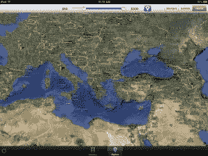
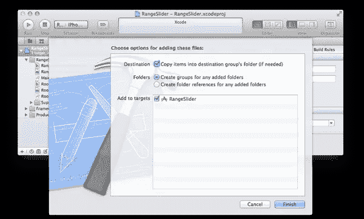
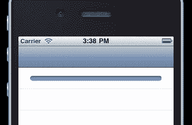
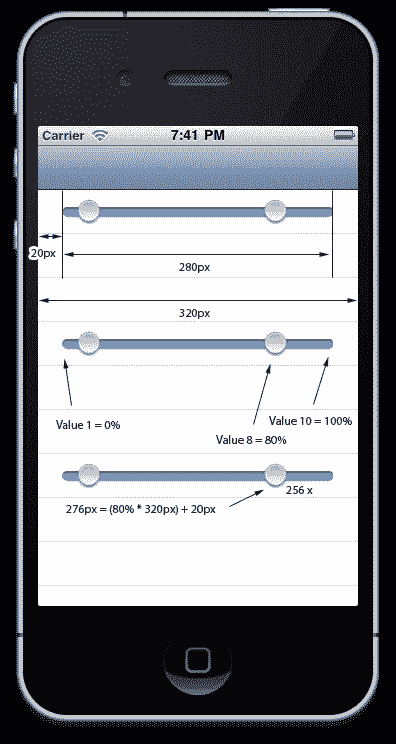
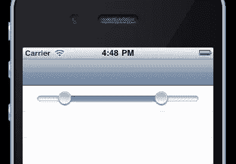

# 邪恶的 iOS 范围滑块:第一部分

> 原文：<https://www.sitepoint.com/wicked-ios-range-slider-part-one/>

常用的 iOS 控件之一是滑块控件。这是一个伟大的，多用途的滑块，允许你快速滑动你的手指在屏幕上设置一个值。

然而，当您想要创建一系列值时，事情变得有点复杂。选择是有限的。你应该提供两个滑块吗？一个用于最小范围，一个用于最大范围？这牺牲了可用性和屏幕空间，通常不是一个理想的结果。

大多数情况下，答案是创建一个范围滑块，它不在 iOS 控件的默认范围内。下面是我们将在这两部分教程中创建的内容。

<iframe width="640" height="360">
 
感谢马丁·沃鲁施，这一切都在进行中。 T3
 
请注意，这不是一个简单快捷的工作。要得到一个合适的范围滑块需要相当多的工作，但是一旦达到，你就可以在你需要的任何项目中重用它。我会给你自己至少一个小时来完成这个。
 
第一部分将介绍初始设置、图形、代码、添加拖动拇指的触摸事件的基础知识。在第二部分中，我们将添加值改变时的事件动作，并从第一部分中离开的地方修复 UI。
 <h2>如果是好东西，苹果会有吗？</h2> 
虽然苹果没有提供 iOS 范围滑块控件，但这并不意味着你不应该创建一个。事实上，苹果在他们最大的应用程序之一 iPhoto 中使用了范围滑块。编辑一个视频，你会注意到“修剪”滑块实际上是一个范围滑块。它有一个最小和最大的界限，来定义你想要视频被修剪的地方。
 
在为 iOS 平台创建自定义控件时，要记住的最重要的一点是，你在屏幕上看到的永远不会等同于你使用手指时的体验。对于控件的最小尺寸有非常具体的可用性规则，我们将确保我们制作的范围滑块遵守这些规则，并且在所有场景中易于使用。
 <h3>第一步:基础</h3> 
我们将创建一个新项目，并导入我们需要的图像。我们会有四张照片。这是一个细目分类，就像是在你最喜欢的图像处理应用程序中新创建的一样。
 

滑块的部件

 
<a href="https://www.sitepoint.com/wp-content/uploads/2011/09/iOSRangeSliderImages.zip">下载图片</a>
 
你会注意到我们有一个滚动条滑块，突出显示的颜色，一个缩略图和突出显示的缩略图，当你选择它的时候。最重要的是，你会注意到我们有两种分辨率，一种用于老款 iphone，一种用于 retina 显示屏 iphone。
 
创建一个新的基于导航的应用程序，如果你没有在现有的应用程序中使用它。完成后，将提供的下载中的 images 文件夹拖到您的项目区域，并确保您选择了将文件复制到项目中的复选框。
 

 <h3>步骤 2:创建 UIControl 子类</h3> 
这个默认项目非常简单，只有一个导航控制器和一个<code>UITableView</code>。我们将创建一个定制的<code>UIControl</code>子类，并将其放入表格视图的第一个单元格中。Cmd+N 创建一个新文件。选择“目标-C 级”并单击下一步。将<code>UIView</code>更改为<code>UIControl</code>，并再次点击下一步。你喜欢给你的班级起什么名字都行，我的班级叫“RangeSlider”。
 
现在您将拥有一个基本的<code>UIControl</code>子类，我们将在其中设置一些基本的实例变量。我们只需要从滑块中选择<code>set</code>和<code>get</code>，我们希望能够选择<code>set</code>和<code>get</code>的最小值和最大值。最后，我们必须能够<code>set</code>一个最小范围，这样我们就可以指定我们想要的范围至少是<em> x </em>长。3 到 3 的范围有什么用？
 
在您的<code>RangeSlider</code>头文件中，创建您的变量定义并设置属性
 <pre><code>@interface RangeSlider : UIControl{ float minimumValue; float maximumValue; float minimumRange; float selectedMinimumValue; float selectedMaximumValue; } @property(nonatomic) float minimumValue; @property(nonatomic) float maximumValue; @property(nonatomic) float minimumRange; @property(nonatomic) float selectedMinimumValue; @property(nonatomic) float selectedMaximumValue; @end</code></pre> 
然后在你的主文件中，综合这些属性。
 <pre><code> @implementation RangeSlider @synthesize minimumValue, maximumValue, minimumRange, selectedMinimumValue, selectedMaximumValue;</code></pre> 
接下来，我们需要设置一些局部变量，我们不会暴露给更广泛的世界。这些只是用来跟踪我们的滑块内部的各种元素。我们需要的是我们的拇指状态的两个布尔值，称为<code>_minThumbOn</code>和<code>_maxThumbOn</code>。我们将使用这些来跟踪滑块的当前触摸状态。接下来，我们需要为我们之前谈到的每张图片添加<code>UIImageView</code>变量。最后是一个填充值，这将允许在滑块图像的任何一边的位置空间。所以把这个添加到你的头接口。
 <pre><code> BOOL _maxThumbOn; BOOL _minThumbOn; float _padding; UIImageView * _minThumb; UIImageView * _maxThumb; UIImageView * _track; UIImageView * _trackBackground;</code></pre> 
设置的最后一步是将我们的<code>RangeSlider</code>的实例添加到表格视图的第一个单元格中。在<code>RootViewController</code>中，导入顶部的<code>RangeSlider.h</code>头，将方法<code>numberOfRowsInSection</code>改为返回 1 而不是 0，并找到<code>cellForRowAtIndexPath</code>方法。我们将<code>alloc</code>一个新的<code>RangeSlider</code>实例，设置它的最大、最小和最小范围，然后用与单元格相同的边界初始化它。很明显，你可以随意用你想要的任何帧大小来初始化它！
 
这位于注释“配置单元”的下方
 <pre><code> RangeSlider *slider= [RangeSlider alloc]; slider.minimumValue = 1; slider.selectedMinimumValue = 2; slider.maximumValue = 10; slider.selectedMinimumValue = 8; slider.minimumRange = 2; [slider initWithFrame:cell.bounds]; [cell addSubview:slider];</code></pre> 
如果您现在构建并运行您的项目，您将不会看到比普通导航控制器和表视图更多的东西。请放心，这里实际上有一个<code>RangeSlider</code>控件。不过，这只是目前的一个空视图！
 <h3>步骤 3:添加滑块和拇指</h3> 
我们将从我们的<code>initWithFrame</code>方法开始。它将设置一个初始状态，并调用重画滑块的方法。这一步的代码都在块内。
 <pre><code>if(self){ // Code all in here } return self;</code></pre> 
首先让我们设置一些初始状态值
 <pre><code>// Set the initial state _minThumbOn = false; _maxThumbOn = false; _padding = 20; // 20 is a good value</code></pre> 
接下来，我们将在控件中添加轨道背景和高亮图像。框架是根据单元格框架的大小设置的，而不是基于单元格的中心点居中(感谢<a href="https://github.com/skjolber"> skjolber </a>指出这一点)。
 <pre><code>_trackBackground = [[[UIImageView alloc] initWithImage:[UIImage imageNamed:@"bar-background.png"]] autorelease]; _trackBackground.frame = CGRectMake((frame.size.width - _trackBackground.frame.size.width) / 2, (frame.size.height - _trackBackground.frame.size.height) / 2, _trackBackground.frame.size.width, _trackBackground.frame.size.height); [self addSubview:_trackBackground]; _track = [[[UIImageView alloc] initWithImage:[UIImage imageNamed:@"bar-highlight.png"]] autorelease]; _track.frame = CGRectMake((frame.size.width - _track.frame.size.width) / 2, (frame.size.height - _track.frame.size.height) / 2, _track.frame.size.width, _track.frame.size.height); [self addSubview:_track];</code></pre> 
如果您现在构建项目，您应该会看到蓝色的高亮条遍布整个单元格的宽度，就像这样。
 

跟踪单元格中的图像

 
接下来，我们将添加两个拇指控件，分别用于 min 和 max。然而要放置这些，我们需要调用一个我们还没有写的方法<code>xForValue</code>。这个<code>xForValue</code>方法获取一个滑块值，并返回滑块值在<em> x </em>轴上的位置。首先，让我们继续编写 thumb 代码。
 <pre><code>_minThumb = [[[UIImageView alloc] initWithImage:[UIImage imageNamed:@"handle.png"] highlightedImage:[UIImage imageNamed:@"handle-hover.png"]] autorelease]; _minThumb.center = CGPointMake([self xForValue:selectedMinimumValue], self.frame.size.height / 2)); [self addSubview:_minThumb]; _maxThumb = [[[UIImageView alloc] initWithImage:[UIImage imageNamed:@"handle.png"] highlightedImage:[UIImage imageNamed:@"handle-hover.png"]] autorelease]; _maxThumb.center = CGPointMake([self xForValue:selectedMaximumValue], self.frame.size.height / 2)); [self addSubview:_maxThumb];</code></pre> 
好吧，让我们来分析一下。每一个的代码都差不多，只是一个是最大值，另一个是最小值。我们也从初始化一个高亮状态的新图像开始。我们使用当前最小值或最大值的<em> x </em>值，在我们框架的<em>高度</em>值的一半处，制作中心点。然后，我们将这些图像添加到我们的主控件视图中。
 
这不会在当前状态下运行，因为一些红色错误标志会告诉你。我们需要定义并创建我们的<code>xForValue</code>方法。
 <h3>第四步:让我们得到数学</h3> 
在我们的<code>RangeSlider</code>实现的顶部，我们将添加一个区域来定义私有方法——因为这个方法不需要公开。在<code>@implementation</code>行上面，添加一个新的私有方法接口，该接口带有我们的<code>xForValue</code>方法的方法定义。
 <pre><code> @interface RangeSlider (PrivateMethods) -(float)xForValue:(float)value; @end</code></pre> 
然后在<code>initWithFrame</code>方法之后，我们将创建<code>xForValue</code>。如果没有图表，这里的代码就没有意义。所以我做了个图表。
 

这种帮助有意义吗？

 
一旦你把它分解了，就简单了，对吧？<em> x </em>值等于滑块的宽度(帧宽度减去每侧的填充)，乘以滑块在最小值和最大值之间的距离的百分比，加上一批填充(将其从左侧移动一个填充)。
 
因此，如果滑块的宽度是全宽减去 2 *填充，那么我们可以称之为<em> a </em>。并且值的百分比是<em> b </em>，填充是<em> p </em>那么我们得到如下。
 <pre>x = a * b + p</pre> 
将<em> a </em>替换为宽度和填充值—<code>self.frame.size.width</code>和<code>_padding</code>，将<em> p </em>替换为<code>_padding</code>。
 <pre>x = (self.frame.size.width-(_padding*2))*b+_padding</pre> 
下一步是弄清楚我们的值在滑块上有多远。要做到这一点，我们需要找出范围是什么，所以这是最大值减去最小值。然后我们在这个范围内走了多远，所以参数值减去最小值。最后，我们将我们跨越的距离除以整个范围，得到当前跨越的百分比。
 <pre>b = (value - minimumValue) / (maximumValue - minimumvalue)</pre> 
将这个值代入我们之前的值，我们得到:
 <pre>x = (self.frame.size.width-(_padding*2))*((value - minimumValue) / (maximumValue - minimumValue))+_padding</pre> 
现在把它放到我们的方法定义中，我们得到了这个！
 <pre><code>-(float)xForValue:(float)value{ return (self.frame.size.width-(_padding*2))*((value - minimumValue) / (maximumValue - minimumValue))+_padding; }</code></pre> 
最后建成运行！看看那些完美放置的拇指…
 

滑块拇指到位后

 <h3>第五步:是时候搬家了</h3> 
是时候开始研究我们如何与触摸事件互动了。这里有三个我们要实现的方法，<code>beginTrackingWithTouch</code>、<code>endTrackingWithTouch</code>和<code>continueTrackingWithTouch</code>。这是我们开始跟踪的方法。
 <pre><code>-(BOOL) beginTrackingWithTouch:(UITouch *)touch withEvent:(UIEvent *)event{ CGPoint touchPoint = [touch locationInView:self]; if(CGRectContainsPoint(_minThumb.frame, touchPoint)){ _minThumbOn = true; }else if(CGRectContainsPoint(_maxThumb.frame, touchPoint)){ _maxThumbOn = true; } return YES; }</code></pre> 
如您所见，我们从获取当前接触点开始。然后，我们检查任一拇指框是否包含我们的触摸点；基本上是询问我们是否触摸了任何一个拇指，如果是，我们将相关的<code>_minThumbOn</code>或<code>_maxThumbOn</code>变量设置为真，这样当我们继续跟踪触摸时，我们就知道移动哪个拇指了！
 
我们的结束跟踪方法只是确保 max 和 min <code>thumbOn</code>变量都是假的。
 <pre><code>-(void)endTrackingWithTouch:(UITouch *)touch withEvent:(UIEvent *)event{ _minThumbOn = false; _maxThumbOn = false; }</code></pre> 
持续接触法是神奇的地方。这里我们将拇指移动到正确的位置！
 <pre><code>-(BOOL)continueTrackingWithTouch:(UITouch *)touch withEvent:(UIEvent *)event{ if(!_minThumbOn &amp;&amp; !_maxThumbOn){ return YES; } CGPoint touchPoint = [touch locationInView:self]; if(_minThumbOn){ _minThumb.center = CGPointMake(MAX([self xForValue:minimumValue],MIN(touchPoint.x, [self xForValue:selectedMaximumValue - minimumRange])), _minThumb.center.y); } if(_maxThumbOn){ _maxThumb.center = CGPointMake(MIN([self xForValue:maximumValue], MAX(touchPoint.x, [self xForValue:selectedMinimumValue + minimumRange])), _maxThumb.center.y); } [self setNeedsDisplay]; return YES; }</code></pre> 
我们首先返回<em> YES </em>如果我们实际上没有触摸一个拇指滑块。没必要做额外的工作，嗯？之后，我们将缩略图视图的中心调整到新的缩略图点的<em> x </em>位置，但如果它在最大范围值之外，或者如果它太靠近另一个滑块，则不会调整(重用我们之前的<code>xForValue</code>方法)。<code>if</code>语句只是在我们想要移动最大还是最小滑块之间有所不同。
 <pre><code>_minThumb.center = CGPointMake(MAX([self xForValue:minimumValue],MIN(touchPoint.x, [self xForValue:selectedMaximumValue - minimumRange])), _minThumb.center.y);</code></pre> 
<code>MIN</code>陈述说我们想要最低的，或者是接触点，或者是在拇指太靠近最大拇指之前我们可以移动到的最高点。<code>MAX</code>声明说，我们要么想要我们决定的接触点，要么想要在<em> x </em>进入我们的填充之前的最低位置:我们的<code>minimumValue</code>的<em> x </em>。
 
最后，我们调用 controls <code>setNeedsDisplay</code>方法，以便重新绘制底层的<code>UIView</code>并显示移动。
 
如果您现在构建并运行它，您将看到您可以选择拇指，并上下运行它们。它们也只会走到我们定义的<code>minimumRange</code>那么远(在我们的例子中是 2)。
 
 
 
<h2>第一部分到此结束</h2> 
在第一部分的最后，我们有了一个全功能的范围滑块，有了图形和响应触摸事件的控件。继续，<a href="https://www.sitepoint.com/wicked-ios-range-slider-part-two/">看看第二部分</a>，我们将把范围滑块变成有用的东西！
 
<aside class="flex space-x-4"><h2 class="text-lg my-2 mr-2">分享这篇文章</h2><button aria-label="Share Sitepoint on facebook" data-network="facebook" class="social-share-button mr-2 cursor-pointer transform transition duration-200 hover:scale-125 text-primary-700"><svg aria-hidden="true" focusable="false" data-prefix="fab" data-icon="facebook-square" class="svg-inline--fa fa-facebook-square fa-w-14 fa-lg share-icon" role="img" viewbox="0 0 448 512"><path fill="currentColor" d="M400 32H48A48 48 0 0 0 0 80v352a48 48 0 0 0 48 48h137.25V327.69h-63V256h63v-54.64c0-62.15 37-96.48 93.67-96.48 27.14 0 55.52 4.84 55.52 4.84v61h-31.27c-30.81 0-40.42 19.12-40.42 38.73V256h68.78l-11 71.69h-57.78V480H400a48 48 0 0 0 48-48V80a48 48 0 0 0-48-48z"/></svg></button><button aria-label="Share Sitepoint on reddit" data-network="reddit" class="social-share-button mr-2 cursor-pointer transform transition duration-200 hover:scale-125 text-primary-700"><svg aria-hidden="true" focusable="false" data-prefix="fab" data-icon="reddit" class="svg-inline--fa fa-reddit fa-w-16 fa-lg share-icon" role="img" viewbox="0 0 512 512"><path fill="currentColor" d="M201.5 305.5c-13.8 0-24.9-11.1-24.9-24.6 0-13.8 11.1-24.9 24.9-24.9 13.6 0 24.6 11.1 24.6 24.9 0 13.6-11.1 24.6-24.6 24.6zM504 256c0 137-111 248-248 248S8 393 8 256 119 8 256 8s248 111 248 248zm-132.3-41.2c-9.4 0-17.7 3.9-23.8 10-22.4-15.5-52.6-25.5-86.1-26.6l17.4-78.3 55.4 12.5c0 13.6 11.1 24.6 24.6 24.6 13.8 0 24.9-11.3 24.9-24.9s-11.1-24.9-24.9-24.9c-9.7 0-18 5.8-22.1 13.8l-61.2-13.6c-3-.8-6.1 1.4-6.9 4.4l-19.1 86.4c-33.2 1.4-63.1 11.3-85.5 26.8-6.1-6.4-14.7-10.2-24.1-10.2-34.9 0-46.3 46.9-14.4 62.8-1.1 5-1.7 10.2-1.7 15.5 0 52.6 59.2 95.2 132 95.2 73.1 0 132.3-42.6 132.3-95.2 0-5.3-.6-10.8-1.9-15.8 31.3-16 19.8-62.5-14.9-62.5zM302.8 331c-18.2 18.2-76.1 17.9-93.6 0-2.2-2.2-6.1-2.2-8.3 0-2.5 2.5-2.5 6.4 0 8.6 22.8 22.8 87.3 22.8 110.2 0 2.5-2.2 2.5-6.1 0-8.6-2.2-2.2-6.1-2.2-8.3 0zm7.7-75c-13.6 0-24.6 11.1-24.6 24.9 0 13.6 11.1 24.6 24.6 24.6 13.8 0 24.9-11.1 24.9-24.6 0-13.8-11-24.9-24.9-24.9z"/></svg></button><button aria-label="Share Sitepoint on twitter" data-network="twitter" class="social-share-button mr-2 cursor-pointer transform transition duration-200 hover:scale-125 text-primary-700"><svg aria-hidden="true" focusable="false" data-prefix="fab" data-icon="twitter-square" class="svg-inline--fa fa-twitter-square fa-w-14 fa-lg share-icon" role="img" viewbox="0 0 448 512"><path fill="currentColor" d="M400 32H48C21.5 32 0 53.5 0 80v352c0 26.5 21.5 48 48 48h352c26.5 0 48-21.5 48-48V80c0-26.5-21.5-48-48-48zm-48.9 158.8c.2 2.8.2 5.7.2 8.5 0 86.7-66 186.6-186.6 186.6-37.2 0-71.7-10.8-100.7-29.4 5.3.6 10.4.8 15.8.8 30.7 0 58.9-10.4 81.4-28-28.8-.6-53-19.5-61.3-45.5 10.1 1.5 19.2 1.5 29.6-1.2-30-6.1-52.5-32.5-52.5-64.4v-.8c8.7 4.9 18.9 7.9 29.6 8.3a65.447 65.447 0 0 1-29.2-54.6c0-12.2 3.2-23.4 8.9-33.1 32.3 39.8 80.8 65.8 135.2 68.6-9.3-44.5 24-80.6 64-80.6 18.9 0 35.9 7.9 47.9 20.7 14.8-2.8 29-8.3 41.6-15.8-4.9 15.2-15.2 28-28.8 36.1 13.2-1.4 26-5.1 37.8-10.2-8.9 13.1-20.1 24.7-32.9 34z"/></svg></button><button aria-label="Share Sitepoint on linkedin" data-network="linkedin" class="social-share-button mr-2 cursor-pointer transform transition duration-200 hover:scale-125 text-primary-700"><svg aria-hidden="true" focusable="false" data-prefix="fab" data-icon="linkedin" class="svg-inline--fa fa-linkedin fa-w-14 fa-lg share-icon" role="img" viewbox="0 0 448 512"><path fill="currentColor" d="M416 32H31.9C14.3 32 0 46.5 0 64.3v383.4C0 465.5 14.3 480 31.9 480H416c17.6 0 32-14.5 32-32.3V64.3c0-17.8-14.4-32.3-32-32.3zM135.4 416H69V202.2h66.5V416zm-33.2-243c-21.3 0-38.5-17.3-38.5-38.5S80.9 96 102.2 96c21.2 0 38.5 17.3 38.5 38.5 0 21.3-17.2 38.5-38.5 38.5zm282.1 243h-66.4V312c0-24.8-.5-56.7-34.5-56.7-34.6 0-39.9 27-39.9 54.9V416h-66.4V202.2h63.7v29.2h.9c8.9-16.8 30.6-34.5 62.9-34.5 67.2 0 79.7 44.3 79.7 101.9V416z"/></svg></button><button aria-label="Share Sitepoint on email" data-network="email" class="social-share-button mr-2 cursor-pointer transform transition duration-200 hover:scale-125 text-primary-700"><svg aria-hidden="true" focusable="false" data-prefix="fas" data-icon="envelope" class="svg-inline--fa fa-envelope fa-w-16 fa-lg share-icon" role="img" viewbox="0 0 512 512"><path fill="currentColor" d="M502.3 190.8c3.9-3.1 9.7-.2 9.7 4.7V400c0 26.5-21.5 48-48 48H48c-26.5 0-48-21.5-48-48V195.6c0-5 5.7-7.8 9.7-4.7 22.4 17.4 52.1 39.5 154.1 113.6 21.1 15.4 56.7 47.8 92.2 47.6 35.7.3 72-32.8 92.3-47.6 102-74.1 131.6-96.3 154-113.7zM256 320c23.2.4 56.6-29.2 73.4-41.4 132.7-96.3 142.8-104.7 173.4-128.7 5.8-4.5 9.2-11.5 9.2-18.9v-19c0-26.5-21.5-48-48-48H48C21.5 64 0 85.5 0 112v19c0 7.4 3.4 14.3 9.2 18.9 30.6 23.9 40.7 32.4 173.4 128.7 16.8 12.2 50.2 41.8 73.4 41.4z"/></svg></button></aside> </body> </html></iframe>